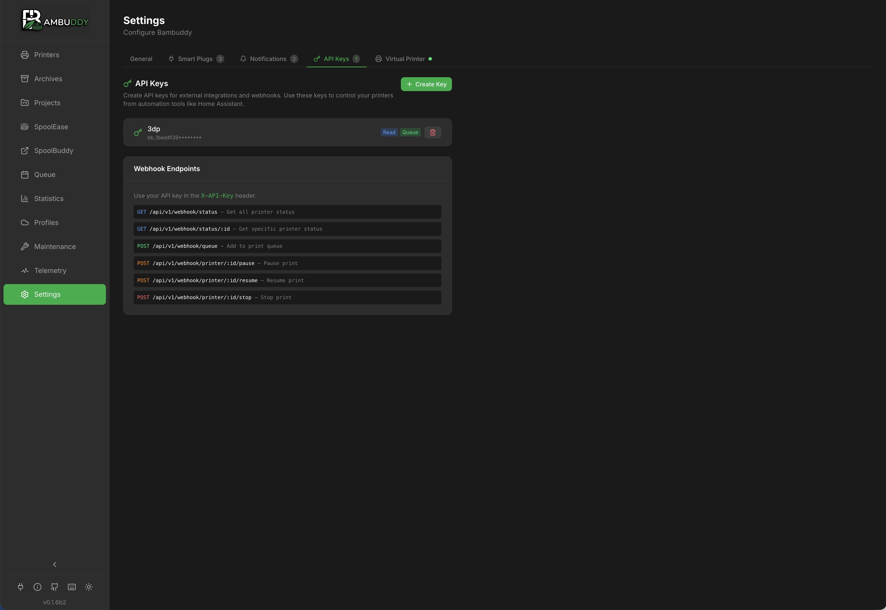

# API Keys & Webhooks

Integrate Bambuddy with external tools using API keys and webhooks.

{ .screenshot }

---

## :material-key: API Keys

### Overview

API keys allow external applications to:

- Access Bambuddy data
- Trigger actions
- Integrate with automation tools

### Creating an API Key

1. Go to **Settings** > **API Keys**
2. Click **Create API Key**
3. Enter a name (e.g., "Home Assistant")
4. Select permissions
5. Click **Create**
6. **Copy the key immediately** - it won't be shown again!

!!! warning "Save Your Key"
    API keys are shown only once at creation. Store it securely.

---

## :material-shield-lock: Permissions

### Available Permissions

| Permission | Allows |
|------------|--------|
| **Read Printers** | View printer status |
| **Control Printers** | Start/stop/pause prints |
| **Read Archives** | View archive data |
| **Write Archives** | Edit/delete archives |
| **Read Statistics** | View statistics |
| **Read Queue** | View print queue |
| **Write Queue** | Add/remove from queue |
| **Read Settings** | View configuration |
| **Write Settings** | Modify configuration |
| **Admin** | Full access |

### Principle of Least Privilege

Only grant permissions that are needed:

- Read-only for dashboards
- Control for automation
- Admin only when necessary

---

## :material-api: Using the API

### Authentication

Include the API key in request headers:

```bash
curl -H "X-API-Key: your-api-key-here" \
  http://localhost:8000/api/v1/printers
```

### Base URL

```
http://your-server:8000/api/v1
```

### Common Endpoints

| Endpoint | Method | Description |
|----------|--------|-------------|
| `/printers` | GET | List all printers |
| `/printers/{id}` | GET | Get printer details |
| `/printers/{id}/status` | GET | Get printer status |
| `/archives` | GET | List archives |
| `/archives/{id}` | GET | Get archive details |
| `/queue` | GET | View print queue |
| `/queue` | POST | Add to queue |
| `/statistics` | GET | Get statistics |

See [API Reference](../reference/api.md) for complete documentation.

---

## :material-web: Interactive API Browser

Bambuddy includes a built-in API browser for testing endpoints directly in the interface.

### Accessing the API Browser

The API Browser appears in the right column of the API Keys settings page.

1. Go to **Settings** > **API Keys**
2. Scroll to see the API Browser on the right

### Features

- **Auto-discovery** - All endpoints loaded from OpenAPI schema
- **Grouped by category** - Printers, archives, settings, etc.
- **Parameter inputs** - Fill in path, query, and body parameters
- **Request body examples** - Pre-filled from schema
- **Live execution** - Test requests and see responses
- **Response display** - Formatted JSON with status and timing
- **Search** - Filter endpoints across categories

### Using with API Keys

1. Paste an API key in the "API Key for Testing" input
2. Expand an endpoint and fill in parameters
3. Click **Execute** to make the request
4. View the response below

!!! tip "New Key Shortcut"
    After creating a new API key, click **Use in API Browser** to automatically add it for testing.

---

## :material-webhook: Webhooks

### Outgoing Webhooks

Bambuddy can send notifications to external URLs:

1. Go to **Settings** > **Notifications**
2. Add a **Webhook** provider
3. Enter your endpoint URL
4. Configure events to trigger

### Payload Format

```json
{
  "event": "print_complete",
  "timestamp": "2024-01-15T14:30:00Z",
  "data": {
    "printer": "Workshop X1C",
    "filename": "benchy.3mf",
    "duration": 8100,
    "filament_used": 45.2,
    "status": "success"
  }
}
```

### Events

| Event | Trigger |
|-------|---------|
| `print_started` | Print begins |
| `print_progress` | Progress milestone |
| `print_complete` | Print finishes |
| `print_failed` | Print fails |
| `printer_offline` | Connection lost |
| `printer_error` | HMS error |

---

## :material-home-assistant: Integration Examples

### Home Assistant

Use REST sensors to display status:

```yaml
sensor:
  - platform: rest
    name: "Bambuddy Printer Status"
    resource: "http://bambuddy:8000/api/v1/printers/1/status"
    headers:
      X-API-Key: "your-api-key"
    value_template: "{{ value_json.state }}"
    json_attributes:
      - progress
      - remaining_time
      - temperature
```

Trigger automations on webhook events.

### Node-RED

Use HTTP request nodes with API key authentication.

### IFTTT / Zapier

Use webhook triggers and actions.

---

## :material-cog: Managing API Keys

### Viewing Keys

See all API keys in Settings:

- Name
- Created date
- Last used
- Permissions

### Revoking Keys

Delete keys that are no longer needed:

1. Find the key in the list
2. Click **Delete**
3. Confirm deletion

Key is immediately invalidated.

### Rotating Keys

Best practice: Rotate keys periodically:

1. Create new key
2. Update applications
3. Delete old key

---

## :material-shield-check: Security Best Practices

### Key Storage

- Never commit keys to version control
- Use environment variables
- Store in secrets managers

### Network Security

- Use HTTPS for external access
- Limit API access to trusted IPs if possible
- Consider VPN for remote access

### Monitoring

- Review API key usage
- Check for unauthorized access
- Revoke unused keys

### Permissions

- Use minimum required permissions
- Create separate keys per application
- Avoid using admin keys in automation

---

## :material-code-json: Rate Limiting

### Current Limits

| Endpoint Type | Limit |
|--------------|-------|
| Read | 100/minute |
| Write | 30/minute |
| Control | 10/minute |

### Rate Limit Headers

Responses include rate limit info:

```
X-RateLimit-Limit: 100
X-RateLimit-Remaining: 95
X-RateLimit-Reset: 1705331400
```

---

## :material-help-circle: Troubleshooting

### 401 Unauthorized

- Check API key is correct
- Verify key hasn't been revoked
- Ensure header name is `X-API-Key`

### 403 Forbidden

- Check key has required permissions
- Verify endpoint matches permissions

### 429 Too Many Requests

- Rate limit exceeded
- Wait and retry
- Check for runaway automation

---

## :material-lightbulb: Tips

!!! tip "Descriptive Names"
    Name keys after their purpose: "Home Assistant Dashboard" not "key1".

!!! tip "Separate Keys"
    Use different keys for different applications for easy management.

!!! tip "Regular Audit"
    Review API keys periodically and remove unused ones.

!!! tip "Test First"
    Test API calls manually before implementing in automation.

!!! tip "Document Usage"
    Keep notes on which keys are used where.
