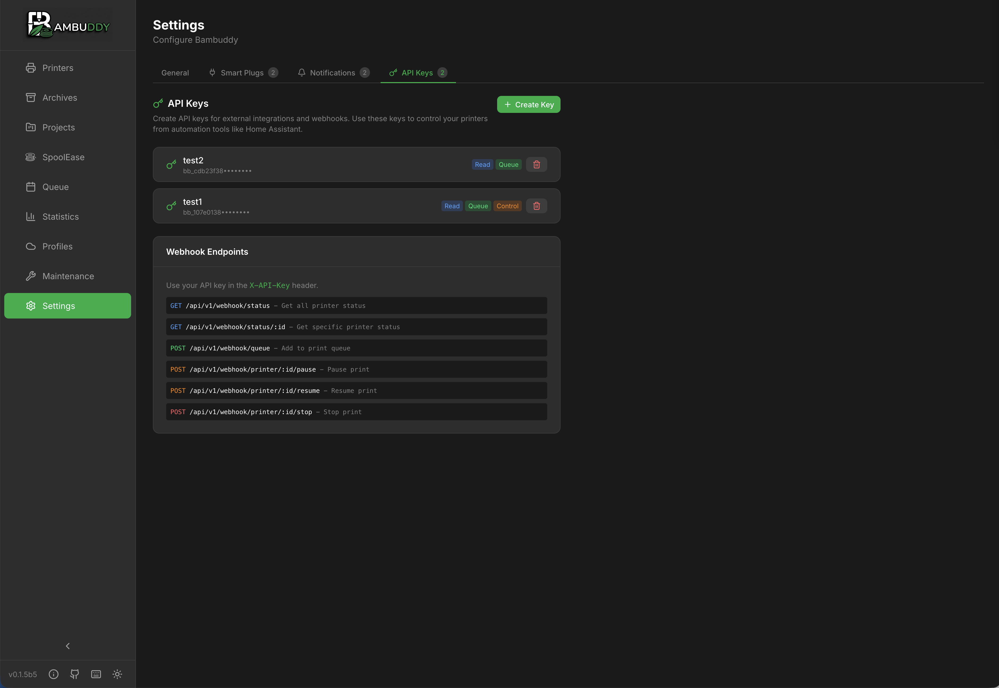
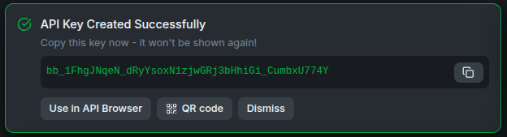
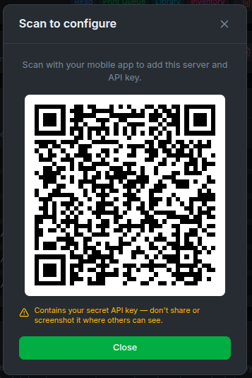

# API Keys & Webhooks

Integrate Bambuddy with external tools using API keys and webhooks.

!!! tip "New in v0.2.4 — Cloud access for API keys ([#1182](https://github.com/maziggy/bambuddy/issues/1182))"
    API keys now carry an **owner** (the user who created them) and an opt-in
    **cloud-access scope**. Tick *Allow cloud access* on a new key to let it
    read its owner's Bambu Cloud presets, filament catalogue, and device list
    via `/api/v1/cloud/*` — perfect for headless slicing workflows. Default
    is **off**, so existing automation never silently gains cloud-read
    access on upgrade. Jump to [Cloud Access Scope](#cloud-access-scope)
    below for the details.

{ .screenshot }

---

## :material-key: API Keys

### Overview

API keys allow external applications to:

- Access Bambuddy data
- Trigger actions
- Integrate with automation tools

### Creating an API Key

1. Go to **Settings** > **API Keys**
2. Click **Create API Key**
3. Enter a name (e.g., "Home Assistant")
4. Select permissions
5. Click **Create**
6. **Copy the key immediately** - it won't be shown again!

!!! warning "Save Your Key"
    API keys are shown only once at creation. Store it securely.

### Mobile setup with a QR code

The success panel shown right after you create a key has a **QR code** button
next to **Use in API Browser**:

{ .screenshot }

Click it to display a QR code that encodes the Bambuddy server URL **and** the
new API key together, so a compatible mobile app (for example, an NFC
spool-inventory app) can scan once to configure both — no copy-pasting the long
key by hand.

{ .screenshot }

The encoded server URL comes from your configured **Settings → Network →
External URL**, falling back to the address you're currently viewing Bambuddy on.
If clients connect from outside your LAN (reverse proxy, Docker host, VPN), set
the External URL so the scanned address is actually reachable from the phone.

!!! warning "The QR contains your secret key"
    The QR encodes the raw API key — treat the image like the key itself. Don't
    share it or screenshot it where others can see, and regenerate the key if it
    leaks.

!!! info "Payload format (for app developers)"
    The QR is a single custom-scheme URI:
    ```
    bambuddy://config?v=1&url=<url-encoded base URL>&key=<url-encoded API key>
    ```
    `v=1` is the schema version (clients should check it), `url` is the Bambuddy
    base URL, and `key` is the API key — both URL-encoded. The key is only
    available here, at creation time: Bambuddy stores keys hashed and can never
    show them again.

---

## :material-shield-lock: Permissions

### Available Permissions

API keys are intentionally **scoped narrowly** — they cannot perform
administrative operations (user management, full settings updates, backup
restore, firmware installs). The ten toggles you can set on a key are:

| Permission | Allows |
|------------|--------|
| **Read Status** | Read printer state, archives, queue, library listings, projects, filaments, inventory, maintenance, notifications, K-profiles, AMS history, stats, system info, camera, (scrubbed) settings, slicer pipelines and their run history, and the slim user listing (`GET /users/slim`, id + username only — see below) |
| **Manage Queue** | Add to / remove from / reorder the print queue; reprint archives. Together with **Manage Library**, run a slicer pipeline (see below) |
| **Control Printer** | Start, pause, resume, stop prints; send files to the printer; AMS RFID re-read; clear-plate confirmation; smart-plug on/off |
| **Manage Library** | Upload new files; rename and delete library entries; import models from MakerWorld; slice a library file. Together with **Manage Queue**, run a slicer pipeline (see below) |
| **Manage Inventory** | Create / update / delete spools, the spool/color catalogue, forecast SKU settings. Required for SpoolBuddy kiosks (NFC tag scan, scale readings, kiosk system commands like reboot/update). |
| **Manage Maintenance** | Log completed maintenance (`POST /maintenance/items/{id}/perform`), reset counters, edit intervals, assign/remove per-printer items, and manage the maintenance-type catalog. Suits Home Assistant automations that record "I cleaned the nozzle" without needing broader printer control. |
| **Manage Archives** | Edit and delete print archives (`DELETE /archives/{id}`), including the `?purge_stats=true` option on that route which also drops the row from Quick Stats. Suits automations that prune the print history. Reprinting an archive stays under **Manage Queue**; the standalone bulk-purge operation stays admin-only. |
| **Manage Projects** | Create, update and delete projects, and manage their membership (adding archives to a project). Suits automations that file finished prints into projects. Reading projects comes with **Read Status**. |
| **Allow Cloud Access** | Read the owner's Bambu Cloud presets/filaments via `/cloud/*` (see below) |
| **Update Electricity Price** | Push a new per-kWh tariff to `POST /settings/electricity-price` (see [Energy Tracking](energy.md#dynamic-electricity-price-from-home-assistant)) — narrowly scoped, the only settings field writable via API key |

!!! warning "Allowlist model since 0.2.4.5 (GHSA-r2qv-8222-hqg3)"
    Earlier Bambuddy versions gated API keys via a small denylist of
    administrative permissions. Anything outside that list — including
    physical printer control, queue writes, library uploads, and inventory
    writes — was reachable from *any* valid key regardless of which
    checkboxes you ticked, because the seven toggles were not actually
    enforced outside the legacy `/webhook/*` endpoints. Starting in
    0.2.4.5, every Bambuddy endpoint maps to the toggles above — almost
    always exactly one, occasionally two that must both be held — or is
    admin-only and rejects all API keys. A key with no
    toggles ticked can hit no endpoints; a key with only **Read Status**
    cannot stop a print, edit the queue, upload files, or change a spool.

!!! info "Slicer pipelines need two toggles"
    Listing pipelines and reading run history comes with **Read Status**.
    Starting, cancelling or retrying a run needs **Manage Queue** *and*
    **Manage Library** together, because a run does both jobs: it slices the source
    into a new library file, then queues one print per copy. Neither toggle
    on its own authorises the whole operation, so a key holding only one of
    them gets a 403 naming the other.

    Creating, editing, and deleting pipeline definitions — and clearing run
    history — stays admin-only. A key can run the recipe; it cannot rewrite
    it. Use [Slicer Pipelines](slicer-pipelines.md) in the web UI to author
    them.

    One extra toggle applies to pipelines built on **Bambu Cloud or Orca
    Cloud presets**: resolving those reads the cloud token stored on a user
    account, and an API-keyed request has no signed-in user. Add **Allow
    Cloud Access** and the run resolves them as the key's owner, the same
    way slicing a library file directly does. Pipelines using local or
    standard presets need nothing extra.

!!! info "A key never exceeds the account that owns it"
    The toggles above are a ceiling, not a grant. A key acts on behalf of the
    user who created it, and is limited to the permissions **that user** holds
    through their groups — ticking **Control Printer** on a key created by
    someone who may not control printers does not give the key that ability.
    Deactivating or deleting a user disables their keys along with their login.

    Two consequences worth planning around:

    - **Create keys under an account that will keep its permissions.** A key
      created by a member of staff who later changes role, or leaves and is
      deactivated, stops working at that moment. For an integration that has to
      outlive any one person, create the key under a dedicated service account.
    - If a key returns `403 API key owner does not have '<permission>'`, the
      key is asking for something its owner cannot do. Grant the permission to
      the owner's group, or recreate the key under an account that has it.

    Keys created before Bambuddy recorded key ownership have no owner to be
    measured against and are governed by their toggles alone. Recreate them
    when convenient so they gain an owner.

!!! warning "Editing and deleting needs the owner's *all* permission"
    A key has no identity of its own, so it cannot be "the owner" of a
    library file, archive or queue item the way a person is. The routes that
    edit or delete those therefore ask whether the caller may act on
    **anyone's** rows — `library:delete_all`, `archives:delete_all`,
    `queue:delete_all` and their `update` counterparts — and the key's owner
    has to hold that permission.

    The built-in **Operators** group holds only the `_own` variants, so a key
    created by an Operator is refused outright on those routes rather than
    being narrowed to that person's own files. It reads as
    `403 API key owner does not have 'library:delete_all' permission`. If an
    automation needs to prune or rename, create its key under an account in a
    group that holds the `_all` permissions — **Administrators** does, and a
    custom group can be granted them through **Settings → Users → Groups**.

    The flip side is worth planning for: such a key can edit and delete
    *every* user's rows within its toggles, not only its owner's.

!!! info "Why no general 'Write Settings' or 'Admin' permission?"
    The `PATCH /settings` route can rewrite SMTP/LDAP/MQTT credentials, the
    HA access token, and similar secrets. Allowing those writes from any
    API key would silently widen attack surface beyond what the documented
    use cases (Home Assistant tariffs, dashboards, automation) actually
    need. The narrowly-scoped **Update Electricity Price** toggle exists
    specifically to unlock the HA dynamic-tariff workflow without opening
    that door.

### Principle of Least Privilege

Only grant permissions that are needed:

- **Read-only dashboards**: Read Status only.
- **Home Assistant queue automation**: Read Status + Manage Queue.
- **Home Assistant queue + start prints**: + Control Printer.
- **Headless slicer / library-uploading automation**: + Manage Library.
- **SpoolBuddy kiosks (bundled installs handle this for you)**: + Manage Inventory.
- **Home Assistant maintenance-log automation** ("cleaned nozzle every N hours"): Read Status + Manage Maintenance.
- **Print-history cleanup automation** (prune old archives): Read Status + Manage Archives.
- **Filing finished prints into projects**: Read Status + Manage Projects.
- **Trigger a slicer pipeline from an automation**: Read Status + Manage Queue + Manage Library.
- **HA dynamic-tariff integration**: + Update Electricity Price.
- **Slicing against Bambu Cloud or Orca Cloud presets** (whether from a [pipeline](slicer-pipelines.md) or a direct slice call): + Allow Cloud Access (requires owner sign-in).

### Upgrade Notes

When upgrading from a pre-0.2.4.5 install:

- Existing keys are backfilled: **Manage Library** and **Manage Inventory**
  default to whatever **Manage Queue** was set to (so "queue-only" keys keep
  working for the upload+queue workflow they already used, while hardened
  "read-only" keys do not silently gain write capabilities).
- **Manage Maintenance** was carved out of the admin denylist in the #1832
  follow-up. It was explicitly denied for every API key beforehand, so
  no existing integration relies on it — existing keys are backfilled to
  **off**, and new keys default to **on**. Toggle it explicitly if an
  older key needs to log maintenance events.
- **Manage Archives** was carved out of the admin denylist in #1888 (archive
  delete/edit previously returned 403 for every API key). Same shape as
  Manage Maintenance: explicitly denied beforehand, so existing keys are
  backfilled to **off** and new keys default to **on**. Toggle it explicitly
  if an older key needs to delete or edit archives.
- **Manage Projects** was carved out of the admin denylist in #1893 (creating
  a project, or adding archives to one, previously returned 403 for every API
  key). Same shape again: existing keys are backfilled to **off** and new keys
  default to **on**. Toggle it explicitly if an older key needs to manage
  projects.
- **Slicer pipelines** were unreachable from any API key until the run
  dispatch shipped; every pipeline endpoint answered 403. They now ride the
  toggles you already have — no new checkbox, and nothing to backfill — so a
  key that already holds **Manage Queue** and **Manage Library** can run a
  pipeline after upgrading. That grants no capability it lacked: such a key
  could already slice a library file and queue prints directly, and a
  pipeline only composes those two steps using settings an administrator
  authored.
- The bundled SpoolBuddy kiosk key is explicitly granted **Manage Inventory**
  by the CLI (it needs to write NFC scans and scale readings).
- If a previously-working integration starts returning 403, the missing
  toggle is named in the response body — tick it in **Settings → API
  Keys**, regenerate or update the key, and retry.

---

## :material-cloud-key-outline: Cloud Access Scope

API keys created in v0.2.4 and later carry an explicit **owner** (the user who
created them) and an opt-in **cloud-access scope**. This unlocks a workflow that
was previously blocked: reading the owner's Bambu Cloud presets, filament
catalogue, and device list from `/api/v1/cloud/*` endpoints — exactly what a
headless slicing workflow needs. It is also what lets a
[slicer pipeline](slicer-pipelines.md) built on cloud presets be run by an API
key rather than only by a signed-in person.

### When to enable it

Tick **Allow cloud access** on the create form when the key needs to:

- Pull filament profiles (`GET /cloud/filaments`) for an automated slicer
- List your Bambu Cloud devices (`GET /cloud/devices`)
- Read printer firmware availability (`GET /cloud/firmware-updates`)
- Read your slicer presets (`GET /cloud/settings`)

The flag defaults to **off**, so existing automation never silently gains
cloud-read access on upgrade.

### Three fences a key must pass for /cloud/*

When an API-keyed call reaches `/api/v1/cloud/*`, three checks all need to
succeed:

1. **The key has an owner.** Keys created before v0.2.4 have no owner and are
   shown as **Legacy** in the API Keys list — they're rejected at `/cloud/*`
   with a "recreate it" message. Every other endpoint they were used against
   (queue, status, control) keeps working.
2. **`Allow cloud access` is enabled** on the key. Otherwise `/cloud/*` returns
   `403` with a "enable cloud access" hint.
3. **The owner is signed into Bambu Cloud** (Settings → Cloud Profiles).
   Without a stored token, `/cloud/*` returns the standard token-not-set error.

### Auth-disabled deployments

The cloud-access scope only makes sense when authentication is enabled —
auth-disabled deployments don't have per-user cloud tokens to read against.
The create form refuses `Allow cloud access = true` in that mode with a
`400 Bad Request` so you don't end up with a non-functional key.

### Migrating older keys

Keys created before v0.2.4 keep working against every non-cloud endpoint
without any change. To grant one of them cloud access, **delete the key and
recreate it** — there's no in-place upgrade because the original creator
identity wasn't recorded at the time.

### Owner deletion

Deleting a user removes all of their API keys (`ON DELETE CASCADE` on
PostgreSQL, plus an explicit cleanup step in the user-delete route for SQLite
where FK enforcement is off by default). Orphan keys can never authenticate.

---

## :material-api: Using the API

### Authentication

Include the API key in request headers:

```bash
curl -H "X-API-Key: your-api-key-here" \
  http://localhost:8000/api/v1/printers
```

### Base URL

```
http://your-server:8000/api/v1
```

### Common Endpoints

| Endpoint | Method | Description |
|----------|--------|-------------|
| `/printers` | GET | List all printers |
| `/printers/{id}` | GET | Get printer details |
| `/printers/{id}/status` | GET | Get printer status |
| `/archives` | GET | List archives |
| `/archives/{id}` | GET | Get archive details |
| `/queue` | GET | View print queue |
| `/queue` | POST | Add to queue |
| `/statistics` | GET | Get statistics |
| `/inventory/spools` | GET | List spools |
| `/inventory/spools/by-tag` | GET | Find a spool by NFC `tray_uuid`/`tag_uid` |
| `/slicer-pipelines` | GET | List saved slicer pipelines |
| `/slicer-pipelines/{id}/run` | POST | Run a pipeline (needs Manage Queue + Manage Library) |
| `/pipeline-runs` | GET | List pipeline runs |
| `/users/slim` | GET | Resolve user ids to names (id + username only) |
| `/auth/me` | GET | Identify the key: its owner and the scopes it actually carries |

!!! note "Turning `created_by_id` into a name"
    Archives, the queue and the statistics endpoints all report ownership as a
    numeric `created_by_id`, and `/statistics` accepts it as a filter. To turn
    those numbers into names, call `GET /users/slim` — it returns
    `[{"id": 1, "username": "martin"}, ...]` and nothing else. Emails, roles,
    group membership and permission sets stay behind the admin-only
    `GET /users` listing, which rejects API keys.

    If you only need *your own* id — a personal dashboard rather than a
    per-user one — `GET /auth/me` is enough and needs no user listing at all.

!!! warning "`/auth/me` changed in 0.2.5"
    Before 0.2.5, `/auth/me` answered an API key with a synthetic
    administrator: `id: 0`, `role: "admin"`, `is_admin: true` and every
    permission in the system. That never matched what the key could do — keys
    cannot reach administrative routes at all — so clients that built their UI
    from this response showed actions that failed with 403 on use.

    It now returns the key **owner's** `id` and `username`, `is_admin: false`,
    and a `permissions` list containing exactly the permissions the key's
    scopes admit. Keys created before per-user ownership existed have no owner
    to report and keep `id: 0` with an `api-key:` username. If your client
    branched on `is_admin` or `role`, branch on `permissions` instead.

!!! note "Manage Inventory keys can look up spools by tag"
    The `/inventory/spools/by-tag` lookup is reachable with either the **Read Status** scope *or* the **Manage Inventory** scope, so a key created only with **Manage Inventory** — which can create, update, and delete spools — can look a spool up by its NFC tag without needing the broader Read Status scope. This is what lets an NFC inventory integration dedupe a scan with a single, narrowly-scoped key. Other inventory read endpoints (e.g. `/inventory/spools` to list all spools) still require **Read Status**.

See [API Reference](../reference/api.md) for complete documentation.

---

## :material-web: Interactive API Browser

Bambuddy includes a built-in API browser for testing endpoints directly in the interface.

### Accessing the API Browser

The API Browser appears in the right column of the API Keys settings page.

1. Go to **Settings** > **API Keys**
2. Scroll to see the API Browser on the right

### Features

- **Auto-discovery** - All endpoints loaded from OpenAPI schema
- **Grouped by category** - Printers, archives, settings, etc.
- **Parameter inputs** - Fill in path, query, and body parameters
- **Request body examples** - Pre-filled from schema
- **Live execution** - Test requests and see responses
- **Response display** - Formatted JSON with status and timing
- **Search** - Filter endpoints across categories

### Using with API Keys

1. Paste an API key in the "API Key for Testing" input
2. Expand an endpoint and fill in parameters
3. Click **Execute** to make the request
4. View the response below

!!! tip "New Key Shortcut"
    After creating a new API key, click **Use in API Browser** to automatically add it for testing.

---

## :material-webhook: Webhooks

### Outgoing Webhooks

Bambuddy can send notifications to external URLs:

1. Go to **Settings** > **Notifications**
2. Add a **Webhook** provider
3. Enter your endpoint URL
4. Configure events to trigger

### Payload Format

```json
{
  "event": "print_complete",
  "timestamp": "2024-01-15T14:30:00Z",
  "data": {
    "printer": "Workshop X1C",
    "filename": "benchy.3mf",
    "duration": 8100,
    "filament_used": 45.2,
    "filament_details": "PLA: 30.0g | PETG: 15.2g",
    "status": "success"
  }
}
```

For failed/stopped prints, `filament_used` is scaled by progress and additional fields are included:

```json
{
  "event": "print_failed",
  "timestamp": "2024-01-15T15:15:00Z",
  "data": {
    "printer": "Workshop X1C",
    "filename": "benchy.3mf",
    "duration": 2700,
    "filament_used": 7.6,
    "filament_details": "PLA: 7.6g",
    "progress": 50,
    "reason": "Filament runout",
    "status": "failed"
  }
}
```

### Events

| Event | Trigger |
|-------|---------|
| `print_started` | Print begins |
| `print_progress` | Progress milestone |
| `print_complete` | Print finishes (includes filament usage) |
| `print_failed` | Print fails (includes scaled filament usage and progress) |
| `print_stopped` | Manual cancellation (includes scaled filament usage and progress) |
| `printer_offline` | Connection lost |
| `printer_error` | HMS error |

---

## :material-home-assistant: Integration Examples

### Home Assistant

Use REST sensors to display status:

```yaml
sensor:
  - platform: rest
    name: "Bambuddy Printer Status"
    resource: "http://bambuddy:8000/api/v1/printers/1/status"
    headers:
      X-API-Key: "your-api-key"
    value_template: "{{ value_json.state }}"
    json_attributes:
      - progress
      - remaining_time
      - temperature
```

Trigger automations on webhook events.

### Node-RED

Use HTTP request nodes with API key authentication.

### IFTTT / Zapier

Use webhook triggers and actions.

---

## :material-cog: Managing API Keys

### Viewing Keys

See all API keys in Settings:

- Name
- Created date
- Last used
- Permissions

### Revoking Keys

Delete keys that are no longer needed:

1. Find the key in the list
2. Click **Delete**
3. Confirm deletion

Key is immediately invalidated.

### Rotating Keys

Best practice: Rotate keys periodically:

1. Create new key
2. Update applications
3. Delete old key

---

## :material-shield-check: Security Best Practices

### Key Storage

- Never commit keys to version control
- Use environment variables
- Store in secrets managers

### Network Security

- Use HTTPS for external access
- Limit API access to trusted IPs if possible
- Consider VPN for remote access

### Monitoring

- Review API key usage
- Check for unauthorized access
- Revoke unused keys

### Permissions

- Use minimum required permissions
- Create separate keys per application
- Avoid using admin keys in automation

---

## :material-help-circle: Troubleshooting

### 401 Unauthorized

- Check API key is correct
- Verify key hasn't been revoked
- Ensure header name is `X-API-Key`

### 403 Forbidden

- Check key has required permissions
- Verify endpoint matches permissions

---

## :material-lightbulb: Tips

!!! tip "Descriptive Names"
    Name keys after their purpose: "Home Assistant Dashboard" not "key1".

!!! tip "Separate Keys"
    Use different keys for different applications for easy management.

!!! tip "Regular Audit"
    Review API keys periodically and remove unused ones.

!!! tip "Test First"
    Test API calls manually before implementing in automation.

!!! tip "Document Usage"
    Keep notes on which keys are used where.
