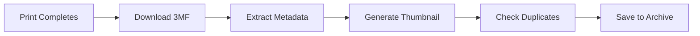
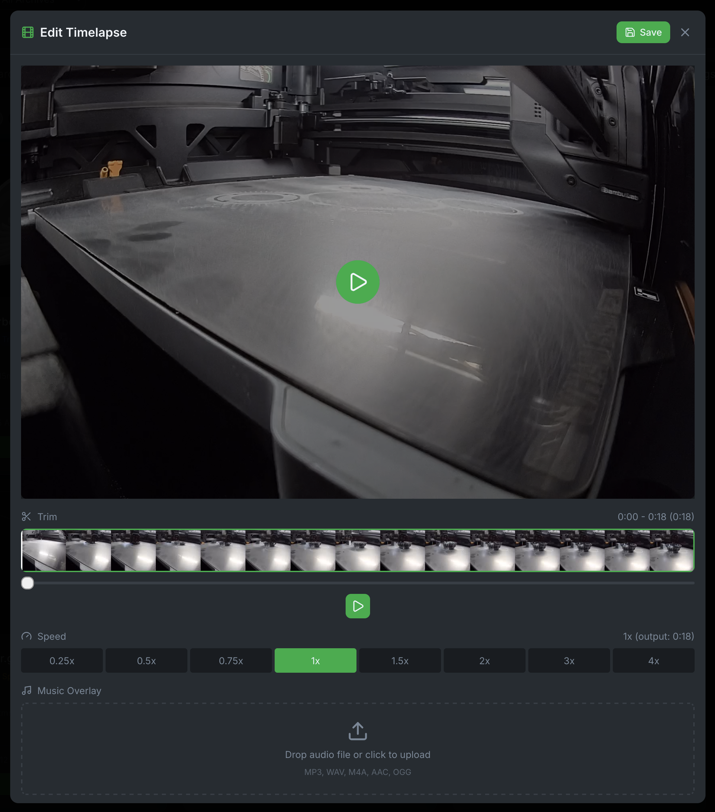

# Print Archiving

Bambuddy automatically archives every completed print with full metadata, 3D previews, and duplicate detection.

{ .screenshot }

---

## :material-archive: How Archiving Works

When a print completes:



### What Gets Archived

| Data | Description |
|------|-------------|
| **3MF File** | Complete print file from printer |
| **Thumbnail** | Preview image from slicer |
| **Metadata** | Print settings, layers, filament, etc. |
| **Print result** | Success, failed, or stopped |
| **Duration** | Actual print time |
| **Filament used** | Grams consumed |
| **Camera snapshot** | Photo at completion (if enabled) |

---

## :material-cube-scan: 3D Model Preview

View your models directly in the browser:

### Three.js Viewer

- **Rotate** - Click and drag
- **Zoom** - Scroll wheel
- **Pan** - Right-click and drag
- **Reset** - Double-click

### Viewer Features

- Wireframe mode
- Solid/transparent modes
- Color from slicer
- Multi-part support

---

## :material-content-duplicate: Duplicate Detection

Bambuddy automatically detects duplicate prints:

### How It Works

1. Extracts file hash from 3MF
2. Compares with existing archives
3. Marks potential duplicates
4. You decide what to keep

### Duplicate Indicators

- Badge showing "Duplicate"
- Link to original print
- Side-by-side comparison available

### Managing Duplicates

- **Keep both** - Sometimes you intentionally reprint
- **Delete duplicate** - Remove the newer one
- **Merge** - Combine statistics from both

---

## :material-card-text: Archive Cards

Each archive displays as a card with key information:

```
┌────────────────────────────────────────┐
│  [Thumbnail]                           │
│                                        │
│  Benchy.3mf                           │
│  Workshop X1C • 2h 15m                │
│  ✓ Success • 45g PLA                  │
│                                        │
│  [Tags] [Project Badge]               │
└────────────────────────────────────────┘
```

### Card Information

- **Thumbnail** - Visual preview
- **Filename** - Original file name
- **Printer** - Which printer completed it
- **Duration** - How long it took
- **Result** - Success, failed, or stopped
- **Filament** - Material and weight used
- **Object Count** - Number of printable objects in the 3MF
- **Tags** - Custom labels
- **Project** - Assigned project badge

### Context Menu Button

Each card has a three-dot menu button (⋮) that appears on hover:

- Provides quick access to context menu actions
- Always visible on mobile devices
- Located on the left side of the card

---

## :material-view-grid: View Modes

Switch between different archive views using the toolbar buttons:

### Grid View (Cards)

Default view showing archive cards in a responsive grid:

- Large thumbnails for visual browsing
- All metadata visible at a glance
- Best for visual identification

### List View

Compact table view for data-focused browsing:

- One archive per row
- Sortable columns
- Inline edit and delete buttons
- Three-dot menu for full context menu access
- Best for managing large archives

### Calendar View

Browse archives by date:

- Monthly calendar layout
- Dots indicate prints on each day
- Color coding for success/failure
- Click a day to see that day's prints
- Click an archive to highlight it in grid view

### Cross-View Highlighting

Click an archive in calendar view or from a project's archive list:

1. Switches to grid view automatically
2. Scrolls to the selected archive
3. Highlights with a yellow border for 5 seconds
4. Great for finding specific prints across views

---

## :material-mouse: Context Menu Actions

Right-click (or long-press on mobile) for quick actions:

| Action | Description |
|--------|-------------|
| :material-printer-3d: **Re-print** | Send to any connected printer |
| :material-compare: **Compare** | Side-by-side with other archives |
| :material-folder-move: **Add to Project** | Assign to a project |
| :material-tag: **Edit Tags** | Add or remove tags |
| :material-pencil: **Edit Details** | Modify name, notes, etc. |
| :material-download: **Download 3MF** | Get the original file |
| :material-cube-outline: **Upload/Replace F3D** | Attach Fusion 360 design file |
| :material-download: **Download F3D** | Download attached F3D file |
| :material-delete: **Delete** | Remove from archive |

---

## :material-printer-3d: Re-print with AMS Mapping

When re-printing an archive, Bambuddy shows a filament comparison with auto-matching and manual override options:

{ .screenshot }

### What It Shows

| Required (from 3MF) | → | Loaded (in AMS) | Status |
|---------------------|---|-----------------|--------|
| PLA Red (25g) | → | PLA Red (AMS-A Slot 1) | ✓ Match |
| PETG Black (10g) | → | PETG White (AMS-B Slot 2) | ⚠ Color mismatch |
| PLA Blue (5g) | → | TPU (AMS-A Slot 3) | ⚠ Type mismatch |

### Status Indicators

| Icon | Color | Meaning |
|------|-------|---------|
| ✓ | Green | Type and color both match (exact or similar) |
| ⚠ | Yellow | Same type, different color |
| ⚠ | Orange | Different filament type or not loaded |

### Features

- **Auto-Matching** - Automatically finds the best AMS slot for each required filament (type + color)
- **Manual Slot Selection** - Click the dropdown to override auto-matching and select any AMS slot
- **Color Names** - Dropdown shows color names (decoded from Bambu filament codes like "Jade White", "Cobalt Blue", or derived from hex for third-party filaments)
- **Blue Ring Indicator** - Shows which slots have been manually selected vs auto-matched
- **AMS Slot Labels** - Shows which AMS unit and slot contains the filament (e.g., "AMS-B Slot 3")
- **Fuzzy Color Matching** - Colors are matched within a tolerance, so slight hex variations still show as a match
- **Re-read Button** - Refresh AMS status from the printer if you've swapped spools since the modal opened

### Multi-Plate 3MF Files

When reprinting a multi-plate 3MF file (exported from Bambu Studio with "All sliced file"), Bambuddy shows a plate selection grid:

- **Plate Thumbnails** - Visual preview of each plate to help identify the correct one
- **Plate Names** - Shows object names and print time estimates
- **Filtered Filaments** - Only filaments used by the selected plate are shown for mapping
- **Required Selection** - You must select a plate before printing

This prevents the issue where all plates' filaments were shown together, causing incorrect AMS mapping.

!!! tip "Single-Plate Exports"
    For 3MF files exported as a single plate ("Plate sliced file"), the plate is auto-selected and no grid is shown.

### Print Options

Click **Print Options** to configure settings before starting:

| Option | Default | Description |
|--------|---------|-------------|
| **Bed Leveling** | Enabled | Auto-level bed before print |
| **Flow Calibration** | Disabled | Calibrate extrusion flow |
| **Vibration Calibration** | Enabled | Reduce ringing artifacts |
| **First Layer Inspection** | Disabled | AI inspection of first layer |
| **Timelapse** | Disabled | Record timelapse video |

!!! tip "Multi-Color Prints"
    Bambuddy sends AMS mapping in the same format as Bambu Studio, ensuring reliable filament switching on multi-color prints.

### How It Works

1. Click **Re-print** on an archive
2. Select target printer
3. **For multi-plate files**: Select which plate to print from the grid
4. Review filament comparison (click **Re-read** if you've changed spools)
5. Expand **Print Options** to adjust settings if needed
6. Click **Print** to start

!!! tip "File Type Badge"
    Archive cards show a **GCODE** (green) or **SOURCE** (orange) badge. Only GCODE files have AMS mapping data - SOURCE files are slicer project files without embedded print settings.

---

## :material-image-multiple: Photo Attachments

Add photos to your archives:

### Camera Snapshot

Automatic camera capture on print completion:

1. Go to **Settings** > **General**
2. Enable **Capture snapshot on print complete**
3. Photos are automatically added to archives

### Manual Photos

Upload photos of your finished prints:

1. Open an archive
2. Click **Add Photo**
3. Upload from your device
4. Photos are stored with the archive

!!! tip "Failure Documentation"
    Add photos of failed prints to help analyze what went wrong.

---

## :material-movie-edit: Timelapse Editor

Edit your timelapse videos directly in Bambuddy:

{ .screenshot }

### Opening the Editor

1. Open an archive with a timelapse
2. Click the timelapse to view it
3. Click **Edit** in the viewer header

### Editor Features

| Feature | Description |
|---------|-------------|
| **Trim** | Set start and end points with visual timeline |
| **Speed** | Adjust playback from 0.25x to 4x |
| **Music** | Add audio overlay with volume control |
| **Preview** | Preview changes before saving |

### Timeline Controls

- **Thumbnail strip** - Visual preview of video frames
- **Trim handles** - Drag to set start/end points
- **Playhead** - Shows current position
- **Play/Pause** - Preview trimmed section

### Adding Music

1. Click the **Music** section
2. Upload an audio file (MP3, WAV, M4A, AAC, OGG)
3. Adjust volume with the slider
4. Preview synced with video playback

### Saving Changes

Click **Save** to process the video. The original timelapse will be replaced with the edited version.

!!! note "Processing Time"
    Video processing uses FFmpeg on the server. Longer videos may take a few moments to process.

---

## :material-download: Source 3MF Upload

Upload the original 3MF file for prints started outside Bambuddy:

1. Open an archive
2. Click **Upload 3MF**
3. Select the source file
4. 3MF is stored with the archive

This enables 3D preview and re-printing even for imported archives.

---

## :material-cube-outline: Fusion 360 Design Files

Attach F3D design files to archives for complete design tracking:

### Uploading F3D Files

1. Right-click an archive (or use the context menu button)
2. Select **Upload F3D**
3. Choose your `.f3d` file
4. File is stored with the archive

### F3D Badge

Archives with attached F3D files show a cyan badge on the card (next to the source 3MF badge if present). Click the badge to download the file.

### Context Menu Options

| Action | When Visible | Description |
|--------|--------------|-------------|
| **Upload F3D** | No F3D attached | Attach a new design file |
| **Replace F3D** | F3D exists | Replace with a different file |
| **Download F3D** | F3D exists | Download the attached file |
| **Remove F3D** | F3D exists | Delete the attachment |

!!! tip "Design Tracking"
    Keep your Fusion 360 source files alongside your prints for complete project documentation.

---

## :material-tag: Tags

Organize archives with custom tags:

### Creating Tags

1. Open any archive
2. Click **Edit Tags**
3. Type a new tag name
4. Press Enter to create

### Using Tags

- Filter archives by tag
- Combine multiple tags
- Color-coded in the interface

### Tag Examples

- `functional` - Useful prints
- `decoration` - Decorative items
- `gift` - Prints for others
- `prototype` - Test iterations
- `failed` - Print failures

---

## :material-note-text: Notes

Add notes to archives:

- Design changes
- Print settings tweaks
- Quality observations
- Reference links

Notes are searchable via full-text search.

---

## :material-account: Designer Attribution

Credit the model designer:

1. Open an archive
2. Click **Edit Details**
3. Add **Designer** name
4. Optionally add **Designer URL**

Great for tracking models from Printables, Thingiverse, etc.

---

## :material-link: External Links

Link archives to their source on Printables, Thingiverse, or other sites:

### Adding an External Link

1. Open an archive
2. Click **Edit** (pencil icon)
3. Enter the URL in the **External Link** field
4. Click **Save**

### How It Works

| Source | Behavior |
|--------|----------|
| **External Link set** | Globe button opens your custom URL |
| **MakerWorld detected** | Globe button opens auto-detected MakerWorld URL |
| **Neither** | Globe button disabled |

!!! tip "MakerWorld Auto-Detection"
    Files downloaded from MakerWorld include metadata that Bambuddy extracts automatically. The external link field lets you manually add links for files from other sources.

---

## :material-filter: Filtering Archives

Find archives quickly:

### Filter Options

| Filter | Description |
|--------|-------------|
| **Printer** | Show only from specific printer |
| **Status** | Success, failed, or stopped |
| **Date range** | Prints within timeframe |
| **Project** | Assigned to project |
| **Tags** | Has specific tags |
| **Material** | Filament type used |

### Combining Filters

Stack multiple filters to narrow results. For example: "PLA prints from Workshop X1C in the last week."

---

## :material-sort: Sorting

Sort archives by:

- **Date** (newest/oldest)
- **Name** (A-Z/Z-A)
- **Duration** (shortest/longest)
- **Printer** (grouped)

---

## :material-lightbulb: Tips

!!! tip "Batch Operations"
    Select multiple archives with Shift+click or Ctrl+click for batch actions.

!!! tip "Quick Search"
    Press ++slash++ to jump to the search box from anywhere.

!!! tip "Project Organization"
    Use projects to group related prints (like "Voron Build" or "Gift Set").

!!! tip "Tag Consistently"
    Develop a consistent tagging system for easy filtering later.
