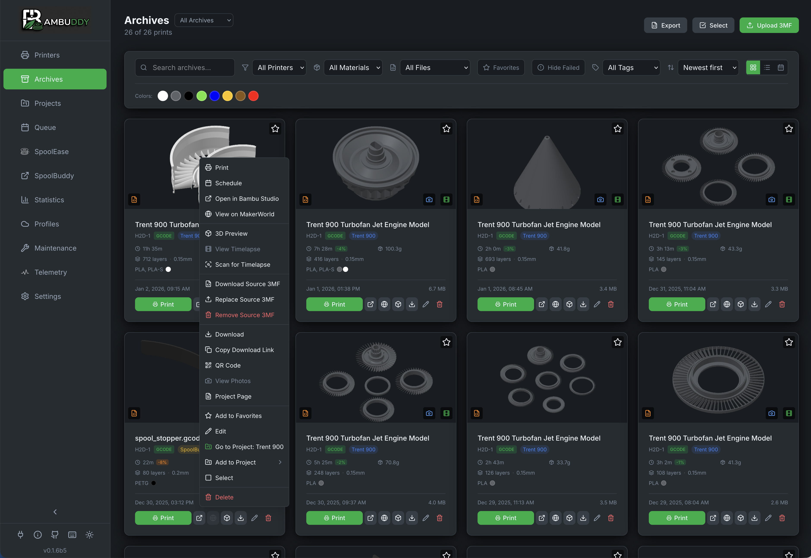
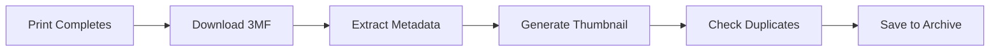
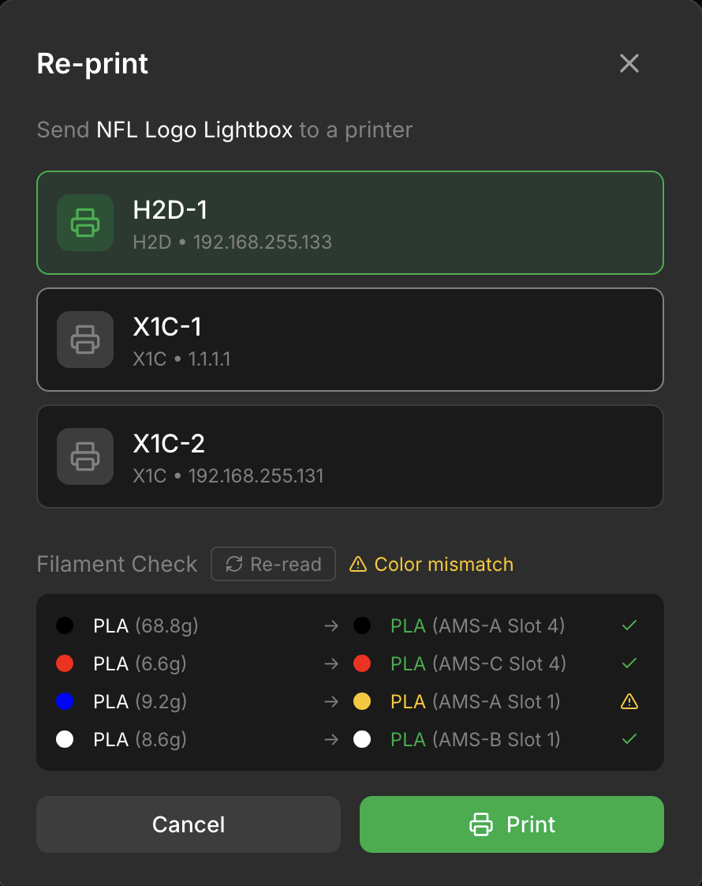
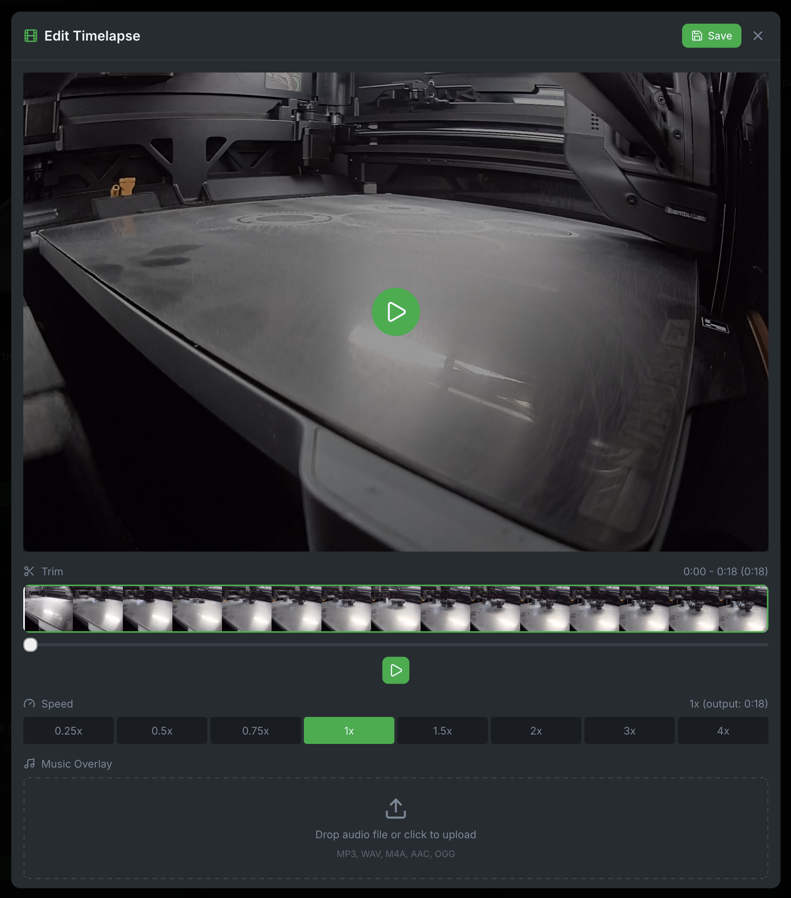

# Print Archiving

Bambuddy automatically archives every print with full metadata, 3D previews, and duplicate detection.

{ .screenshot }

---

## :material-archive: How Archiving Works

!!! warning "SD Card Required"
    An SD card must be inserted in your printer for archiving to work. Bambuddy downloads the 3MF file from the printer's SD card after each print completes.

When a print completes:


```mermaid
graph LR
    A[Print Completes] --> B[Download 3MF]
    B --> C[Extract Metadata]
    C --> D[Generate Thumbnail]
    D --> E[Check Duplicates]
    E --> F[Save to Archive]
```

### What Gets Archived

| Data | Description |
|------|-------------|
| **3MF File** | Complete print file from printer |
| **Thumbnail** | Preview image from slicer |
| **Metadata** | Print settings, layers, filament, etc. |
| **Print result** | Success, failed, or stopped |
| **Duration** | Actual print time |
| **Filament used** | Grams consumed |
| **Camera snapshot** | Photo at completion (if enabled) |

### What Gets Skipped

Bambuddy automatically skips archiving for:

- **Calibration prints** — Internal printer operations like flow rate calibration, vibration compensation, and bed leveling (gcode files under `/usr/` on the printer)
- **Prints with auto-archive disabled** — Per-printer toggle in printer settings

---

## :material-cube-scan: 3D GCode Preview

Click the **3D-preview badge** (layers icon) on an archive card — or the **3D Preview** context-menu entry — to open the embedded GCode viewer for that archive. The viewer renders the sliced toolpath directly in the Bambuddy layout, with layer scrubbing and playback, so you can inspect exactly what the printer will do without leaving the app.

### Opening the Viewer

- **Archive card badge** - Click the layers icon in the bottom-right corner of any card
- **Context menu** - Right-click an archive → **3D Preview**
- **List-view menu** - Works the same way in compact list layout

The viewer opens in the main content pane with the Bambuddy sidebar still visible. Reloading the page keeps you in the shell — the viewer URL carries the archive reference so it re-renders correctly.

### Plate Picker

For multi-plate 3MF files, a picker modal appears first:

- **Grid layout** - Plate thumbnails from the slicer, two columns on wider screens
- **Object lists** - Each row shows the first few object names on that plate + print time
- **Scrollable** - Archives with dozens of plates scroll inside the modal rather than overflow the page

Single-plate archives skip the picker and open the viewer directly.

### Viewer Controls

- **Layer slider** (right side) - Scrub through the model layer by layer
- **Play button** + speed selector (1× / 3× / 10× / 25×) - Animate the toolpath
- **Mouse** - Left-drag to rotate, scroll to zoom, right-drag to pan
- **Bed size** - Automatically matches the printer model the archive was sliced for (H2D → 350 × 320 × 325 mm, X1C/P1S → 256³, A1 → 256³, etc.), no configuration needed

### Source-Only Archives

Pure project 3MF files — exported from BambuStudio without being sliced — don't contain any G-code to preview. Clicking 3D Preview on those archives shows a short toast telling you to slice the file in BambuStudio first; the viewer isn't opened.

---

## :material-content-duplicate: Duplicate Detection

Bambuddy automatically detects duplicate prints:

### How It Works

1. Extracts file hash from 3MF
2. Compares with existing archives
3. Marks potential duplicates
4. You decide what to keep

### Duplicate Indicators

- Badge showing "Duplicate"
- Link to original print
- Side-by-side comparison available

### Managing Duplicates

- **Keep both** - Sometimes you intentionally reprint
- **Delete duplicate** - Remove the newer one

---

## :material-card-text: Archive Cards

Each archive displays as a card with key information:

```
┌────────────────────────────────────────┐
│  [Thumbnail]                           │
│                                        │
│  Benchy.3mf                           │
│  Workshop X1C • 2h 15m                │
│  ✓ Success • 45g PLA                  │
│                                        │
│  [Tags] [Project Badge]               │
└────────────────────────────────────────┘
```

### Card Information

- **Thumbnail** - Visual preview
- **Filename** - Original file name
- **Printer** - Which printer completed it
- **Duration** - How long it took
- **Result** - Success, failed, or stopped
- **Filament** - Material and weight used (slicer estimate from the 3MF — actual per-run usage lives in the [Print Log](#per-archive-print-log) below)
- **Object Count** - Number of printable objects in the 3MF
- **Tags** - Custom labels
- **Project** - Assigned project badge
- **Uploaded by** - Username who uploaded (when authentication is enabled)
- **N prints badge** - Orange badge shown when this archive has been printed more than once. Click it to open the per-archive Print Log (see below).

### Per-archive Print Log

Every time you print or reprint an archive, Bambuddy records the event independently — date, status, duration, actual filament used, cost, failure reason. The archive card itself stays representative of the *file* (one card per unique 3MF), but the full per-print history is always one click away.

**Access paths:**

- **Click the orange `N prints` badge** on the card (only visible when there's more than one run)
- **Right-click the card → Print Log** (visible on every archive, including single-run ones)
- The same log also renders at the top of the **Edit Archive** dialog for context

**What you'll see in the log:**

| Column | Description |
|--------|-------------|
| **Date** | When this specific run started |
| **Status** | Completed, Failed, Cancelled, Stopped, or Skipped |
| **Duration** | Actual elapsed time for this run |
| **Filament** | Actual grams used for this run (from spool tracking when configured, otherwise scaled to the print's progress percentage) |
| **Cost** | Actual cost for this run |
| **Failure reason** | Shown under failed runs, when one was recorded |

**Why this matters:** a failed reprint at 10 g no longer overwrites a previous successful 100 g print on the same archive — both runs stay visible, and Quick Stats correctly sum to 110 g across the two events.

### Card Action Buttons

Each archive card has action buttons at the bottom for quick access:

| Button | Description |
|--------|-------------|
| **Reprint** | Print immediately on a connected printer |
| **Schedule** | Add to print queue (schedule for later) |
| :material-open-in-new: | Open in Slicer (Bambu Studio or OrcaSlicer — configurable in Settings) |
| :material-web: | Open external link (if set) |
| :material-cube-outline: | 3D Preview |
| :material-download: | Download 3MF file |
| :material-pencil: | Edit archive details |

!!! note "Permission Required"
    The Schedule button requires the `queue:create` permission. Users without this permission will see the button disabled.

### Context Menu Button

Each card has a three-dot menu button (⋮) that appears on hover:

- Provides quick access to all context menu actions
- Always visible on mobile devices
- Located on the left side of the card

### Multi-Plate Browsing

For archives created from multi-plate 3MF files, you can browse through each plate's thumbnail directly on the card:

1. **Hover** over the archive card to reveal navigation controls
2. **Arrow buttons** (◀ ▶) on left/right to cycle through plates
3. **Dot indicators** at bottom show current plate (clickable)
4. Each plate shows its individual thumbnail preview

!!! tip "Lazy Loading"
    Plate data is only fetched when you hover over the card, keeping the archives page fast even with many archives.

---

## :material-view-grid: View Modes

Switch between different archive views using the toolbar buttons:

### Grid View (Cards)

Default view showing archive cards in a responsive grid:

- Large thumbnails for visual browsing
- All metadata visible at a glance
- Best for visual identification

### List View

Compact table view for data-focused browsing:

- One archive per row
- Sortable columns
- Inline edit and delete buttons
- Three-dot menu for full context menu access
- Best for managing large archives

### Calendar View

Browse archives by date:

- Monthly calendar layout
- Dots indicate prints on each day
- Color coding for success/failure
- Click a day to see that day's prints
- Click an archive to highlight it in grid view

### Cross-View Highlighting

Click an archive in calendar view or from a project's archive list:

1. Switches to grid view automatically
2. Scrolls to the selected archive
3. Highlights with a yellow border for 5 seconds
4. Great for finding specific prints across views

---

## :material-mouse: Context Menu Actions

Right-click (or long-press on mobile) for quick actions:

| Action | Description |
|--------|-------------|
| :material-printer-3d: **Re-print** | Send to any connected printer |
| :material-folder-move: **Add to Project** | Assign to a project |
| :material-tag: **Edit Tags** | Add or remove tags |
| :material-pencil: **Edit Details** | Modify name, notes, etc. |
| :material-download: **Download 3MF** | Get the original file |
| :material-upload: **Upload Timelapse** | Manually attach a timelapse video |
| :material-delete: **Remove Timelapse** | Remove attached timelapse |
| :material-cube-outline: **Upload/Replace F3D** | Attach Fusion 360 design file |
| :material-download: **Download F3D** | Download attached F3D file |
| :material-delete: **Delete** | Remove from archive (see [Delete Behavior](#delete-behavior) below) |

---

## :material-delete: Delete Behavior

When you delete a print from the archive, Bambuddy by default **keeps the print's filament, time, cost, and energy contribution in [Quick Stats](statistics.md)**. The archive entry disappears from the listings and its files are removed from disk (so you reclaim the storage), but the totals on the Statistics page stay honest.

This is the right default when you reprint the same model many times and want to keep the file list tidy — deleting nine of ten Benchies no longer rewinds the 300 g and 24 hours back to whatever the surviving archive contributed.

### "Also remove this print from Quick Stats" checkbox

If you actually want the print *gone* from statistics — typical for failed prints that shouldn't pollute success-rate dashboards, or one-off experiments you don't want to count — tick the **Also remove this print from Quick Stats (filament, time, cost, energy)** checkbox in the delete confirmation dialog. With the box ticked, the row is hard-deleted and its contribution disappears from totals just like before.

The checkbox is opt-in per delete — it resets to off every time the dialog closes, so a destructive choice on one print never carries over to the next one.

| Action | Files on disk | Listings / search | Quick Stats |
|--------|---------------|-------------------|-------------|
| **Delete** (default, soft) | Removed | Hidden | **Still counted** |
| **Delete + checkbox** (hard) | Removed | Hidden | Dropped from totals |

!!! note "Auto-purge is unaffected"
    The [Auto-Purge](#auto-purge) sweeper continues to hard-delete old archives the way it always has — its job is reclaiming disk space and pruning rows the user hasn't used in a long time. If you want a print to disappear from stats too, use the checkbox on the manual delete instead.

---

## :material-printer-3d: Re-print with AMS Mapping

When re-printing an archive, Bambuddy shows a filament comparison with auto-matching and manual override options:

{ .screenshot }

### What It Shows

| Required (from 3MF) | → | Loaded (in AMS) | Status |
|---------------------|---|-----------------|--------|
| PLA Red (25g) | → | PLA Red (AMS-A Slot 1) | ✓ Match |
| PETG Black (10g) | → | PETG White (AMS-B Slot 2) | ⚠ Color mismatch |
| PLA Blue (5g) | → | TPU (AMS-A Slot 3) | ⚠ Type mismatch |

### Status Indicators

| Icon | Color | Meaning |
|------|-------|---------|
| ✓ | Green | Type and color both match (exact or similar) |
| ⚠ | Yellow | Same type, different color |
| ⚠ | Orange | Different filament type or not loaded |

### Features

- **Auto-Matching** - Automatically finds the best AMS slot for each required filament (type + color)
- **Manual Slot Selection** - Click the dropdown to override auto-matching and select any AMS slot
- **Color Names** - Dropdown shows color names (decoded from Bambu filament codes like "Jade White", "Cobalt Blue", or derived from hex for third-party filaments)
- **Blue Ring Indicator** - Shows which slots have been manually selected vs auto-matched
- **AMS Slot Labels** - Shows which AMS unit and slot contains the filament (e.g., "AMS-B Slot 3")
- **Fuzzy Color Matching** - Colors are matched within a tolerance, so slight hex variations still show as a match
- **Re-read Button** - Refresh AMS status from the printer if you've swapped spools since the modal opened

### Multi-Plate 3MF Files

When reprinting a multi-plate 3MF file (exported from Bambu Studio with "All sliced file"), Bambuddy shows a plate selection grid:

- **Plate Thumbnails** - Visual preview of each plate to help identify the correct one
- **Plate Names** - Shows object names and print time estimates
- **Filtered Filaments** - Only filaments used by the selected plate are shown for mapping
- **Required Selection** - You must select a plate before printing

This prevents the issue where all plates' filaments were shown together, causing incorrect AMS mapping.

!!! tip "Single-Plate Exports"
    For 3MF files exported as a single plate ("Plate sliced file"), the plate is auto-selected and no grid is shown.

### Print Options

Click **Print Options** to configure settings before starting:

| Option | Default | Description |
|--------|---------|-------------|
| **Bed Leveling** | Enabled | Auto-level bed before print |
| **Flow Calibration** | Disabled | Calibrate extrusion flow |
| **Vibration Calibration** | Enabled | Reduce ringing artifacts |
| **First Layer Inspection** | Disabled | AI inspection of first layer |
| **Timelapse** | Disabled | Record timelapse video |

!!! tip "Multi-Color Prints"
    Bambuddy sends AMS mapping in the same format as Bambu Studio, ensuring reliable filament switching on multi-color prints.

### How It Works

1. Click **Re-print** on an archive
2. Select target printer
3. **For multi-plate files**: Select which plate to print from the grid
4. Review filament comparison (click **Re-read** if you've changed spools)
5. Expand **Print Options** to adjust settings if needed
6. Click **Print** to start

!!! tip "File Type Badge"
    Archive cards show a **GCODE** (green) or **SOURCE** (orange) badge. Only GCODE files have AMS mapping data - SOURCE files are slicer project files without embedded print settings.

---

## :material-image-multiple: Photo Attachments

Add photos to your archives:

### Camera Snapshot

Automatic camera capture on print completion:

1. Go to **Settings** > **General**
2. Enable **Capture snapshot on print complete**
3. Photos are automatically added to archives

### Manual Photos

Upload photos of your finished prints:

1. Open an archive
2. Click **Add Photo**
3. Upload from your device
4. Photos are stored with the archive

!!! tip "Failure Documentation"
    Add photos of failed prints to help analyze what went wrong.

---

## :material-movie-edit: Timelapse Editor

Edit your timelapse videos directly in Bambuddy:

{ .screenshot }

### Supported Formats

| Format | Printers | Handling |
|--------|----------|----------|
| **MP4** | X1, X1C, X1E, A1, A1 Mini, H2D | Attached directly |
| **AVI** | P1S, P1P | Saved immediately, converted to MP4 in the background |

!!! info "Background Conversion"
    AVI files from P1-series printers are converted to MP4 automatically using FFmpeg. The conversion runs at low CPU priority (`-threads 1`, `nice -n 19`) to avoid impacting performance on Raspberry Pi. The timelapse is available immediately after the print — the conversion happens silently in the background.

### Opening the Editor

1. Open an archive with a timelapse
2. Click the timelapse to view it
3. Click **Edit** in the viewer header

### Editor Features

| Feature | Description |
|---------|-------------|
| **Trim** | Set start and end points with visual timeline |
| **Speed** | Adjust playback from 0.25x to 4x |
| **Music** | Add audio overlay with volume control |
| **Preview** | Preview changes before saving |

### Timeline Controls

- **Thumbnail strip** - Visual preview of video frames
- **Trim handles** - Drag to set start/end points
- **Playhead** - Shows current position
- **Play/Pause** - Preview trimmed section

### Adding Music

1. Click the **Music** section
2. Upload an audio file (MP3, WAV, M4A, AAC, OGG)
3. Adjust volume with the slider
4. Preview synced with video playback

### Saving Changes

Click **Save** to process the video. The original timelapse will be replaced with the edited version.

!!! note "Processing Time"
    Video processing uses FFmpeg on the server. Longer videos may take a few moments to process.

### Manual Timelapse Upload & Remove

If the auto-scan attaches the wrong timelapse or your printer is in LAN-only mode:

1. **Remove** the incorrect timelapse via the context menu → **Remove Timelapse**
2. **Upload** the correct file via the context menu → **Upload Timelapse**

| Action | When Visible | Description |
|--------|--------------|-------------|
| **Upload Timelapse** | No timelapse attached | Upload `.mp4`, `.avi`, or `.mkv` from your device |
| **Remove Timelapse** | Timelapse attached | Delete the timelapse and clear the reference |

!!! tip "AVI Auto-Conversion"
    Uploaded AVI and MKV files are automatically converted to MP4 in the background, just like auto-scanned timelapses.

---

## :material-download: Source 3MF Upload

Upload the original 3MF file for prints started outside Bambuddy:

1. Open an archive
2. Click **Upload 3MF**
3. Select the source file
4. 3MF is stored with the archive

This enables 3D preview and re-printing even for imported archives.

---

## :material-cube-outline: Fusion 360 Design Files

Attach F3D design files to archives for complete design tracking:

### Uploading F3D Files

1. Right-click an archive (or use the context menu button)
2. Select **Upload F3D**
3. Choose your `.f3d` file
4. File is stored with the archive

### F3D Badge

Archives with attached F3D files show a cyan badge on the card (next to the source 3MF badge if present). Click the badge to download the file.

### Context Menu Options

| Action | When Visible | Description |
|--------|--------------|-------------|
| **Upload F3D** | No F3D attached | Attach a new design file |
| **Replace F3D** | F3D exists | Replace with a different file |
| **Download F3D** | F3D exists | Download the attached file |
| **Remove F3D** | F3D exists | Delete the attachment |

!!! tip "Design Tracking"
    Keep your Fusion 360 source files alongside your prints for complete project documentation.

---

## :material-tag: Tags

Organize archives with custom tags:

### Creating Tags

1. Open any archive
2. Click **Edit Tags**
3. Type a new tag name
4. Press Enter to create

### Using Tags

- Filter archives by tag
- Combine multiple tags
- Color-coded in the interface

### Tag Examples

- `functional` - Useful prints
- `decoration` - Decorative items
- `gift` - Prints for others
- `prototype` - Test iterations
- `failed` - Print failures

### Tag Management

Manage all tags from a centralized location:

1. Navigate to **Archives** page
2. Click the **gear icon** next to the tag filter dropdown
3. View all tags with usage counts

**Available actions:**

| Action | Description |
|--------|-------------|
| :material-magnify: **Search** | Filter tags by name |
| :material-sort: **Sort** | Order by usage count or alphabetically |
| :material-pencil: **Rename** | Change tag name across all archives |
| :material-delete: **Delete** | Remove tag from all archives |

!!! tip "Bulk Rename"
    Renaming a tag updates all archives that use it in one action. Great for fixing typos or consolidating similar tags.

---

## :material-note-text: Notes

Add notes to archives:

- Design changes
- Print settings tweaks
- Quality observations
- Reference links

Notes are searchable via full-text search.

---

## :material-account: Designer Attribution

Credit the model designer:

1. Open an archive
2. Click **Edit Details**
3. Add **Designer** name
4. Optionally add **Designer URL**

Great for tracking models from Printables, Thingiverse, etc.

---

## :material-link: External Links

Link archives to their source on Printables, Thingiverse, or other sites:

### Adding an External Link

1. Open an archive
2. Click **Edit** (pencil icon)
3. Enter the URL in the **External Link** field
4. Click **Save**

### How It Works

| Source | Behavior |
|--------|----------|
| **External Link set** | Globe button opens your custom URL |
| **MakerWorld detected** | Globe button opens auto-detected MakerWorld URL |
| **Neither** | Globe button disabled |

!!! tip "MakerWorld Auto-Detection"
    Files downloaded from MakerWorld include metadata that Bambuddy extracts automatically. The external link field lets you manually add links for files from other sources.

---

## :material-filter: Filtering Archives

Find archives quickly:

### Filter Options

| Filter | Description |
|--------|-------------|
| **Printer** | Show only from specific printer |
| **Tags** | Has specific tags |
| **Material** | Filament type used |
| **Color** | Filter by filament color (AND/OR modes) |
| **File type** | GCODE, SOURCE, or ALL |
| **Favorites** | Show only favorited archives |

### Combining Filters

Stack multiple filters to narrow results. For example: "PLA prints from Workshop X1C in the last week."

---

## :material-sort: Sorting

Sort archives by:

- **Date** (newest/oldest)
- **Name** (A-Z/Z-A)
- **Size** (largest/smallest)

---

## :material-broom: Auto-Purge

Your archive can grow forever. For admins who don't want to babysit disk usage, Bambuddy can automatically delete old archives on a daily cadence.

### Enabling Auto-Purge

Navigate to **Settings → General → Archive Settings**. Below the familiar toggles (auto-archive, save thumbnails, capture finish photo) there's an **Auto-purge old archives** section.

1. Flip the toggle on.
2. Set the age threshold (minimum 7 days, maximum 10 years, default 365).
3. Changes save immediately with a confirmation toast — no separate Save button.

A background sweeper runs every 15 minutes but throttles actual purge runs to once per 24 hours, so flipping the toggle does not trigger an immediate deletion — the next daily tick picks it up.

### Manual Purge

Need to clean up right now? The Archives page header has a **Purge old** button right next to Upload 3MF. It opens a modal with a live preview: "*N* archives · *size* would be deleted" plus up to five sample filenames. Adjust the age input to see the count update, then confirm.

#### What happens when you click Purge

- Each matching archive is permanently removed from the database.
- The 3MF, thumbnail, timelapse, source 3MF, F3D design file, and photo folder are all deleted from disk.
- **There is no trash bin for archives** — deletion is immediate and cannot be undone.
- Reprinting an archive refreshes its age clock, so archives you still use are safe.

### How "old" Is Measured

The threshold is based on **the most recent time each archive was printed**, not its original creation date. When you reprint an archive Bambuddy reuses the same row and refreshes its completed-at timestamp, so reprinting a two-year-old archive yesterday moves its age clock back to yesterday. In practice: only archives you haven't actually used in a while get purged.

### What Gets Deleted

Unlike the File Manager trash bin, **archives are hard-deleted**. There is no restore. For every archive past the threshold the sweeper removes:

- The database row
- The 3MF file
- The thumbnail
- The timelapse (if any)
- The source 3MF (if uploaded separately)
- The F3D design file (if uploaded)
- The photo folder

Everything goes through the same safety-checked path as the single-archive delete button, so the existing "refuse to delete outside the archive directory" guards still apply.

### Keeping Archives Safe

If you want to make sure certain prints survive the purge:

- **Download them first** — the 3MF and thumbnail are easy to grab individually.
- **Favourite them** *(planned)* — a future release may exclude favourited archives from auto-purge.

Auto-purge is off by default on new installs, so nothing disappears until you opt in.

### Permissions

Both the toggle and the manual purge require the `archives:purge` permission (Administrators group by default). Regular users don't see either UI.

## :material-lightbulb: Tips

!!! tip "Batch Operations"
    Enter selection mode and click archives to select them for batch actions (tagging, project assignment, comparison).

!!! tip "Quick Search"
    Press ++slash++ to jump to the search box from anywhere.

!!! tip "Project Organization"
    Use projects to group related prints (like "Voron Build" or "Gift Set").

!!! tip "Tag Consistently"
    Develop a consistent tagging system for easy filtering later.
