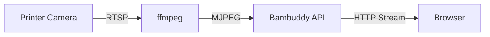

# Camera Streaming

Monitor your prints visually with live camera streaming directly from your Bambu Lab printer.

---

## :material-video: Live Streaming

Bambuddy provides MJPEG video streaming from your printer's built-in camera.

### Opening the Camera

1. Click the :material-camera: camera icon on any printer card
2. A new window opens with the live feed
3. The stream starts automatically

### Stream Controls

| Button | Action |
|:------:|--------|
| **Live** | Real-time MJPEG video stream |
| **Snapshot** | Single still image (lower bandwidth) |
| :material-refresh: | Restart the stream |
| :material-fullscreen: | Enter fullscreen mode |

---

## :material-camera: Snapshot Mode

For lower bandwidth usage, use snapshot mode:

- Captures a single frame on demand
- Click refresh to get a new snapshot
- Ideal for cellular connections or slow networks

---

## :material-cog: Technical Details

### How Streaming Works



1. Printer exposes camera via **RTSP** (Real Time Streaming Protocol)
2. **ffmpeg** converts RTSP to MJPEG (Motion JPEG)
3. Bambuddy serves the **MJPEG stream** to your browser
4. Browser displays frames in an `` tag

### Requirements

| Requirement | Details |
|-------------|---------|
| **ffmpeg** | Must be installed on Bambuddy server |
| **Camera enabled** | Must be enabled in printer settings |
| **LAN Mode** | Camera access requires LAN Mode |
| **Network access** | Server must be able to reach printer IP |

!!! tip "Docker Users"
    Camera streaming works with Docker's default bridge networking in most setups (NAT handles routing automatically).

    If you have issues, try `network_mode: host` - see [Docker Installation](../getting-started/docker.md#network-mode-host).

### Installing ffmpeg

=== ":material-ubuntu: Ubuntu/Debian"

    ```bash
    sudo apt install ffmpeg
    ```

=== ":material-apple: macOS"

    ```bash
    brew install ffmpeg
    ```

=== ":material-microsoft-windows: Windows"

    Download from [ffmpeg.org](https://ffmpeg.org/download.html) and add to PATH.

=== ":material-docker: Docker"

    ffmpeg is included in the Docker image.

---

## :material-image-area: Camera Snapshots on Print Complete

Bambuddy can automatically capture a camera snapshot when prints complete:

1. Go to **Settings** > **General**
2. Enable **Capture snapshot on print complete**
3. Snapshots are saved to the archive

This creates a visual record of your completed prints!

---

## :material-tune: Stream Settings

### Frame Rate

The default frame rate is 10 FPS. You can adjust this in the URL:

```
/api/v1/printers/{id}/camera/stream?fps=15
```

| FPS | Use Case |
|-----|----------|
| 5 | Low bandwidth |
| 10 | Default, balanced |
| 15 | Smoother video |
| 30 | Maximum quality |

!!! note "Higher FPS = More Bandwidth"
    Higher frame rates consume more network bandwidth and server resources.

---

## :material-connection: Stream Cleanup

Bambuddy properly cleans up camera streams:

- **Window close** - Stream stops automatically
- **Tab hidden** - Stream pauses to save resources
- **Page unload** - ffmpeg process terminated
- **Refresh** - Old stream stopped, new one started

This prevents orphaned ffmpeg processes from consuming resources.

---

## :material-help-circle: Troubleshooting

### Stream Won't Start

1. **Is the printer on?** Camera requires power
2. **Is camera enabled?** Check printer settings
3. **Is ffmpeg installed?** Required for streaming
4. **Is LAN Mode enabled?** Required for camera access
5. **Running in Docker?** Try `network_mode: host` if having issues

### Docker: Camera Not Working

If camera streaming doesn't work in Docker, try host network mode:

```yaml
# docker-compose.yml
services:
  bambuddy:
    build: .
    network_mode: host
    # Remove the ports: section when using host mode
```

Note: Docker's default bridge networking with NAT works in most setups. Host mode is only needed if your network configuration prevents NAT'd traffic from reaching the printer.

### Stream Freezes

- Network congestion or WiFi issues
- Try lowering the FPS
- Check printer WiFi signal strength
- Try snapshot mode instead

### High Latency

MJPEG streaming typically has 1-3 seconds of latency. This is normal and due to:

- RTSP buffering
- ffmpeg processing
- HTTP streaming

### Camera Shows Black

- Camera may be initializing
- Try refreshing the stream
- Check if camera works in Bambu Studio

---

## :material-api: API Endpoints

For developers and integrations:

| Endpoint | Method | Description |
|----------|--------|-------------|
| `/api/v1/printers/{id}/camera/stream` | GET | MJPEG stream |
| `/api/v1/printers/{id}/camera/snapshot` | GET | Single JPEG frame |
| `/api/v1/printers/{id}/camera/stop` | POST | Stop active streams |
| `/api/v1/printers/{id}/camera/test` | GET | Test camera connection |

### Example: Embed in OBS

Use the stream URL directly:

```
http://your-bambuddy-server:8000/api/v1/printers/1/camera/stream
```

Add as a **Browser Source** or **Media Source** in OBS.

---

## :material-lightbulb: Tips

!!! tip "Timelapse Alternative"
    While Bambuddy shows live video, the printer itself creates actual timelapses. Access timelapse videos through the archive after print completion.

!!! tip "Multiple Cameras"
    Open multiple camera windows for different printers to monitor your entire print farm.

!!! tip "Mobile Viewing"
    Camera streaming works on mobile devices too. Access from the printer card camera icon.

!!! tip "Bandwidth Conservation"
    Close camera windows when not actively watching to save server resources and bandwidth.
