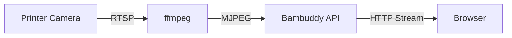

# Camera Streaming

Monitor your prints visually with live camera streaming directly from your Bambu Lab printer.

---

## :material-video: Live Streaming

Bambuddy provides MJPEG video streaming from your printer's built-in camera.

### Opening the Camera

1. Click the :material-camera: camera icon on any printer card
2. Camera opens based on your view mode setting (see below)
3. The stream starts automatically

### View Mode Setting

Configure how camera streams open in **Settings** > **General** > **Camera**:

| Mode | Description |
|------|-------------|
| **New Window** | Opens camera in a separate browser window (default) |
| **Embedded** | Shows camera as a floating overlay on the main screen |

#### Embedded Viewer Features

When using embedded mode, the camera appears as a floating window:

- **Draggable**: Click and drag the header to reposition
- **Resizable**: Drag the bottom-right corner to resize
- **Persistent**: Position and size are remembered per printer across sessions
- **Minimize**: Click the minimize button to collapse to title bar
- **Close**: Click X to close the viewer
- **Multi-Viewer**: Open cameras for multiple printers simultaneously

!!! tip "Embedded Mode Benefits"
    Embedded mode keeps you on the main screen while monitoring prints - no need to switch between browser windows. Open multiple viewers to monitor your entire print farm at once.

### Stream Controls

| Button | Action |
|:------:|--------|
| **Live** | Real-time MJPEG video stream |
| **Snapshot** | Single still image (lower bandwidth) |
| :material-refresh: | Restart the stream |
| :material-fullscreen: | Enter fullscreen mode |

---

## :material-camera: Snapshot Mode

For lower bandwidth usage, use snapshot mode:

- Captures a single frame on demand
- Click refresh to get a new snapshot
- Ideal for cellular connections or slow networks

---

## :material-cog: Technical Details

### How Streaming Works



1. Printer exposes camera via **RTSP** (Real Time Streaming Protocol)
2. **ffmpeg** converts RTSP to MJPEG (Motion JPEG)
3. Bambuddy serves the **MJPEG stream** to your browser
4. Browser displays frames in an `` tag

### Requirements

| Requirement | Details |
|-------------|---------|
| **ffmpeg** | Must be installed on Bambuddy server |
| **Camera enabled** | Must be enabled in printer settings |
| **Developer Mode** | Camera access requires Developer Mode |
| **Network access** | Server must be able to reach printer IP |

!!! tip "Docker Users"
    Camera streaming works with Docker's default bridge networking in most setups (NAT handles routing automatically).

    If you have issues, try `network_mode: host` - see [Docker Installation](../getting-started/docker.md#network-mode-host).

### Installing ffmpeg

=== ":material-ubuntu: Ubuntu/Debian"

    ```bash
    sudo apt install ffmpeg
    ```

=== ":material-apple: macOS"

    ```bash
    brew install ffmpeg
    ```

=== ":material-microsoft-windows: Windows"

    Download from [ffmpeg.org](https://ffmpeg.org/download.html) and add to PATH.

=== ":material-docker: Docker"

    ffmpeg is included in the Docker image.

---

## :material-movie-edit: Timelapse Editor

Edit timelapse videos directly in Bambuddy before downloading or sharing.

### Opening the Editor

1. Go to **Archives** and select a completed print
2. Click on the timelapse video thumbnail
3. Click **Edit** to open the timelapse editor

### Editing Features

| Feature | Description |
|---------|-------------|
| **Trim** | Set start and end points to remove unwanted footage |
| **Speed** | Adjust playback speed from 0.25x to 4x |
| **Music** | Add background music from built-in tracks |
| **Preview** | Watch your edits before exporting |

### Exporting

1. Make your edits
2. Click **Export**
3. Wait for processing (uses ffmpeg)
4. Download the edited video

!!! tip "Original Preserved"
    Editing creates a new file - your original timelapse is never modified.

---

## :material-image-area: Camera Snapshots on Print Complete

Bambuddy can automatically capture a camera snapshot when prints complete:

1. Go to **Settings** > **General**
2. Enable **Capture snapshot on print complete**
3. Snapshots are saved to the archive

This creates a visual record of your completed prints!

---

## :material-tune: Stream Settings

### Frame Rate

The default frame rate is 10 FPS. You can adjust this in the URL:

```
/api/v1/printers/{id}/camera/stream?fps=15
```

| FPS | Use Case |
|-----|----------|
| 5 | Low bandwidth |
| 10 | Default, balanced |
| 15 | Smoother video |
| 30 | Maximum quality |

!!! note "Higher FPS = More Bandwidth"
    Higher frame rates consume more network bandwidth and server resources.

---

## :material-connection: Stream Cleanup

Bambuddy properly cleans up camera streams:

- **Window close** - Stream stops automatically
- **Tab hidden** - Stream pauses to save resources
- **Page unload** - ffmpeg process terminated
- **Refresh** - Old stream stopped, new one started

This prevents orphaned ffmpeg processes from consuming resources.

---

## :material-refresh: Auto-Reconnect

Bambuddy automatically detects and recovers from stalled camera streams:

### Stall Detection

The browser periodically checks if the stream is still receiving frames:

- **Check interval**: Every 5 seconds
- **Detection**: Compares last frame timestamp
- **Threshold**: Stalled if no new frames for >5 seconds

### Automatic Recovery

When a stall is detected:

1. **Detects** that no frames have been received
2. **Closes** the stalled connection
3. **Reconnects** automatically
4. **Resumes** streaming

!!! tip "Network Interruptions"
    If your network briefly drops, the stream will automatically recover once the connection is restored.

---

## :material-help-circle: Troubleshooting

### Stream Won't Start

1. **Is the printer on?** Camera requires power
2. **Is camera enabled?** Check printer settings
3. **Is ffmpeg installed?** Required for streaming
4. **Is Developer Mode enabled?** Required for camera access
5. **Running in Docker?** Try `network_mode: host` if having issues

### Docker: Camera Not Working

If camera streaming doesn't work in Docker, try host network mode:

```yaml
# docker-compose.yml
services:
  bambuddy:
    build: .
    network_mode: host
    # Remove the ports: section when using host mode
```

Note: Docker's default bridge networking with NAT works in most setups. Host mode is only needed if your network configuration prevents NAT'd traffic from reaching the printer.

### Stream Freezes

- Network congestion or WiFi issues
- Try lowering the FPS
- Check printer WiFi signal strength
- Try snapshot mode instead

### High Latency

MJPEG streaming typically has 1-3 seconds of latency. This is normal and due to:

- RTSP buffering
- ffmpeg processing
- HTTP streaming

### Camera Shows Black

- Camera may be initializing
- Try refreshing the stream
- Check if camera works in Bambu Studio

---

## :material-api: API Endpoints

For developers and integrations:

| Endpoint | Method | Description |
|----------|--------|-------------|
| `/api/v1/printers/{id}/camera/stream` | GET | MJPEG stream |
| `/api/v1/printers/{id}/camera/snapshot` | GET | Single JPEG frame |
| `/api/v1/printers/{id}/camera/stop` | POST | Stop active streams |
| `/api/v1/printers/{id}/camera/test` | GET | Test camera connection |

### Example: Embed in OBS

Use the stream URL directly:

```
http://your-bambuddy-server:8000/api/v1/printers/1/camera/stream
```

Add as a **Browser Source** or **Media Source** in OBS.

---

## :material-lightbulb: Tips

!!! tip "Timelapse Videos"
    The printer creates timelapse videos automatically. View and edit them in the archive after print completion using the built-in timelapse editor.

!!! tip "Multiple Cameras"
    In embedded mode, open multiple camera viewers simultaneously - each remembers its own position and size. Great for monitoring your entire print farm on one screen.

!!! tip "Mobile Viewing"
    Camera streaming works on mobile devices too. Access from the printer card camera icon.

!!! tip "Bandwidth Conservation"
    Close camera windows when not actively watching to save server resources and bandwidth.
