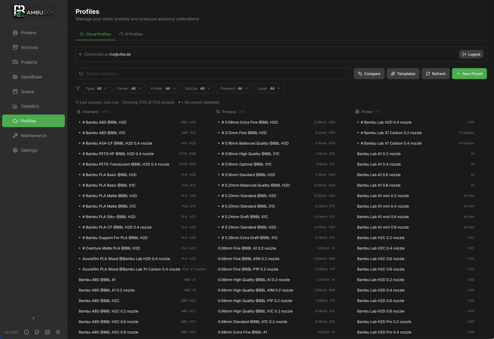
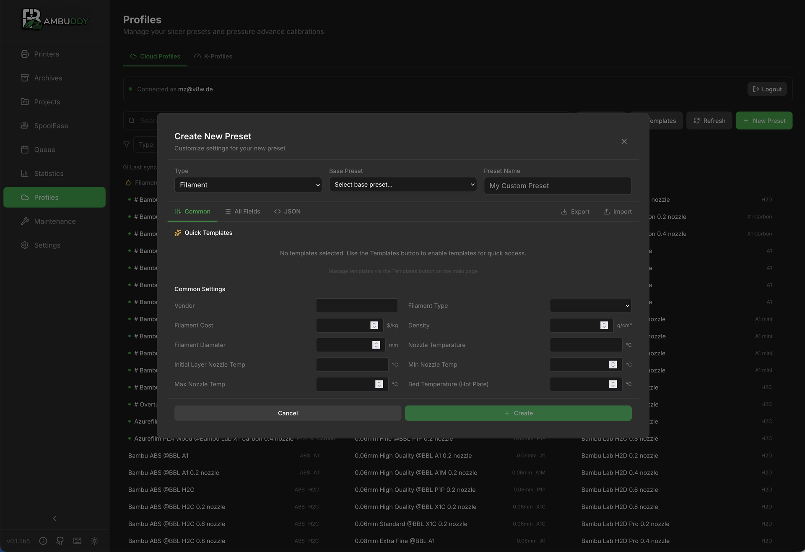

# Cloud Profiles

Manage and compare your Bambu Cloud slicer presets directly from Bambuddy.

{ .screenshot }

---

## :material-cloud: Overview

Bambu Cloud Profiles lets you:

- **View** your cloud slicer presets
- **Compare** template differences
- **Manage** visibility and organization
- **Track** preset versions

---

## :material-key: Authentication

### Connecting to Bambu Cloud

1. Go to **Cloud Profiles** page
2. Click **Connect to Bambu Cloud**
3. Enter your Bambu Cloud credentials
4. Click **Authenticate**

!!! note "Credentials Storage"
    Credentials are stored locally and only used to access your presets.

### Connection Status

| Status | Description |
|:------:|-------------|
| :material-check-circle:{ style="color: #4caf50" } Connected | Authenticated and synced |
| :material-close-circle:{ style="color: #f44336" } Disconnected | Not authenticated |
| :material-sync: Syncing | Fetching latest presets |

---

## :material-view-list: Viewing Profiles

### Profile Types

| Type | Description |
|------|-------------|
| **Filament** | Material settings |
| **Process** | Print settings |
| **Printer** | Machine settings |

### Profile Information

Each profile displays:

- Name
- Type (filament/process/printer)
- Modified date
- Visibility status
- Sync status

---

## :material-compare: Comparing Profiles

Compare profiles to understand differences:

### Comparing Templates

1. Select a profile
2. Click **Compare with Template**
3. View differences highlighted

{ .screenshot }

### Diff View

| Color | Meaning |
|:-----:|---------|
| :material-square:{ style="color: #4caf50" } Green | Added/New value |
| :material-square:{ style="color: #f44336" } Red | Removed/Old value |
| :material-square:{ style="color: #ff9800" } Orange | Changed value |

### What's Compared

- Temperature settings
- Speed settings
- Retraction settings
- Cooling settings
- Support settings
- And more...

---

## :material-eye: Visibility Control

### Template Visibility

Control which presets appear in Bambu Studio:

| Status | In Bambu Studio |
|:------:|-----------------|
| :material-eye: Visible | Shows in preset list |
| :material-eye-off: Hidden | Hidden from list |

### Changing Visibility

1. Find the profile
2. Click the visibility toggle
3. Changes sync to cloud

!!! tip "Declutter"
    Hide presets you don't use to keep Bambu Studio organized.

---

## :material-sync: Syncing

### Manual Sync

Click **Sync** to fetch latest presets from cloud.

### What Syncs

- Profile names and settings
- Visibility status
- Modified timestamps

### Sync Direction

Currently **read-only** from Bambu Cloud:

- :material-check: View presets
- :material-check: Compare with templates
- :material-close: Edit preset values (use Bambu Studio)

---

## :material-filter: Filtering Profiles

### Filter Options

| Filter | Description |
|--------|-------------|
| **Type** | Filament, Process, Printer |
| **Visibility** | Visible, Hidden, All |
| **Search** | Text search in names |

### Sorting

Sort profiles by:

- Name (A-Z, Z-A)
- Modified date
- Type

---

## :material-content-copy: Using Profiles

### In Bambu Studio

1. Open Bambu Studio
2. Sign in to Bambu Cloud
3. Access synced profiles
4. Apply to prints

### From Bambuddy

View profiles but don't edit:

- Reference settings
- Compare versions
- Track what you have

---

## :material-history: Version Tracking

### Modified Dates

Each profile shows when it was last modified:

- Helps track changes
- Identify recent updates

### Template Comparison

Compare your profile to the original template:

- See what you've customized
- Identify drift from defaults
- Reset to template if needed

---

## :material-help-circle: Troubleshooting

### Authentication Failed

1. Verify credentials are correct
2. Check internet connection
3. Ensure Bambu Cloud is accessible
4. Try logging out and back in

### Profiles Not Showing

1. Click **Sync** to refresh
2. Check filters aren't hiding profiles
3. Verify cloud account has profiles
4. Check connection status

### Sync Issues

1. Check network connectivity
2. Try manual sync
3. Re-authenticate if needed
4. Check Bambu Cloud status

### Verification Failed
Occasionally it can occur, that Bambu Accounts that have TOTP enabled, experience problems signing in to Cloud Profiles.
A workaround for this is to temporarily disable 2FA via TOTP
1. In the [Profile Settings](https://bambulab.com/de-de/u/profile-setting) disable 2FA-TOTP
2. Log-In to Cloud Profiles in Bambuddy and wait for the Authentication Mail
3. After successful login, turn on 2FA via TOTP in the profile settings again

---

## :material-lightbulb: Tips

!!! tip "Regular Sync"
    Sync after making changes in Bambu Studio to keep Bambuddy current.

!!! tip "Compare Before Printing"
    Compare profiles to understand differences before choosing one.

!!! tip "Organize with Visibility"
    Hide unused presets to keep your active presets easy to find.

!!! tip "Document Changes"
    When you modify a profile significantly, note what you changed.
