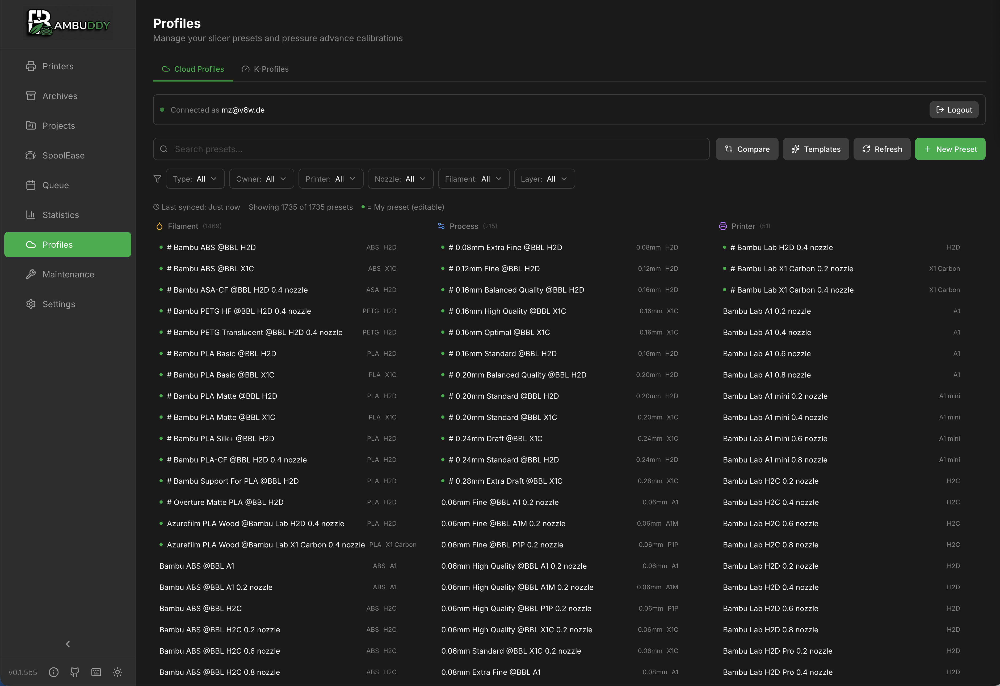
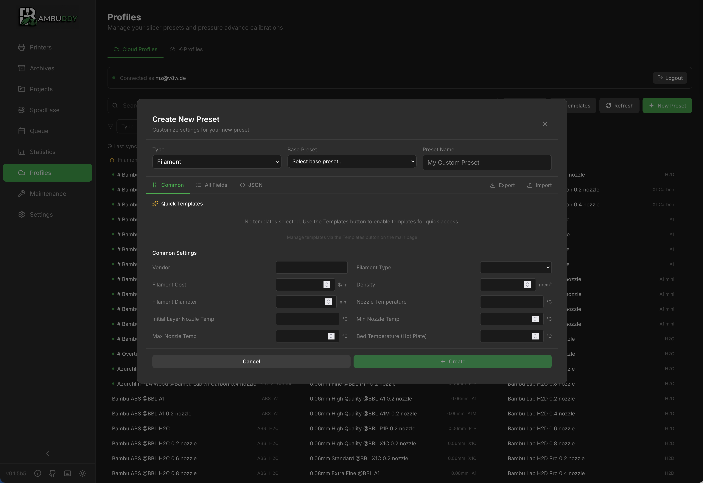

# Cloud Profiles

Manage and compare your Bambu Cloud slicer presets directly from Bambuddy.

{ .screenshot }

---

## :material-cloud: Overview

Bambu Cloud Profiles lets you:

- **View** your cloud slicer presets
- **Compare** template differences
- **Manage** visibility and organization
- **Track** preset versions

---

## :material-key: Authentication

### Connecting to Bambu Cloud

1. Go to **Cloud Profiles** page
2. Click **Connect to Bambu Cloud**
3. Enter your Bambu Cloud credentials
4. Click **Login**
5. Complete 2FA verification (see below)

!!! info "Multi-User Instances"
    When [authentication](authentication.md) is enabled, each user has their own independent Bambu Cloud login. Your cloud credentials are stored on your user account — logging in or out does not affect other users. The `cloud:auth` permission is required to use Cloud Profiles.

!!! tip "Headless / API access"
    Want to read your cloud presets and filament catalogue from a script or
    CI pipeline? Create an API key with **Allow cloud access** enabled — see
    [API Keys → Cloud Access Scope](api-keys.md#cloud-access-scope). The key
    will read on its owner's behalf using your stored Bambu Cloud login;
    no second sign-in needed.

### Two-Factor Authentication (2FA)

Bambuddy supports both types of Bambu Cloud 2FA:

| Method | Description |
|--------|-------------|
| **Email Verification** | A 6-digit code is sent to your email |
| **TOTP (Authenticator App)** | Use your authenticator app (Google Authenticator, Authy, etc.) |

The login flow automatically detects which method your account uses:

- **Email**: You'll see "Verification code sent to your email"
- **TOTP**: You'll see "Enter code from your authenticator app"

!!! tip "TOTP Recommended"
    If you have an authenticator app set up on your Bambu account, the login will be faster since you don't need to wait for an email.

### Access Token Login

If email/password login doesn't work for you, you can log in using a Bambu Cloud access token instead:

1. Click **Use access token instead** on the login page
2. Pick your **Region** (Global or China) — must match where you registered your Bambu account
3. Obtain your access token using one of the methods below
4. Paste it into Bambuddy and click **Set Token**

!!! note "China-region accounts must use token login"
    Bambu Lab China accounts (`bambulab.cn`) are tied to phone numbers, not email addresses. The email / password flow in Bambuddy's login form is unusable for these accounts — token login is the only path. Select **Region: China** before pasting the token so Bambuddy validates it against `api.bambulab.cn` instead of the global endpoint.

#### How to Obtain an Access Token

The access token is **not** available in the Bambu Studio UI and Bambu Lab no longer exposes it on their profile page either. The two reliable methods today:

##### Method 1: MakerWorld cookie (works for both regions)

The same `token` cookie MakerWorld stores in your browser session is the Cloud Access Token. Easiest path:

1. Open [MakerWorld](https://makerworld.com/en) (global) or [MakerWorld 中国](https://makerworld.com.cn/zh) (China) in your browser and log in.
2. Press `F12` to open Developer Tools.
3. Go to **Application** (Chrome / Edge) or **Storage** (Firefox) → **Cookies** → the MakerWorld domain.
4. Select the row whose name is `token`.
5. Copy the **Cookie Value** from the panel at the bottom.
6. Paste it into Bambuddy's Access Token field (with the matching **Region** selected) and click **Set Token**.

!!! warning "Treat the token like a password"
    It grants access to your Bambu Cloud account, including print history and MakerWorld actions. Don't paste it into GitHub issues, screenshots, or chat threads. Bambuddy stores it locally on your server only.

##### Method 2: Python script (Global region only)

Use a library like [`bambu-lab-cloud-api`](https://pypi.org/project/bambu-lab-cloud-api/) to handle the login flow — it sends your credentials, prompts for the email verification code, and returns the token. Targets the global `api.bambulab.com` endpoint only; doesn't work for China-region accounts because those don't accept email login.

!!! info "Token details"
    - The token is typically valid for **3 months**, then needs re-issuing the same way.
    - Scripts often save it to a local file (e.g., `~/.bambu_token`) for reuse.
    - This is the **Cloud Access Token** (for the cloud API / MQTT) — do not confuse it with the **Printer Access Code** (found on the printer screen under Network settings; used for local LAN connections only).

!!! tip "When to use token login"
    - You're on a China-region account (required — see note above).
    - Email / 2FA login fails on the global region.
    - Your account uses a third-party SSO provider that Bambuddy can't authenticate against directly.

!!! note "Credentials Storage"
    Credentials are stored locally and only used to access your presets.

### Connection Status

| Status | Description |
|:------:|-------------|
| :material-check-circle:{ style="color: #4caf50" } Connected | Authenticated and synced |
| :material-close-circle:{ style="color: #f44336" } Disconnected | Not authenticated |
| :material-sync: Syncing | Fetching latest presets |

---

## :material-view-list: Viewing Profiles

### Profile Types

| Type | Description |
|------|-------------|
| **Filament** | Material settings |
| **Process** | Print settings |
| **Printer** | Machine settings |

### Profile Information

Each profile displays:

- Name
- Type (filament/process/printer)
- Modified date
- Visibility status
- Sync status

---

## :material-compare: Comparing Profiles

Compare profiles to understand differences:

### Comparing Templates

1. Select a profile
2. Click **Compare with Template**
3. View differences highlighted

{ .screenshot }

### Diff View

| Color | Meaning |
|:-----:|---------|
| :material-square:{ style="color: #4caf50" } Green | Added/New value |
| :material-square:{ style="color: #f44336" } Red | Removed/Old value |
| :material-square:{ style="color: #ff9800" } Orange | Changed value |

### What's Compared

- Temperature settings
- Speed settings
- Retraction settings
- Cooling settings
- Support settings
- And more...

---

## :material-eye: Visibility Control

### Template Visibility

Control which presets appear in Bambu Studio:

| Status | In Bambu Studio |
|:------:|-----------------|
| :material-eye: Visible | Shows in preset list |
| :material-eye-off: Hidden | Hidden from list |

### Changing Visibility

1. Find the profile
2. Click the visibility toggle
3. Changes sync to cloud

!!! tip "Declutter"
    Hide presets you don't use to keep Bambu Studio organized.

---

## :material-sync: Syncing

### Manual Sync

Click **Sync** to fetch latest presets from cloud.

### What Syncs

- Profile names and settings
- Visibility status
- Modified timestamps

### Sync Direction

Currently **read-only** from Bambu Cloud:

- :material-check: View presets
- :material-check: Compare with templates
- :material-close: Edit preset values (use Bambu Studio)

---

## :material-filter: Filtering Profiles

### Filter Options

| Filter | Description |
|--------|-------------|
| **Type** | Filament, Process, Printer |
| **Visibility** | Visible, Hidden, All |
| **Search** | Text search in names |

### Sorting

Sort profiles by:

- Name (A-Z, Z-A)
- Modified date
- Type

---

## :material-content-copy: Using Profiles

### In Bambu Studio

1. Open Bambu Studio
2. Sign in to Bambu Cloud
3. Access synced profiles
4. Apply to prints

### From Bambuddy

View profiles but don't edit:

- Reference settings
- Compare versions
- Track what you have

---

## :material-history: Version Tracking

### Modified Dates

Each profile shows when it was last modified:

- Helps track changes
- Identify recent updates

### Template Comparison

Compare your profile to the original template:

- See what you've customized
- Identify drift from defaults
- Reset to template if needed

---

## :material-help-circle: Troubleshooting

### Authentication Failed

1. Verify credentials are correct
2. Check internet connection
3. Ensure Bambu Cloud is accessible
4. Try logging out and back in
5. For TOTP: Ensure your device time is synchronized (TOTP codes are time-based)
6. If all else fails, try the **access token** method instead (see [Access Token Login](#access-token-login))

### TOTP Code Not Working

1. Check your device time is accurate (enable automatic time sync)
2. Make sure you're using the correct account in your authenticator app
3. Try waiting for a new code (codes expire every 30 seconds)
4. If persistent, try disabling and re-enabling TOTP on your Bambu account

### Profiles Not Showing

1. Click **Sync** to refresh
2. Check filters aren't hiding profiles
3. Verify cloud account has profiles
4. Check connection status

### Sync Issues

1. Check network connectivity
2. Try manual sync
3. Re-authenticate if needed
4. Check Bambu Cloud status

---

## :material-lightbulb: Tips

!!! tip "Regular Sync"
    Sync after making changes in Bambu Studio to keep Bambuddy current.

!!! tip "Compare Before Printing"
    Compare profiles to understand differences before choosing one.

!!! tip "Organize with Visibility"
    Hide unused presets to keep your active presets easy to find.

!!! tip "Document Changes"
    When you modify a profile significantly, note what you changed.
