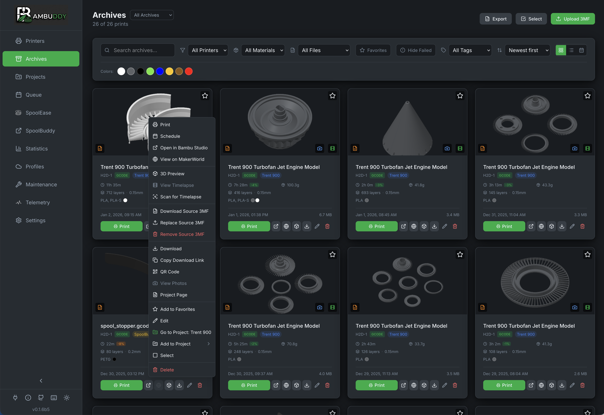
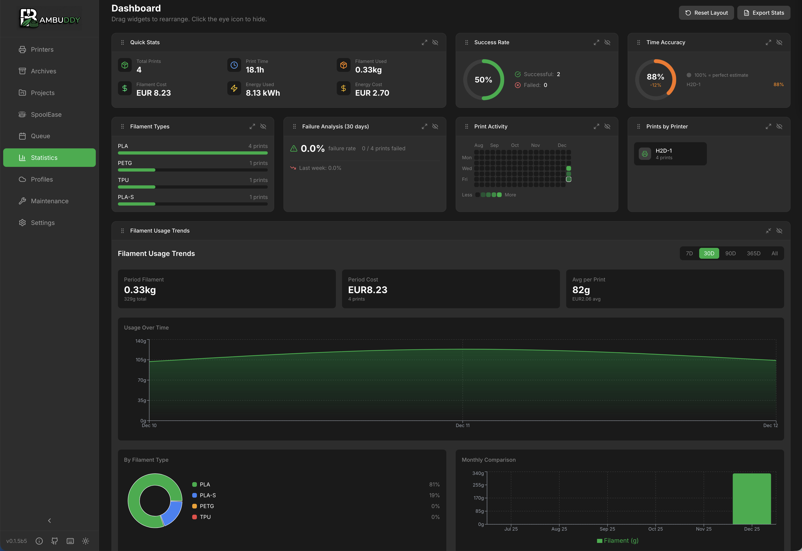
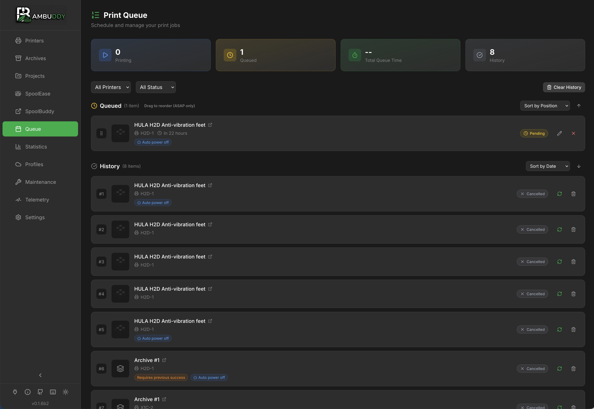

# Features

Bambuddy is packed with features to help you manage your 3D printing workflow. Explore them all below.

---

## :material-printer-3d: Printers & Monitoring

### [:material-monitor-dashboard: Real-time Monitoring](monitoring.md)
Live printer status, temperatures, print progress, and HMS error tracking via WebSocket.

### [:material-camera: Camera Streaming](camera.md)
MJPEG live video streaming and snapshots from your printer's built-in camera.

### [:material-water-percent: AMS & Humidity](ams.md)
Monitor AMS slot status, humidity levels, and temperature with historical charts.

### [:material-tune-vertical: Printer Control](printer-control.md)
Chamber temperature, light control, speed profiles, fan settings, and AI detection modules.

{ .screenshot }

---

## :material-archive: Print Archive

### [:material-archive-outline: Print Archiving](archiving.md)
Automatic 3MF archiving with metadata extraction, 3D preview, and duplicate detection.

### [:material-magnify: Full-Text Search](search.md)
Fast FTS5 search across print names, filenames, tags, notes, designer, and filament.

### [:material-folder-multiple: Projects](projects.md)
Group related prints into projects with progress tracking and color-coded badges.

### [:material-compare: Archive Comparison](comparison.md)
Compare 2-5 archives side-by-side with highlighted setting differences.

{ .screenshot }

---

## :material-chart-line: Analytics

### [:material-view-dashboard: Statistics Dashboard](statistics.md)
Customizable drag-and-drop widgets for success rates, filament usage, costs, and more.

### [:material-alert-circle: Failure Analysis](failure-analysis.md)
Correlate failures with conditions to identify patterns and improve reliability.

### [:material-lightning-bolt: Energy Tracking](energy.md)
Track power consumption per print or cumulative, with cost calculations.

### [:material-file-export: Export](export.md)
Export archives and statistics to CSV or Excel with filter support.

{ .screenshot }

---

## :material-robot: Automation

### [:material-printer-3d-nozzle: Print Queue](print-queue.md)
Queue prints with drag-and-drop ordering, scheduled start times, and automation.

### [:material-power-plug: Smart Plugs](smart-plugs.md)
Tasmota integration for auto power-on before print and power-off after cooldown.

### [:material-printer-3d: Virtual Printer](virtual-printer.md)
Emulate a Bambu printer on your network to send prints directly from your slicer.

### [:material-bell-ring: Notifications](notifications.md)
Multi-provider alerts via WhatsApp, Telegram, Discord, Email, and more.

{ .screenshot }

---

## :material-puzzle: Integrations

### [:material-spool: Spoolman](spoolman.md)
Sync filament inventory with Spoolman for complete spool tracking.

### [:material-cloud: Cloud Profiles](cloud-profiles.md)
Manage Bambu Cloud slicer presets and compare template differences.

### [:material-speedometer: K-Profiles](k-profiles.md)
Pressure advance settings management for optimal print quality.

### [:material-key: API Keys & Webhooks](api-keys.md)
REST API with granular permissions for external integrations.

### [:material-link: External Links](external-links.md)
Add custom sidebar links to external tools and resources.

---

## :material-wrench: Maintenance

### [:material-tools: Maintenance Tracker](maintenance.md)
Schedule and track maintenance tasks with interval reminders.

### [:material-folder: File Manager](file-manager.md)
Browse and manage files on your printer's internal storage.

### [:material-backup-restore: Backup & Restore](backup.md)
Database backup with selective restore options.

### [:material-information: System Info](system-info.md)
View database statistics, system resources, and telemetry settings.

---

## :material-lightbulb: Pro Tips

!!! tip "Keyboard Shortcuts"
    Press ++question++ anywhere to see available keyboard shortcuts. Navigate between pages with number keys ++1++ through ++5++.

!!! tip "Context Menus"
    Right-click (or long press on mobile) on cards for quick actions like re-print, compare, or delete.

!!! tip "Customizable Themes"
    Bambuddy offers extensive theme customization with separate settings for dark and light modes:

    - **Style**: Classic (clean shadows), Glow (accent-colored glow), Vibrant (dramatic shadows)
    - **Background**: Neutral, Warm, Cool + dark-only options (OLED, Slate, Forest)
    - **Accent Colors**: Green, Teal, Blue, Orange, Purple, Red

    Mix and match any combination in Settings → Appearance.
