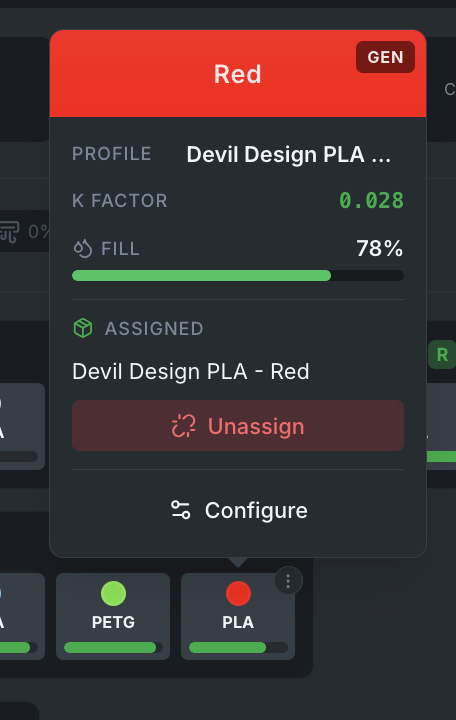

# Spool Inventory

Bambuddy includes a built-in spool inventory system to track your filament collection, assign spools to AMS slots, and automatically monitor filament consumption.

---

## :material-view-list: Inventory Overview

The Spool Inventory page shows all your spools in a searchable, filterable table with summary statistics.

{ .screenshot }

### Summary Cards

| Card | Description |
|------|-------------|
| **Total Inventory** | Total filament weight across all spools |
| **Total Consumed** | Total filament used since tracking started |
| **By Material** | Breakdown by filament type (PLA, PETG, etc.) |
| **In Printer** | Number of spools currently loaded in AMS slots |
| **Low Stock** | Spools with less than 20% remaining |

### Filtering & Search

- **Status tabs**: Active, Archived, All
- **Quick filters**: Used, New
- **Dropdowns**: Filter by Material, Brand
- **Search**: Find spools by name, brand, material, or color
- **View modes**: Table or Cards

---

## :material-plus-circle: Adding Spools

Click **+ Add Spool** to create a new inventory entry.

{ .screenshot }

### Filament Info Tab

| Field | Description |
|-------|-------------|
| **Slicer Preset** | Search and select from your Bambu Studio cloud presets |
| **Material** | PLA, PETG, ABS, ASA, TPU, etc. |
| **Brand** | Filament manufacturer |
| **Subtype** | Basic, Matte, Silk, HF, Metal, etc. |
| **Label Weight** | Net weight as printed on the spool (default: 1000g) |
| **Color** | Visual color picker with recent colors, brand palettes, and hex input |

### Additional Section

| Field | Description |
|-------|-------------|
| **Empty Spool Weight** | Select from the spool catalog or enter manually (for accurate remaining calculations) |
| **Remaining Weight** | Current filament remaining — shows `label_weight - weight_used` with a reference maximum |
| **Note** | Free-text notes about the spool |

### PA Profile Tab

{ .screenshot }

Link pressure advance (K-factor) calibration profiles to the spool:

- **Auto-select** matches profiles by brand, material, and subtype
- Shows matches grouped by printer and nozzle (left/right for dual-nozzle)
- K-factor values displayed for quick reference

---

## :material-link-variant: AMS Slot Assignment

Assign inventory spools to AMS slots to track which filament is loaded where.

### Assigning a Spool

1. Hover over a non-Bambu-Lab AMS slot on the printer card
2. Click **Assign Spool** in the hover card

{ .screenshot }

3. Select a spool from the filtered list
4. Click **Assign Spool** to confirm

The assign modal automatically:

- **Filters out Bambu Lab spools** — these are tracked via RFID and managed by the AMS
- **Filters out already-assigned spools** — each spool can only be in one slot at a time
- Shows only manually added (non-BL) spools

### Unassigning a Spool

1. Hover over an assigned AMS slot
2. Click **Unassign** in the hover card

{ .screenshot }

### Bambu Lab Spools

Slots containing Bambu Lab spools (identified by RFID) do not show assign/unassign buttons. These spools are managed automatically by the AMS.

!!! info "Auto-Unlink"
    When a Bambu Lab spool is inserted into a slot that has a manual spool assignment, the assignment is automatically removed.

!!! info "Stable Assignments on Startup"
    Spool assignments are preserved across Bambuddy restarts. If the same spool is still in the slot (verified by RFID identifiers), the assignment is kept without sending any commands to the printer.

---

## :material-scale-balance: Usage Tracking

Bambuddy tracks filament consumption automatically using 3MF slicer data as the primary source for all spools.

### 3MF Slicer Estimates (Primary)

For all spools — both Bambu Lab (RFID) and third-party — Bambuddy uses the per-filament `used_g` data from the archived 3MF file:

- Extracts per-filament usage from the slicer's slice_info
- Maps 3MF filament slots to physical AMS trays using the printer's actual tray state (not just the slicer slot number)
- For **queue prints**: uses the stored AMS mapping for exact slot-to-tray resolution
- For **single-filament prints**: uses the printer's active tray for reliable tracking
- For **completed** prints: uses the full slicer estimate
- For **failed/aborted** prints: uses per-layer G-code data for accurate partial tracking, with linear progress scaling as fallback

### AMS Remain% Delta (Fallback)

When 3MF data is unavailable (e.g., G-code-only prints without an archived 3MF file), Bambuddy falls back to AMS remain% tracking:

- Captures remain% at print start and end to compute consumption deltas
- Only used for trays not already tracked via 3MF

!!! tip "Accuracy"
    3MF estimates come from the slicer and are very accurate for completed prints. For partial prints, per-layer G-code analysis provides precise filament consumption up to the exact layer where the print stopped. If layer data is unavailable, a linear estimate (total × progress%) is used as a final fallback.

### Usage History

Each consumption event is recorded with:

- Spool ID and printer
- Print name
- Weight consumed (grams)
- Percentage consumed
- Print status (completed / failed / aborted)

---

## :material-cog: Settings

Configure the inventory system in **Settings > Filament**.

{ .screenshot }

### Filament Tracking

Choose between:

- **Built-in Inventory** — Use Bambuddy's spool management
- **Spoolman** — Use external Spoolman integration

### Spool Catalog

Pre-defined empty spool weights for quick selection when adding spools. Common entries include manufacturer-specific spool weights.

### Color Catalog

Pre-defined color palettes from filament brands. Used in the color picker when adding or editing spools.

---

## :material-lightbulb: Tips

!!! tip "Weigh Your Spools"
    For the most accurate remaining weight, weigh the full spool on a kitchen scale and subtract the empty spool weight. Enter this as the remaining weight when adding a new spool.

!!! tip "Low Stock Alerts"
    Keep an eye on the "Low Stock" summary card. Spools below 20% remaining are flagged so you can reorder before running out.

!!! tip "PA Profiles"
    Link K-factor profiles to your spools so the correct pressure advance settings are always associated with each filament.
