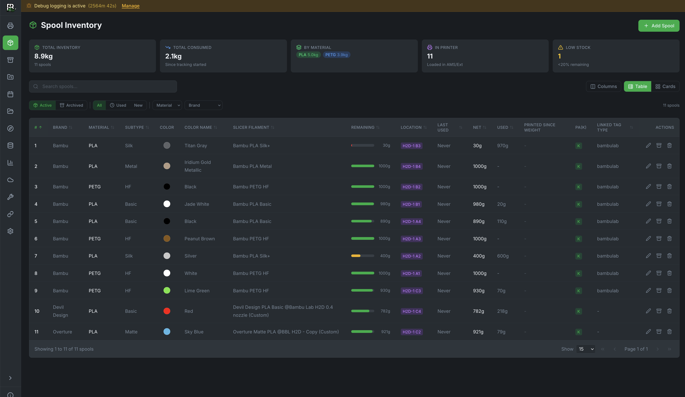
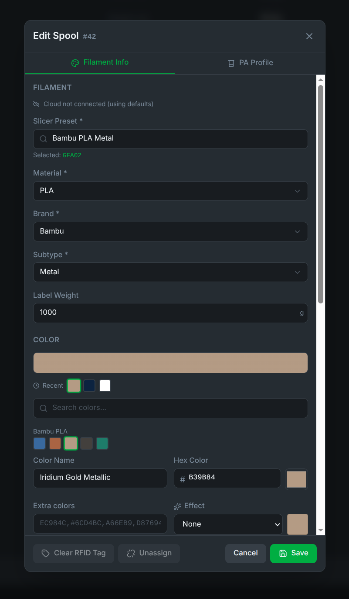
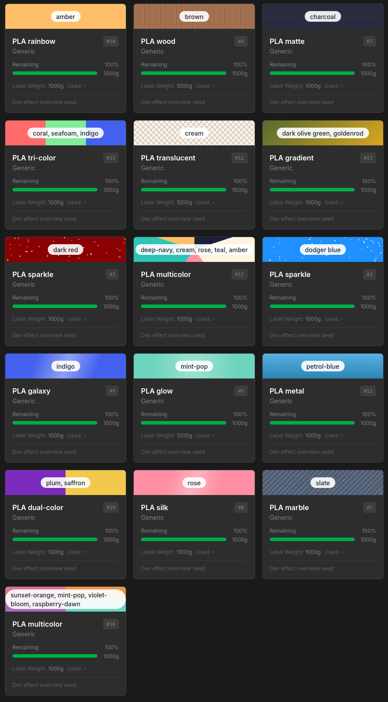
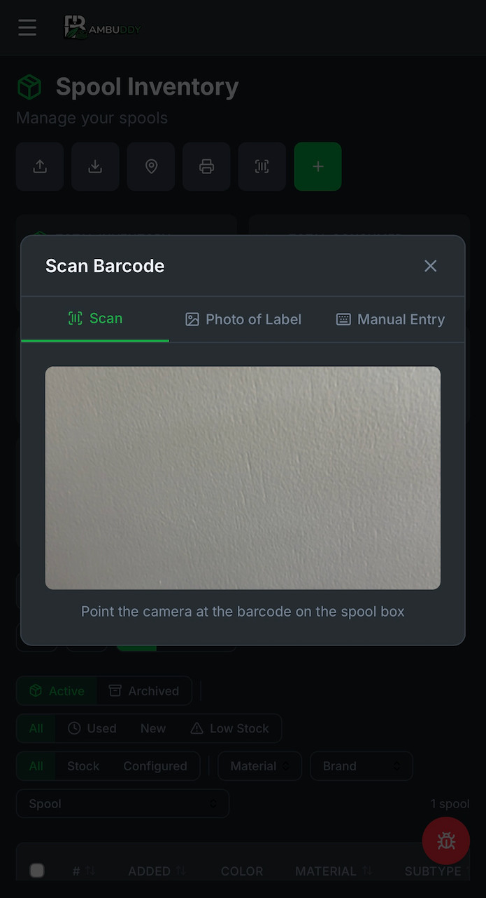
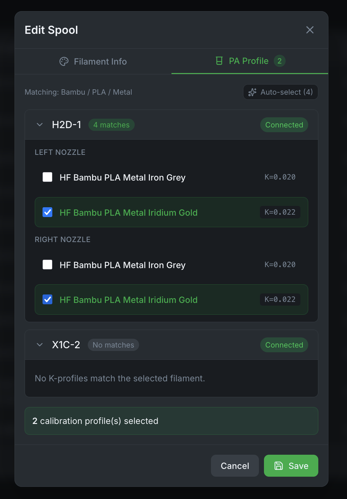
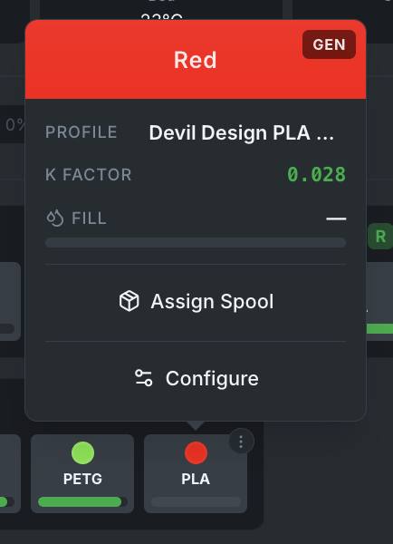
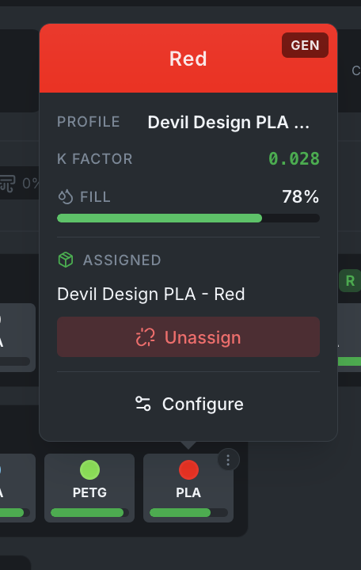
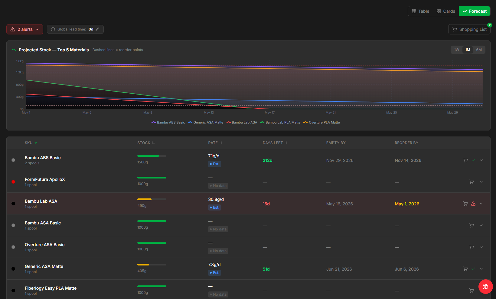
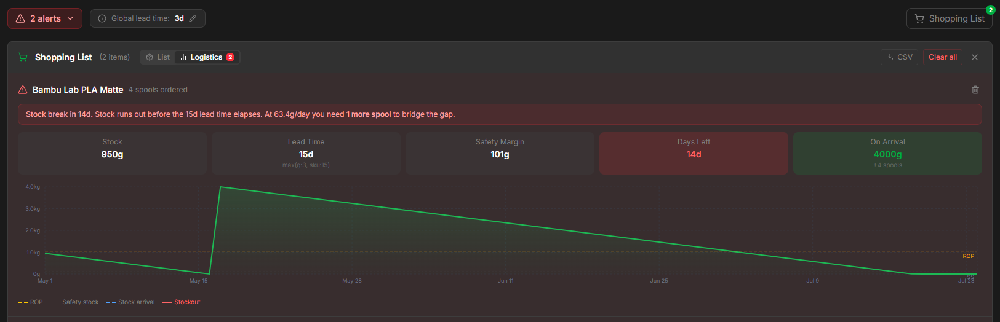
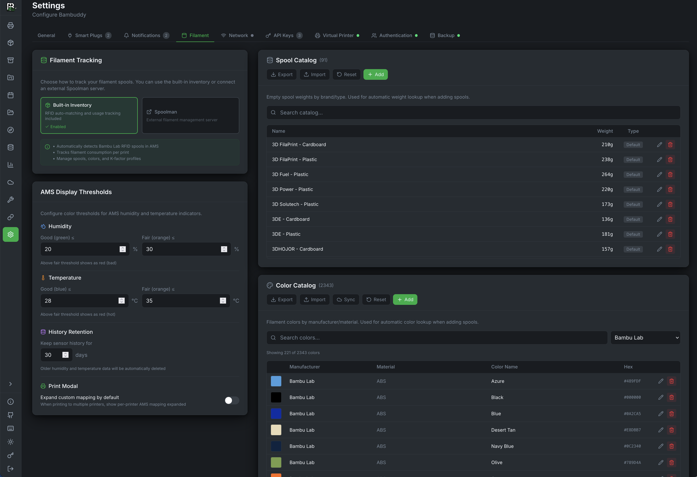

# Spool Inventory

Bambuddy includes a built-in spool inventory system to track your filament collection, assign spools to AMS slots, and automatically monitor filament consumption.

---

## :material-view-list: Inventory Overview

The Spool Inventory page shows all your spools in a searchable, filterable table with summary statistics.

{ .screenshot }

### Summary Cards

| Card | Description |
|------|-------------|
| **Total Inventory** | Total filament weight across all spools |
| **Total Consumed** | Total filament used since tracking started |
| **By Material** | Breakdown by filament type (PLA, PETG, etc.) |
| **In Printer** | Number of spools currently loaded in AMS slots |
| **Low Stock** | Spools with less than 20% remaining |

### Filtering & Search

- **Status tabs**: Active, Archived, All
- **Quick filters**: Used, New
- **Stock filter**: All, Stock (no slicer profile), Configured (has slicer profile)
- **Dropdowns**: Filter by Material, Brand, Category, Spool Name, **Storage Location**
    - The **Storage Location** chip lists every entry in your [storage locations catalog](storage-locations.md) (e.g. *Shelf A*, *4l drybox*), plus **No location set** for unassigned spools. The chip stays hidden until at least one spool has a storage location. Manage the catalog from **Inventory → Locations** — see [Storage Locations](storage-locations.md).
- **Search**: Find spools by name, brand, material, or color
- **View modes**: Table or Cards
- **Group similar**: Toggle to visually collapse identical unused/unassigned spools into a single expandable row or card with a count badge (e.g., "5 identical spools"). Spools are grouped by material, subtype, brand, color, and label weight. Used or AMS-assigned spools always appear individually. Group state persists across sessions.

---

## :material-plus-circle: Adding Spools

Click **+ Add Spool** to create a new inventory entry.

You can also **copy** an existing spool. Copying opens the Add Spool form with the existing spool data pre-filled, so you only need to change what is different.

When editing an existing spool, the modal header shows the spool's numeric ID (e.g. **Edit Spool #42**) so you can confirm which record you are modifying.

{ .screenshot }

### Filament Info Tab

| Field | Description |
|-------|-------------|
| **Slicer Preset** | Search and select a filament profile (see [Where Presets Come From](#where-presets-come-from) below) |
| **Material** | PLA, PETG, ABS, ASA, TPU, etc. (see [Custom Materials](#custom-materials) below) |
| **Brand** | Filament manufacturer |
| **Subtype** | Basic, Matte, Silk, HF, Metal, etc. |
| **Label Weight** | Net weight as printed on the spool (default: 1000g) |
| **Quantity** | Number of identical spools to create (1–100, default: 1) |
| **Color** | Visual color picker with recent colors, brand palettes, and hex input |
| **Extra colours** | Optional. Comma-separated list of 2 to 8 hex stops (e.g. `EC984C,#6CD4BC,A66EB9,D87694`). Leave blank for a solid colour. Without set *Effect* they will be rendered as gradient, or as colour wheel pie when **Subtype = Multicolor** is set |
| **Effect** | Optional. Visual rendering hint, see below.  |

#### Effects
Effects can be use to give a visual hint on the filaments look, covering: 

 - surface effects (*Sparkle*, *Wood*, *Marble*, *Glow*, *Matte*), 
 - sheen variants (*Silk*, *Galaxy*, *Rainbow*, *Metal*, *Translucent*)
 - structural variants (*Gradient*, *Dual Color*, *Tri Color*, *Multicolor*). 
    
They are rendered on top of the colour swatch, using the information from **Extra Colours** — effects do **not** change the slicer profile or anything the printer sees. 

Colour lists for multi-color filaments can easily be gathered from a site like 3dfilamentprofiles.com and pasted into the **Extra Colours** field.

{ .screenshot }

### Quick Add (Stock Spools)

Toggle **Quick Add (Stock)** at the top of the spool form to switch to a simplified mode. This hides the slicer preset and the PA Profile tab — only **Material** (required), **Brand**, **Subtype** (both optional), **Label Weight**, **Quantity**, and **Color** are shown.

Use Quick Add when you want to inventory filament without picking a specific slicer profile. These are called "stock" spools — they track weight and usage like any other spool, but they aren't linked to a printer filament profile. You can always edit a stock spool later to assign a slicer preset, at which point it becomes a "configured" spool.

!!! tip "Bulk Buying"
    Set the **Quantity** field to create multiple identical spools at once — for example, if you bought a 5-pack of PLA. All spools are created in a single operation with the same material, color, weight, and other settings. The quantity field is only available in Quick Add mode.

!!! tip "Group Similar Spools"
    After adding multiple identical spools, use the **Group** toggle in the inventory toolbar to collapse them into a single row with a count badge. This keeps your inventory clean when you have many spools of the same filament. Click a group to expand and see individual spools.

!!! tip "Multi-colour gradients and transparency"
    Multi-colour spools (gradient, dual-colour, tri-colour, multicolour) and translucent filaments now render correctly in the inventory. **Paste a hex list** like `EC984C,#6CD4BC,A66EB9,D87694` into the **Extra colours** field — that's the same format 3dfilamentprofiles.com puts on its filament details pages, so you can copy and paste directly. The swatch becomes a gradient strip; setting the spool's **Subtype** to *Multicolor* makes it render as a colour wheel pie instead. Transparency in the base colour (alpha < FF) shows through a checkerboard pattern beneath the colour layer, so partially translucent spools actually look translucent on the inventory page. Pick an **Effect** (*Sparkle*, *Wood*, *Marble*, *Glow*, *Matte*) for an overlay that mimics how the spool looks in real life. None of these affect the slicer profile or anything the printer sees — they're purely a visual hint to help you tell spools apart at a glance. The same fields exist on entries in **Settings → Color Catalog**, so a multi-colour combo can be saved once and reused across spools.

### Where Presets Come From

The **Slicer Preset** dropdown merges filament profiles from three sources, checked in order:

| Source | Badge | Description |
|--------|-------|-------------|
| **Bambu Cloud** | — | Your personal cloud presets synced from BambuStudio. Includes both Bambu's official presets and any custom presets you've created (e.g., "# Overture Matte PLA @BBL P1S"). Requires [Cloud Profiles](cloud-profiles.md) login. |
| **Local Profiles** | `Local` (green) | OrcaSlicer presets you've imported via [Local Profiles](local-profiles.md). Useful if you don't use Bambu Cloud. |
| **Built-in Fallback** | `Built-in` (amber) | A static table of ~150 Bambu Lab filament IDs (PLA Basic, PETG HF, ABS, etc.). Always available, no login needed. |

Presets from all three sources are merged and deduplicated. If cloud login fails, local + built-in presets still appear — the preset list is never empty.

!!! tip "Selecting a preset auto-fills the Material, Brand, and Subtype fields from the preset name, saving you from filling them manually."

!!! info "Inventory vs AMS Slot Configuration"
    The spool inventory is for tracking **your filament collection** — every spool you own, regardless of whether it's loaded in a printer. You can inventory a spool of PETG sitting on a shelf even if no printer is currently using it.

    **AMS Slot Configuration** (see [below](#ams-slot-assignment)) is a separate action: it tells the printer what filament profile to use for a specific slot. The two features work together but serve different purposes.

### Custom Materials

The material dropdown includes common types: PLA, PETG, ABS, TPU, ASA, PC, PA, PVA, HIPS, PA-CF, PETG-CF, and PLA-CF.

**If your material isn't listed** (e.g., PCTG, PHA, PP, PVDF), simply type it into the Material field. A "Use custom material" option will appear at the bottom of the dropdown — click it to use your custom material type.

Custom materials work just like built-in ones for inventory tracking, usage history, and filtering.

!!! example "Example: Adding 3D-Fuel PCTG Pro"
    1. Click **+ Add Spool**
    2. In **Slicer Preset**, search for your closest PETG preset (PCTG is a PETG variant). If you have a custom OrcaSlicer profile for PCTG, import it via [Local Profiles](local-profiles.md) first and it will appear here.
    3. In **Material**, type `PCTG` and click "Use custom material: PCTG"
    4. In **Brand**, type `3D-Fuel`
    5. In **Subtype**, type `Pro`
    6. Set the color, label weight, and save

### Scan to Add (Barcode & Label Scanning)

Click **Scan Barcode** next to **+ Add Spool** (or the same button in the empty-inventory state) to add a spool by scanning the retail barcode on the box, or by photographing the spool's label, instead of filling in the form by hand.

{ .screenshot }

The scanner opens with up to three tabs:

| Tab | How it works |
|-----|--------------|
| **Scan** | Live camera view — point it at the UPC/EAN barcode printed on the spool's box. Requires a secure browser context (`https://` or `localhost`); if your Bambuddy instance is reached over plain `http://<lan-ip>`, most browsers won't grant camera access at all, so this tab is hidden automatically. |
| **Photo of Label** | Take or choose a photo of the spool's label. This uses the phone's native photo picker rather than a live camera feed, so it works even when the **Scan** tab is unavailable (e.g. plain HTTP). The photo is read on-device — text is extracted locally in the browser and only the recognized text (never the image itself) is sent to Bambuddy. |
| **Manual Entry** | Type the barcode digits directly. Always available, regardless of camera or connection type. |

#### Where the match comes from

However a barcode is captured (scan, photo, or manual entry), Bambuddy resolves it in this order:

1. **Your own inventory** — if you've scanned this exact barcode before (on any spool, including archived ones), the previous spool's material, brand, subtype, color, and weight are reused instantly. No network call is made.
2. **Open Filament Database** — a community-maintained database of retail filament barcodes ([openfilamentdatabase.org](https://openfilamentdatabase.org)). Bambuddy queries it only when your own inventory has no match, and only if the [lookup setting](#scan-to-add-barcode-lookup) is enabled.
3. **SpoolmanDB-Community** — a much broader community filament catalog (430+ brands) with a smaller but growing set of barcodes attached to specific colors. Checked only when the Open Filament Database has no match, under the same [lookup setting](#scan-to-add-barcode-lookup).
4. **No match** — if none of the above recognizes the barcode, the Add Spool form still opens with the scanned code carried into its **Barcode** field (see [Additional Section](#additional-section)), so you haven't lost the scan — just fill in the rest of the details yourself.

For the **Photo of Label** path specifically, if no barcode is found in the photo, Bambuddy still tries to guess the material, brand, subtype, color, and weight directly from the label text (brand names, "PLA+", color words, "1KG", printing-temperature ranges, and so on) — useful for handmade or region-specific labels that don't carry a barcode at all.

A toast tells you which of these applies ("Matched from your inventory", "Matched from the Open Filament Database", "Matched from SpoolmanDB-Community", or "No match found") so you know how much to trust the prefilled fields before saving.

#### After a match

Whichever path resolves the barcode, Bambuddy opens the same **Add Spool** form used for [Quick Add](#quick-add-stock-spools) — prefilled with whatever was found, with **Material** as the only required field. The scanned code itself is also visible and editable in the form's **Barcode** field (see [Additional Section](#additional-section)) so you can double-check or correct it before saving. Review and adjust anything before saving, exactly as with a manually-entered spool. Once saved, the barcode is stored on the new spool, so the very next scan of the same product resolves instantly from step 1 above.

!!! tip "Building your own barcode library"
    The more spools you scan, the less Bambuddy needs to rely on the community databases — every scan of a barcode not already recognized from your own inventory, once saved, becomes a permanent match for next time. This is especially useful for house brands or region-specific filament that neither community database covers. You can also type a barcode into the **Barcode** field on an existing spool to pre-teach a mapping without scanning it first.

!!! tip "Show the Barcode column"
    The scanned/entered barcode is also available as a sortable column in the Inventory table — hidden by default, enable it via column settings if you want it visible at a glance.

### Additional Section

| Field | Description |
|-------|-------------|
| **Empty Spool Weight** | Select from the spool catalog or enter manually (for accurate remaining calculations) |
| **Remaining Weight** | Current filament remaining — shows `label_weight - weight_used` with a reference maximum |
| **Cost per kg** | Used for archive cost roll-ups in Statistics. |
| **Category** | Free-text label like *Production*, *Prototype*, or *Client A*. Used purely for organisation — appears as an inventory filter chip and as a way to group spools that share a different low-stock threshold. The form autocompletes from categories already in use across your other spools so casing stays consistent. Optional. |
| **Low-stock threshold (this spool)** | Per-spool override of the global low-stock percentage. Leave blank to use whatever's set in the inventory's stat-card threshold control (default 20 %). Useful for marking *production* spools to alert earlier (e.g. 50 %) while letting *prototype* spools stay quiet until much later. The override applies to both the stat-card "Low Stock" count and the "Low Stock" filter. |
| **Storage Location** | Physical shelf, drawer, or drybox from your [locations catalog](storage-locations.md). Pick an existing entry from the dropdown or type a new name and click **Add**. |
| **Barcode** | The scanned UPC/EAN, auto-filled by [Scan to Add](#scan-to-add-barcode-label-scanning) — or type one in yourself to pre-teach the native lookup before you ever scan it. Optional; not carried over when you **Copy** a spool, since a copy is a new, unscanned physical item. |
| **Note** | Free-text notes about the spool |

### PA Profile Tab

{ .screenshot }

Link pressure advance (K-factor) calibration profiles to the spool:

- **Auto-select** matches profiles by brand, material, and subtype
- Shows matches grouped by printer and nozzle (left/right for dual-nozzle)
- K-factor values displayed for quick reference

---

## :material-link-variant: AMS Slot Assignment

Assign inventory spools to AMS slots to track which filament is loaded where.

### Assigning a Spool

1. Hover over any AMS slot on the printer card (empty or configured, non-Bambu-Lab)
2. Click **Assign Spool** in the hover card

{ .screenshot }

3. Select a spool from the filtered list
4. Click **Assign Spool** to confirm

The assign modal automatically:

- **Filters out Bambu Lab spools** — these are tracked via RFID and managed by the AMS
- **Filters out already-assigned spools** — each spool can only be in one slot at a time
- Shows only manually added (non-BL) spools

### Bulk actions

When you need to act on more than one spool at a time, tick the checkbox at the left of each row in the Inventory table. As soon as one row is selected, a sticky toolbar appears above the list with these actions:

| Action | What it does |
|--------|--------------|
| **Edit** | Opens a bulk-edit modal — apply the same value to one or more fields across every selected spool. |
| **Print labels** | Opens the existing label picker with the selected spools pre-checked. |
| **Reset usage** | Zero the "Total Consumed" counter on all selected spools without touching remaining weight. |
| **Archive** / **Restore** | Soft-archive (or restore from Archived view) all selected spools in one click. |
| **Delete** | Permanently delete the selected spools (confirmation required). |
| **Clear selection** | Drop the selection without acting on it. |

Selection clears automatically when you change tabs, filters, or search — the count on the toolbar always matches what you're looking at.

The bulk-edit modal uses a three-state design per field: by default fields are **left unchanged**, and you opt-in per field by ticking its checkbox before entering a value. Only fields you tick are sent to the backend, so unrelated fields on the selected spools are not touched. Editable fields: material, sub-type, brand, color name + colour, storage location, slicer filament name + ID, cost / kg, note, label weight, core weight, category, low-stock threshold %.

!!! note "Clearing fields is per-spool only"
    The bulk-edit modal lets you SET non-empty values. It deliberately does not offer a "clear this field" option — emptying ten notes by mistake should not be a single click. Use the per-spool editor when you need to blank a field.

!!! info "K-profiles stay per-spool"
    Pressure-advance (K-profile) calibrations are tied to a specific printer + extruder + nozzle, so the bulk-edit modal does not include them. Edit K-profiles per spool from the inventory row's edit dialog.

The bulk-edit modal uses the same dropdowns the per-spool editor shows for material, sub-type, brand, category, slicer preset name, slicer filament, and storage location. Slicer presets pull from Bambu Cloud (when signed in), Orca Cloud, local presets, and the built-in filament list — so picking a preset here behaves identically to picking it on the per-spool form.

### What the toast tells you

After a bulk action, the toast at the bottom of the screen reflects the actual outcome:

- **Green "N spools …"** — every selected spool succeeded.
- **Yellow "N updated, M failed"** — partial success. The toolbar still closes and the selection clears, but the message tells you exactly how many rows the backend rejected. Inspect the listed rows in the inventory to confirm what was changed.
- **Red "All N … failed — selection kept so you can retry"** — every row failed. The selection and the modal stay open so you can fix the cause (e.g. Spoolman is unreachable, a coworker deleted the rows in another tab) and click Apply again.

The same three-outcome pattern applies to Edit, Delete, Archive, and Restore. Reset usage stays simple — it either zeros every selected spool's counter or surfaces a single error.

The bulk actions work identically in Built-in Inventory and Spoolman modes.

### Unassigning a Spool

1. Hover over an assigned AMS slot
2. Click **Unassign** in the hover card

The hover card shows the assigned spool's material, brand, color, and numeric ID so you can confirm the correct spool without opening the inventory page.

{ .screenshot }

### Bambu Lab Spools

Slots containing Bambu Lab spools (identified by RFID) do not show assign/unassign buttons. These spools are managed automatically by the AMS.

!!! info "Auto-Unlink"
    When a Bambu Lab spool is inserted into a slot that has a manual spool assignment, the assignment is automatically removed.

!!! info "Stable Assignments on Startup"
    Spool assignments are preserved across Bambuddy restarts. If the same spool is still in the slot (verified by RFID identifiers), the assignment is kept without sending any commands to the printer.

!!! info "Auto-tracking new Bambu spools"
    When a Bambu Lab spool is detected in the AMS and no inventory row already has its tray UUID, Bambuddy first looks for an existing **untagged** spool (matching material, color, and brand of "Bambu" / "Bambu Lab" / unspecified) and attaches the RFID to it — so a spool you logged ahead of time via Quick Add reuses your existing record (with your weight, notes, and cost data) rather than producing a duplicate. If no match is found, a new inventory row is created from the AMS data.

### Configure AMS Slot

AMS slot configuration tells the **printer** what filament profile to use for a specific slot. This is separate from inventory — it controls how the printer handles the filament during printing (temperature, flow rate, pressure advance, etc.).

1. Hover over an AMS slot on the printer card
2. Click the menu button (:material-dots-vertical:)
3. Select **Configure Slot**
4. Choose a filament preset
5. Optionally select a K profile and custom color
6. Click **Configure Slot** to apply

!!! info "When to Configure vs When to Assign"
    - **Assign Spool**: Links an inventory spool to a slot for tracking (weight, usage history, cost) **and automatically configures the slot** with the spool's filament profile, color, and K-profile. Works on both configured and empty slots.
    - **Configure Slot**: Manually sends a specific filament profile to the printer. Useful when you want to override the auto-configured settings or set up a slot without an inventory spool.

#### Where Configure Slot Presets Come From

The preset list in the Configure Slot modal comes from the same three sources as the spool form, but filtered by printer model:

| Source | Description |
|--------|-------------|
| **Bambu Cloud** | Cloud presets filtered by model suffix (e.g., `@BBL P1S`, `@BBL H2D`). Custom presets you created in BambuStudio appear here with a `Custom` badge. |
| **Local Profiles** | OrcaSlicer imports filtered by `compatible_printers`. |
| **Built-in Fallback** | Bambu Lab's filament catalog (~150 entries). Always available. |

Only presets compatible with the specific printer model are shown, reducing clutter and preventing mismatches.

!!! tip "User Presets"
    User presets that inherit from Bambu presets (e.g., "# Overture Matte PLA @BBL H2D") are fully supported. Bambuddy automatically derives the correct filament ID from the preset's base configuration.

---

## :material-scale-balance: Usage Tracking

Bambuddy tracks filament consumption automatically using 3MF slicer data as the primary source for all spools.

### 3MF Slicer Estimates (Primary)

For all spools — both Bambu Lab (RFID) and third-party — Bambuddy uses the per-filament `used_g` data from the archived 3MF file:

- Extracts per-filament usage from the slicer's slice_info
- Maps 3MF filament slots to physical AMS trays using the actual AMS mapping from the print command
- For **slicer-initiated prints** (BambuStudio, OrcaSlicer, Bambu Handy): captures the `ams_mapping` directly from the MQTT print command, ensuring the correct tray is tracked regardless of which application starts the print
- For **queue prints**: uses the stored AMS mapping for exact slot-to-tray resolution
- For **single-filament prints**: uses the printer's active tray for reliable tracking
- For **completed** prints: uses the full slicer estimate
- For **failed/aborted** prints: uses per-layer G-code data for accurate partial tracking, with linear progress scaling as fallback
- For **mid-print spool changes**: if a spool assignment is changed during a print, the live assignment is used for filament deduction (when the change timestamp is after print start); otherwise the snapshot from print start is preserved

### AMS Remain% Delta (Fallback)

When 3MF data is unavailable (e.g., G-code-only prints without an archived 3MF file), Bambuddy falls back to AMS remain% tracking:

- Captures remain% at print start and end to compute consumption deltas
- Only used for trays not already tracked via 3MF

!!! tip "Accuracy"
    3MF estimates come from the slicer and are very accurate for completed prints. For partial prints, per-layer G-code analysis provides precise filament consumption up to the exact layer where the print stopped. If layer data is unavailable, a linear estimate (total × progress%) is used as a final fallback.

### Usage History

Each consumption event is recorded with:

- Spool ID and printer
- Print name
- Weight consumed (grams)
- Percentage consumed
- Print status (completed / failed / aborted)
- Cost (calculated from spool cost/kg)

### Resetting Usage

Each spool's `weight_used` counter accumulates over the lifetime of the spool and feeds the **Total Consumed (Since tracking started)** summary card. Two affordances let you zero it out without touching anything else:

- **Per spool** — In the inventory table, an :material-eraser: eraser icon appears in the row's action column on active spools that have consumed grams. Clicking it opens a confirm dialog and resets that spool's `weight_used` to 0.
- **All spools at once** — On the **Total Consumed** summary card, an :material-eraser: eraser icon next to the label resets every active spool's counter in one go. The confirm dialog tells you how many spools will be affected.

Both actions leave the spool itself untouched: the label weight, remaining weight calculation, AMS lock flag (`weight_locked`), cost-per-kg, and storage location are not changed. Only the accumulated consumption counter goes back to 0. Future prints continue to increment normally — unlike manually editing the *Current Weight* field in the spool form, which auto-locks the spool and stops AMS auto-sync.

The bulk variant is the recommended way to clean-slate the **Total Consumed** stat (for example, after deleting all archives on a test instance) so subsequent prints track from zero. **Spoolman users get the same actions** — the request routes to Spoolman's PATCH `/spool/{id}` with `used_weight: 0` for each target instead of the built-in inventory table, but the UX is identical.

---

## :material-currency-usd: Cost Tracking

Track filament costs per spool and see cost breakdowns for every print.

### Setting Cost Per Kg

Each spool can have an individual **Cost per kg** value, set in the Additional section of the spool form. This value is used to calculate the cost of each print based on actual filament consumption.

### How Cost Calculation Works

When a print completes, Bambuddy calculates the cost for each spool used:

1. **Per-spool cost**: Uses the spool's `cost_per_kg` if set
2. **Default fallback**: Uses the global **Default Filament Cost** from Settings → Filament
3. **Formula**: `cost = (weight_used_grams / 1000) × cost_per_kg`

The calculated cost is stored in the usage history record and aggregated to the archive's total cost.

### Cost Display

- **Print modal**: Shows a real-time cost preview based on loaded filaments and their cost/kg values before starting a print
- **Archive cards**: Display the total filament cost for each print
- **Inventory table**: Includes a sortable "Cost/kg" column (hidden by default — enable via column settings)
- **Statistics**: Total cost across all prints is included in the stats summary

### Recalculating Costs

If you update spool prices or add cost data retroactively, use **Recalculate Costs** on the Archives page to update all archive costs based on current filament prices. This recalculates costs using:

1. Spool usage history records (by archive ID)
2. Legacy usage records (by print name, for older records)
3. Filament catalog prices (if no usage records exist)

### Default Filament Cost & Currency

Configure in **Settings → Filament**:

| Setting | Description |
|---------|-------------|
| **Default Filament Cost** | Fallback cost per kg when a spool doesn't have an individual cost set (default: 25.00) |
| **Currency** | Currency symbol used for cost display throughout the app (USD, EUR, GBP, MYR, and 23 more) |

!!! tip "Set Costs on Your Spools"
    For the most accurate cost tracking, set `cost_per_kg` on each spool when you add it to inventory. The default cost is a rough estimate — individual spool prices give you precise per-print cost data.

---

## :octicons-graph-16: Inventory Forecast

See inventory depletion rates based on material usage and handle stock logistics.

{ .screenshot }

### Forecasting

The Forecast view shows all Inventory spools. Identical spool types are grouped together. 

Each rown can be expanded to show additional settings, data, and actions.

| Setting | Description |
|---------|-------------|
| **Effective lead time** | The maximum between the SKU Lead Time and the Global Lead Time |
| **SKU Lead Time Override** | A user defined lead time in days |
| **Safety Margin** | A buffer added on top of the statistical safety stock |
| **Reorder Point** | The point (expressed in grams) when the stock item should be reordered |
| **Add to Shopping List** | The cart icon adds the spool to the Shopping Cart. Quantity can either be expressed as spools or as days of stock |

The user can set a **Global Lead Time** that will override all lower lead times (or lead times that are not set).

The interface will alert of any stock breakage forecasted. These can also be sent via the notification service by enabling them in **Settings → Notifications**.
To exclude spools from forecasting and alert logging, click the Snooze icon in item row.

!!! tip "Set Lead Time on Your Spools"
    For the most accurate tracking, set Lead Time on each spool group.

### Usage

Material usage is calculated based on how many data points are available: 

**History-based (needs ≥2 print events):**

```
interval_rate = grams_used_in_print / days_between_prints   (floor: 0.5 days)
recency_weight = exp(−ln(2)/30 × days_since_print)          (30-day half-life)
```

**Weighted mean across all intervals:**

```
daily_rate = Σ(interval_rate × recency_weight) / Σ(recency_weight)
std_dev    = sqrt( Σ(weight × (interval_rate − daily_rate)²) / Σ(weight) )
```

**Delta-based (only 1 event, or no history):**

```
daily_rate = total_grams_used / days_since_spool_was_added
```

### Shopping Cart

The shopping cart lists all user added spools that are set to be reordered.

In the **List** view the user can set a row item as Purchased. Once set as Purchased, the item can set as Received to be removed form the list. 

!!! tip "Add Purcahses To Stock"
    All items marked as Received will be automatically added to Inventory in the Stock category.

{ .screenshot }

In the **Logistics** view a graph shows predicted stock variations based on reorder quantity and data.


## :material-printer: Printable Labels

Bambuddy can generate PDF labels for any selection of spools. The label carries the colour swatch (with multi-colour gradient stripes for spools that have extra colours), brand, material, name, the spool ID, and a QR code that deep-links straight back to that spool's row in Bambuddy when scanned with a phone — useful for finding the right spool in storage.

### Two ways to start

- **Per-spool icon** — every spool card and table row has a small printer icon. Click it to print just that one spool's label.
- **Header bulk button** — *Print labels…* in the inventory page header opens the picker pre-selected with every spool currently visible (i.e. matching your filters). Refine the selection in the modal.

### The picker

The modal lists the spools you can choose from with checkboxes. From the top:

- **Search** — substring match across name, brand, and `#ID` (e.g. type `#42` to jump to spool 42).
- **Material chips** — narrow the visible list to a single material (PLA, PETG, …). Chips are derived from your library so you only see what you actually have.
- **Select all visible / Deselect visible / Clear all** — additive selection actions. *Select all visible* adds the currently filtered list to your selection without dropping anything you'd already picked outside the filter; *Clear all* wipes the entire selection. This means you can build a selection across filters: filter to PLA, click *Select all visible*, switch to PETG, click *Select all visible* again — both groups are now selected.
- **Live "X selected" count** in the modal title so you always know what you're about to print.

### Template sizes

Pick the template that matches your label stock or holder:

| Template | Size | Per page | Best for |
|---|---|---|---|
| **AMS holder** | 30 × 15 mm | 1 | The popular [Makerworld AMS Filament Label Holder](https://makerworld.com/en/models/752566) (model 752566). Compact identification at-a-glance. |
| **Box label** | 62 × 29 mm | 1 | Brother PT/QL or Dymo small labels. Carries name, brand, material, storage location, and a QR code. |
| **Avery L7160** | 38.1 × 63.5 mm | 21 | EU sheet stock — A4 paper, 21 labels per sheet (3 columns × 7 rows). |
| **Avery 5160** | 25.4 × 66.7 mm | 30 | US sheet stock — Letter paper, 30 labels per sheet (3 columns × 10 rows). |

Sizes are exact — the renderer measures in points, not pixels, so Avery layouts align to <0.1 mm and don't drift across the page.

### What's on each label

- **Colour swatch** — the spool's `rgba`. Spools with multi-colour stops (`extra_colors`) render as vertical stripes in the order you saved them.
- **Brand · material · subtype** — small text row.
- **Spool name** — bold; what you set in the spool form.
- **Storage location** — italic, only on the box-label and Avery templates (the AMS holder is too small).
- **Spool ID** — large bold `#N`, anchored at the bottom-left. This is the killer field for telling 8 spools of "PLA White" apart in your closet, especially partials.
- **QR code** — links to `/inventory?spool=<id>` so a phone scan jumps straight to the spool's row in Bambuddy. The AMS-holder template skips the QR (no room at 30 × 15 mm) — the spool ID and swatch are enough at AMS-bay distance.

!!! tip "Low-resolution / thermal label printers"
    The QR is tuned to stay scannable on cheap 203 dpi thermal printers, including on the small 40 × 30 mm box label where earlier builds rendered it too densely and the lines bled together. If you print to a **black-and-white** thermal printer, tick **Monochrome (black & white printer)** in the print dialog — it drops the colour swatch (which prints as a meaningless grey block) and gives that space to the text; the colour is still shown as the hex code line.

### What ends up in the QR

The QR encodes the URL Bambuddy can be reached at + `/inventory?spool=<id>`. By default this is the request's own scheme + host (`https://bambuddy.your-server.local/inventory?spool=42`) — if you set **Settings → External URL** to your public Bambuddy address, the QR uses that instead, so a phone outside your LAN can still resolve it.

### Print or save

The PDF opens in a new browser tab. From there you can either print directly to a label printer / sheet of blanks, or save the PDF and print later. Since rendering is server-side via [ReportLab](https://docs.reportlab.com/), the output is byte-identical across browsers — no "Chrome prints differently than Firefox" surprises.

### Limits

- Up to **500 spools per request**. Plenty for any realistic batch (a full Avery L7160 sheet is 21, a sheet of 5160 is 30; 500 covers ~24 sheets).
- The renderer truncates names with an ellipsis if a spool name is too long for the chosen template — for the AMS-holder size in particular, the *spool ID* is what matters; long names get truncated. If your spool name is consistently being truncated, consider a shorter `name` field on the spool itself.

---

## :material-file-delimited: CSV Import & Export

Add spools in bulk and get your inventory back out as a spreadsheet. Two buttons sit in the inventory page header — **Import CSV** and **Export CSV**. They operate on Bambuddy's own (local) inventory; in Spoolman mode the buttons are disabled with a tooltip pointing you at Spoolman's own built-in CSV import/export, since Spoolman owns the data store.

### Exporting

*Export CSV* downloads your current active inventory (archived spools are excluded) using the fixed column schema below. `rgba` is written without a leading `#`, and `remaining` is filled in for you, so the file is ready to read in a spreadsheet and re-imports cleanly — handy for backups and for migrating between Bambuddy instances.

### Importing

*Import CSV* is a two-step, preview-first flow — nothing is written until you confirm:

1. **Choose a file** (or drag it onto the drop zone). Bambuddy parses and validates it on the server and shows a **preview table**, one row per CSV line:
    - :material-check-circle:{ .green } **valid** — will be created on confirm.
    - :material-close-circle:{ .red } **error** — skipped, with the reason shown inline (e.g. `material is required`, `rgba must be 6- or 8-char hex`).
    - **skipped** — blank lines.
2. **Review**, then click **Import N valid rows**. Only the valid rows are created, in a single transaction. Invalid rows are never written — fix them in the CSV and re-upload.

A summary at the top shows the valid / error / skipped counts. The preview writes nothing to your inventory, so you can iterate on a messy file safely.

Two informational flags can appear on a valid row in the preview:

- :material-alert: A **different-material colour** — the colour was resolved from a Color Catalog entry of another material because no exact-material entry existed (see below).
- :material-content-copy: A **possible duplicate** — an active spool with the same `material` + `brand` + `color_name` already exists. This is a soft warning only; there's no de-duplication, so the row is still imported as a brand-new spool. It's there to catch an accidental double-click or re-upload of the same file.

### Colour resolution

You don't have to supply a hex value for every row. Bambuddy resolves the colour in this order:

1. If `rgba` is present in the CSV, it wins.
2. Otherwise, if `brand` + `color_name` match an entry in your [Color Catalog](#color-catalog) (case-insensitive), the hex, `extra_colors`, and `effect_type` are filled in automatically. Resolved rows are flagged with a :material-auto-fix: wand icon in the preview. A catalog entry that matches your row's `material` (or a generic entry with no material set) is used first; only if none exists does Bambuddy fall back to another material's variant of that colour, which the preview marks with the :material-alert: different-material flag.
3. Otherwise the colour is left blank.

### CSV schema

The header is fixed but **case- and space-tolerant** — `Color Name`, `color-name`, and `COLOR_NAME` all map to `color_name`. Only `material` is required; every other column is optional and may be left blank or omitted.

| Column | Required | Notes |
|---|---|---|
| `material` | ✅ | e.g. `PLA`, `PETG`, `ABS`. |
| `brand` | | e.g. `Polymaker`. Used with `color_name` for colour resolution. |
| `subtype` | | e.g. `Basic`, `Matte`, `Silk`. |
| `color_name` | | e.g. `Jade White`. |
| `rgba` | | `RRGGBB` or `RRGGBBAA` hex, with or without `#`. 6-char values get an opaque alpha. |
| `extra_colors` | | Comma-separated hex stops for multi-colour spools. |
| `effect_type` | | `sparkle`, `silk`, `gradient`, … (same set as the spool form). |
| `label_weight` | | Advertised net weight in grams. **Defaults to `1000` if left blank**, which affects the derived `remaining` — set it explicitly for 750 g (or other) spools. |
| `weight_used` | | Grams consumed. Round-trips on export/import. Must be between `0` and `label_weight`. |
| `remaining` | | **Export-only**, derived (`label_weight − weight_used`). Ignored on import. |
| `cost_per_kg` | | Cost per kilogram. |
| `nozzle_temp_min` / `nozzle_temp_max` | | Temperature overrides in °C. |
| `last_used` | | ISO-8601 timestamp of last use. |
| `note` | | Free-text note. |
| `storage_location` | | Where the spool is stored (e.g. `Shelf A`). Round-trips on export/import. |
| `category` | | User-defined category (e.g. `Production`, `Prototype`). Round-trips on export/import. |
| `low_stock_threshold_pct` | | Per-spool low-stock threshold, `1`–`99` (%). Blank falls back to the global setting. |
| `barcode` | | Scanned/entered UPC or EAN (see [Scan to Add](#scan-to-add-barcode-label-scanning)). Round-trips on export/import; canonicalized the same way on import as a manual edit (digits only, leading zeros stripped). Safe to omit entirely — older exports and hand-written CSVs without this column import cleanly with the barcode left unset. |

!!! note "`remaining` is display-only"
    Remaining weight is always derived from `label_weight − weight_used`, so it's exported for readability but ignored on import. `weight_used` is the single source of truth — set that to control how full a spool is.

!!! warning "Imported spools start their consumption history at the imported `weight_used`"
    The lifetime **Total Consumed (Since tracking started)** counter has its baseline set to `0` for an imported spool, so the imported `weight_used` is treated as already-consumed when the spool first appears. If you import partially-used spools, expect the **Total Consumed** card to jump by the sum of those `weight_used` values.

Validation mirrors the spool form exactly (the import reuses the same model), so anything the form would reject, the importer rejects too — with the offending row called out in the preview instead of failing the whole file.

!!! note "Known limitation — leading-quote-plus-formula notes"
    To stop spreadsheets from executing fields that begin with `=`, `+`, `-`, `@`, a tab, or a carriage return, export prefixes such cells with a single quote and import strips exactly that quote back off. As a side effect, a note you authored as literally `'=text` (a single quote *followed by* one of those characters) is read back on import as `=text`. This is an extremely rare edge case; if you rely on such values, set them after import.

---

## :material-cog: Settings

Configure the inventory system in **Settings > Filament**.

{ .screenshot }

### Filament Tracking

Choose between:

- **Built-in Inventory** — Use Bambuddy's spool management
- **Spoolman** — Use external Spoolman integration

#### Auto-add unknown RFID spools

When a spool with an RFID tag Bambuddy hasn't seen before is loaded into the AMS, Bambuddy's default behaviour is to create an inventory record automatically using the data the AMS reads from the tag (material, colour, brand). Turn this **off** if you prefer to pre-register new spools manually on delivery — the auto-matcher only links to a pre-existing record when material, sub-type, colour and brand match exactly, so partial matches would silently create duplicates.

With the toggle **off**, Bambuddy still detects the unknown spool — but instead of writing a new inventory row immediately, a confirmation modal pops up wherever you are in the app:

- Shows the printer name, AMS label (e.g. `AMS-B Slot 4`), the spool's material, and a colour swatch
- **Add to Inventory** creates the record and assigns it to the slot in one step
- **Cancel** dismisses the prompt for this insertion

The modal only re-appears if you physically remove the spool and re-insert it (or insert a different unknown spool). It does not nag you every few seconds.

The setting applies to both Built-in Inventory and Spoolman modes. Manual `Sync AMS` actions also honour it — slots that would have been auto-added are reported as skipped with the reason "Auto-add disabled; add to inventory manually".

!!! tip "When to turn it off"
    If your workflow is "weigh the empty spool, log it in Bambuddy with cost / notes / RFID tag, then load it", turning auto-add off keeps your pre-registered record intact instead of risking a duplicate row when the AMS reads the same tag.

#### Sync Weights from AMS

When using built-in inventory, a **Sync Weights from AMS** button appears below the mode selector. This force-syncs all inventory spool weights from the live AMS remain% sensor values of connected printers.

Use this to recover from corrupted weight data — for example, if a printer power-off event caused all spool fill levels to drop to zero. The sync overwrites the stored `weight_used` values with the current AMS readings. Printers must be online for the sync to work.

!!! warning "Low Resolution"
    AMS remain% is integer-precision (1% steps = ~10g for a 1kg spool). For precise tracking, rely on the automatic 3MF-based usage tracker during normal printing. Use AMS sync only as a recovery tool.

#### Scan-to-Add Barcode Lookup

Controls whether [Scan to Add](#scan-to-add-barcode-label-scanning) is allowed to query community filament databases — the **Open Filament Database** and **SpoolmanDB-Community** — over the internet when a scanned barcode isn't already in your own inventory.

- **On** (default) — unrecognized barcodes are looked up against the Open Filament Database first, then SpoolmanDB-Community.
- **Off** — Bambuddy only matches barcodes it has seen before on your own spools; an unrecognized barcode falls straight through to the empty/OCR-guessed form. Scanning, manual entry, and the label-photo OCR guesser all keep working either way — this toggle only affects the outbound calls to both external databases, for anyone who'd rather their self-hosted instance not phone out to a third party by default.

A **Refresh database now** button forces an immediate re-download of both the Open Filament Database and SpoolmanDB-Community, bypassing the normal 24-hour cache. Use it right after either community database publishes new entries if you don't want to wait for the automatic refresh.

### Spool Catalog

Pre-defined empty spool weights for quick selection when adding spools. Ships with 90+ entries covering common manufacturers.

| Button | Description |
|--------|-------------|
| **Export** | Download the catalog as a JSON file for backup or sharing |
| **Import** | Load a JSON file to add entries. Duplicates (same name) are skipped automatically |
| **Reset** | Restore the built-in default catalog (overwrites all entries) |
| **+ Add** | Manually add a new spool weight entry |

### Color Catalog

Pre-defined color palettes from filament brands. Ships with 600+ colors across 20 brands. Used in the color picker when adding, editing, or copying spools, **and as the single source of truth for resolving hex colors to human-readable names everywhere in the UI** — the Printer tab AMS popup, the inventory list, the print modal filament override cards, and auto-provisioned inventory entries all look up display names from this table. If a color name shows up wrong (e.g. "Scarlet Red" instead of "Cherry Pink"), edit the offending entry or use one of the **Sync** buttons to pull the canonical name from a community database.

| Button | Description |
|--------|-------------|
| **Export** | Download the entire catalog as a JSON file |
| **Import** | Load a JSON file to add colors. Duplicates (same manufacturer + color name + material) are skipped |
| **Sync** | Fetch new colors from [FilamentColors.xyz](https://filamentcolors.xyz/) — a community database of measured filament colors. Only adds new entries, never modifies existing ones |
| **Sync SpoolmanDB-Community** | Fetch new colors from [SpoolmanDB-Community](https://github.com/Icezaza2543/SpoolmanDB-Community), a community-maintained, much broader brand/material/color catalog (430+ brands). Same additive-only behavior as the FilamentColors.xyz sync — existing entries are never modified. One bounded download, so it finishes in one step rather than a progress stream |
| **Reset** | Restore the built-in default catalog (overwrites all entries) |
| **+ Add** | Manually add a new color entry with manufacturer, color name, hex code, and material |

!!! info "Display names come from this catalog"
    Bambuddy resolves every spool color name by looking up the hex in this catalog (Bambu Lab entries are preferred when the same hex is registered under multiple brands). There is no hardcoded `tray_id_name` → name mapping in the backend or frontend — adding a color here is the supported way to correct or extend display names. Restart-free: the frontend refetches the catalog on next page load.

#### Import File Format

Both catalogs accept a JSON array. Spool catalog entries:

```json
[
  { "name": "Brand - Spool Type", "weight": 210 }
]
```

Color catalog entries:

```json
[
  { "manufacturer": "eSUN", "color_name": "Silk Gold", "hex_color": "#C48E2F", "material": "PLA Silk" }
]
```

!!! tip "Community Sharing"
    Use **Export** to share your catalog with others, and **Import** to load shared catalogs. This is useful for adding colors from brands not yet in the default database.

---

## :material-frequently-asked-questions: FAQ

### Does Scan to Add need a camera, or work over plain HTTP?

The **Scan** (live camera) tab needs a secure browser context — `https://` or `localhost` — because browsers block camera access (`getUserMedia`) everywhere else. Most self-hosted Bambuddy instances are reached over plain `http://<lan-ip>`, so that tab is hidden automatically when it wouldn't work. On the handful of browsers that only discover this once you try, Bambuddy shows a plain "Camera not available — HTTPS (or localhost) is required" message instead of a raw browser error.

Either way, you're never stuck: **Photo of Label** uses the phone's native photo picker (not a live camera feed) and works over plain HTTP too, and **Manual Entry** always works regardless of connection type.

### Where does Scan to Add's data come from?

Four sources, checked in order: your own inventory (any spool you've scanned before), the community [Open Filament Database](https://openfilamentdatabase.org), [SpoolmanDB-Community](https://github.com/Icezaza2543/SpoolmanDB-Community) (both togglable together — see [Scan-to-Add Barcode Lookup](#scan-to-add-barcode-lookup) under Settings), and — for the Photo of Label tab specifically — a best-effort guess from the label text itself when no barcode is found. See [Scan to Add](#scan-to-add-barcode-label-scanning) above for the full breakdown.

### My material isn't in the dropdown (e.g., PCTG, PHA, PP)

Type the material name directly into the Material field. A green "Use custom material" option appears at the bottom of the dropdown. Custom materials work the same as built-in ones for all tracking features.

### Do I need to pick a filament profile for every spool?

No. Use **Quick Add (Stock)** mode to add spools with just a material type — no slicer preset, brand, or subtype required. Stock spools track weight, usage, and cost just like configured spools, but they aren't linked to a printer filament profile. You can filter stock spools on the inventory page, edit them later to assign a profile, or copy a similar spool and only adjust the fields that need to change.

In **full mode**, the Slicer Preset field is required. It links the spool to a filament profile ID that the printer understands. If you're just inventorying filament for tracking purposes, pick the closest available preset — for example, use a generic "PETG Basic" preset for a third-party PETG spool.

If you have custom slicer profiles (e.g., a PCTG profile in OrcaSlicer), import them via [Local Profiles](local-profiles.md) so they appear in the preset dropdown.

### I have different printers (P1S, H2D) and nozzles — do presets matter?

The spool inventory itself is **printer-agnostic**. You can add a spool once and assign it to any printer's AMS slot. Printer model filtering only applies when **configuring an AMS slot** (telling the printer which profile to use), not when adding spools to inventory.

When you configure an AMS slot, the preset list is automatically filtered by that printer's model — so you'll only see P1S-compatible presets when configuring a P1S slot, and H2D-compatible presets when configuring an H2D slot.

### Is inventory only for loaded filaments?

No. The inventory tracks **all your spools** — loaded and unloaded. You can add every spool you own to the inventory, even spools sitting on a shelf. The "In Printer" summary card shows how many are currently loaded in AMS slots, but unloaded spools are tracked just the same (weight remaining, usage history, cost, etc.).

### Where do the "Slicer Preset" profiles come from?

They come from three sources, checked in order:

1. **Your Bambu Cloud account** — if you've logged in via [Cloud Profiles](cloud-profiles.md), all your synced filament presets appear (including custom ones you've created in BambuStudio or OrcaSlicer and synced to cloud)
2. **Local OrcaSlicer imports** — if you've imported `.orca_filament`, `.bbscfg`, or `.bbsflmt` files via [Local Profiles](local-profiles.md)
3. **Built-in fallback table** — ~150 Bambu Lab filament IDs that are always available, no login needed

If you're not logged into Bambu Cloud, you'll still see local imports and the built-in table.

### What's the difference between "Assign Spool" and "Configure Slot"?

| Action | What it does | Affects printer? |
|--------|-------------|-----------------|
| **Assign Spool** | Links an inventory spool to an AMS slot for tracking (weight, usage, cost) and auto-configures the slot with the spool's filament profile, color, and K-profile | Yes |
| **Configure Slot** | Manually sends a specific filament profile to the printer (temperatures, flow, pressure advance) | Yes |

Assigning a spool is the simplest workflow — it handles both tracking and printer configuration in one step. Use "Configure Slot" when you want to manually override settings or set up a slot without an inventory spool.

---

## :material-lightbulb: Tips

!!! tip "Weigh Your Spools"
    For the most accurate remaining weight, weigh the full spool on a kitchen scale and subtract the empty spool weight. Enter this as the remaining weight when adding a new spool.

!!! tip "Low Stock Alerts"
    Keep an eye on the "Low Stock" summary card. Spools below 20% remaining are flagged so you can reorder before running out.

!!! tip "PA Profiles"
    Link K-factor profiles to your spools so the correct pressure advance settings are always associated with each filament.

!!! tip "Third-Party Filament Workflow"
    For non-Bambu filaments: **1)** Add the spool to inventory (pick the closest preset, type custom material/brand) → **2)** Load the spool in the AMS → **3)** Assign the spool to the slot on the printer card → **4)** Configure the slot with the correct filament profile. This gives you both accurate tracking and correct print settings.
