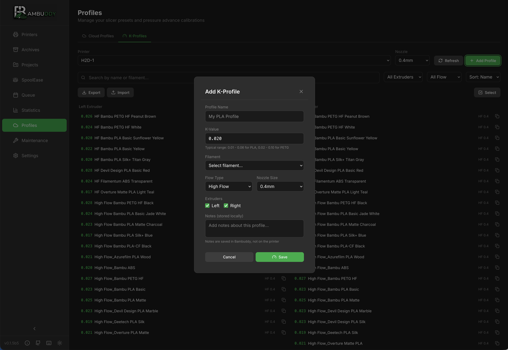

# K-Profiles

Manage pressure advance (K-factor) settings for optimal print quality across different filaments.

{ .screenshot }

---

## :material-speedometer: What is Pressure Advance?

Pressure advance (K-factor) compensates for filament compression in the extruder:

- **Too low**: Bulging corners, blobs at start
- **Too high**: Gaps at corners, weak lines
- **Just right**: Clean corners, consistent extrusion

Different filaments need different K values.

---

## :material-database: K-Profile Storage

Bambuddy stores K-profiles per:

- **Printer** - Each printer has its own values
- **Filament** - Different K per material
- **Nozzle** - Values vary by nozzle size

---

## :material-download: Retrieving K-Profiles

### From Printer

Pull current K-profiles from your printer:

1. Go to **K-Profiles** page
2. Select your printer
3. Click **Fetch from Printer**
4. K-values are downloaded

### What's Retrieved

| Data | Description |
|------|-------------|
| **Material** | Filament type |
| **K-factor** | Pressure advance value |
| **Nozzle** | Nozzle diameter |
| **Notes** | Any stored notes |

---

## :material-upload: Pushing K-Profiles

### To Printer

Send K-profiles to your printer:

1. Go to **K-Profiles** page
2. Select profiles to push
3. Click **Push to Printer**
4. Profiles are uploaded

!!! warning "Overwrites Existing"
    Pushing profiles overwrites the printer's current K values for that material.

---

## :material-pencil: Editing K-Profiles

### Modify Values

1. Click on a K-profile
2. Edit the K-factor value
3. Add optional notes
4. Click **Save**

### Value Guidelines

| Material | Typical K Range |
|----------|:--------------:|
| PLA | 0.02 - 0.06 |
| PETG | 0.06 - 0.12 |
| ABS/ASA | 0.04 - 0.08 |
| TPU | 0.20 - 0.50 |

!!! note "These are starting points"
    Actual values depend on your specific printer, filament brand, and nozzle.

---

## :material-plus-circle: Adding K-Profiles

### Manual Entry

1. Click **Add K-Profile**
2. Select material type
3. Enter K-factor value
4. Select nozzle size
5. Add notes if desired
6. Click **Save**

### From Calibration

After running calibration:

1. Note the optimal K value
2. Add or update the profile
3. Save for future use

---

## :material-ruler: Calibration

### Running K-Factor Calibration

Bambu Lab printers include built-in calibration:

1. Load the filament to calibrate
2. From printer or Bambu Studio, run flow calibration
3. Observe the test pattern
4. Note the optimal K value
5. Update the K-profile in Bambuddy

### Third-Party Methods

Alternative calibration methods:

- Marlin K-factor test patterns
- Pressure advance tower prints
- Corner flow tests

---

## :material-content-copy: Copying Profiles

### Between Printers

Copy K-profiles to another printer:

1. Select source profiles
2. Click **Copy to Printer**
3. Select destination printer
4. Profiles are copied

!!! tip "Fine-tune After Copy"
    Copied values may need adjustment for different hardware.

---

## :material-sync: Sync Status

### Profile States

| Status | Meaning |
|:------:|---------|
| :material-check-circle:{ style="color: #4caf50" } Synced | Matches printer |
| :material-sync-alert:{ style="color: #ff9800" } Modified | Local changes not pushed |
| :material-help-circle:{ style="color: #2196f3" } New | Not on printer yet |

### Keeping in Sync

- Fetch after printer changes
- Push after local edits
- Regular sync recommended

---

## :material-compare: Comparing Values

### View Differences

Compare K-values between:

- Different printers
- Bambuddy vs printer
- Different materials

{ .screenshot }

---

## :material-file-export: Backup

### Exporting K-Profiles

1. Go to **K-Profiles**
2. Click **Export**
3. Download JSON file

### Importing K-Profiles

1. Click **Import**
2. Select JSON file
3. Review and confirm

Useful for backup or transferring to new installations.

---

## :material-alert: Troubleshooting

### Fetch Failed

1. Verify printer connection
2. Check printer is not busy
3. Try again

### Push Failed

1. Check printer is idle
2. Verify connection status
3. Ensure no active prints

### Values Don't Apply

1. Verify profile was pushed
2. Check material matches slicer
3. Re-slice if needed

---

## :material-lightbulb: Tips

!!! tip "Calibrate Each Filament"
    Even same material from different brands may need different K values.

!!! tip "Note the Brand"
    Add brand/color to notes for easy identification.

!!! tip "Regular Updates"
    Recalibrate after nozzle changes or significant printer maintenance.

!!! tip "Start Conservative"
    When unsure, start with a lower K value and increase gradually.

!!! tip "Backup Before Changes"
    Export profiles before making major changes.
