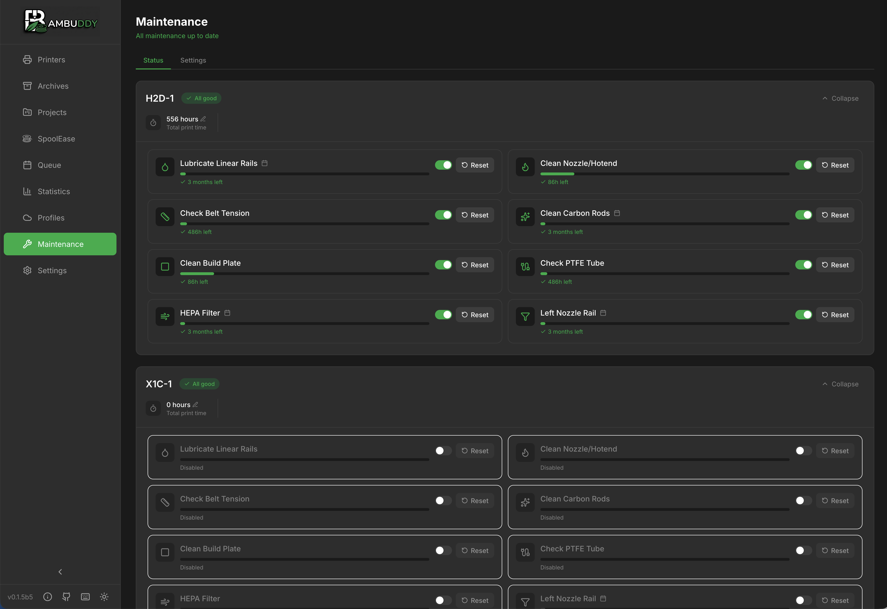
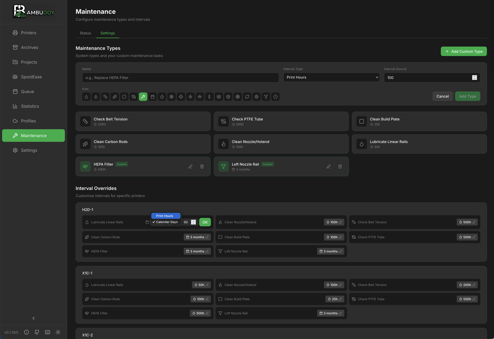

# Maintenance Tracker

Schedule and track maintenance tasks to keep your printers running reliably.

{ .screenshot }

---

## :material-tools: Overview

The maintenance tracker helps you:

- **Schedule** recurring maintenance tasks
- **Track** when maintenance was last performed
- **Get notified** when maintenance is due
- **Log** maintenance history

---

## :material-format-list-checks: Maintenance Types

### Default Types

Bambuddy includes common maintenance tasks:

| Type | Default Interval |
|------|-----------------|
| **Bed Cleaning** | Every 10 prints |
| **Lubrication** | Every 100 hours |
| **Belt Tension** | Every 200 hours |
| **Nozzle Check** | Every 50 prints |
| **HEPA Filter** | Every 500 hours |
| **Carbon Filter** | Every 500 hours |

### Custom Types

Create your own maintenance tasks:

1. Go to **Settings** > **Maintenance**
2. Click **Add Maintenance Type**
3. Enter name and description
4. Set default interval
5. Click **Save**

{ .screenshot }

---

## :material-calendar-clock: Interval Types

### Print Count

Schedule based on number of prints:

- Example: Clean bed every 10 prints
- Resets after maintenance is logged

### Print Hours

Schedule based on actual print time:

- Example: Lubricate every 100 hours
- Accumulated from print durations

### Calendar Days

Schedule based on calendar time:

- Example: Check belts every 30 days
- Counts calendar days regardless of usage

---

## :material-plus-circle: Setting Up Maintenance

### Per-Printer Configuration

Each printer has its own maintenance schedule:

1. Go to **Maintenance** page
2. Select your printer
3. Click **Configure**
4. Enable/disable maintenance types
5. Adjust intervals as needed
6. Click **Save**

### Interval Customization

Override default intervals per printer:

| Printer | Bed Cleaning |
|---------|:------------:|
| Workshop X1C | Every 10 prints |
| Office P1S | Every 5 prints |
| Garage A1 | Every 20 prints |

---

## :material-check-circle: Logging Maintenance

### Marking Complete

When you perform maintenance:

1. Go to **Maintenance** page
2. Find the due/overdue item
3. Click **Mark Complete**
4. Optionally add notes
5. Counter resets

### Logging Details

Add information to maintenance logs:

| Field | Description |
|-------|-------------|
| **Date** | When performed |
| **Notes** | What you did |
| **Parts** | Any parts replaced |

---

## :material-alert: Due Status

### Status Indicators

| Status | Meaning |
|:------:|---------|
| :material-check-circle:{ style="color: #4caf50" } OK | Not due yet |
| :material-alert:{ style="color: #ff9800" } Due Soon | Approaching due |
| :material-alert-circle:{ style="color: #f44336" } Overdue | Past due |

### Due Soon Threshold

Configure when "Due Soon" triggers:

- Default: 80% of interval
- Example: Bed cleaning every 10 prints → "Due Soon" at 8 prints

---

## :material-bell-ring: Notifications

Get notified when maintenance is due:

1. Go to **Settings** > **Notifications**
2. Enable **Maintenance Due** event
3. Configure your notification provider

### Notification Timing

- **Due Soon**: When threshold reached
- **Overdue**: When interval exceeded

[:material-arrow-right: Notification setup](notifications.md)

---

## :material-history: Maintenance History

View past maintenance for each printer:

### History Log

| Date | Type | Notes |
|------|------|-------|
| Dec 14 | Bed Cleaning | IPA wipe |
| Dec 10 | Lubrication | Rails and screws |
| Dec 1 | Nozzle Check | Replaced with 0.4mm |

### Exporting History

Export maintenance logs for records:

- CSV format
- Date range selection
- Per-printer or all printers

---

## :material-printer: Per-Printer View

### Dashboard

Each printer shows maintenance status:

```
Workshop X1C
─────────────────────────────
✅ Bed Cleaning      2 prints until due
⚠️ Lubrication       8 hours until due
❌ Belt Tension      OVERDUE
✅ Nozzle Check      45 prints until due
```

### Quick Actions

- **View Details**: See full maintenance info
- **Mark Complete**: Log completed maintenance
- **View History**: See past maintenance

---

## :material-lightbulb: Maintenance Tips

!!! tip "Bed Cleaning"
    Clean with IPA between prints for best adhesion. Deep clean with dish soap weekly.

!!! tip "Lubrication"
    Use appropriate grease for linear rails. Don't over-lubricate.

!!! tip "Belt Tension"
    Belts should be firm but not overly tight. Use the "guitar string" test.

!!! tip "Nozzle Inspection"
    Check for wear, especially with abrasive filaments. Replace when worn.

!!! tip "Filters"
    HEPA and carbon filters lose effectiveness over time. Replace as recommended.

!!! tip "Document Everything"
    Add notes when logging maintenance to build a history of what works.

---

## :material-cog: Best Practices

### Regular Schedule

- Check maintenance status weekly
- Don't skip overdue items
- Build maintenance into your routine

### Preventive vs Reactive

- Preventive: Follow intervals
- Reactive: Fix when broken
- **Preventive is better!**

### Track Everything

- Log all maintenance
- Note any issues found
- Track parts replaced
