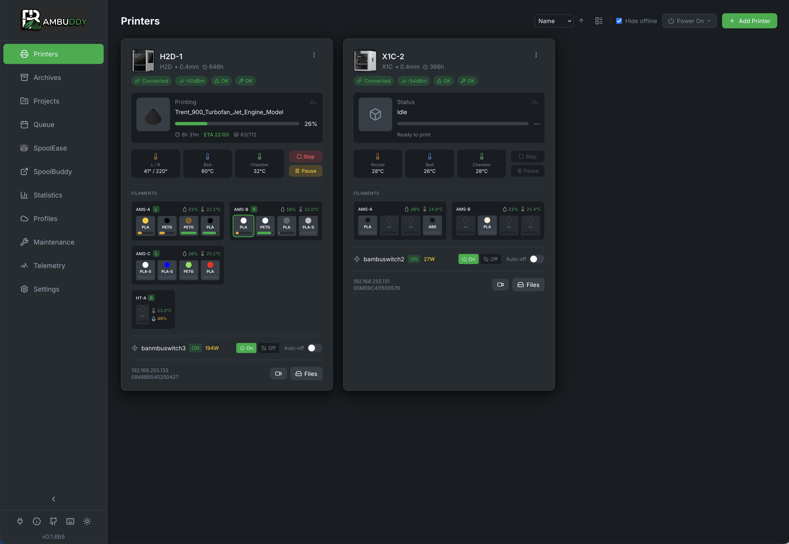
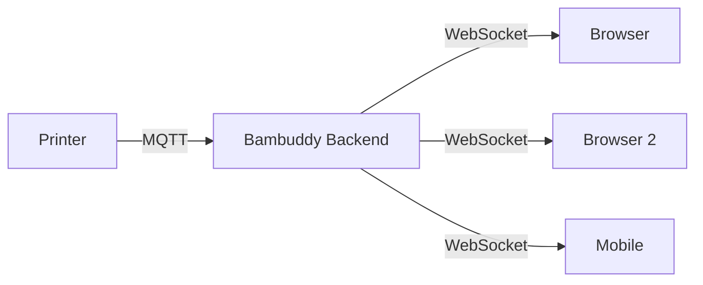

# Real-time Monitoring

Bambuddy provides live monitoring of all your connected Bambu Lab printers through WebSocket-based real-time updates.

{ .screenshot }

---

## :material-resize: Resizable Printer Cards

Adjust the size of printer cards to fit your screen and workflow:

### Card Sizes

| Size | Description |
|:----:|-------------|
| **S** (Small) | Compact view, more cards per row |
| **M** (Medium) | Default balanced view |
| **L** (Large) | More detail, fewer cards per row |
| **XL** (Extra Large) | Maximum detail, single column |

### Adjusting Size

1. Look for the **+** and **-** buttons in the Printers page toolbar
2. Click **+** to increase card size
3. Click **-** to decrease card size
4. Size preference is saved automatically

!!! tip "Print Farm View"
    Use Small size for monitoring many printers at once on a large screen.

---

## :material-monitor-dashboard: Printer Status

Each printer card displays real-time information:

### Connection Status

| Indicator | Status |
|:---------:|--------|
| :material-circle:{ style="color: #4caf50" } | Connected and communicating |
| :material-circle:{ style="color: #ff9800" } | Connecting or reconnecting |
| :material-circle:{ style="color: #f44336" } | Disconnected or error |

### Temperature Readouts

Live temperature readings update every few seconds:

| Sensor | Description |
|--------|-------------|
| :material-printer-3d-nozzle: **Nozzle** | Current hotend temperature |
| :material-radiator: **Bed** | Heated bed temperature |
| :material-home-thermometer: **Chamber** | Enclosure temperature (if available) |

### Fan Status

Real-time fan speed monitoring in the Controls section:

| Fan | Icon | Color | Description |
|-----|:----:|:-----:|-------------|
| :material-fan: **Part Cooling** | Fan | Cyan | Cools the printed layers |
| :material-weather-windy: **Auxiliary** | Wind | Blue | Controls airflow in chamber |
| :material-air-filter: **Chamber** | AirVent | Green | Exhausts hot air from enclosure |

Fan badges always display with dynamic coloring:

- **Active** (colored): Fan is running, shows current speed %
- **Inactive** (gray): Fan is off, shows 0%

Fan speeds update in real-time via WebSocket alongside temperatures.

### Print Progress

When a print is active, you'll see:

- **Progress bar** - Visual completion percentage
- **Current layer** - Layer X of Y
- **Time remaining** - Estimated time to completion
- **Filament used** - Grams consumed so far

---

## :material-alert-decagram: HMS Error Monitoring

The Health Management System (HMS) monitors printer health and displays issues in real-time.

### Status Indicator

The HMS indicator is always visible on printer cards:

| Status | Meaning | Action |
|:------:|---------|--------|
| :material-check-circle:{ style="color: #4caf50" } **OK** | No issues detected | None needed |
| :material-alert:{ style="color: #ff9800" } **Warning** | Minor issues or warnings | Check when convenient |
| :material-alert-circle:{ style="color: #ff5722" } **Error** | Serious errors | Address before next print |
| :material-close-circle:{ style="color: #f44336" } **Fatal** | Fatal errors | Immediate attention needed |

### Error Details

Click the HMS indicator to see:

- Error code and description
- Affected component
- Recommended action
- Link to Bambu Lab support article

!!! tip "HMS Notifications"
    Enable HMS error notifications to get alerted immediately when issues occur. See [Notifications](notifications.md).

---

## :material-access-point: WiFi Signal Strength

The printer card displays WiFi signal strength:

| Icon | Signal |
|:----:|--------|
| :material-wifi-strength-4: | Excellent |
| :material-wifi-strength-3: | Good |
| :material-wifi-strength-2: | Fair |
| :material-wifi-strength-1: | Weak |

Weak signal can cause connection drops and print monitoring issues.

---

## :material-timer-sand: Total Print Hours

Track cumulative print time for each printer:

- Displayed on the printer card
- Useful for maintenance scheduling
- Helps identify heavily-used machines

---

## :material-bug: MQTT Debug Logging

Built-in debugging tool for printer communication:

### Starting Debug Logging

1. Click the settings icon on a printer card
2. Click **Start MQTT Debug**
3. Messages are captured in real-time

### Viewing Messages

| Direction | Description |
|-----------|-------------|
| :material-arrow-down: **Incoming** | Messages from printer to Bambuddy |
| :material-arrow-up: **Outgoing** | Commands sent to printer |

Features:

- **JSON payloads** - Expandable for detailed inspection
- **Filter by type** - Focus on specific message types
- **Search** - Find specific content
- **Auto-refresh** - New messages appear automatically

### Use Cases

- Troubleshooting connection issues
- Understanding printer behavior
- Debugging automation problems
- Reporting issues to developers

---

## :material-web: WebSocket Architecture

Bambuddy uses WebSocket for real-time updates:

### How It Works

1. **Printer** sends status updates via MQTT over TLS
2. **Backend** processes and stores the data
3. **WebSocket** broadcasts updates to all connected clients
4. **Browser** updates the UI instantly

### Connection Features

| Feature | Description |
|---------|-------------|
| **Auto-reconnect** | Automatically reconnects on disconnect |
| **State sync** | Full state synchronized on reconnect |
| **Delta updates** | Only changed data is sent |
| **Multi-tab** | Multiple browser tabs supported |

### Performance

- **Latency**: < 1 second typical
- **Bandwidth**: Minimal (delta updates only)
- **Scalability**: Multiple clients supported

---

## :material-image-multiple: Printer Images

Customize your printer cards with images:

1. Click the settings icon on a printer card
2. Upload a printer image
3. The image displays on the card

!!! tip "Recommended Size"
    Use images around 300x200 pixels for best results.

---

## :material-bell-ring: Status Change Notifications

Configure alerts for printer events:

| Event | Description |
|-------|-------------|
| **Printer Offline** | When connection is lost |
| **Printer Error** | When HMS errors occur |
| **Print Complete** | When a job finishes |
| **Print Failed** | When a print fails |

[:material-arrow-right: Set up notifications](notifications.md)

---

## :material-lightbulb: Tips

!!! tip "At-a-Glance Monitoring"
    Keep the Printers page open on a dedicated screen or tablet for constant visibility.

!!! tip "Camera Confirmation"
    Use the camera page to visually confirm print quality alongside status data.

!!! tip "Early Error Detection"
    Enable HMS error notifications to catch problems before they ruin a print.

!!! tip "Debug When Needed"
    Check MQTT debug logs if a printer behaves unexpectedly - often reveals communication issues.
