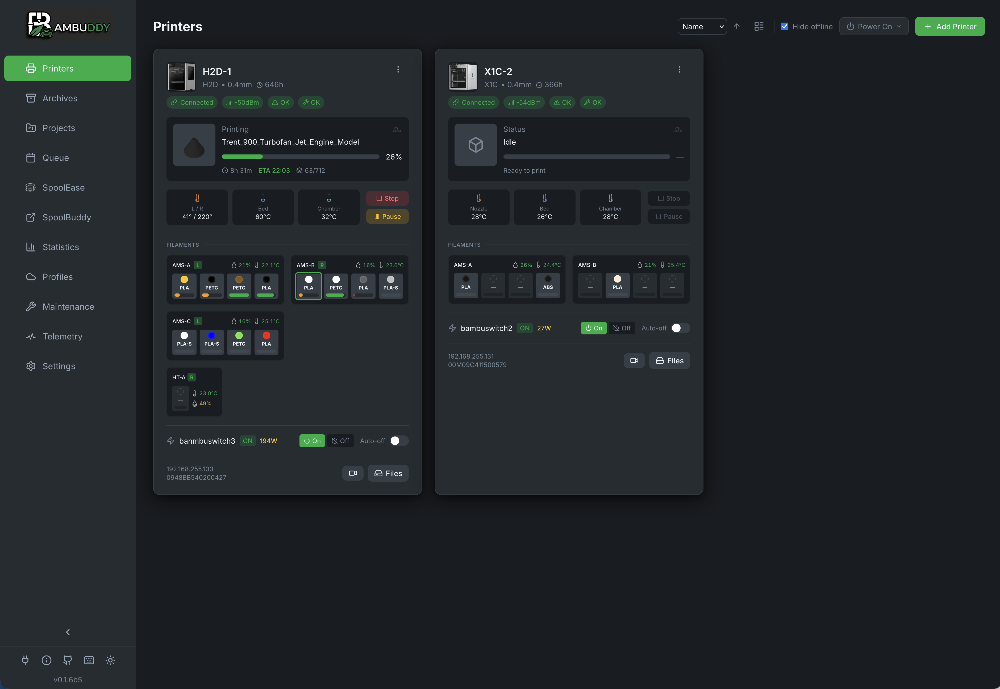
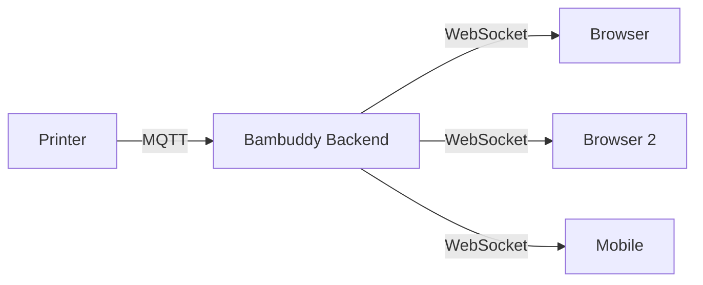

# Real-time Monitoring

Bambuddy provides live monitoring of all your connected Bambu Lab printers through WebSocket-based real-time updates.

{ .screenshot }

---

## :material-magnify: Search & Filters

Large print farms are hard to navigate on a phone where Ctrl+F isn't an option. The Printers page has a live search bar and two filter dropdowns above the card grid.

### Live Search

Type into the search bar to filter the card grid in real time. The search matches **any** of the following fields (case-insensitive, whitespace-trimmed):

- Printer name
- Printer model (e.g., `X1C`, `P1S`, `A1 mini`)
- Location
- Serial number

Click the **:material-close:** button inside the search bar to clear it.

### Status Filter

The **status** dropdown filters by current printer state:

| Option | Shows |
|--------|-------|
| All statuses | Every printer (default) |
| Printing | Currently running a job |
| Paused | Print paused |
| Idle | Connected and ready |
| Finished | Waiting for plate clear |
| Error | FAILED state or active HMS errors |
| Offline | Disconnected |

The status filter is **reactive to WebSocket updates** — when a print finishes and the printer transitions from `RUNNING` to `FINISH`, it is immediately removed from the "Printing" view without needing a manual refresh.

### Location Filter

The **location** dropdown appears only when at least one printer has a location configured. It lets you quickly narrow the view to a single workshop, rack, or room. Location values are taken directly from each printer's configured location.

### Combining Filters

Search, status, and location filters combine — a matching printer must pass **all three** checks. An empty-state message appears if no printer matches the current combination; clear the search bar or reset the dropdowns to see everything again.

!!! tip "Mobile Tip"
    On phones, use the search bar to quickly find a specific printer by location or serial when scrolling through many cards would be tedious.

---

## :material-resize: Resizable Printer Cards

Adjust the size of printer cards to fit your screen and workflow:

### Card Sizes

| Size | Description |
|:----:|-------------|
| **S** (Small) | Compact view, more cards per row |
| **M** (Medium) | Default balanced view |
| **L** (Large) | More detail, fewer cards per row |
| **XL** (Extra Large) | Maximum detail, single column |

### Adjusting Size

1. Look for the **+** and **-** buttons in the Printers page toolbar
2. Click **+** to increase card size
3. Click **-** to decrease card size
4. Size preference is saved automatically

!!! tip "Print Farm View"
    Use Small size for monitoring many printers at once on a large screen.

---

## :material-chart-bar: Status Summary Bar

The status summary bar at the top of the Printers page provides an at-a-glance overview of your fleet:

### Availability & Counts

| Indicator | Description |
|:---------:|-------------|
| :material-circle:{ style="color: #4caf50" } **X available** | Idle printers ready to accept a print (always shown, even when 0) |
| :material-circle:{ style="color: #4caf50" } **X printing** | Printers currently running a job (pulsing dot) |
| :material-circle:{ style="color: #9e9e9e" } **X offline** | Disconnected printers |
| :material-circle:{ style="color: #f44336" } **X problem** | Connected printers with active HMS errors (only shown when > 0) |

### Next Available Printer

When at least one printer is actively printing, the bar shows which printer will finish soonest:

- **Printer name** — the printer closest to completing its current job
- **Progress bar** — visual completion indicator
- **Percentage** — current print progress
- **Time remaining** — estimated time until the printer becomes available

!!! tip "Print Farm Monitoring"
    The "Next available" indicator is especially useful for print farms with many printers — quickly see which printer will be free next without scanning every card.

---

## :material-monitor-dashboard: Printer Status

Each printer card displays real-time information:

### Connection Status

| Indicator | Status |
|:---------:|--------|
| :material-circle:{ style="color: #4caf50" } | Connected and communicating |
| :material-circle:{ style="color: #ff9800" } | Connecting or reconnecting |
| :material-circle:{ style="color: #f44336" } | Disconnected or error |

### Temperature Readouts

Live temperature readings update every few seconds:

| Sensor | Description |
|--------|-------------|
| :material-printer-3d-nozzle: **Nozzle** | Current hotend temperature |
| :material-radiator: **Bed** | Heated bed temperature |
| :material-home-thermometer: **Chamber** | Enclosure temperature (if available) |

### Heater History

Every heater tile on the printer card carries a small chart icon (top-right corner). Click the tile body to open the existing target-temperature popover; click the chart icon to open the heater history modal for that sensor.

Bambuddy records nozzle, bed, and chamber readings every 60 seconds (alongside the matching target value) so you can review thermal behaviour after a print:

| Element | Description |
|---------|-------------|
| **Kind toggle** | Switch between Nozzle / Nozzle 2 (H2D dual-nozzle) / Bed / Chamber — only sensors present on this model are shown. |
| **Time range** | 6h / 24h / 48h / 7d window selector. |
| **Stat cards** | Current value (with trend arrow), average, min, and max across the selected window. |
| **Chart** | Solid line for the recorded reading, dashed step-after line for the configured target. |

!!! info "Read-only chambers"
    On X1C / X1E sensor-only chambers and P2S models (no `M141` heater acceptance), the chart icon still works — Bambuddy is reading the chamber sensor either way, so the history is just as useful for spotting drift or for tuning ambient conditions.

#### Retention

Heater data is kept for 30 days by default. Adjust this under **Settings → General → Printer Sensor History Retention** if you need a longer or shorter window. Old rows are purged automatically once every ~24 hours by the recorder loop; a manual purge per printer is available via `DELETE /printer-sensor-history/{printer_id}?days=N` (requires the `printer_sensor_history:read` scope, included by default in the Operators and Viewers groups).

### Nozzle Details (H2 Series)

H2 series printers show extended nozzle information on hover:

| Printer | Feature | Details |
|---------|---------|---------|
| **H2D / H2D Pro** | L/R Nozzle Hover Card | Shows both nozzle details side by side — diameter, type, flow, wear, max temp, serial. Active nozzle highlighted with Active/Idle status. |
| **H2S** | Single Nozzle Hover Card | Shows extended nozzle details (wear, serial, max temp) on hover over the nozzle temperature card. |
| **H2C** | Nozzle Rack Card | 6-position tool-changer dock showing all rack slots with diameter and filament color. Empty slots shown as placeholders. Hover for full details. |

!!! info "L/R Nozzle Status"
    The L/R nozzle card shows **Active** or **Idle** based on which nozzle the printer is currently using, rather than mounted/docked status.

### Fan Status

Real-time fan speed monitoring in the Controls section:

| Fan | Icon | Color | Description |
|-----|:----:|:-----:|-------------|
| :material-fan: **Part Cooling** | Fan | Cyan | Cools the printed layers |
| :material-weather-windy: **Auxiliary** | Wind | Blue | Controls airflow in chamber |
| :material-air-filter: **Chamber** | AirVent | Green | Exhausts hot air from enclosure |

Fan badges always display with dynamic coloring:

- **Active** (colored): Fan is running, shows current speed %
- **Inactive** (gray): Fan is off, shows 0%

A **print speed badge** (:material-gauge:) also appears in this row, showing the current speed preset percentage. See [Printer Control > Print Speed](printer-control.md#print-speed-control) for details.

Fan speeds update in real-time via WebSocket alongside temperatures.

### Compact Mode Status Pip

In compact (Small) view, each printer card shows a small colored status pip:

| Color | Meaning |
|:-----:|---------|
| :material-circle:{ style="color: #4caf50" } Green | Connected, no issues |
| :material-circle:{ style="color: #f44336" } Red | Offline, or fatal/serious HMS error (severity ≤ 2) |
| :material-circle:{ style="color: #ff9800" } Amber | HMS warning (common/info severity) |

Hover over the pip to see the number of active HMS errors.

### Print Progress

When a print is active, you'll see:

- **Progress bar** - Visual completion percentage (turns amber when paused)
- **Current layer** - Layer X of Y
- **Time remaining** - Estimated time to completion
- **Filament used** - Grams consumed so far

### Status Sorting

When sorting by status, printers are ordered by priority:

1. **HMS errors** — printers with active HMS errors appear first
2. **Printing** — printers running a job
3. **Idle** — connected with no active job
4. **Offline** — disconnected printers

This makes it easy to spot printers that need attention in large print farms.

### ETA Sorting

When sorting by **ETA** (estimated time of arrival / remaining print time), printers are ordered so the next finish lands at the top — useful for staging the next job's filament ahead of time:

1. **Printing with a known ETA** — soonest finish first, ascending by remaining minutes
2. **Printing without an ETA yet** — the brief window between starting a print and the slicer reporting total time
3. **Idle / finished** — connected, no active job
4. **Offline** — disconnected

Printers with the same ETA (or no active print) fall back to alphabetical order so the list stays stable across refreshes. The sort-direction button still flips the result — descending puts offline printers at the top for fleet-wide connectivity triage.

The ETA sort renders a flat list (no section headers), since every printer's ETA is unique.

### Collapsible Groups

When sorting by **Status**, **Model**, or **Location**, printers are rendered inside collapsible section headers — click a header to expand or collapse that group. The **Name** and **ETA** sorts render a flat grid.

- Each group's collapsed state persists across page refreshes (stored per-browser in `localStorage`).
- In selection mode, each section header shows a **Select All** button that selects every printer within that group.
- Status groups appear in priority order (Error → Printing → Paused → Finished → Idle → Offline); the sort-direction toggle flips the order.

---

## :material-alert-decagram: HMS Error Monitoring

The Health Management System (HMS) monitors printer health and displays issues in real-time.

### Status Indicator

The HMS indicator is always visible on printer cards:

| Status | Meaning | Action |
|:------:|---------|--------|
| :material-check-circle:{ style="color: #4caf50" } **OK** | No issues detected | None needed |
| :material-alert:{ style="color: #ff9800" } **Warning** | Minor issues or warnings | Check when convenient |
| :material-alert-circle:{ style="color: #ff5722" } **Error** | Serious errors | Address before next print |
| :material-close-circle:{ style="color: #f44336" } **Fatal** | Fatal errors | Immediate attention needed |

### Error Details

Click the HMS indicator to see:

- Human-readable error description (853 codes translated)
- Error code for reference
- Affected component
- Recommended action
- Link to Bambu Lab support article

### Error Actions (Resume / Stop / Check Assistant / …)

Each error in the modal now shows the same action buttons that BambuStudio and Bambu Handy display — **Resume Printing**, **Stop Printing**, **Continue**, **Retry**, **Filament Extruded**, **Check Assistant**, **Don't Remind Me**, **Recheck**, and so on, depending on what Bambu's catalog lists for that specific error on your printer model.

Click any button and Bambuddy sends the matching MQTT command back to the printer. The wire shapes mirror BambuStudio's `DeviceErrorDialog` / `DeviceManager` source so the printer sees the same payload regardless of which client sent it:

- **Resume Printing / Resume (defects acceptable) / Resume (problem solved) / Problem Solved and Resume / Filament Loaded, Resume / Proceed** → `resume` command. Tells the firmware "I handled the problem, re-check normally and continue." For faults that re-trigger on resume (e.g. a genuinely wrong plate), the printer will re-detect and re-pause with the same code; use **Ignore this and Resume** instead for that semantic.
- **Ignore this and Resume / Ignore. Don't Remind Next Time / Don't Remind Me** → `ignore` command. Distinct from Resume: tells the firmware "suppress the next re-check of this specific fault AND resume the paused print" in one operation. The `err` field carries the decimal int value of the error code (matching BambuStudio's wire format); `job_id` carries the active subtask id so the firmware knows which print's check to skip.
- **No Reminder Next Time** → `idle_ignore` with `type=0`. Dismisses the dialog on the printer's touchscreen without resuming; the firmware suppresses one re-display of the same warning.
- **Stop Printing** → `stop` command. Aborts the print from the paused state and the printer transitions to FAILED.
- **Filament Extruded / Continue / Retry / Abort** (filament-load dialogs) → `ams_control` with `param=done` / `resume` / `abort`.
- **OK / Confirm** → `clean_print_error` (the same command the explicit "Clear Errors" button uses).
- **Check Assistant**, **View Liveview**, **Close**, **Cancel** — these are surfaced for parity with BambuStudio's modal but don't have an MQTT counterpart; the printer's own touchscreen drives them. Bambuddy renders the buttons so you have label parity, but clicking them is a no-op on the wire.

After a button click Bambuddy waits up to 2.5 s for the printer to push at least one MQTT status update; if no push arrives the action is reported as **`Printer did not acknowledge HMS action`** rather than a silent success. This catches firmware-side silent rejection (broker ACKs the publish but the printer drops the command — e.g. an err format mismatch).

Which buttons appear is determined by the printer model (`X1C`, `P1S`, `A1`, `H2D`, …) and the error code via Bambu's published HMS catalog. If Bambu's catalog has no entry for a code, the modal shows only the error description and the "Clear Errors" fallback.

Action labels are translated in all 11 supported locales (English, German, Spanish, French, Italian, Japanese, Korean, Portuguese (Brazil), Turkish, Simplified Chinese, Traditional Chinese).

!!! note "Permission Required"
    HMS actions require the **Printer Control** permission (`printers:control`). Users without this permission cannot execute actions.

### Clear Errors

The HMS error modal also includes a **Clear Errors** button at the bottom that:

1. Sends a `clean_print_error` command to the printer via MQTT
2. Immediately removes errors from the Bambuddy UI
3. Only appears when there are active errors

This is useful for dismissing stale `print_error` values that persist after print cancellation or transient events (without needing to power-cycle the printer or start a new print). The per-error action buttons (above) handle the common cases — Clear Errors is the catch-all for older codes that have no action mapping.

!!! note "Permission Required"
    The Clear Errors button requires the **Printer Control** permission (`printers:control`). Users without this permission will see the button disabled.

!!! tip "HMS Notifications"
    Enable HMS error notifications to get alerted immediately when issues occur. See [Notifications](notifications.md).

---

## :material-access-point: WiFi Signal Strength

The printer card displays WiFi signal strength:

| Icon | Signal |
|:----:|--------|
| :material-wifi-strength-4: | Excellent |
| :material-wifi-strength-3: | Good |
| :material-wifi-strength-2: | Fair |
| :material-wifi-strength-1: | Weak |

Weak signal can cause connection drops and print monitoring issues.

---

## :material-timer-sand: Total Print Hours

Track cumulative print time for each printer:

- Displayed on the printer card
- Useful for maintenance scheduling
- Helps identify heavily-used machines

---

## :material-bug: MQTT Debug Logging

Built-in debugging tool for printer communication:

### Starting Debug Logging

1. Click the settings icon on a printer card
2. Click **Start MQTT Debug**
3. Messages are captured in real-time

### Viewing Messages

| Direction | Description |
|-----------|-------------|
| :material-arrow-down: **Incoming** | Messages from printer to Bambuddy |
| :material-arrow-up: **Outgoing** | Commands sent to printer |

Features:

- **JSON payloads** - Expandable for detailed inspection
- **Filter by type** - Focus on specific message types
- **Search** - Find specific content
- **Auto-refresh** - New messages appear automatically

### Use Cases

- Troubleshooting connection issues
- Understanding printer behavior
- Debugging automation problems
- Reporting issues to developers

---

## :material-web: WebSocket Architecture

Bambuddy uses WebSocket for real-time updates:

```mermaid
graph LR
    A[Printer] -->|MQTT| B[Bambuddy Backend]
    B -->|WebSocket| C[Browser]
    B -->|WebSocket| D[Browser 2]
    B -->|WebSocket| E[Mobile]
```

### How It Works

1. **Printer** sends status updates via MQTT over TLS
2. **Backend** processes and stores the data
3. **WebSocket** broadcasts updates to all connected clients
4. **Browser** updates the UI instantly

### Connection Features

| Feature | Description |
|---------|-------------|
| **Auto-reconnect** | Automatically reconnects on disconnect |
| **State sync** | Full state synchronized on reconnect |
| **Delta updates** | Only changed data is sent |
| **Multi-tab** | Multiple browser tabs supported |

### Performance

- **Latency**: < 1 second typical
- **Bandwidth**: Minimal (delta updates only)
- **Scalability**: Multiple clients supported

---

## :material-folder: Printer File Browser

Browse and manage files stored on your printer's internal storage.

### Opening the File Browser

1. Click the **folder icon** (:material-folder:) on any printer card
2. A modal opens showing the printer's file system

### Navigation

- **Quick access buttons** - Jump to Root, Cache, Models, or Timelapse folders
- **Breadcrumb path** - Shows current location with back navigation
- **Click folders** - Navigate into subdirectories

### File Selection

Select files for bulk operations:

| Action | Description |
|--------|-------------|
| **Click checkbox** | Select/deselect individual files |
| **Select All** | Select all files in current view |
| **Deselect All** | Clear all selections |

### File Operations

| Operation | Single File | Multiple Files |
|-----------|------------|----------------|
| **Download** | Direct download | Downloads as ZIP archive |
| **Delete** | Delete with confirmation | Bulk delete with confirmation |

### Sorting & Filtering

| Control | Options |
|---------|---------|
| **Sort** | Name (A-Z/Z-A), Size, Date |
| **Filter** | Type filename to filter list |

### Storage Info

View used and free space in the header when available.

---

## :material-image-multiple: Printer Images

Customize your printer cards with images:

1. Click the settings icon on a printer card
2. Upload a printer image
3. The image displays on the card

!!! tip "Recommended Size"
    Use images around 300x200 pixels for best results.

---

## :material-bell-ring: Status Change Notifications

Configure alerts for printer events:

| Event | Description |
|-------|-------------|
| **Printer Offline** | When connection is lost |
| **Printer Error** | When HMS errors occur |
| **Print Complete** | When a job finishes |
| **Print Failed** | When a print fails |

[:material-arrow-right: Set up notifications](notifications.md)

---

## :material-lightbulb: Tips

!!! tip "At-a-Glance Monitoring"
    Keep the Printers page open on a dedicated screen or tablet for constant visibility.

!!! tip "Camera Confirmation"
    Use the camera page to visually confirm print quality alongside status data.

!!! tip "Early Error Detection"
    Enable HMS error notifications to catch problems before they ruin a print.

!!! tip "Debug When Needed"
    Check MQTT debug logs if a printer behaves unexpectedly - often reveals communication issues.
