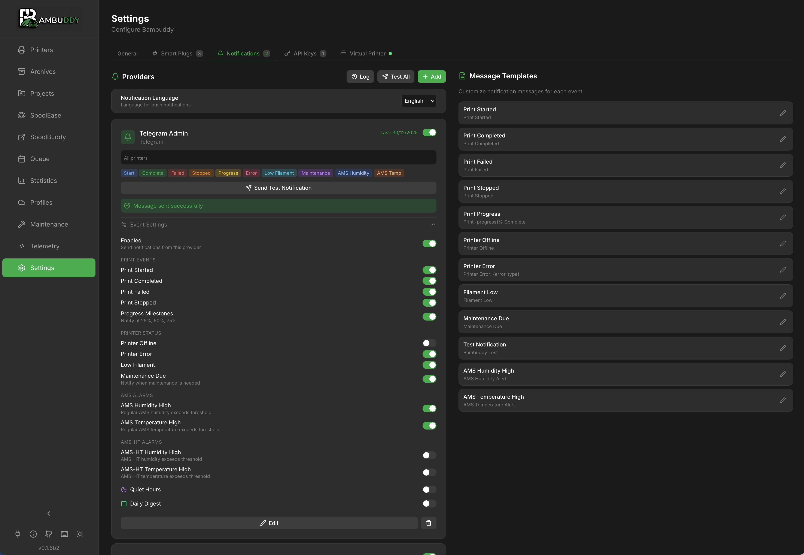

# Notifications

Get notified about print events via WhatsApp, Telegram, Discord, Email, and more.

{ .screenshot }

---

## :material-bell-ring: Supported Providers

| Provider | Setup | Features |
|----------|:-----:|----------|
| **ntfy** | :material-star::material-star-outline::material-star-outline: Easy | Free, no account needed |
| **WhatsApp** | :material-star::material-star-outline::material-star-outline: Easy | Via CallMeBot |
| **Discord** | :material-star::material-star-outline::material-star-outline: Easy | Channel webhooks |
| **Pushover** | :material-star::material-star-outline::material-star-outline: Easy | Professional push service |
| **Telegram** | :material-star::material-star::material-star-outline: Medium | Via Telegram Bot |
| **Email** | :material-star::material-star::material-star-outline: Medium | SMTP email |
| **Webhook** | :material-star::material-star::material-star: Flexible | Custom HTTP POST |

---

## :material-plus-circle: Adding a Provider

1. Go to **Settings** > **Notifications**
2. Click **Add Provider**
3. Select provider type
4. Enter configuration
5. Click **Send Test** to verify
6. Configure event triggers
7. Click **Add**

---

## :material-tune: Provider Setup Guides

### ntfy (Easiest)

Simple topic-based notifications - no account needed!

1. Choose a unique topic name (e.g., `my-printer-xyz123`)

2. Subscribe on your phone:
   - Install ntfy app ([Android](https://play.google.com/store/apps/details?id=io.heckel.ntfy) / [iOS](https://apps.apple.com/app/ntfy/id1625396347))
   - Subscribe to your topic

3. In Bambuddy, enter:

| Field | Value |
|-------|-------|
| **Topic** | Your topic name |
| **Server** | `https://ntfy.sh` (or self-hosted) |

!!! tip "Keep Topic Secret"
    Anyone who knows your topic can send you messages. Use a random string.

---

### WhatsApp (CallMeBot)

Free WhatsApp notifications:

1. Add CallMeBot to contacts: **+34 644 51 95 23**

2. Send via WhatsApp: `I allow callmebot to send me messages`

3. You'll receive an API key

4. In Bambuddy, enter:

| Field | Value |
|-------|-------|
| **Phone Number** | Your number with country code (e.g., +1234567890) |
| **API Key** | Key from CallMeBot |

---

### Discord

Via channel webhooks:

1. In Discord, go to channel settings
2. Navigate to **Integrations** > **Webhooks**
3. Click **New Webhook**
4. Customize name/avatar
5. Click **Copy Webhook URL**
6. In Bambuddy, paste the URL

---

### Pushover

Professional push notification service:

1. Create account at [pushover.net](https://pushover.net/)
2. Install Pushover app on your device
3. Create an Application in dashboard
4. In Bambuddy, enter:

| Field | Value |
|-------|-------|
| **User Key** | From Pushover account |
| **API Token** | From your Application |

---

### Telegram

Via Telegram Bot:

1. Message [@BotFather](https://t.me/BotFather)
2. Send `/newbot` and follow prompts
3. Save the **Bot Token**
4. Message [@userinfobot](https://t.me/userinfobot) to get your **Chat ID**
5. In Bambuddy, enter:

| Field | Value |
|-------|-------|
| **Bot Token** | From BotFather |
| **Chat ID** | Your user/group ID |

!!! tip "Group Notifications"
    Add the bot to a group and use the group's chat ID for team notifications.

---

### Email (SMTP)

Send via email:

| Field | Example |
|-------|---------|
| **SMTP Server** | `smtp.gmail.com` |
| **Port** | 587 (STARTTLS) or 465 (SSL) |
| **Security** | STARTTLS or SSL |
| **Username** | Your email |
| **Password** | App password (not regular password) |
| **From Address** | Sender email |
| **To Address** | Recipient email |

#### Gmail Setup

1. Enable 2-Factor Authentication
2. Generate an [App Password](https://myaccount.google.com/apppasswords)
3. Use: `smtp.gmail.com`, Port 587, STARTTLS

---

### Webhook (Custom)

For custom integrations:

| Field | Value |
|-------|-------|
| **URL** | Your webhook endpoint |
| **Headers** | Optional (e.g., Authorization) |

Payload format:

```json
{
  "event": "print_complete",
  "printer": "Workshop X1C",
  "filename": "benchy.3mf",
  "duration": "2h 15m",
  "timestamp": "2024-01-15T14:30:00Z"
}
```

---

## :material-calendar-check: Event Triggers

| Event | Description |
|-------|-------------|
| **Print Started** | Print job begins |
| **Print Completed** | Print finishes successfully |
| **Print Failed** | Print fails or errors |
| **Print Stopped** | Manual cancellation |
| **Progress Milestones** | At 25%, 50%, 75% |
| **Printer Offline** | Connection lost |
| **Printer Error** | HMS errors detected |
| **Low Filament** | Filament running low |
| **AMS Alert** | AMS humidity warning |
| **AMS-HT Alert** | AMS-HT specific alerts |

Enable/disable each event per provider.

---

## :material-moon-waning-crescent: Quiet Hours

Suppress notifications during sleep:

1. Enable **Quiet Hours** toggle
2. Set **Start Time** (e.g., 22:00)
3. Set **End Time** (e.g., 07:00)

Notifications during quiet hours are silently skipped.

---

## :material-printer: Per-Printer Filtering

Limit notifications to specific printers:

1. Open provider settings
2. Find **Printers** section
3. Select specific printers or "All"

Only events from selected printers trigger notifications.

---

## :material-email-newsletter: Daily Digest

Batch notifications into a summary:

1. Enable **Daily Digest** toggle
2. Set **Digest Time** (e.g., 08:00)

### How It Works

- Events are collected (not sent immediately)
- At digest time, one summary is sent
- Includes counts and details

### Example Digest

```
Daily Print Summary (Dec 14)

✅ 3 prints completed
❌ 1 print failed
⏱️ Total time: 8h 45m
🧵 Filament used: 245g

Details:
- Benchy (2h 15m) ✅
- Phone Stand (45m) ✅
- Cable Clip (15m) ✅
- Prototype v3 (3h 30m) ❌
```

---

## :material-file-document-edit: Message Templates

Customize notification messages:

### Accessing Templates

1. Go to **Settings** > **Notifications**
2. Click **Templates** tab
3. Select event type to edit

### Variables

Insert dynamic content with `{variable}`:

**Print Events:**

- `{printer}` - Printer name
- `{filename}` - Print filename
- `{duration}` - Print time
- `{filament}` - Filament used
- `{estimated_time}` - Estimated duration
- `{progress}` - Completion percentage
- `{reason}` - Failure reason
- `{finish_photo_url}` - Camera snapshot URL (print_complete, print_failed, print_stopped)

**Printer Events:**

- `{printer}` - Printer name
- `{error_type}` - HMS error type
- `{error_detail}` - Error description

**AMS Events:**

- `{printer}` - Printer name
- `{slot}` - AMS slot
- `{remaining_percent}` - Filament left
- `{humidity}` - Humidity level

**Common:**

- `{timestamp}` - Event time
- `{app_name}` - "Bambuddy"

### Reset to Default

Click reset to restore original template.

### Finish Photo URL

Include a camera snapshot in notifications when prints complete:

1. Go to **Settings** > **Network**
2. Set **External URL** to your Bambuddy server's address (e.g., `http://192.168.1.100:8000`)
3. Edit your template to include `{finish_photo_url}`

!!! note "External URL Required"
    The External URL setting is required for finish photos to work. This is auto-detected from your browser when you first visit the Network settings page.

Example template:
```
Print completed!
Printer: {printer}
File: {filename}
Photo: {finish_photo_url}
```

---

## :material-check-circle: Testing

Always test before relying on notifications:

1. Configure provider
2. Click **Send Test**
3. Verify you receive the message
4. Check message formatting

---

## :material-bell-off: Quick Disable

Quickly disable all notifications:

1. Find the **Quick Disable** button
2. Click to toggle all notifications off
3. Click again to re-enable

Useful during maintenance or troubleshooting.

---

## :material-lightbulb: Tips

!!! tip "Start with ntfy"
    ntfy is the simplest setup - no account needed, just pick a topic.

!!! tip "Use Quiet Hours"
    Avoid middle-of-night alerts with quiet hours.

!!! tip "Multiple Providers"
    Set up multiple providers for redundancy.

!!! tip "Progress for Long Prints"
    Enable progress milestones for prints over a few hours.

!!! tip "Customize Templates"
    Personalize messages to include only info you need.

!!! tip "Test Regularly"
    Periodically test notifications to ensure they still work.
