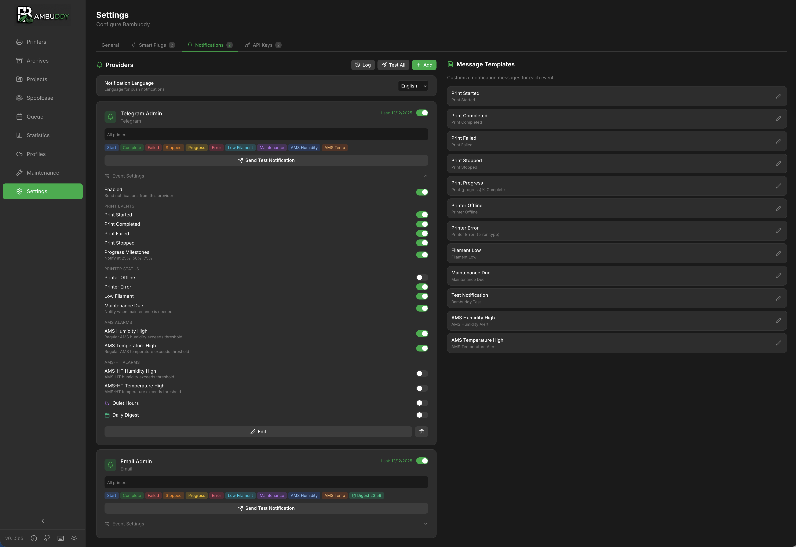

# Notifications

Get notified about print events via WhatsApp, Telegram, Discord, Email, Home Assistant, and more.

{ .screenshot }

---

## :material-bell-ring: Supported Providers

| Provider | Setup | Features |
|----------|:-----:|----------|
| **ntfy** | :material-star::material-star-outline::material-star-outline: Easy | Free, no account needed |
| **WhatsApp** | :material-star::material-star-outline::material-star-outline: Easy | Via CallMeBot |
| **Discord** | :material-star::material-star-outline::material-star-outline: Easy | Channel webhooks |
| **Pushover** | :material-star::material-star-outline::material-star-outline: Easy | Professional push service |
| **Bark** | :material-star::material-star-outline::material-star-outline: Easy | iOS push, no account, self-hostable |
| **Telegram** | :material-star::material-star::material-star-outline: Medium | Via Telegram Bot |
| **Email** | :material-star::material-star::material-star-outline: Medium | SMTP email |
| **Home Assistant** | :material-star::material-star-outline::material-star-outline: Easy | HA dashboard or mobile push via any notify service, with custom data fields |
| **Webhook** | :material-star::material-star::material-star: Flexible | Custom HTTP POST |

---

## :material-plus-circle: Adding a Provider

1. Go to **Settings** > **Notifications**
2. Click **Add Provider**
3. Select provider type
4. Enter configuration
5. Click **Send Test** to verify
6. Configure event triggers
7. Click **Add**

---

## :material-tune: Provider Setup Guides

### ntfy (Easiest)

Simple topic-based notifications - no account needed!

1. Choose a unique topic name (e.g., `my-printer-xyz123`)

2. Subscribe on your phone:
   - Install ntfy app ([Android](https://play.google.com/store/apps/details?id=io.heckel.ntfy) / [iOS](https://apps.apple.com/app/ntfy/id1625396347))
   - Subscribe to your topic

3. In Bambuddy, enter:

| Field | Value |
|-------|-------|
| **Topic** | Your topic name |
| **Server** | `https://ntfy.sh` (or self-hosted) |

!!! tip "Keep Topic Secret"
    Anyone who knows your topic can send you messages. Use a random string.

#### Per-event priority

ntfy supports a `Priority` header that controls how the receiving device escalates an alert (sound, vibration, do-not-disturb override, banner persistence). Bambuddy lets you map each *enabled* event to one of five levels:

| Priority | ntfy value | Typical use |
|----------|-----------|-------------|
| **Min**     | 1 | Diagnostics-style pings — no sound, no badge |
| **Low**     | 2 | Informational, non-urgent (e.g. "first layer complete") |
| **Default** | 3 | Standard notification (the ntfy default if nothing is set) |
| **High**    | 4 | Audible / urgent (e.g. "filament low", "AMS humidity high") |
| **Urgent**  | 5 | Wakes the device, ignores DND (e.g. "print failed", "printer offline") |

After enabling the events you want, scroll to the **ntfy Priority** section in the Add / Edit Notification dialog. Each enabled event gets its own dropdown — events left at *Default* fall through to whatever the ntfy server is configured to send. Disabled events don't appear in the section.

Switching the provider type away from ntfy hides the section; the priorities are still saved if you switch back.

---

### WhatsApp (CallMeBot)

Free WhatsApp notifications:

1. Add CallMeBot to contacts: **+34 644 51 95 23**

2. Send via WhatsApp: `I allow callmebot to send me messages`

3. You'll receive an API key

4. In Bambuddy, enter:

| Field | Value |
|-------|-------|
| **Phone Number** | Your number with country code (e.g., +1234567890) |
| **API Key** | Key from CallMeBot |

---

### Discord

Via channel webhooks:

1. In Discord, go to channel settings
2. Navigate to **Integrations** > **Webhooks**
3. Click **New Webhook**
4. Customize name/avatar
5. Click **Copy Webhook URL**
6. In Bambuddy, paste the URL

---

### Pushover

Professional push notification service:

1. Create account at [pushover.net](https://pushover.net/)
2. Install Pushover app on your device
3. Create an Application in dashboard
4. In Bambuddy, enter:

| Field | Value |
|-------|-------|
| **User Key** | From Pushover account |
| **API Token** | From your Application |
| **Priority** | Message priority, `-2` (lowest) to `2` (Emergency). Defaults to `0` (normal). |

!!! warning "Emergency priority (2)"
    Priority `2` is Pushover's **Emergency** level: the notification keeps re-alerting on your device until you acknowledge it. Pushover requires two extra parameters for this, and Bambuddy exposes them **only when you set Priority to `2`**:

    | Field | Meaning | Range | Default |
    |-------|---------|-------|---------|
    | **Emergency Retry (s)** | How often Pushover re-alerts until acknowledged | 30–10800 s | 60 s |
    | **Emergency Expire (s)** | When Pushover stops re-alerting if never acknowledged | 30–10800 s (max 3 h) | 3600 s |

    Values outside the allowed range are clamped automatically. These fields have no effect at any other priority.

---

### Bark (iOS)

Open-source push notifications for iPhone/iPad via the [Bark](https://github.com/Finb/Bark) app — no account needed, self-hostable:

1. Install the Bark app from the App Store
2. Copy your **device key** from the app (shown on the main screen)
3. In Bambuddy, add a provider and select **Bark**:

| Field | Value |
|-------|-------|
| **Device Key** | From the Bark app |
| **Server URL** | Optional — defaults to the official `https://api.day.app` relay; enter your own [bark-server](https://github.com/Finb/bark-server) URL if self-hosting |
| **Group** | Optional — groups notifications in the iOS notification center |
| **Sound** | Optional — a Bark sound name (e.g. `minuet`) |
| **Interruption Level** | Optional — **Time Sensitive** breaks through scheduled summaries; **Critical** also bypasses Silent mode and Focus (great for print failures); **Passive** delivers without waking the screen |

---

### Telegram

Via Telegram Bot:

1. Message [@BotFather](https://t.me/BotFather)
2. Send `/newbot` and follow prompts
3. Save the **Bot Token**
4. Message [@userinfobot](https://t.me/userinfobot) to get your **Chat ID**
5. In Bambuddy, enter:

| Field | Value |
|-------|-------|
| **Bot Token** | From BotFather |
| **Chat ID** | Your user/group ID |
| **Forum Topic ID** | Optional — see below |

!!! tip "Group Notifications"
    Add the bot to a group and use the group's chat ID for team notifications.

#### Forum Topics

If the target group has Topics enabled, Bambuddy posts to the **General** topic
unless you tell it otherwise. Set **Forum Topic ID** to route the notifications
into one specific topic instead — useful for giving each printer its own topic
inside a single group rather than running a separate chat per printer.

To find the ID, open the topic in Telegram and copy its link. The last number is
the topic ID:

```
https://t.me/c/1234567890/25
                         ^^ Forum Topic ID
```

The field takes a plain number and may be left empty. Two things to watch for:

- The bot needs permission to post in the group, and Topics must actually be
  enabled on it. Bambuddy passes the ID through unchanged and reports back
  whatever Telegram answers, so a wrong ID surfaces as a Telegram error.
- Deleting and recreating a topic gives it a new ID, so the notifications will
  need repointing.

Use **Test** in the provider dialog to confirm the message lands where you
expect before saving.

---

### Email (SMTP)

Send via email:

| Field | Example |
|-------|---------|
| **SMTP Server** | `smtp.gmail.com` |
| **Port** | 587 (STARTTLS) or 465 (SSL) |
| **Security** | STARTTLS or SSL |
| **Username** | Your email |
| **Password** | App password (not regular password) |
| **From Address** | Sender email |
| **To Address** | Recipient email |

#### Gmail Setup

1. Enable 2-Factor Authentication
2. Generate an [App Password](https://myaccount.google.com/apppasswords)
3. Use: `smtp.gmail.com`, Port 587, STARTTLS

---

### Home Assistant

Zero-config notifications if Home Assistant is already connected:

1. Ensure HA is configured in **Settings** > **Network** > **Home Assistant**
2. Add a notification provider and select **Home Assistant**
3. No additional fields needed — click **Send Test** to verify

Notifications appear as persistent notifications in your HA dashboard.

!!! tip "Push straight to your phone"
    Set the **Home Assistant Service** field to a notify service like `notify.mobile_app_myphone` to push directly to the HA Companion app instead of the dashboard.

**Custom data fields.** When targeting a notify service, the optional **Data (JSON)** field is forwarded as the service call's nested `data` object — the same place HA automations put mobile push options:

```json
{"priority": "high", "ttl": 0, "channel": "3D Printing", "group": "printers"}
```

`ttl: 0` + `priority: high` make Android pushes arrive immediately; `channel` creates a dedicated Android notification channel so you can give printer alerts their own sound. See the [HA Companion notification docs](https://companion.home-assistant.io/docs/notifications/notifications-basic/) for all supported keys. Leave the field empty when using the default persistent notification — it doesn't accept custom data.

The field is passed to Home Assistant exactly as you write it, so **anything the notify service accepts works here** — including nested objects and lists, not just the flat values above. Action buttons are the common case:

```json
{
  "ttl": 0,
  "priority": "high",
  "group": "3D Printer",
  "actions": [
    {"action": "SNOOZE_PRINT_FINISHED", "title": "Snooze 20 min"},
    {"action": "BED_COOL_NOTIFY_ON", "title": "Notify on Bed Cool"}
  ]
}
```

Two things decide whether those buttons appear and do anything, and neither is set here:

- **Pressing a button does nothing until Home Assistant listens for it.** The Companion app fires a `mobile_app_notification_action` event carrying your `action` string; you need an HA automation triggered on that event to act on it.
- **On iOS, a bare `actions` list is ignored.** iOS renders buttons only for a notification `category` you have registered in the Companion app, so send `"category": "your_category"` instead. Android renders the list directly.

!!! warning "Write it as JSON, not YAML"
    The examples in the HA docs are YAML. This field is JSON: keys and string values need double quotes, lists use `[ ]`, and there are no trailing commas. Bambuddy refuses to save malformed JSON rather than sending a half-built payload, so if **Save** reports invalid JSON, the field content is the thing to check — nothing was dropped silently.

---

### Webhook (Custom)

For custom integrations:

| Field | Value |
|-------|-------|
| **URL** | Your webhook endpoint |
| **Headers** | Optional (e.g., Authorization) |

All webhook payloads use a standardized format with `title`, `message`, `timestamp`, `source`, an `event` field identifying the event type, and all event-specific variables as structured fields. This makes it easy for automation tools (n8n, Node-RED, Home Assistant, etc.) to parse event data without extracting information from the message text.

**Print complete** example:

```json
{
  "title": "Print Complete",
  "message": "Workshop X1C: benchy.3mf completed in 2h 15m",
  "timestamp": "2026-04-02T14:30:00.123456",
  "source": "Bambuddy",
  "event": "print_complete",
  "printer": "Workshop X1C",
  "filename": "benchy.3mf",
  "duration": "2h 15m",
  "filament_grams": "15.2",
  "filament_details": "AMS-A T1 PLA: 15.2g"
}
```

**Failed/stopped prints** include additional fields:

```json
{
  "title": "Print Failed",
  "message": "Workshop X1C: benchy.3mf failed at 50%",
  "timestamp": "2026-04-02T15:15:00.123456",
  "source": "Bambuddy",
  "event": "print_failed",
  "printer": "Workshop X1C",
  "filename": "benchy.3mf",
  "duration": "0h 45m",
  "filament_grams": "7.6",
  "filament_details": "PLA: 7.6g",
  "progress": "50",
  "reason": "Filament runout"
}
```

**Simpler events** include fewer fields — only what's relevant:

```json
{
  "title": "Printer Offline",
  "message": "Workshop X1C is offline",
  "timestamp": "2026-04-02T14:30:00.123456",
  "source": "Bambuddy",
  "event": "printer_offline",
  "printer": "Workshop X1C"
}
```

When a camera snapshot is available (e.g. First Layer Complete, Print Started, Print Completed), the payload includes a base64-encoded JPEG image in the `image` field:

```json
{
  "title": "First Layer Complete",
  "message": "Workshop X1C: benchy.3mf — Layer 1/200 done",
  "timestamp": "2026-04-02T14:30:00.123456",
  "source": "Bambuddy",
  "event": "first_layer_complete",
  "printer": "Workshop X1C",
  "filename": "benchy.3mf",
  "total_layers": "200",
  "image": "/9j/4AAQSkZJRg..."
}
```

!!! tip "Decoding the image"
    The `image` field contains a standard base64-encoded JPEG. In Home Assistant automations, you can decode it with a `template` sensor or pass it to `notify.mobile_app_*` as `image` data. In Node-RED, use a `Buffer.from(msg.payload.image, 'base64')` node. The field is only present when a snapshot was captured — not all events include images.

!!! info "Slack/Mattermost Format"
    When using the Slack payload format, only `{"text": "..."}` is sent — structured event fields are not included. Use the generic format for automation integrations that need structured data.

---

## :material-calendar-check: Event Triggers

### Print Events

| Event | Description |
|-------|-------------|
| **Print Started** | Print job begins |
| **Plate Not Empty** | Objects detected on build plate before print (bypasses quiet hours) |
| **Print Completed** | Print finishes successfully (includes filament usage) |
| **Print Failed** | Print fails or errors (includes scaled filament usage and progress) |
| **Print Stopped** | Manual cancellation (includes scaled filament usage and progress) |
| **Plate Clear Required** | A print reached a terminal state and the queue is gated until the build plate is confirmed clear. Off by default — it fires after every print, at the same moment as Print Completed. Also published over [MQTT](mqtt.md). |
| **Missing Spool Assignment** | Print started with required AMS trays that have no assigned spool (off by default) |
| **First Layer Complete** | First layer finished — check adhesion remotely (includes camera snapshot) |
| **Bed Cooled** | Bed temperature dropped below threshold after print (configurable in Settings) |
| **Progress Milestones** | At 25%, 50%, 75% |

### Printer Events

| Event | Description |
|-------|-------------|
| **Printer Offline** | Connection lost |
| **Printer Error** | HMS errors with human-readable descriptions (853 codes translated) |
| **AI Failure Detection** | Obico ML detected a possible print failure (spaghetti, layer shift, etc.). Fires only when [Failure Detection](failure-detection.md) is enabled and the printer crosses the configured sensitivity threshold. Off by default. |
| **Printer Sensor Alert** | A [Home Assistant sensor](sensors.md#printer-sensors) bound to a printer entered its alert state — an enclosure door opened, a chamber ran hot. Fires on the transition in, not repeatedly. Off by default. Storage-location sensors have their own event, below. |
| **Low Filament** | Filament running low |
| **Maintenance Due** | Scheduled maintenance is due |

### AMS Events

| Event | Description |
|-------|-------------|
| **AMS Humidity High** | AMS humidity exceeds threshold |
| **AMS Temperature High** | AMS temperature exceeds threshold. Silent while the unit is drying — see below. |
| **AMS-HT Humidity High** | AMS-HT humidity exceeds threshold |
| **AMS-HT Temperature High** | AMS-HT temperature exceeds threshold. Silent while the unit is drying — see below. |
| **Auto-Drying Suspended** | Bambuddy stopped automatically drying an AMS unit because repeated cycles brought the humidity no lower. **On by default** — it reports that Bambuddy has stopped acting, so silence would read as "still drying". Fires once per unit; the suspension lifts on its own when the reading falls. See [the threshold floor](ams.md#drying-threshold-floor). |

### Inventory Events

| Event | Description |
|-------|-------------|
| **Storage Location Sensor Alert** | A [Home Assistant sensor](sensors.md#storage-location-sensors) bound to a storage location entered its alert state — a drybox got too humid, a battery ran low. Fires on the transition in, not repeatedly. Off by default. This is a separate switch from **Printer Sensor Alert**: a provider narrowed to one printer would otherwise receive every drybox alert as well, with no way to have one without the other. |
!!! info "Temperature alerts stay quiet while an AMS is drying"

    Drying deliberately runs hotter than the alert threshold — 45°C for PLA, 65°C for PETG, up to 85°C on an AMS-HT, against a default threshold of 35°C. Left alone, a twelve-hour dry would send twelve notifications about a temperature you asked for.

    Bambuddy holds the temperature alert back for the length of a cycle and through the cool-down that follows, using the drying state the printer reports. It starts alerting again as soon as the unit reads back at or below your threshold, so the quiet period matches how long the unit actually takes to cool rather than a fixed delay. Nothing to configure, and the suppression survives a restart.

    Two deliberate exceptions. The **humidity** alert is unaffected — during drying that reading falling is the whole point. And a unit reporting a loss of thermal control still alerts, because that is exactly when you want to hear about it.

### Print Queue Events

| Event | Default | Description |
|-------|:-------:|-------------|
| **Job Added** | Off | Job added to queue |
| **Job Assigned** | Off | Model-based job assigned to a printer |
| **Job Started** | Off | Queue job started printing |
| **Job Waiting** | **On** | Job waiting for filament (actionable) |
| **Job Skipped** | **On** | Job skipped due to previous print failure |
| **Job Failed** | **On** | Job failed to start (upload error, etc.) |
| **Queue Complete** | Off | All queued jobs finished |

!!! tip "Actionable Queue Notifications"
    The most important queue notifications (Waiting, Skipped, Failed) are enabled by default because they require user action - load the right filament, check why a print failed, etc.

Enable/disable each event per provider.

---

## :material-moon-waning-crescent: Quiet Hours

Suppress notifications during sleep:

1. Enable **Quiet Hours** toggle
2. Set **Start Time** (e.g., 22:00)
3. Set **End Time** (e.g., 07:00)

Notifications during quiet hours are silently skipped.

---

## :material-printer: Per-Printer Filtering

Limit notifications to specific printers:

1. Open provider settings
2. Find **Printers** section
3. Select specific printers or "All"

Only events from selected printers trigger notifications.

---

## :material-email-newsletter: Daily Digest

Batch notifications into a summary:

1. Enable **Daily Digest** toggle
2. Set **Digest Time** (e.g., 08:00)

### How It Works

- Events are collected (not sent immediately)
- At digest time, one summary is sent
- Includes counts and details

### Example Digest

```
Daily Print Summary (Dec 14)

✅ 3 prints completed
❌ 1 print failed
⏱️ Total time: 8h 45m
🧵 Filament used: 245g

Details:
- Benchy (2h 15m) ✅
- Phone Stand (45m) ✅
- Cable Clip (15m) ✅
- Prototype v3 (3h 30m) ❌
```

---

## :material-file-document-edit: Message Templates

Customize notification messages:

### Accessing Templates

1. Go to **Settings** > **Notifications**
2. Click **Templates** tab
3. Select event type to edit

### Variables

Insert dynamic content with `{variable}`:

**Print Events:**

- `{printer}` - Printer name
- `{filename}` - Print filename
- `{duration}` - Print time
- `{filament_grams}` - Total filament used in grams (scaled by progress for failed/stopped prints)
- `{filament_details}` - Per-filament breakdown (e.g., "PLA: 15.2g" or "PLA: 10.0g | PETG: 5.0g")
- `{estimated_time}` - Estimated duration (e.g., "1h 23m")
- `{eta}` - Wall-clock completion time (e.g., "15:53" or "3:53 PM"), respects your time format setting
- `{progress}` - Completion percentage (available for failed/stopped prints)
- `{reason}` - Failure reason
- `{finish_photo_url}` - Camera snapshot URL (print_complete, print_failed, print_stopped). **Email special-case (#1792):** if your **Email** template references `{finish_photo_url}` in the body, the rendered URL also triggers an inline embed — the HTML part replaces the URL with the snapshot rendered inline at exactly that position, while the plain-text part keeps the URL as a clickable link. Place the variable WHERE you want the image to appear. If the template doesn't reference it, the email stays text-only — no surprise attachment.

**Printer Events:**

- `{printer}` - Printer name
- `{error_type}` - HMS error type
- `{error_detail}` - Error description

**First Layer Complete:**

- `{printer}` - Printer name
- `{filename}` - Print filename
- `{total_layers}` - Total layer count

**Bed Cooled:**

- `{printer}` - Printer name
- `{bed_temp}` - Current bed temperature
- `{threshold}` - Configured threshold
- `{filename}` - Print filename

**Printer Sensor Alert:**

- `{printer}` - Printer name
- `{sensor}` - Sensor display name
- `{state}` - State that triggered the alert (`open`, `41.2 °C`)

**Storage Location Sensor Alert:**

- `{location}` - Storage location name (there is no `{printer}` here — the alert
  belongs to a location, not a machine)
- `{sensor}` - Sensor display name
- `{state}` - State that triggered the alert (`24.7 °C`, `43.6 %`) — trimmed of
  trailing zeros, unlike the two-decimal form shown on the inventory page

**Missing Spool Assignment:**

- `{printer}` - Printer name
- `{missing_slots}` - Comma-separated slot labels (e.g., "A1, A3")
- `{missing_slot_details}` - Per-slot breakdown with expected profile (e.g., "- A1: PLA Basic")

**AMS Events:**

- `{printer}` - Printer name
- `{slot}` - AMS slot
- `{remaining_percent}` - Filament left
- `{humidity}` - Humidity level
- `{ams_label}` - Which unit (e.g. "AMS-A")
- `{threshold}` - The configured threshold the reading is measured against
- `{cycles}` - Drying cycles that ended above the threshold (Auto-Drying Suspended only)

**Common:**

- `{timestamp}` - Event time
- `{app_name}` - "Bambuddy"

### Reset to Default

Click reset to restore original template.

### Finish Photos

A camera snapshot can reach your notification either as a **link** you click or as
an **image attached to the message itself**. Which one you get depends on the
channel, not on a setting — see the table below.

Both paths are gated on **Settings** > **General** > **Archive Settings** >
**Capture finish photo**. With that off, no snapshot is taken and nothing is
attached or linked.

#### Attached image

ntfy, Pushover, Telegram and Discord receive the photo as a real attachment
whenever one was captured — you do **not** need `{finish_photo_url}` in the
template for this, and no External URL is required, because the image bytes are
uploaded with the message.

| Channel | Snapshot delivery |
|---------|-------------------|
| **ntfy** | Attached. If your ntfy server has attachments disabled, Bambuddy retries automatically and sends the text alone. |
| **Pushover** | Attached. |
| **Telegram** | Attached — sent as a photo with the message as its caption. |
| **Discord** | Attached and shown inline in the embed. |
| **Webhook** | Base64-encoded JPEG in the payload's `image` field (generic format only — the Slack format carries text alone). |
| **Email** | Inline, but only when the template references `{finish_photo_url}` — see below. |
| **Home Assistant, CallMeBot, Bark** | Link only. Use `{finish_photo_url}` in the template. |

Attachments are capped at 2.5 MB. A larger snapshot is skipped and the message is
sent as text — the reason is written to the log.

Snapshots are not limited to completed prints: Print Started, Print Progress,
First Layer Complete and printer-error notifications capture a live frame at the
moment they fire.

#### Linked URL

`{finish_photo_url}` is available on the **print_complete**, **print_failed** and
**print_stopped** events, and needs a reachable server address:

1. Go to **Settings** > **Network**
2. Set **External URL** to your Bambuddy server's address (e.g., `http://192.168.1.100:8000`)
3. Edit your template to include `{finish_photo_url}`

!!! note "External URL Required"
    The External URL setting is required for the linked form to work. This is auto-detected from your browser when you first visit the Network settings page.

Example template:
```
Print completed!
Printer: {printer}
File: {filename}
Filament: {filament_details}
Photo: {finish_photo_url}
```

For **Email**, that same variable also switches the message to an inline embed —
the photo is rendered at exactly the position you placed the variable. See the
`{finish_photo_url}` entry under [Variables](#variables) for the details.

---

## :material-check-circle: Testing

Always test before relying on notifications:

1. Configure provider
2. Click **Send Test**
3. Verify you receive the message
4. Check message formatting

---

## :material-bell-off: Quick Disable

Quickly disable all notifications:

1. Find the **Quick Disable** button
2. Click to toggle all notifications off
3. Click again to re-enable

Useful during maintenance or troubleshooting.

---

## :material-lightbulb: Tips

!!! tip "Start with ntfy"
    ntfy is the simplest setup - no account needed, just pick a topic.

!!! tip "Use Quiet Hours"
    Avoid middle-of-night alerts with quiet hours.

!!! tip "Multiple Providers"
    Set up multiple providers for redundancy.

!!! tip "Progress for Long Prints"
    Enable progress milestones for prints over a few hours.

!!! tip "Customize Templates"
    Personalize messages to include only info you need.

!!! tip "Test Regularly"
    Periodically test notifications to ensure they still work.

!!! tip "Bed Cooled Threshold"
    Configure the bed cooled temperature threshold in **Settings** > **Notifications**. Default is 35°C. The notification fires as soon as the printer reports the bed at or below the threshold — no timeout.

!!! tip "Plate Not Empty Bypasses Quiet Hours"
    Plate detection notifications are always sent immediately, even during quiet hours or when digest mode is enabled. This ensures you're alerted to potential issues before a print starts.

---

## :material-account-bell: Per-User Email Notifications

When [Advanced Authentication](authentication.md#per-user-email-notifications) is enabled, individual users can receive email notifications for their own print jobs. This is separate from the provider-based notification system above — it sends emails directly to the user who submitted the print.

### Requirements

- Advanced Authentication must be enabled
- SMTP must be configured
- "User Notifications" must be enabled in **Settings** → **Notifications**
- User must have an email address on their account
- User must have the `notifications:user_email` permission (Administrators and Operators by default)

### Supported Events

| Event | Description |
|-------|-------------|
| **Print Started** | Your print job has begun |
| **Print Completed** | Your print job finished successfully |
| **Print Failed** | Your print job encountered an error |
| **Print Stopped** | Your print job was cancelled |

### Setup

1. Enable User Notifications in **Settings** → **Notifications**
2. Click **Notifications** in the sidebar
3. Toggle each event type on or off
4. Click **Save**

See [Authentication → Per-User Email Notifications](authentication.md#per-user-email-notifications) for full details.
