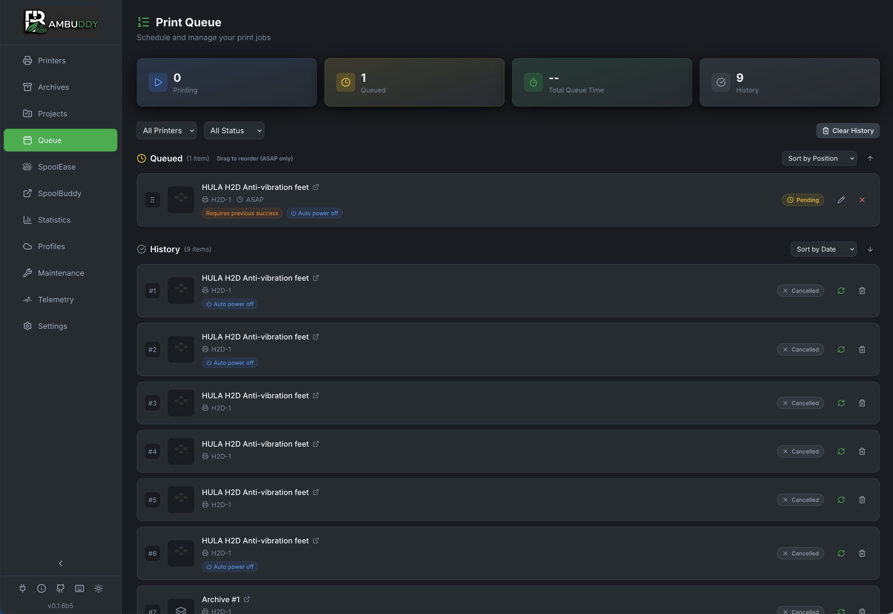

# Print Queue

Queue and schedule prints with drag-and-drop ordering, timed starts, and smart plug automation.

{ .screenshot }

---

## :material-playlist-plus: Queue Overview

The print queue lets you:

- **Queue prints** from your archive
- **Order** with drag-and-drop
- **Schedule** specific start times
- **Automate** with smart plug integration
- **Track** queue progress

---

## :material-plus: Adding to Queue

### From Archive

1. Go to **Archives** page
2. Right-click an archive card
3. Select **Add to Queue**
4. Choose target printer
5. Optionally configure filament mapping (see below)
6. Print is added to queue

### From File Manager

1. Go to **File Manager** page
2. Select sliced files (`.gcode` or `.gcode.3mf`)
3. Click **Add to Queue** in toolbar (or right-click context menu)
4. Choose target printer (or leave unassigned)
5. Files are archived and queued automatically

### From Queue Page

1. Go to **Queue** page
2. Click **Add Print**
3. Browse and select an archive
4. Choose target printer
5. Optionally set schedule time
6. Optionally configure filament mapping

### AMS Filament Mapping

When adding multi-color prints to the queue, you can configure which AMS slot to use for each filament:

1. Expand the **Filament Mapping** section
2. View auto-matched filaments (type + color)
3. Click any dropdown to manually select a different AMS slot
4. Color names shown for easy identification (decoded from Bambu filament codes)
5. Mapping is stored with the queued print

!!! tip "Stored Mappings"
    AMS mappings are saved when you add a print to the queue. When the print starts, Bambuddy uses your configured mapping instead of auto-matching again.

### Plate Selection (Multi-Plate 3MF)

For 3MF files with multiple plates:

1. Click **Edit** on a queued item
2. Scroll to **Plate Selection** section
3. Browse plates with thumbnails and print times
4. Click to select the plate to print
5. Filament requirements update to show selected plate's filaments

!!! tip "Single Plate per Queue Item"
    Each queue item prints one plate. To print multiple plates from the same file, add the file to queue multiple times and select different plates.

### Print Options

Configure printer settings for each queued print:

1. Click **Edit** on a queued item
2. Expand **Print Options** section
3. Toggle options as needed:

| Option | Description |
|--------|-------------|
| Bed Levelling | Auto-level bed before print |
| Flow Calibration | Calibrate flow before print |
| Vibration Calibration | Reduce vibration artifacts |
| Layer Inspect | Enable AI first layer inspection |
| Timelapse | Record timelapse video |
| Use AMS | Use AMS system for filament |

!!! tip "Default Settings"
    Default values match typical printing needs. Adjust only if your print requires specific settings.

---

## :material-drag: Drag and Drop Ordering

Reorder prints in the queue:

1. Hover over a queued print
2. Grab the drag handle :material-drag:
3. Drag to new position
4. Release to reorder

Prints execute in order from top to bottom.

---

## :material-clock-outline: Scheduling

### Immediate Prints

Add to queue without a schedule - prints start when:

- Printer is idle
- Previous prints complete
- No scheduled prints are pending

### Scheduled Prints

Set a specific start time:

1. Click **Schedule** on queued print
2. Choose date and time
3. Print starts at scheduled time

### Schedule Priority

Scheduled prints take priority:

1. Check for scheduled prints at scheduled time
2. If none, check immediate queue
3. Start next print

### Queue Only (Staged Prints)

Stage prints without automatic scheduling:

1. When adding to queue, select **Queue Only**
2. Print shows with purple **Staged** badge
3. Print won't start automatically
4. Click :material-play: **Play** button to release to queue

Use Queue Only to:

- Prepare print batches before activating
- Stage prints across multiple printers
- Review and approve before printing starts
- Build a queue without immediate execution

!!! tip "Batch Workflow"
    Add multiple prints with Queue Only, review the order, then release them one by one or all at once.

---

## :material-power: Smart Plug Automation

Combine with smart plugs for full automation:

### Auto Power On

When a queued print is ready:

1. Bambuddy checks if printer is on
2. If off and smart plug configured, powers on
3. Waits for printer to boot
4. Starts the print

### Auto Power Off

After print completes:

1. Print completes
2. Cooldown period (configurable)
3. Check if more prints queued
4. If no more prints, power off

### Configuration

1. Go to **Settings** > **Smart Plugs**
2. Configure plug for printer
3. Enable **Auto Power On** and **Auto Power Off**
4. Set cooldown temperature and time

[:material-arrow-right: Smart Plugs setup](smart-plugs.md)

---

## :material-format-list-checks: Queue Status

### Print States

| State | Icon | Description |
|-------|:----:|-------------|
| Queued | :material-clock-outline: | Waiting in queue |
| Scheduled | :material-calendar-clock: | Waiting for scheduled time |
| Starting | :material-play-circle-outline: | Sending to printer |
| Printing | :material-printer-3d: | Currently printing |
| Completed | :material-check-circle:{ style="color: #4caf50" } | Successfully finished |
| Failed | :material-close-circle:{ style="color: #f44336" } | Print failed |
| Cancelled | :material-cancel: | Manually removed |

### Queue Card

Each queued print shows:

- Thumbnail
- Print name
- Target printer
- Estimated duration
- Scheduled time (if set)
- Status

---

## :material-cancel: Managing Queue

### Remove from Queue

1. Click the **X** on any queued print
2. Confirm removal
3. Print is removed (not deleted from archive)

### Cancel Running Print

1. Find the currently printing item
2. Click **Cancel**
3. Print stops on printer
4. Marked as cancelled in queue

### Clear Queue

Remove all queued prints:

1. Click **Clear Queue** button
2. Confirm action
3. All pending prints removed

!!! note "Running Print Not Affected"
    Clear Queue only removes pending prints, not the currently active print.

---

## :material-pencil-box-multiple: Bulk Editing

Edit multiple queued items at once:

### Selecting Items

1. Look for checkboxes on pending queue items
2. Click checkbox to select/deselect individual items
3. Use **Select All** / **Deselect All** in the toolbar

### Bulk Edit Modal

When items are selected, click **Edit Selected** to open the bulk edit modal:

| Setting | Description |
|---------|-------------|
| **Printer** | Reassign all selected items to a different printer |
| **Staged** | Toggle manual start (Queue Only) mode |
| **Auto power off** | Toggle auto power off after print |
| **Require previous success** | Toggle conditional execution |
| **Bed levelling** | Toggle bed levelling |
| **Flow calibration** | Toggle flow calibration |
| **Vibration calibration** | Toggle vibration calibration |
| **First layer inspection** | Toggle AI inspection |
| **Timelapse** | Toggle timelapse recording |
| **Use AMS** | Toggle AMS usage |

### Tri-State Toggles

Each setting has three states:

| State | Symbol | Meaning |
|-------|:------:|---------|
| **Unchanged** | — | Don't modify this setting |
| **Off** | Off | Set to disabled on all selected items |
| **On** | On | Set to enabled on all selected items |

Only settings you explicitly change are applied - other settings remain as they were.

### Bulk Cancel

Click **Cancel Selected** to cancel all selected pending items at once.

!!! tip "Quick Reassignment"
    Use bulk edit to quickly reassign multiple prints to a different printer when one becomes unavailable.

---

## :material-printer: Multi-Printer Queue

Queue prints across multiple printers:

### Per-Printer Queues

Each printer has its own queue:

- Filter by printer to see specific queue
- Prints wait for their assigned printer
- Different printers can print simultaneously

### Multi-Printer Selection

Send the same print to multiple printers at once:

1. Open **Add to Queue** or **Re-print** modal
2. Select multiple printers using checkboxes
3. Use **Select all** / **Clear** buttons for quick selection
4. Configure filament mapping (default applies to all printers, or use per-printer mapping)
5. Click submit to send to all printers

!!! tip "Print Farms"
    Multi-printer selection is ideal for print farms. Use the default mapping for printers with identical filament configurations, or enable per-printer mapping for mixed setups.

### Per-Printer AMS Mapping

When multiple printers are selected, you can configure filament slot mapping individually for each printer:

1. Select multiple printers
2. Under each printer, check **Custom mapping** to enable per-printer configuration
3. The mapping section expands showing:
   - Required filaments with color indicators
   - Dropdown to select AMS slot for each requirement
   - Match status: :material-check:{ style="color: #00ae42" } exact, :material-alert:{ style="color: #facc15" } type-only, :material-alert:{ style="color: #f97316" } missing
4. Click **Auto** to auto-configure using RFID data
5. Click **Re-read** to refresh the printer's loaded filaments

| Control | Description |
|---------|-------------|
| **Custom mapping** checkbox | Enable per-printer slot configuration |
| **Auto** button | Auto-match filaments using RFID data |
| **Re-read** button | Refresh loaded filaments from printer |
| Match indicator | Shows (X/Y matched) status |

!!! tip "Default Expanded"
    Go to **Settings → Filament** and enable **Expand custom mapping by default** to automatically expand per-printer mapping for all printers when multi-selecting.

!!! note "Auto-Configure"
    The Auto button reads RFID data from loaded spools and matches them to required filaments by type and color. It prioritizes exact matches, then similar colors, then type-only matches.

### Choosing a Printer

When adding to queue:

1. Select one or more target printers
2. Prints join each printer's queue
3. Different archives can go to different printers

### Load Balancing

Manually distribute prints:

- Add long prints to less-used printers
- Queue time-sensitive prints on fastest printer
- Keep specific materials on specific printers
- Use multi-printer selection for batch production

---

## :material-bell-ring: Queue Notifications

Get notified about queue events:

| Event | Description |
|-------|-------------|
| Print Started | Queue print begins |
| Print Completed | Queue print finishes |
| Print Failed | Queue print fails |
| Queue Empty | All prints completed |

[:material-arrow-right: Set up notifications](notifications.md)

---

## :material-history: Queue History

View past queue activity:

- Completed prints
- Failed prints
- Cancelled prints
- Execution times

History helps you:

- Track throughput
- Identify patterns
- Debug issues

---

## :material-api: API Access

Manage queue programmatically:

```bash
# Add to queue
POST /api/v1/queue

# Get queue status
GET /api/v1/queue

# Remove from queue
DELETE /api/v1/queue/{id}
```

See [API Reference](../reference/api.md) for details.

---

## :material-lightbulb: Tips

!!! tip "Overnight Prints"
    Schedule longer prints to start overnight - wake up to finished prints!

!!! tip "Smart Plug Combo"
    Combine scheduling with auto power-off for hands-free operation.

!!! tip "Queue Batch Jobs"
    Queue multiple small prints for efficient batch production.

!!! tip "Priority Management"
    Move urgent prints to the top of the queue with drag-and-drop.

!!! tip "Estimated Times"
    Check estimated durations when scheduling to avoid printer conflicts.
