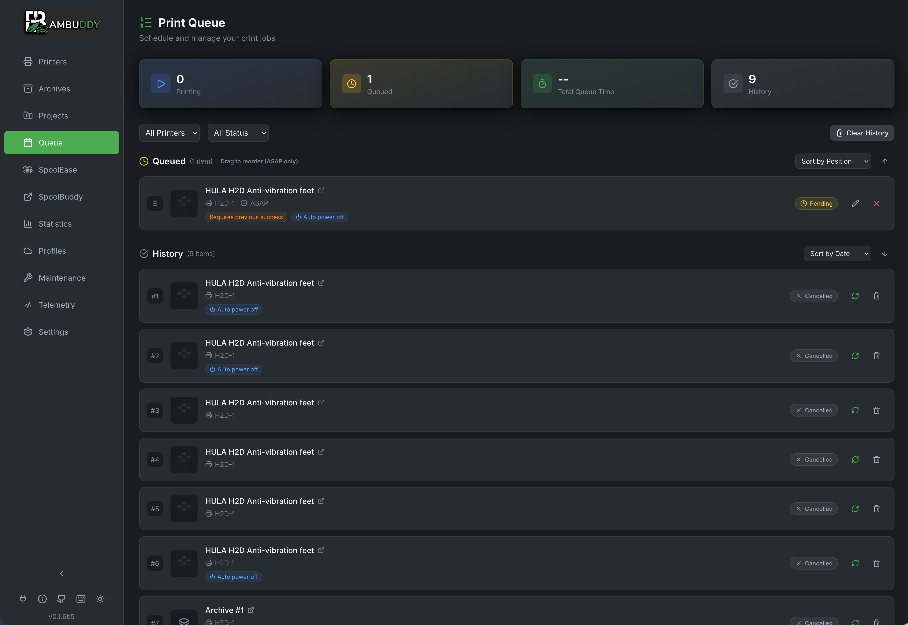

# Print Queue

Queue and schedule prints with drag-and-drop ordering, timed starts, batch grouping, a Gantt timeline, and smart plug automation.

{ .screenshot }

---

## :material-playlist-plus: Queue Overview

The Queue page has **three tabs** along the top:

| Tab | What it shows |
|---|---|
| **Queue** | The live print order — pending, scheduled, printing, and waiting items. Layout toggle switches between a flat list and per-printer section cards (each with aggregate item count, total time, and total filament weight). |
| **History** | Past prints in a responsive 1 / 2 / 3-column grid. Two-line rich rows with filament color swatch, weight, type, user attribution, and inline error message on failed / skipped rows. Hover any thumbnail to see the full image at 192&times;192 next to it. |
| **Timeline** | A Gantt swimlane — one row per printer (plus per target_model and unassigned) with bars positioned by start time and sized by duration. Live NOW marker; 24-hour rolling window with 12-hour step buttons. Only committed schedules are rendered (see [Timeline View](#timeline-view) below). |

The active tab is remembered across reloads.

The Queue tab lets you:

- **Queue prints** from your archive, file manager, library, or virtual printer
- **Group as batch** — multi-plate prints auto-group; any 2+ selected items can be grouped manually
- **Multi-drag** — pick N items, the whole block moves together
- **Schedule** specific start times
- **Automate** with smart plug integration

!!! warning "SD Card Required"
    An SD card must be inserted in your printer for the print queue to work. Files are transferred to the printer's SD card when prints start.

---

## :material-plus: Adding to Queue

### From Archive

1. Go to **Archives** page
2. Click the **Schedule** button on the archive card (or right-click and select **Schedule**)
3. Choose target printer
4. Optionally configure filament mapping (see below)
5. Print is added to queue

!!! tip "Quick Access"
    The **Schedule** button appears directly on archive cards next to **Reprint** for sliced files, making it easy to queue prints without using the context menu.

### From File Manager

1. Go to **File Manager** page
2. Select sliced files (`.gcode` or `.gcode.3mf`)
3. Click **Add to Queue** in toolbar (or right-click context menu)
4. Choose target printer (or leave unassigned)
5. Files are archived and queued automatically

### From Queue Page

1. Go to **Queue** page
2. Click **Add Print**
3. Browse and select an archive
4. Choose target printer
5. Optionally set schedule time
6. Optionally configure filament mapping

### From Virtual Printer

When a virtual printer is set to **Print Queue** mode, prints sent from your slicer are automatically archived and added to the queue. The virtual printer's **Auto-dispatch** setting controls what happens next:

- **Enabled** (default): Incoming prints start automatically when a printer is available
- **Disabled**: Prints are added to the queue but require manual dispatch

[:material-arrow-right: Virtual Printer setup](virtual-printer.md)

### AMS Filament Mapping

When adding multi-color prints to the queue, you can configure which AMS slot to use for each filament:

1. Expand the **Filament Mapping** section
2. View auto-matched filaments (type + color)
3. Click any dropdown to manually select a different AMS slot
4. Color names shown for easy identification (decoded from Bambu filament codes)
5. Mapping is stored with the queued print

**Dual-Nozzle Printers (H2D/H2D Pro):**

On dual-nozzle printers, filament matching is nozzle-aware. Each filament requirement shows an **L** or **R** badge indicating which nozzle the slicer assigned it to. Auto-match prefers trays on the slicer-assigned nozzle via `ams_extruder_map`. Since 0.2.5 ([#1722](https://github.com/maziggy/bambuddy/issues/1722)) the dropdown also shows trays on the *other* extruder so you can manually pick a cross-extruder slot when you've loaded the required filament there on purpose &mdash; the L/R badge stays as a hint, but it doesn't hide options. The printer's firmware decides at start-print whether the resulting `ams_mapping` is physically valid.

!!! tip "Stored Mappings"
    AMS mappings are saved when you add a print to the queue. When the print starts, Bambuddy uses your configured mapping instead of auto-matching again.

**Prefer Lowest Remaining Filament:**

When multiple AMS spools match the same type and color, the auto-matcher normally picks the first one by slot order. Enable **Prefer lowest remaining filament** in Settings → Filament to instead select the spool with the least filament remaining. This helps consume partial spools before starting new ones, avoiding a buildup of nearly-empty rolls.

- Applies to queue scheduling, print modal pre-selection, and multi-printer mapping
- Unknown remain values (e.g. external spools without sensors) are treated as full and sorted last
- The matching priority chain is unchanged (tray_info_idx > exact color > similar color > type-only) — sorting only affects which spool wins within the same tier
- Disabled by default to preserve existing behavior

### Plate Selection (Multi-Plate 3MF)

For 3MF files with multiple plates:

1. Click **Edit** on a queued item
2. Scroll to **Plate Selection** section
3. Browse plates with thumbnails and print times
4. Click to select the plate to print
5. Filament requirements update to show selected plate's filaments

!!! tip "Select Multiple Plates"
    When adding a multi-plate 3MF file to the queue, each plate has a **checkbox** for multi-select. Click individual plates to toggle them, or use the **"Select All / Deselect All"** button to quickly select every plate. Each selected plate is added as a separate queue entry (one per plate per selected printer), individually editable after creation. Multi-select is only available in add-to-queue mode — reprint and edit modes remain single-select.

!!! tip "Single Plate per Queue Item"
    Each queue item prints one plate. To print multiple plates from the same file, select multiple plates when adding to queue, or add the file multiple times and select different plates each time.

### Print Options

Configure printer settings for each queued print:

1. Click **Edit** on a queued item
2. Expand **Print Options** section
3. Toggle options as needed:

| Option | Description | Default |
|--------|-------------|:-------:|
| Bed Levelling | Auto-level bed before print | On |
| Flow Calibration | Calibrate flow before print | Off |
| Vibration Calibration | Reduce vibration artifacts | On |
| Layer Inspect | Enable AI first layer inspection | Off |
| Timelapse | Record timelapse video | Off |
| Use AMS | Use AMS system for filament | On |

### Configurable Default Print Options

You can change the default values for print options so that every new print dialog starts with your preferred settings. Individual prints can still be overridden as needed.

1. Go to **Settings → Workflow**
2. Toggle defaults for each option:

| Setting | Description | Factory Default |
|---------|-------------|:---------------:|
| Bed Levelling | Auto-level bed before print | On |
| Flow Calibration | Calibrate flow before print | Off |
| Vibration Calibration | Reduce vibration artifacts | On |
| First Layer Inspection | Enable AI first layer inspection | Off |
| Timelapse | Record timelapse video | Off |

These defaults apply to:

- The **Print** / **Reprint** dialog
- The **Add to Queue** / **Schedule** dialog
- All new queue items

!!! tip "Per-Print Override"
    Defaults are just starting values. You can still toggle any option on or off for each individual print before submitting.

---

## :material-content-copy: Batch Grouping

Bambuddy groups related queue items into a single **collapsible row** with aggregate stats. Three ways to create a batch:

### Auto-grouping: Multi-plate prints

When you queue multiple plates from one source 3MF in a single submission (multi-plate selection or model-based assignment to a single printer), Bambuddy automatically creates a batch named e.g. `MyModel - 3 plates` and assigns every queued plate to it.

### Auto-grouping: Batch print quantity

1. Open the **Print**, **Reprint**, or **Add to Queue** dialog
2. Set the **Quantity** field to the number of copies (default: 1)
3. Submit &mdash; Bambuddy creates one queue item per copy, all in the same batch

- In **direct print** mode, the first copy prints immediately and the remaining copies are queued under the batch
- In **queue/schedule** mode, all copies are added to the queue together
- Combined with multi-printer selection, quantity applies per printer

### Manual grouping: Group as batch

Pick any unrelated items and stitch them together as a batch:

1. Select **2 or more pending items** that are NOT already in a batch (checkboxes on the left of each row)
2. The selection bar at the top of the queue gains a **Group as batch** action
3. Click it &mdash; an empty batch is created, every selected item is assigned to it, and they collapse into one parent row

### How a batch looks

- The **batch parent row** shows the source file name, aggregate item count, total estimated time, total filament weight, and a chevron to collapse / expand the children
- Children are indented under the parent with a cyan left border
- Inside an expanded batch, children remain individually draggable, but only within the batch (you can't drag a child out without ungrouping first)
- Per-batch collapse state is persisted in `localStorage` so it survives reloads

### Ungroup

To break a batch back into individual items:

1. Click the **Ungroup** action on the batch parent row
2. All items the caller owns lose their batch association and become independent queue items again
3. If no members remain, the batch row itself is deleted

You can also cancel an entire batch at once via the API (see [API Access](#api-access) below).

### History batches

Sibling history rows from the same batch collapse into one parent with **status-rollup chips** &mdash; e.g. `3 OK / 1 failed` &mdash; and the latest activity timestamp. The chips link straight to the per-archive Print Log for the underlying file.

---

## :material-sort-ascending: Shortest Job First (SJF)

Prioritize shorter print jobs so more jobs complete sooner.

### Enabling SJF

1. Go to the **Queue** page
2. Click the **SJF** badge in the pending queue header (next to the sort dropdown)
3. The badge turns green when active

### How It Works

When SJF is enabled, the scheduler picks the shortest pending print for each printer instead of following FIFO order:

1. **Jumped items first** — jobs that were previously skipped get top priority (starvation guard)
2. **Shortest duration next** — among remaining items, the shortest print time wins
3. **Position as tiebreaker** — equal-duration items use their original queue position

The queue page automatically reorders to show the scheduler's actual execution order when SJF is active.

### Starvation Guard

Without protection, a long job could be postponed indefinitely as shorter jobs keep arriving. SJF includes an automatic fairness mechanism:

- When a shorter job jumps ahead of a longer one, the longer job is flagged as "jumped"
- A jumped job **cannot be skipped again** — it moves to the front of the queue on the next cycle
- This guarantees every job eventually prints, regardless of duration

### Requirements

- Print duration must be available in the 3MF metadata (the `prediction` field in `slice_info.config`)
- Items without a known print time are sorted last
- SJF applies independently per printer — each printer's queue is sorted separately

!!! tip "When to Use"
    SJF is ideal for print farms with a mix of short and long jobs. If your queue has ten 8-hour prints and someone adds a 20-minute job, SJF moves it to the front instead of waiting 80+ hours.

---

## :material-code-tags: Auto-Print G-code Injection

Inject custom G-code at the start and/or end of prints for third-party bed-clearing systems like Farmloop, SwapMod, AutoClear, and Printflow 3D.

### Configuring Snippets

1. Go to **Settings → Workflow**
2. Find the **G-code Injection** card
3. For each printer model you use, enter:
    - **Start G-code** — injected at the end of the printer's startup block, immediately before the first print move (matches where a slicer-side custom-start-gcode would land)
    - **End G-code** — appended after the last line of the print's G-code
4. Changes save automatically when you click out of the text field

Only printer models that you have connected appear in the list.

### Placeholders

Snippets can reference values from the print's 3MF header using `{name}` placeholders. These are resolved per print, so a snippet that drops the head to the top of the model works regardless of how tall the model is:

| Placeholder | Resolves to | Example |
|---|---|---|
| `{max_layer_z}` | Top-layer Z height of the print, in mm | `G1 Z{max_layer_z} F600` → `G1 Z16.00 F600` |
| `{max_print_height}` | Alias for `{max_layer_z}` | same |
| `{total_layer_number}` | Total number of layers | `; layers={total_layer_number}` → `; layers=80` |
| `{total_layers}` | Alias for `{total_layer_number}` | same |
| `{total_filament_weight}` | Total filament weight in grams | `; weight={total_filament_weight}g` → `; weight=36.55g` |
| `{total_filament_length}` | Total filament length in mm | |

Beyond the named placeholders above:

- **Any header key works** — any key from the 3MF's `; HEADER_BLOCK_START` block is addressable directly (lowercased, spaces → underscores, `[units]` suffixes stripped)
- **Typos stay verbatim** — unknown placeholders are left in the snippet as-is and a warning is logged; a typo never silently expands to an empty string

!!! warning "Always use `{max_layer_z}` for Z moves"
    Hard-coding `G1 Z1` (or worse, leaving `Z` parameter empty) at end-of-print can damage prints, the print head, or push the AMS up off the printer when the model is taller than expected. Always use `{max_layer_z}` for end-of-print park moves.

### Enabling Per Queue Item

1. Open the **Add to Queue** or **Edit Queue Item** dialog
2. Check **Inject auto-print G-code**
3. Submit — the queue item shows a green **G-code** badge

When the scheduler dispatches the print:

1. Looks up the G-code snippets for the target printer's model
2. Resolves any `{placeholder}` values from the 3MF header
3. Creates a **temporary copy** of the 3MF with the snippets injected at the anchors below
4. Uploads the modified copy via FTP
5. Cleans up the temporary file after upload

**Where the snippets land:**

| Snippet | Inserted at | Why there |
|---------|-------------|-----------|
| **Start** | Just before `; MACHINE_START_GCODE_END` | Runs after the printer's own startup block — the same spot a slicer-side custom-start-gcode would land |
| **End** | Just before `; EXECUTABLE_BLOCK_END` | Keeps the snippet *inside* the executed block, so the printer doesn't ignore G-code placed after this marker |

!!! info "Original Files Unchanged"
    Injection never touches your archive or library files — all of this happens on a throwaway temporary copy that exists only for the upload. On that copy, the plate's `.gcode.md5` sidecar is recomputed to match the new bytes, so firmware that validates the checksum still accepts the file.

### Enabling Per Virtual Printer

For [Virtual Printer](virtual-printer.md) queue-mode setups you don't tick each queue item by hand — opt the whole VP in instead:

1. Open the **virtual printer card** (queue mode)
2. Turn on **G-code injection** (off by default)

From then on:

- Every Bambu Studio **Send** / VP upload to that VP is queued with injection enabled — the per-model start/end snippets fire without any per-item edits
- It's a no-op when no snippets are configured for the target printer's model

### Reprint with Quantity

When reprinting with quantity > 1, what happens depends on the **Inject auto-print G-code** checkbox:

- **Unticked** — the first copy prints immediately and the remaining copies are queued.
- **Ticked** — *all* copies are queued instead, so every one is injected by the scheduler. This matters for auto-eject: a directly-dispatched first copy would skip injection and stay stuck on the plate, blocking the copies queued behind it.

!!! warning "Re-tick injection when you repeat a print"
    The injection setting is **not** carried over when you reprint or re-queue a finished print — the **Inject auto-print G-code** checkbox starts **unchecked** every time. (Only *editing* a still-pending queue item keeps its existing setting.) So if you repeat a print straight from the queue and want injection again, remember to tick the box once more in the dialog.

---

## :material-drag: Drag and Drop Ordering

Reorder prints in the queue:

1. Hover over a queued print
2. Grab the drag handle :material-drag:
3. Drag to new position
4. Release to reorder

Prints execute in order from top to bottom.

### Multi-drag

Move several items as a contiguous block:

1. Tick the checkboxes on **2 or more pending items**
2. Grab the drag handle on **any one** of the selected items
3. A **+N ghost** follows the cursor showing how many items are moving
4. Release at the target position &mdash; the whole selection lands as a contiguous block in selection order

Multi-drag works across batches and unrelated items; the batch parent stays with its children (a batched child can only be moved within its batch, see [Batch Grouping](#batch-grouping)).

---

## :material-clock-outline: Scheduling

### Immediate Prints

Add to queue without a schedule - prints start when:

- Printer is idle
- Previous prints complete
- No scheduled prints are pending

### Scheduled Prints

Set a specific start time:

1. Click **Schedule** on queued print
2. Choose date and time
3. Print starts at scheduled time

### Schedule Priority

Scheduled prints take priority:

1. Check for scheduled prints at scheduled time
2. If none, check immediate queue
3. Start next print

### Queue Only (Staged Prints)

Stage prints without automatic scheduling:

1. When adding to queue, select **Queue Only**
2. Print shows with purple **Staged** badge
3. Print won't start automatically
4. Click :material-play: **Play** button to release to queue

Use Queue Only to:

- Prepare print batches before activating
- Stage prints across multiple printers
- Review and approve before printing starts
- Build a queue without immediate execution

!!! tip "Batch Workflow"
    Add multiple prints with Queue Only, review the order, then release them one by one or all at once.

---

## :material-power: Smart Plug Automation

Combine with smart plugs for full automation:

### Auto Power On

When a queued print is ready:

1. Bambuddy checks if printer is on
2. If off and smart plug configured, powers on
3. Waits for printer to boot
4. Starts the print

### Auto Power Off

After print completes:

1. Print completes
2. Cooldown period (configurable)
3. Check if more prints queued
4. If no more prints, power off

### Configuration

1. Go to **Settings** > **Smart Plugs**
2. Configure plug for printer
3. Enable **Auto Power On** and **Auto Power Off**
4. Set cooldown temperature and time

[:material-arrow-right: Smart Plugs setup](smart-plugs.md)

---

## :material-format-list-checks: Queue Status

### Print States

| State | Icon | Description |
|-------|:----:|-------------|
| Queued | :material-clock-outline: | Waiting in queue |
| Scheduled | :material-calendar-clock: | Waiting for scheduled time |
| Starting | :material-play-circle-outline: | Sending to printer |
| Printing | :material-printer-3d: | Currently printing |
| Completed | :material-check-circle:{ style="color: #4caf50" } | Successfully finished |
| Failed | :material-close-circle:{ style="color: #f44336" } | Print failed |
| Cancelled | :material-cancel: | Manually removed |

### Queue Card

Each queued print shows:

- Thumbnail (shows the selected plate's thumbnail for multi-plate files)
- Print name
- Target printer
- Estimated duration
- Scheduled time (if set)
- Status
- Added by (username who queued the print, when authentication is enabled)

---

## :material-timeline: Timeline View

The **Timeline** tab renders the upcoming and active fleet as a true Gantt swimlane — one horizontal row per printer (plus per target_model and unassigned) with jobs as colored bars positioned by start time and sized by duration. It's a forecast view: if a lane is empty, that printer / model has nothing committed to render.

### Layout

- **One swimlane per active printer**, plus extra lanes for each active `target_model` (e.g. "Any X1C") and an "unassigned" lane
- **Hour axis** at the top with ticks every 2 hours
- **NOW marker** &mdash; a vertical red line at the current time
- **24-hour rolling window** starting at the current hour, with **&plusmn;12h** step buttons to scroll forward or back
- **Bar colors**: blue for currently printing, cyan for queued-within-batch, green for queued
- **Idle stretches** show diagonal stripes so it's clear when a printer is free

### What renders

The Timeline only shows **committed schedules** so it reads as a real forecast:

| Status | Renders? | Why |
|---|---|---|
| Currently printing | Yes | Real start time, real progress |
| Pending with `scheduled_time` | Yes | Explicit start commitment |
| Pending ASAP, behind an active print | Yes | Chained ETA from current print's end time |
| Pending ASAP, on an idle printer | **No** | No commitment to render &mdash; would be misleading |
| Staged ("Queue Only" / `manual_start`) | **No** | Awaiting manual release |
| Waiting (`waiting_reason` set) | **No** | Blocked on filament / printer state |

A lane is **dropped entirely** if it has no active print AND no scheduled item that meets these criteria. If the whole fleet is idle with nothing committed, the tab shows an empty-state notice instead of a misleading blank Gantt.

### Per-bar tooltip

Hover any bar to see:

- Source file name
- Start &mdash; scheduled or estimated
- End &mdash; computed from print duration
- Progress percentage (for actively printing items)
- Batch name (for batched items)

### Interactions

- Click a queued bar to edit the item
- Click an active bar to open the printer card

!!! tip "ETA chaining"
    Pending ASAP items behind an active print chain after it: if Printer 1 finishes at 14:00 and has two queued items of 1h each, the second renders at 14:00&ndash;15:00 and the third at 15:00&ndash;16:00. Scheduled items respect their fixed time and may leave gaps in the lane.

---

## :material-cancel: Managing Queue

### Remove from Queue

1. Click the **X** on any queued print
2. Confirm removal
3. Print is removed (not deleted from archive)

!!! tip "Deleting the archive removes its queue items too"
    The reverse path also cleans up: deleting an archive in the Archives page removes every queue item linked to that archive (with a confirmation showing how many will go). Deletion is blocked when any of those items is currently `printing`. See [Linked queue items are removed with the archive](archiving.md#linked-queue-items-are-removed-with-the-archive) in the Archives docs.

### Cancel Running Print

1. Find the currently printing item
2. Click **Cancel**
3. Print stops on printer
4. Marked as cancelled in queue

### Clear Plate Confirmation

When a print finishes or fails and more items are queued for the same printer, the next print does **not** start automatically. Instead, the printer card shows a **"Clear Plate & Start Next"** button.

1. Remove the finished print from the build plate
2. Click **Clear Plate & Start Next** on the printer card
3. The scheduler starts the next queued print within 30 seconds

This prevents prints from starting on a dirty plate. The button appears whenever the printer is awaiting a plate-clear acknowledgment — which is set when a print finishes or fails and cleared only when you tap the button or the scheduler dispatches the next job.

!!! info "Survives restarts and Auto Off power cycles"
    The pending confirmation is persisted to the database, so it survives Bambuddy restarts and printer power cycles. This matters specifically when Auto Off cuts printer power at the end of a print and the smart plug immediately re-powers the printer because another job is queued: the printer boots back into **Idle** with no memory of the previous finish, but the confirmation prompt still shows and the queue stays gated until you acknowledge — no more auto-starting on an uncleared plate after a power cycle.

#### Disabling Plate-Clear Confirmation

If you want the scheduler to start the next queued print automatically without waiting for manual plate-clear confirmation:

1. Go to **Settings → Queue**
2. Disable **Require plate-clear confirmation**
3. The scheduler will now start queued prints automatically on printers with finished or failed jobs

This is useful for print farms or workflows where you trust the plate is cleared between prints (e.g., with auto-eject or flexible build plates). The default is **enabled**, preserving the existing behavior of requiring manual confirmation.

!!! warning "Use With Caution"
    Disabling plate-clear confirmation means prints may start on a plate with a previous print still attached. Only disable this if you have a workflow that ensures the plate is cleared between prints.

!!! tip "Permission Required"
    The Clear Plate button requires the **Printers Control** permission when authentication is enabled.

### Clear Queue

Remove all queued prints:

1. Click **Clear Queue** button
2. Confirm action
3. All pending prints removed

!!! note "Running Print Not Affected"
    Clear Queue only removes pending prints, not the currently active print.

---

## :material-pencil-box-multiple: Bulk Editing

Edit multiple queued items at once:

### Selecting Items

1. Look for checkboxes on pending queue items
2. Click checkbox to select/deselect individual items
3. Use **Select All** / **Deselect All** in the toolbar

### Bulk Edit Modal

When items are selected, click **Edit Selected** to open the bulk edit modal:

| Setting | Description |
|---------|-------------|
| **Printer** | Reassign all selected items to a different printer |
| **Staged** | Toggle manual start (Queue Only) mode |
| **Auto power off** | Toggle auto power off after print |
| **Require previous success** | Toggle conditional execution |
| **Bed levelling** | Toggle bed levelling |
| **Flow calibration** | Toggle flow calibration |
| **Vibration calibration** | Toggle vibration calibration |
| **First layer inspection** | Toggle AI inspection |
| **Timelapse** | Toggle timelapse recording |
| **Use AMS** | Toggle AMS usage |

### Tri-State Toggles

Each setting has three states:

| State | Symbol | Meaning |
|-------|:------:|---------|
| **Unchanged** | — | Don't modify this setting |
| **Off** | Off | Set to disabled on all selected items |
| **On** | On | Set to enabled on all selected items |

Only settings you explicitly change are applied - other settings remain as they were.

### Bulk Cancel

Click **Cancel Selected** to cancel all selected pending items at once.

!!! tip "Quick Reassignment"
    Use bulk edit to quickly reassign multiple prints to a different printer when one becomes unavailable.

---

## :material-printer: Multi-Printer Queue

Queue prints across multiple printers:

### Per-Printer Queues

Each printer has its own queue:

- Filter by printer to see specific queue
- Prints wait for their assigned printer
- Different printers can print simultaneously

### Multi-Printer Selection

Send the same print to multiple printers at once:

1. Open **Add to Queue** or **Re-print** modal
2. Select multiple printers using checkboxes
3. Use **Select all** / **Clear** buttons for quick selection
4. Configure filament mapping (default applies to all printers, or use per-printer mapping)
5. Click submit to send to all printers

!!! tip "Print Farms"
    Multi-printer selection is ideal for print farms. Use the default mapping for printers with identical filament configurations, or enable per-printer mapping for mixed setups.

### Staggered Batch Start

When sending a print to multiple printers, you can stagger the starts to avoid power spikes from simultaneous bed heating — especially useful for larger farms (10+ printers).

Staggering is available in both the **Print** dialog (direct print / reprint) and the **Add to Queue** / **Schedule** dialog whenever multiple printers are selected.

1. Select multiple printers in the **Print** or **Add to Queue** dialog
2. A **Stagger printer starts** checkbox appears automatically when multiple printers are selected
3. Enable the checkbox, then set the **Group size** (how many printers start at once) and **Interval** (minutes between groups)
4. A preview shows the schedule: e.g., "6 printers → 3 groups of 2, starting every 5 min (total: 10 min)"
5. Submit — the first group starts immediately (ASAP) or at the scheduled time, subsequent groups start at computed intervals

| Setting | Description | Default |
|---------|-------------|---------|
| **Group size** | Number of printers to start simultaneously | 2 |
| **Interval** | Minutes between each group starting | 5 min |

Default values can be configured in **Settings → Queue → Staggered Start** and overridden per batch in the Print or Schedule dialog.

!!! note "How It Works"
    Staggering is implemented using the existing `scheduled_time` field on queue items. The first group has no scheduled time (starts immediately), while subsequent groups get computed future timestamps. No new scheduler logic is needed — the existing scheduler naturally skips items whose scheduled time hasn't arrived yet. When used from the **Print** dialog, the selected prints are automatically queued with staggered start times rather than dispatched immediately.

!!! tip "Power Management"
    Combine staggered starts with smart plug auto-off for full power management: stagger prevents peak draw at start, auto-off cuts idle power at finish.

### Per-Printer AMS Mapping

When multiple printers are selected, you can configure filament slot mapping individually for each printer:

1. Select multiple printers
2. Under each printer, check **Custom mapping** to enable per-printer configuration
3. The mapping section expands showing:
   - Required filaments with color indicators
   - Dropdown to select AMS slot for each requirement
   - Match status: :material-check:{ style="color: #00ae42" } exact, :material-alert:{ style="color: #facc15" } type-only, :material-alert:{ style="color: #f97316" } missing
4. Click **Auto** to auto-configure using RFID data
5. Click **Re-read** to refresh the printer's loaded filaments

| Control | Description |
|---------|-------------|
| **Custom mapping** checkbox | Enable per-printer slot configuration |
| **Auto** button | Auto-match filaments using RFID data |
| **Re-read** button | Refresh loaded filaments from printer |
| Match indicator | Shows (X/Y matched) status |

!!! tip "Default Expanded"
    Go to **Settings → Filament** and enable **Expand custom mapping by default** to automatically expand per-printer mapping for all printers when multi-selecting.

!!! note "Auto-Configure"
    The Auto button reads RFID data from loaded spools and matches them to required filaments by type and color. It prioritizes exact matches, then similar colors, then type-only matches.

### Choosing a Printer

When adding to queue:

1. Select one or more target printers
2. Prints join each printer's queue
3. Different archives can go to different printers

### Load Balancing

Manually distribute prints:

- Add long prints to less-used printers
- Queue time-sensitive prints on fastest printer
- Keep specific materials on specific printers
- Use multi-printer selection for batch production

---

## :material-printer-3d-nozzle: Model-Based Queue Assignment

Queue prints to "any printer of matching model" for automatic load balancing across identical printers.

### How It Works

1. When you add a print to the queue, select **Any [Model]** instead of a specific printer
2. Optionally select a **Location** to further filter available printers (e.g., "Any X1C in Workshop")
3. Bambuddy extracts the printer model from the sliced 3MF file (e.g., "X1C", "P1S")
4. The scheduler automatically assigns the print to the first idle printer of that model (and location, if specified)
5. If filament validation is enabled, it only assigns to printers with the required filaments loaded

### Adding Model-Based Queue Items

1. Open **Add to Queue** modal
2. In the printer selection, choose **Any X1C**, **Any P1S**, etc.
3. Optionally select a **Location** from the dropdown to filter by printer location
4. Configure other options as usual
5. Submit - the print joins the queue without a specific printer

### Location Filtering

When you have multiple printers of the same model in different locations:

1. Choose **Any [Model]** for the printer
2. Select a **Location** from the dropdown (shows all locations from your printers)
3. The scheduler only considers printers at that location
4. Queue items show the target location (e.g., "Any X1C - Workshop")

!!! tip "Filtering Queue by Location"
    On the Queue page, use the **Location** dropdown filter to view only jobs for a specific location.

### Filament Validation

When a model-based queue item has required filaments:

1. Scheduler checks each printer of the matching model
2. Only printers with all required filament types loaded (in AMS or external spool) are considered
3. Jobs wait until a compatible printer becomes available
4. The **Waiting** status (purple badge) shows why a job is waiting

### Filament Override

When using model-based assignment, you can override the filament colors and types from the original 3MF file:

1. Select **Any [Model]** for the printer
2. The **Filament Override** section appears showing each filament slot from the sliced file
3. For each slot, a dropdown shows all compatible filaments loaded across printers of the selected model
4. Select an override to change the color or type for that slot
5. Click the reset button to revert to the original 3MF value

The scheduler uses the overridden values when matching filaments:

- **Color preference**: Printers with exact color matches for your overrides are preferred
- **Type filtering**: Only filaments of the same type are shown in the dropdown (e.g., PLA slots only show PLA)
- **Nozzle-aware (auto-match)**: On dual-nozzle printers (H2D), the scheduler prefers filaments on the slicer-assigned extruder when matching. The manual override dropdown shows slots on either extruder so you can pick cross-extruder when intentional &mdash; the firmware validates the final mapping at start-print.

!!! tip "Use Case"
    You sliced a model in black PLA but want to print it in white PLA instead. Rather than re-slicing, override the filament color in the queue and the scheduler will find a printer with white PLA loaded.

### Waiting Status

Model-based queue items show detailed status:

| Status | Description |
|--------|-------------|
| **Pending** | Ready to start, waiting for idle printer |
| **Waiting** | Blocked - shows reason (e.g., "Waiting for filament: Printer1 (needs PLA)") |
| **Printing** | Assigned to printer and running |

The waiting reason tells you exactly what's needed:

- **Waiting for filament**: Which printers are missing which filament types
- **Busy**: Which printers are currently printing
- **Offline**: Which printers are disconnected

### Compatibility Warnings

When queuing to a specific printer that doesn't match the sliced model:

- A warning shows "File was sliced for X1C, but printing on P1S"
- This helps avoid issues from mismatched print profiles

!!! tip "Print Farm Load Balancing"
    Model-based assignment is ideal for print farms with multiple identical printers. Queue prints to "Any X1C" and let Bambuddy distribute work automatically.

---

## :material-bell-ring: Queue Notifications

Get notified about queue events. Configure these in **Settings → Notifications** under "Print Queue":

| Event | Default | Description |
|-------|:-------:|-------------|
| **Job Added** | Off | Job added to queue |
| **Job Assigned** | Off | Model-based job assigned to a printer |
| **Job Started** | Off | Queue job started printing |
| **Job Waiting** | On | Job waiting for filament (actionable) |
| **Job Skipped** | On | Job skipped due to previous print failure |
| **Job Failed** | On | Job failed to start (upload error, etc.) |
| **Queue Complete** | Off | All queued jobs finished |

!!! tip "Actionable Notifications"
    The most important notifications (Waiting, Skipped, Failed) are enabled by default because they require user action. Enable others based on your monitoring needs.

[:material-arrow-right: Set up notifications](notifications.md)

---

## :material-history: Queue History

The **History** tab shows completed, failed, cancelled, and skipped prints in a responsive **1 / 2 / 3-column grid** that adapts to viewport width, so a long history uses available horizontal space instead of one row per line.

### What each history row shows

- Status icon and colored left border (green for completed, red for failed, orange for skipped, grey for cancelled)
- Source file name and small thumbnail
- Relative time (e.g. "2h ago"), with the absolute timestamp on hover
- **Filament color swatch + weight + type** when known
- **User attribution** &mdash; who started the print (when authentication is enabled)
- **Print duration**
- **Inline error message** on failed / skipped rows, so you don't need to expand the row to see why it failed
- **Re-queue** and **Remove** actions

### Thumbnail hover preview

Hover any small thumbnail to pop out a **192&times;192 preview** next to it. Desktop only; touch devices skip this affordance.

### Batch parents in history

Sibling rows from the same batch collapse into one parent row with **status-rollup chips** (e.g. `3 OK / 1 failed`) and the latest activity timestamp. Click the parent to expand and see each child individually.

History helps you:

- Track throughput
- Identify patterns
- Debug issues

---

## :material-api: API Access

Manage queue programmatically:

```bash
# Add to queue (accepts an optional batch_id to attach to an existing batch)
POST /api/v1/queue

# Get queue status
GET /api/v1/queue

# Remove from queue
DELETE /api/v1/queue/{id}

# List all batches
GET /api/v1/queue/batches

# Get a batch
GET /api/v1/queue/batches/{batch_id}

# Create a batch — empty, or with existing pending item_ids to group manually
POST /api/v1/queue/batches

# Ungroup a batch — clear batch_id from every owned member; delete the batch row when empty
POST /api/v1/queue/batches/{batch_id}/ungroup

# Cancel a batch
DELETE /api/v1/queue/batches/{batch_id}
```

See [API Reference](../reference/api.md) for details.

---

## :material-upload: Background Print Dispatch

When you start a print — whether from an archive (Reprint), the file manager, or the print queue — the FTP upload and print-start command run in the background. The UI responds immediately and you can continue browsing while the file transfers.

### Progress Tracking

A persistent toast notification shows real-time dispatch progress:

- **Upload progress bar** for each active job
- **Status badges**: Dispatched → Processing → Completed / Failed / Cancelled
- **Cancel button** to abort an in-progress upload (cleans up partial files on the printer)
- **Batch progress** (e.g., "2/3 complete") when dispatching to multiple printers

### How It Works

1. You click **Print** or **Reprint** — the API returns immediately with a dispatch job ID
2. The background dispatcher picks up the job and starts the FTP upload
3. Progress updates stream to all connected clients via WebSocket
4. After upload completes, the dispatcher sends the print-start command to the printer
5. If you cancel mid-upload, the partial file is deleted from the printer's SD card

!!! info "Per-Printer Queuing"
    Each printer can only have one active dispatch at a time. If you send a second print to the same printer, it waits until the first completes. Different printers run concurrently.

---

## :material-lightbulb: Tips

!!! tip "Overnight Prints"
    Schedule longer prints to start overnight - wake up to finished prints!

!!! tip "Smart Plug Combo"
    Combine scheduling with auto power-off for hands-free operation.

!!! tip "Queue Batch Jobs"
    Queue multiple small prints for efficient batch production.

!!! tip "Priority Management"
    Move urgent prints to the top of the queue with drag-and-drop.

!!! tip "Estimated Times"
    Check estimated durations when scheduling to avoid printer conflicts.

!!! tip "Auto-Drying Between Prints"
    Enable [queue auto-drying](ams.md#queue-auto-drying) to automatically dry filament during idle gaps between scheduled prints. For printers without scheduled prints, [ambient drying](ams.md#ambient-drying) keeps filament dry on any idle printer automatically. Multi-material setups can configure a [per-filament humidity threshold](ams.md#per-filament-humidity-threshold) so Nylon, PLA, and ASA each trigger drying at their own level.
