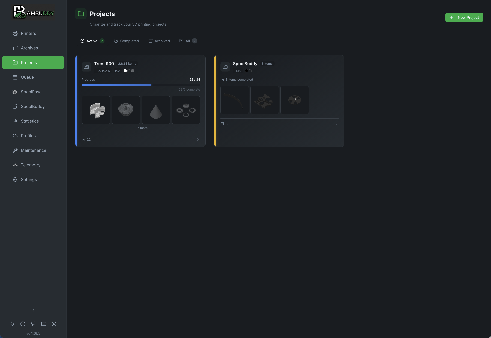
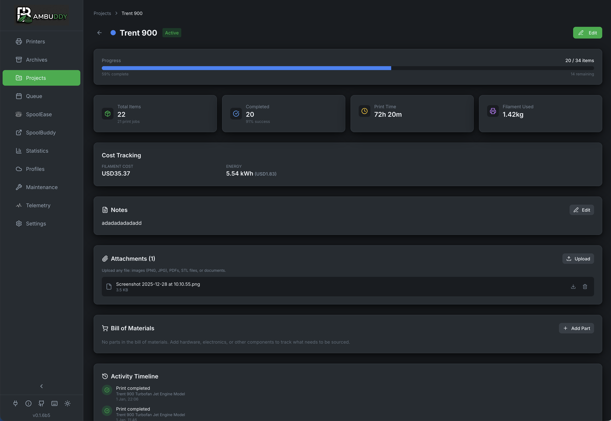

# Projects

Group related prints into projects to track multi-part builds, gift sets, or any collection of related prints.

{ .screenshot }

---

## :material-folder-multiple: What Are Projects?

Projects let you:

- **Group prints** - Organize related archives together
- **Track progress** - See completion status
- **Set targets** - Define how many items needed
- **Track quantities** - Count items per print for batch printing
- **Bill of materials** - Track sourced parts (screws, electronics)
- **File attachments** - Store documentation and references
- **Cost tracking** - Budget and expense tracking
- **Color code** - Visual identification
- **Add notes** - Document the project

### Use Cases

| Project | Description |
|---------|-------------|
| **Voron Build** | All parts for a Voron printer |
| **Gift Set** | Prints for a birthday gift |
| **Home Organizers** | Kitchen and bathroom organizers |
| **Prototypes** | Iterations of a design |
| **Commission** | Client order tracking |

---

## :material-plus-circle: Creating a Project

1. Go to the **Projects** page
2. Click **New Project**
3. Fill in the details:

| Field | Description |
|-------|-------------|
| **Name** | Project name (required) |
| **Description** | What the project is for |
| **Color** | Badge color for identification |
| **Target Count** | Number of prints needed |

4. Click **Create**

---

## :material-folder-arrow-down: Adding Archives to Projects

### From Archive Card

1. Right-click an archive card
2. Select **Add to Project**
3. Choose the project
4. Archive is linked

### From Archive Details

1. Open an archive
2. Click the **Project** dropdown
3. Select a project
4. Changes save automatically

### Bulk Assignment

1. Select multiple archives (Shift+click or Ctrl+click)
2. Right-click the selection
3. Choose **Add to Project**
4. All selected archives are assigned

---

## :material-progress-check: Progress Tracking

Track how close you are to completing a project:

### Progress Bar

```
[██████████░░░░░░░░░░] 50%
5 of 10 items completed
```

### Progress States

| State | Description |
|:-----:|-------------|
| :material-circle-outline: | Not started (0%) |
| :material-circle-half-full: | In progress |
| :material-check-circle:{ style="color: #4caf50" } | Complete (100%) |

### Target Count

Set a target to track completion:

- **Target: 10** with **5 completed** = **50%**
- Leave blank for no specific target

### Quantity Tracking

For batch printing (multiple copies in one print job):

1. Open the archive in edit mode
2. Set **Items Printed** to the number of copies
3. Project progress counts all items, not just print jobs

!!! example "Batch Print Example"
    If you print 10 copies of a bracket in one job:

    - Set **Items Printed** = 10
    - Project shows 10 items completed (not 1)
    - Progress: 10/50 = 20% (if target is 50)

---

## :material-palette: Color Coding

Each project has a color-coded badge:

### Available Colors

- :material-circle:{ style="color: #f44336" } Red
- :material-circle:{ style="color: #ff9800" } Orange
- :material-circle:{ style="color: #ffeb3b" } Yellow
- :material-circle:{ style="color: #4caf50" } Green
- :material-circle:{ style="color: #2196f3" } Blue
- :material-circle:{ style="color: #9c27b0" } Purple
- :material-circle:{ style="color: #607d8b" } Gray

### Badge Display

Project badges appear on:

- Archive cards
- Archive list view
- Project overview

---

## :material-view-dashboard: Project Cards

Each project displays as a card:

```
┌────────────────────────────────────────┐
│  [Color] Voron Build                   │
│                                        │
│  Building a Voron 2.4r2 printer       │
│                                        │
│  [████████████░░░░░░░░] 65%           │
│  13 of 20 items • 10 print jobs       │
│                                        │
│  Latest: stealthburner_main.3mf       │
└────────────────────────────────────────┘
```

### Card Information

- **Color badge** - Visual identification
- **Name** - Project title
- **Description** - What it's for
- **Progress** - Completion percentage
- **Count** - Total items / target (with print job count)
- **Latest** - Most recent print added

---

## :material-pencil: Editing Projects

1. Click the **edit** icon on a project card
2. Modify any field
3. Click **Save**

### Editable Fields

- Name
- Description
- Color
- Target count

---

## :material-filter: Filtering by Project

Filter archives to show only those in a project:

1. Go to **Archives** page
2. Click the **Project** filter
3. Select a project
4. Only linked archives are shown

---

## :material-delete: Deleting Projects

Deleting a project:

1. Click the **delete** icon on a project card
2. Confirm deletion

!!! note "Archives Preserved"
    Deleting a project does NOT delete the archives. They remain in your archive but are no longer linked to a project.

---

## :material-archive-arrow-up: Project Archives View

Click a project card to see all its archives:

{ .screenshot }

- Grid view of all linked prints
- Same filtering and sorting as main Archives
- Quick access to add more prints

---

## :material-clipboard-list: Bill of Materials

Track non-printed parts needed for your project (screws, electronics, hardware):

### Adding BOM Items

1. Open a project
2. Scroll to **Bill of Materials**
3. Click **Add Item**
4. Fill in the details:

| Field | Description |
|-------|-------------|
| **Name** | Part name (e.g., "M3x8 SHCS") |
| **Quantity** | How many needed |
| **Unit Price** | Cost per item |
| **Sourcing URL** | Where to buy |
| **Remarks** | Additional notes |

### Tracking Acquisition

- Check the box when a part is acquired
- Progress bar shows acquired/total items
- Use **Hide done** to focus on remaining items

---

## :material-paperclip: File Attachments

Attach reference files to your project:

### Supported File Types

| Category | Extensions |
|----------|------------|
| **Images** | JPG, PNG, GIF, WebP, SVG |
| **Documents** | PDF, DOC, DOCX, TXT, MD |
| **3D Files** | STL, OBJ, 3MF, STEP, F3D, SCAD |
| **Archives** | ZIP, RAR, 7Z, TAR, GZ |
| **Scripts/Configs** | PY, SH, CFG, GCODE, INI |
| **Data** | JSON, XML, YAML |

### Uploading Files

1. Open a project
2. Scroll to **Attachments**
3. Click **Upload** or drag and drop
4. Files are stored with the project

---

## :material-currency-usd: Cost Tracking

Track project expenses:

### Cost Categories

- **Parts cost** - Sum of BOM item prices
- **Additional costs** - Manual entries for other expenses

### Currency

Uses your configured currency from Settings → General.

---

## :material-lightbulb: Project Ideas

!!! tip "Multi-Part Prints"
    Create a project for complex models that print in multiple pieces. Track which parts are done.

!!! tip "Gift Planning"
    Start a project before a birthday or holiday. Add prints as you complete them.

!!! tip "Printer Builds"
    Building a Voron, Trident, or other kit? Track every printed part.

!!! tip "Iterative Design"
    Group prototypes of the same design to see your progression.

!!! tip "Client Orders"
    Track prints for commission work or client requests.
