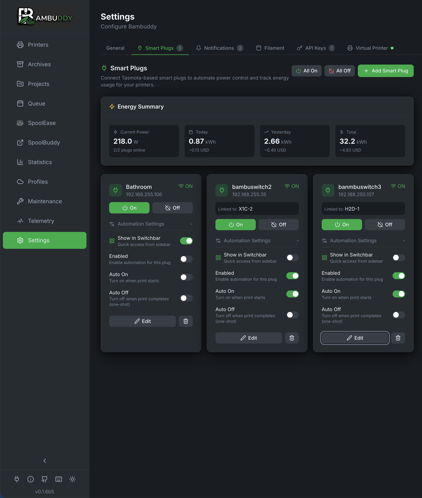
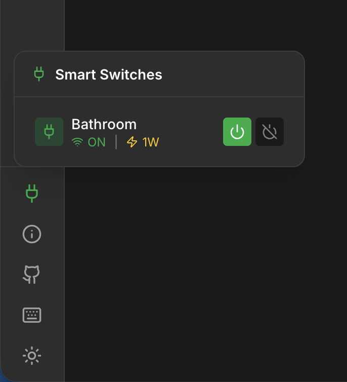

# Smart Plugs

Control your printers with Tasmota or Home Assistant smart plugs, or monitor energy with MQTT devices for power monitoring, automation, and energy tracking.

{ .screenshot }

---

## :material-power-plug: Overview

Smart plug integration enables:

- **Power control** - Turn printers on/off remotely
- **Energy monitoring** - Track power consumption
- **Auto power-on** - Start printer before scheduled prints
- **Auto power-off** - Shut down after cooldown
- **Automation** - Hands-free print scheduling

---

## :material-cog: Requirements

Bambuddy supports two types of smart plug integrations:

### Option 1: Tasmota

Direct control of Tasmota-flashed smart plugs:

| Feature | Required? |
|---------|:---------:|
| Tasmota firmware | :material-check: Yes |
| Power monitoring | Recommended |
| HTTP API access | :material-check: Yes |

**Popular Options:**

- **Sonoff S31** - Compact, power monitoring
- **Gosund SP111** - Affordable, power monitoring
- **Athom Plugs** - Pre-flashed with Tasmota
- **Shelly Plug S** - High quality, Tasmota compatible

!!! tip "Pre-flashed Plugs"
    Buy plugs pre-flashed with Tasmota to avoid the flashing process. Athom and some others sell them ready to use.

### Option 2: Home Assistant

Control any switch/light entity through Home Assistant:

| Feature | Required? |
|---------|:---------:|
| Home Assistant instance | :material-check: Yes |
| Long-Lived Access Token | :material-check: Yes |
| Network access to HA | :material-check: Yes |

**Supports:**

- **Zigbee** - Plugs via ZHA or Zigbee2MQTT
- **Z-Wave** - Plugs via Z-Wave JS
- **Matter** - Matter-compatible devices
- **WiFi** - Any WiFi plug integrated with HA
- **ESPHome** - Custom ESP-based devices

!!! tip "Flexible Integration"
    Home Assistant integration lets you use any device HA supports, including cloud-connected plugs that don't have local APIs.

#### HA Scripts for Multi-Device Control

Want to control multiple devices together (e.g., printer + enclosure fan)? Use Home Assistant scripts:

1. Create a script in HA that turns on/off multiple devices
2. Add the script entity (e.g., `script.turn_on_printer_setup`) as a smart plug in Bambuddy
3. Link it to a printer
4. Configure automation triggers (optional)
5. When triggered, the script executes your automation

**Script Automation Options:**

| Option | Description |
|--------|-------------|
| **Run when printer turns on** | Automatically execute script when the main power plug is switched on |
| **Run when printer turns off** | Automatically execute script when the main power plug is switched off |
| **Show on Printer Card** | Display a quick-run button on the printer card |

Scripts appear in a dedicated row on printer cards with "Run" buttons for quick access.

!!! example "Use Case: Enclosure Fan"
    Create two HA scripts: one to turn on printer + fan, another to turn off both. Link them to your printer with "Run when printer turns on/off" enabled. Now when you control the main plug, both devices respond automatically.

!!! note "Script Behavior"
    Scripts can only be triggered ("Run"), not toggled on/off like regular plugs. They execute once when triggered and complete immediately.

### Option 3: MQTT (Monitor-Only)

Subscribe to MQTT topics for energy monitoring from any MQTT-enabled device:

| Feature | Required? |
|---------|:---------:|
| MQTT broker | :material-check: Yes |
| Device publishing JSON data | :material-check: Yes |
| Control capability | :material-close: No (monitor-only) |

**Supports:**

- **Zigbee2MQTT** - Any Zigbee energy monitor
- **Shelly** - Via native MQTT or Zigbee2MQTT
- **Tasmota Discovery** - Subscribe to Tasmota sensor topics
- **ESPHome** - ESP devices publishing to MQTT
- **Any MQTT source** - Any device publishing JSON with power data

!!! note "Monitor-Only"
    MQTT plugs are **monitor-only** for energy tracking. They cannot be turned on/off through Bambuddy. Use your MQTT broker, Home Assistant, or other automation to control them.

---

## :material-plus-circle: Adding a Smart Plug

### Adding a Tasmota Plug

#### Automatic Discovery

The easiest way to add Tasmota plugs is with automatic discovery:

1. Go to **Settings** > **Smart Plugs**
2. Click **Add Smart Plug**
3. Select the **Tasmota** tab
4. Click **Discover Tasmota Devices**
5. Wait for the network scan to complete
6. Click on a discovered device to select it
7. Fill in remaining details and **Save**

!!! tip "Network Auto-Detection"
    Bambuddy automatically detects your local network and scans all 254 addresses. Works with password-protected devices too!

#### Manual Entry

If discovery doesn't find your plug:

1. Go to **Settings** > **Smart Plugs**
2. Click **Add Smart Plug**
3. Select the **Tasmota** tab
4. Enter configuration:

| Field | Description |
|-------|-------------|
| **Name** | Friendly name |
| **IP Address** | Plug's network IP |
| **Printer** | Associated printer |

5. Click **Save**
6. Click **Test** to verify connection

### Adding a Home Assistant Plug

#### Initial Setup (One-Time)

Before adding HA plugs, configure the connection:

1. Go to **Settings** > **Network**
2. Find the **Home Assistant** section
3. Enter your Home Assistant URL (e.g., `http://192.168.1.100:8123`)
4. Enter your Long-Lived Access Token
5. Click **Test Connection** to verify
6. Enable **Enable Home Assistant** toggle

!!! info "Creating an Access Token"
    In Home Assistant: Profile > Long-Lived Access Tokens > Create Token. Copy the token immediately - it won't be shown again!

#### Adding the Plug

1. Go to **Settings** > **Smart Plugs**
2. Click **Add Smart Plug**
3. Select the **Home Assistant** tab
4. Select an entity from the dropdown (shows all switch/light/input_boolean entities)
5. Enter a friendly name
6. Select the associated printer
7. **(Optional)** Configure energy sensor entities (see below)
8. Click **Save**

!!! tip "Entity Selection"
    The dropdown shows the entity's friendly name and current state. Already-configured entities are filtered out.

### Adding an MQTT Plug

MQTT plugs subscribe to topics and extract power/energy data from JSON payloads. Each data type (power, energy, state) can use a **different MQTT topic** with its own settings.

#### Prerequisites

Configure your MQTT broker in **Settings** > **Network** (same broker used for MQTT Publishing).

#### Adding the Plug

1. Go to **Settings** > **Smart Plugs**
2. Click **Add Smart Plug**
3. Select the **MQTT** tab
4. Configure each data source:

**Power Monitoring:**

| Field | Description | Example |
|-------|-------------|---------|
| **Topic** | MQTT topic for power data | `zigbee2mqtt/shelly/power` |
| **JSON Path** | Path to power value in JSON | `power_l1` or `data.power` |
| **Multiplier** | Unit conversion | `1.0` or `0.001` for mW→W |

**Energy Monitoring (Optional):**

| Field | Description | Example |
|-------|-------------|---------|
| **Topic** | MQTT topic for energy data | `zigbee2mqtt/shelly/energy` |
| **JSON Path** | Path to energy value in JSON | `energy_l1` |
| **Multiplier** | Unit conversion | `1.0` or `0.001` for Wh→kWh |

**State Monitoring (Optional):**

| Field | Description | Example |
|-------|-------------|---------|
| **Topic** | MQTT topic for state data | `zigbee2mqtt/shelly/state` |
| **JSON Path** | Path to on/off state in JSON | `state_l1` |
| **ON Value** | What value means "ON" | `ON`, `true`, `1` (auto-detected if empty) |

5. Click **Save**

!!! info "Separate Topics"
    Each data type can subscribe to a **different MQTT topic**. This is useful when your device publishes power, energy, and state to separate topics.

!!! example "Same Topic Example"
    If your device publishes everything to one topic:

    - Power Topic: `zigbee2mqtt/shelly-working-room`
    - Power Path: `power_l1`
    - Energy Topic: `zigbee2mqtt/shelly-working-room`
    - Energy Path: `energy_l1`

!!! example "Separate Topics Example"
    If your device publishes to different topics:

    - Power Topic: `sensors/power/shelly`
    - Power Path: `value`
    - Energy Topic: `sensors/energy/shelly`
    - Energy Path: `total_kwh`

!!! example "JSON Path Examples"
    For JSON `{"power_l1": 150, "energy_l1": 2.5}`:

    - Power path: `power_l1`
    - Energy path: `energy_l1`

    For nested JSON `{"data": {"power": 150}}`:

    - Power path: `data.power`

!!! tip "Finding Your Topic"
    Use an MQTT client like MQTT Explorer to browse your broker and find the topic your device publishes to.

!!! tip "Custom ON Value"
    Some devices report state as `true`/`false` instead of `ON`/`OFF`. Set the **ON Value** to match your device (e.g., `true`, `1`, `on`). Leave empty for auto-detection of common values.

#### Energy Sensor Configuration

Many Home Assistant smart plugs expose energy data as **separate sensor entities** rather than as attributes on the switch entity. Common examples include:

- **Tapo P110M** - `sensor.tapo_power`, `sensor.tapo_today_energy`, `sensor.tapo_total_energy`
- **IKEA plugs via Zigbee2mqtt** - `sensor.ikea_plug_power`, `sensor.ikea_plug_energy`
- **Shelly plugs** - `sensor.shelly_power`, `sensor.shelly_energy`

To enable energy tracking for these plugs:

1. After selecting the switch entity, expand **Energy Monitoring (Optional)**
2. Select the appropriate sensor for each field:
   - **Power Sensor (W)** - Current power consumption
   - **Energy Today (kWh)** - Today's energy usage
   - **Total Energy (kWh)** - Lifetime energy usage (used for per-print tracking)

!!! info "Sensor Selection"
    The dropdowns show all HA sensors with power/energy units (W, kW, kWh, Wh). You can select sensors from any device - they don't need to match the switch entity.

!!! tip "Per-Print Energy Tracking"
    The **Total Energy** sensor is required for per-print energy tracking. Bambuddy records the total at print start and end to calculate energy used.

---

## :material-view-grid: Switchbar Quick Access

Add frequently-used plugs to the sidebar for quick access:

{ .screenshot style="max-width: 300px" }

1. In **Settings** > **Smart Plugs**, expand a plug's settings
2. Enable **Show in Switchbar**
3. A plug icon appears in the sidebar footer
4. Hover to see status and control all switchbar plugs

The switchbar shows:

- Current power state (ON/OFF)
- Power consumption (if available)
- Quick on/off toggle buttons

!!! tip "Multiple Plugs"
    Add multiple plugs to the switchbar for one-click access to your entire printer farm.

---

## :material-open-in-new: Admin Link (Tasmota Only)

Each Tasmota smart plug card includes a direct link to the Tasmota web interface:

1. Click the **Admin** link on the plug card
2. Opens Tasmota interface in a new tab
3. Auto-login if username/password configured in Bambuddy

!!! tip "Quick Configuration"
    Use the admin link for quick access to Tasmota settings like power reporting, schedules, and firmware updates.

!!! note "Home Assistant Plugs"
    HA plugs don't have an admin link. Manage them through your Home Assistant dashboard.

---

## :material-lan: Finding Plug IP Address (Tasmota Only)

### From Tasmota Interface

1. Access your plug's web interface
2. Go to **Information**
3. Note the **IP Address**

### From Router

1. Log into your router
2. Find connected devices
3. Locate the plug by name or MAC

### Static IP (Recommended)

Assign a static IP to prevent changes:

=== "In Tasmota"

    1. Go to plug web interface
    2. **Configuration** > **Configure WiFi**
    3. Enter static IP settings

=== "In Router"

    Create a DHCP reservation for the plug's MAC address.

---

## :material-power: Power Control

### Manual Control

Toggle power from Bambuddy:

1. Go to printer card
2. Click the power icon :material-power:
3. Select **On** or **Off**

Or from Settings > Smart Plugs:

- Click the power toggle for any plug

### Power Status

| Icon | Status |
|:----:|--------|
| :material-power:{ style="color: #4caf50" } | On |
| :material-power:{ style="color: #9e9e9e" } | Off |
| :material-power:{ style="color: #f44336" } | Unreachable |

---

## :material-robot: Automation

### Auto Power On

Automatically turn on printer before prints:

1. Enable **Auto Power On** for the plug
2. When a queued print is ready:
   - Bambuddy turns on the plug
   - Waits for printer to boot
   - Starts the print

### Auto Power Off

Automatically turn off after prints:

1. Enable **Auto Power Off** for the plug
2. Set **Cooldown Temperature** (e.g., 40°C)
3. Set **Cooldown Time** (e.g., 5 minutes)
4. After print completes:
   - Wait for bed to cool below threshold
   - Wait additional cooldown time
   - Turn off the plug

### Safety Checks

Auto power-off includes safety checks:

- :material-check: Only triggers after successful prints
- :material-check: Waits for cooldown
- :material-check: Checks for queued prints
- :material-check: Verifies printer is idle

---

## :material-lightning-bolt: Energy Monitoring

Track power consumption:

### Real-time Data

| Metric | Description |
|--------|-------------|
| **Power (W)** | Current draw |
| **Voltage (V)** | Line voltage |
| **Current (A)** | Amperage |
| **Energy (kWh)** | Cumulative |

### Per-Print Tracking

Enable energy tracking to record:

- Energy per print
- Electricity costs
- Efficiency comparisons

[:material-arrow-right: Energy Tracking](energy.md)

---

## :material-chart-line: Power Dashboard

View power statistics:

- Current power draw
- Energy over time
- Cost calculations
- Peak usage

---

## :material-console: Tasmota Commands (Technical Reference)

Bambuddy uses these Tasmota HTTP commands for direct Tasmota integration:

| Action | Command |
|--------|---------|
| Turn On | `http://{ip}/cm?cmnd=Power%20On` |
| Turn Off | `http://{ip}/cm?cmnd=Power%20Off` |
| Status | `http://{ip}/cm?cmnd=Status%200` |
| Energy | `http://{ip}/cm?cmnd=Status%208` |

### Testing Manually

```bash
# Turn on
curl "http://192.168.1.100/cm?cmnd=Power%20On"

# Get status
curl "http://192.168.1.100/cm?cmnd=Status%200"
```

---

## :material-shield-alert: Safety Considerations

### Don't Cut Power Mid-Print

Auto power-off is safe because:

- Only triggers after print completion
- Waits for cooldown
- Checks printer state

**Never** manually power off during printing!

### Surge Protection

Consider adding surge protection:

- Protects printer electronics
- Protects smart plug
- Especially important for unstable power

### Fire Safety

Smart plugs have current limits:

- Most handle 10-15A
- 3D printers typically draw 3-8A
- Check your plug's rating

---

## :material-help-circle: Troubleshooting

### Tasmota: Plug Not Responding

1. Check plug is powered
2. Verify IP address is correct
3. Ensure plug is on same network
4. Check if Tasmota web interface loads
5. Verify no firewall blocking

### Home Assistant: Plug Shows Offline

1. Check HA connection in Settings > Network
2. Click **Test Connection** to verify
3. Ensure the access token hasn't expired
4. Verify HA is reachable from Bambuddy's network
5. Check if entity exists in HA

### Home Assistant: Entities Not Loading

1. Verify HA URL is correct (include port if needed)
2. Check access token has correct permissions
3. Try regenerating the access token
4. Ensure HA integration is enabled

### Auto Power-Off Not Working

1. Check feature is enabled
2. Verify cooldown settings
3. Ensure print completed successfully
4. Check for queued prints (won't power off if more queued)

### Power Data Incorrect

1. Not all plugs have power monitoring
2. For Tasmota: Calibrate in **Configuration** > **Configure Other**
3. For HA: Check if entity has power attributes or configure separate energy sensors
4. Check plug specifications

### Home Assistant: No Energy Data

Many HA plugs expose energy data as separate sensor entities, not as switch attributes:

1. When adding/editing the plug, expand **Energy Monitoring (Optional)**
2. Select the appropriate power sensor (W)
3. Select energy today and total sensors (kWh) if available
4. The sensors should appear in the dropdown if they have power/energy units

---

## :material-lightbulb: Tips

!!! tip "Start Simple"
    Start with manual power control before enabling automation.

!!! tip "Test Cooldown"
    Monitor a few prints to find the right cooldown temperature for your printer.

!!! tip "Label Plugs"
    If you have multiple plugs, label them physically to match Bambuddy names.

!!! tip "Dedicated Circuit"
    If possible, put printers on a dedicated circuit to avoid tripping breakers.

!!! tip "Energy Baseline"
    Track energy for a week to establish your typical consumption baseline.
