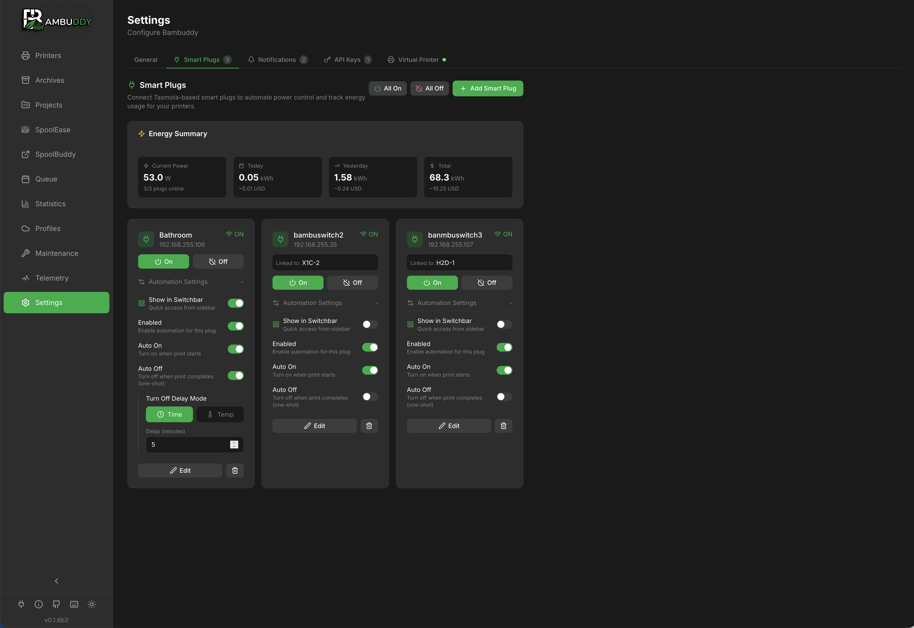

# Smart Plugs

Control your printers with Tasmota-based smart plugs for power monitoring, automation, and energy tracking.

{ .screenshot }

---

## :material-power-plug: Overview

Smart plug integration enables:

- **Power control** - Turn printers on/off remotely
- **Energy monitoring** - Track power consumption
- **Auto power-on** - Start printer before scheduled prints
- **Auto power-off** - Shut down after cooldown
- **Automation** - Hands-free print scheduling

---

## :material-cog: Requirements

### Supported Plugs

Bambuddy supports **Tasmota**-flashed smart plugs:

| Feature | Required? |
|---------|:---------:|
| Tasmota firmware | :material-check: Yes |
| Power monitoring | Recommended |
| HTTP API access | :material-check: Yes |

### Popular Options

- **Sonoff S31** - Compact, power monitoring
- **Gosund SP111** - Affordable, power monitoring
- **Athom Plugs** - Pre-flashed with Tasmota
- **Shelly Plug S** - High quality, Tasmota compatible

!!! tip "Pre-flashed Plugs"
    Buy plugs pre-flashed with Tasmota to avoid the flashing process. Athom and some others sell them ready to use.

---

## :material-plus-circle: Adding a Smart Plug

### Automatic Discovery

The easiest way to add plugs is with automatic discovery:

1. Go to **Settings** > **Smart Plugs**
2. Click **Add Smart Plug**
3. Click **Discover Tasmota Devices**
4. Wait for the network scan to complete
5. Click on a discovered device to select it
6. Fill in remaining details and **Save**

!!! tip "Network Auto-Detection"
    Bambuddy automatically detects your local network and scans all 254 addresses. Works with password-protected devices too!

### Manual Entry

If discovery doesn't find your plug:

1. Go to **Settings** > **Smart Plugs**
2. Click **Add Smart Plug**
3. Enter configuration:

| Field | Description |
|-------|-------------|
| **Name** | Friendly name |
| **IP Address** | Plug's network IP |
| **Printer** | Associated printer |

4. Click **Save**
5. Click **Test** to verify connection

---

## :material-view-grid: Switchbar Quick Access

Add frequently-used plugs to the sidebar for quick access:

1. In **Settings** > **Smart Plugs**, expand a plug's settings
2. Enable **Show in Switchbar**
3. A plug icon appears in the sidebar footer
4. Hover to see status and control all switchbar plugs

The switchbar shows:

- Current power state (ON/OFF)
- Power consumption (if available)
- Quick on/off toggle buttons

!!! tip "Multiple Plugs"
    Add multiple plugs to the switchbar for one-click access to your entire printer farm.

---

## :material-lan: Finding Plug IP Address

### From Tasmota Interface

1. Access your plug's web interface
2. Go to **Information**
3. Note the **IP Address**

### From Router

1. Log into your router
2. Find connected devices
3. Locate the plug by name or MAC

### Static IP (Recommended)

Assign a static IP to prevent changes:

=== "In Tasmota"

    1. Go to plug web interface
    2. **Configuration** > **Configure WiFi**
    3. Enter static IP settings

=== "In Router"

    Create a DHCP reservation for the plug's MAC address.

---

## :material-power: Power Control

### Manual Control

Toggle power from Bambuddy:

1. Go to printer card
2. Click the power icon :material-power:
3. Select **On** or **Off**

Or from Settings > Smart Plugs:

- Click the power toggle for any plug

### Power Status

| Icon | Status |
|:----:|--------|
| :material-power:{ style="color: #4caf50" } | On |
| :material-power:{ style="color: #9e9e9e" } | Off |
| :material-power:{ style="color: #f44336" } | Unreachable |

---

## :material-robot: Automation

### Auto Power On

Automatically turn on printer before prints:

1. Enable **Auto Power On** for the plug
2. When a queued print is ready:
   - Bambuddy turns on the plug
   - Waits for printer to boot
   - Starts the print

### Auto Power Off

Automatically turn off after prints:

1. Enable **Auto Power Off** for the plug
2. Set **Cooldown Temperature** (e.g., 40°C)
3. Set **Cooldown Time** (e.g., 5 minutes)
4. After print completes:
   - Wait for bed to cool below threshold
   - Wait additional cooldown time
   - Turn off the plug

### Safety Checks

Auto power-off includes safety checks:

- :material-check: Only triggers after successful prints
- :material-check: Waits for cooldown
- :material-check: Checks for queued prints
- :material-check: Verifies printer is idle

---

## :material-lightning-bolt: Energy Monitoring

Track power consumption:

### Real-time Data

| Metric | Description |
|--------|-------------|
| **Power (W)** | Current draw |
| **Voltage (V)** | Line voltage |
| **Current (A)** | Amperage |
| **Energy (kWh)** | Cumulative |

### Per-Print Tracking

Enable energy tracking to record:

- Energy per print
- Electricity costs
- Efficiency comparisons

[:material-arrow-right: Energy Tracking](energy.md)

---

## :material-chart-line: Power Dashboard

View power statistics:

- Current power draw
- Energy over time
- Cost calculations
- Peak usage

---

## :material-console: Tasmota Commands

Bambuddy uses these Tasmota HTTP commands:

| Action | Command |
|--------|---------|
| Turn On | `http://{ip}/cm?cmnd=Power%20On` |
| Turn Off | `http://{ip}/cm?cmnd=Power%20Off` |
| Status | `http://{ip}/cm?cmnd=Status%200` |
| Energy | `http://{ip}/cm?cmnd=Status%208` |

### Testing Manually

```bash
# Turn on
curl "http://192.168.1.100/cm?cmnd=Power%20On"

# Get status
curl "http://192.168.1.100/cm?cmnd=Status%200"
```

---

## :material-shield-alert: Safety Considerations

### Don't Cut Power Mid-Print

Auto power-off is safe because:

- Only triggers after print completion
- Waits for cooldown
- Checks printer state

**Never** manually power off during printing!

### Surge Protection

Consider adding surge protection:

- Protects printer electronics
- Protects smart plug
- Especially important for unstable power

### Fire Safety

Smart plugs have current limits:

- Most handle 10-15A
- 3D printers typically draw 3-8A
- Check your plug's rating

---

## :material-help-circle: Troubleshooting

### Plug Not Responding

1. Check plug is powered
2. Verify IP address is correct
3. Ensure plug is on same network
4. Check if Tasmota web interface loads
5. Verify no firewall blocking

### Auto Power-Off Not Working

1. Check feature is enabled
2. Verify cooldown settings
3. Ensure print completed successfully
4. Check for queued prints (won't power off if more queued)

### Power Data Incorrect

1. Not all plugs have power monitoring
2. Calibrate in Tasmota: **Configuration** > **Configure Other**
3. Check plug specifications

---

## :material-lightbulb: Tips

!!! tip "Start Simple"
    Start with manual power control before enabling automation.

!!! tip "Test Cooldown"
    Monitor a few prints to find the right cooldown temperature for your printer.

!!! tip "Label Plugs"
    If you have multiple plugs, label them physically to match Bambuddy names.

!!! tip "Dedicated Circuit"
    If possible, put printers on a dedicated circuit to avoid tripping breakers.

!!! tip "Energy Baseline"
    Track energy for a week to establish your typical consumption baseline.
