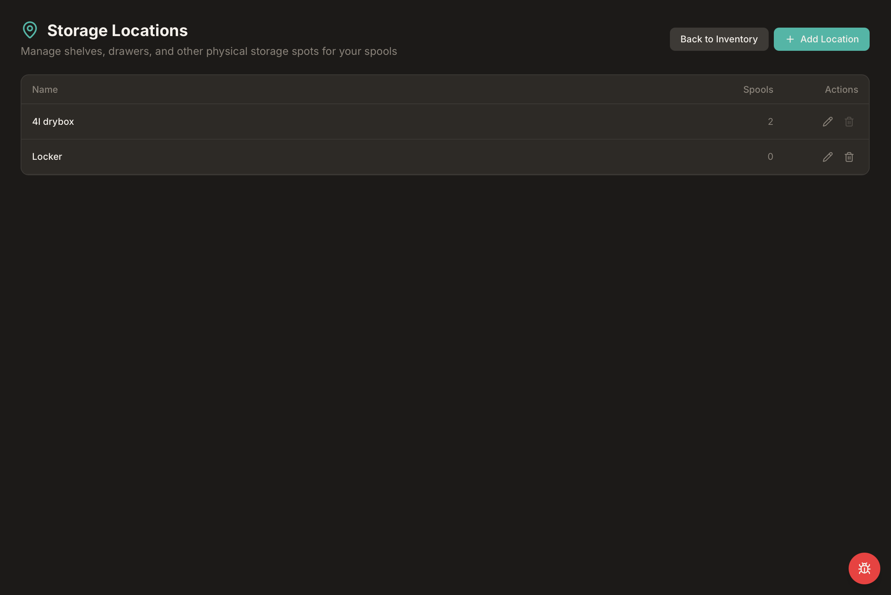
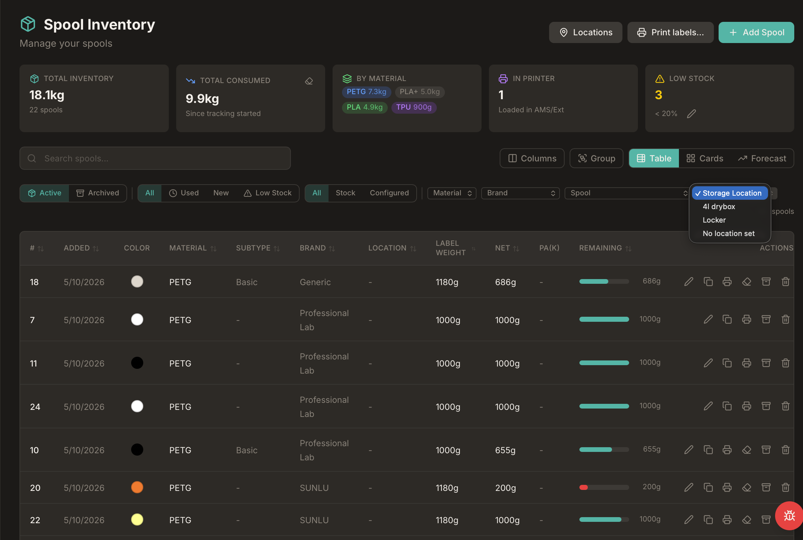
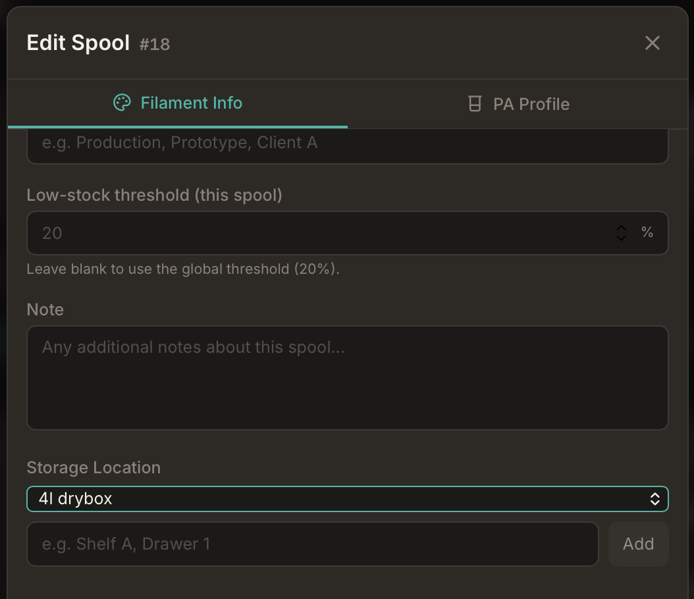

# Storage Locations

Use **Storage Locations** to name the physical places where spools live when they are not loaded in the AMS — shelves, drawers, dryboxes, and similar spots. Bambuddy keeps a catalog you can manage from **Inventory → Locations**, assign from the spool form, and filter on the inventory page.

[:material-arrow-right: Spool Inventory overview](inventory.md)

---

## :material-map-marker: Location vs Storage Location

Bambuddy uses two different "location" concepts:

| UI label | Meaning |
|----------|---------|
| **Location** (inventory table column) | AMS slot or printer assignment (e.g. `H2D-1 B4`) |
| **Storage Location** | Physical shelf, drawer, or drybox where the spool is stored when not in the AMS |
| **Locations page** | Catalog of named storage spots with spool counts |

The **Locations** page is only for physical storage. AMS/printer slot assignment is unchanged — see [AMS Slot Assignment](inventory.md#ams-slot-assignment) on the Spool Inventory page.

---

## :material-view-list: Locations Catalog

Open **Inventory → Locations** to view, add, rename, or delete storage spots.

{ .screenshot }

Each row shows:

- **Name** — the label you chose (e.g. `4l drybox`, `Locker`, `Shelf A`)
- **Spools** — how many active spools are assigned to that spot
- **Actions** — edit or delete the location

Click **+ Add Location** to create a new entry. Names must be unique (case-insensitive — `Shelf A` and `shelf a` count as the same name).

!!! tip "Filter inventory from a location"
    Click a location **name** in the table to jump to the inventory page filtered to spools stored there.

---

## :material-filter: Filter by Storage Location

On the **Spool Inventory** page, use the **Storage Location** filter chip to narrow the list to one shelf or drawer.

{ .screenshot }

The dropdown lists every location in your catalog, plus **No location set** for spools without an assignment. The chip stays hidden until at least one spool has a storage location, so fresh installs are not cluttered.

You can also deep-link directly, for example: `/inventory?location_id=2`.

---

## :material-pencil: Assign a Storage Location

When adding or editing a spool, open the **Additional** section and pick a **Storage Location** from the dropdown. You can also type a new name and click **Add** to create a location on the fly without leaving the form.

{ .screenshot }

!!! info "Labels and QR codes"
    The storage location name appears on box-label and Avery label templates (see [Printable Labels](inventory.md#printable-labels)). It is omitted from the compact AMS-holder template because of size limits.

---

## :material-database-sync: Upgrade from Free-Text Locations

If you already used the free-text **Storage Location** field before this feature, Bambuddy imports those values into the catalog automatically on upgrade. Duplicate names are merged case-insensitively, and existing spools are linked to the matching catalog entry.

You do not need to re-enter locations manually after updating.

---

## :material-database-sync-outline: Spoolman Integration

When [Spoolman](spoolman.md) is enabled, Bambuddy still keeps a local storage-location catalog in the native inventory UI:

- Assigning a storage location writes the location **name** to Spoolman's `location` field for that spool
- Listing locations can sync distinct names from Spoolman into the catalog
- Renaming a location in Bambuddy bulk-renames matching spools in Spoolman

!!! note "Two location fields in Spoolman"
    Spoolman's `location` field holds the **physical storage** name you set in Bambuddy. AMS slot strings (e.g. `Workshop X1C - AMS A Slot 1`) are managed separately by AMS sync — see [Spoolman Integration](spoolman.md#automatic-features).

---

## :material-lightbulb: Tips

!!! tip "Start with your real shelves"
    Add the places you actually use — `Drybox 1`, `Office shelf`, `Garage drawer` — then assign spools as you inventory them.

!!! tip "Find spools fast"
    Use the location filter before a print session to see everything stored in one drybox or drawer.

!!! tip "Keep names short"
    Shorter names fit better on printed labels and filter chips.
