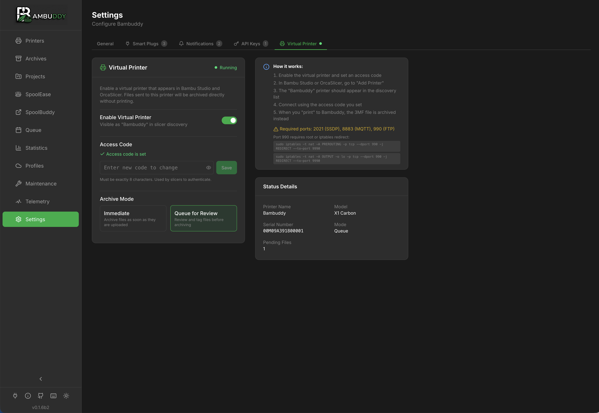

# Virtual Printer

The Virtual Printer feature allows Bambuddy to emulate a Bambu Lab printer on your network. This enables you to send prints directly from Bambu Studio or Orca Slicer to Bambuddy, even without a physical printer connected.

{ .screenshot }

## Overview

When enabled, Bambuddy creates a virtual printer that:

- Appears automatically in Bambu Studio/Orca Slicer via SSDP discovery
- Accepts print jobs over secure TLS/MQTT connections
- Can queue prints for later or auto-start them on a connected printer
- Works with the same workflow as sending to a real Bambu Lab printer

## Use Cases

- **Print Archiving**: Send prints to Bambuddy for archiving without starting them
- **Queue Building**: Build up a print queue before your printer is available
- **Print Farm Preparation**: Prepare jobs to distribute across multiple printers
- **Remote Slicing**: Slice on one computer and send to Bambuddy running elsewhere

## Configuration

### Enabling the Virtual Printer

1. Go to **Settings** in Bambuddy
2. Scroll to the **Virtual Printer** section
3. Toggle **Enable Virtual Printer** to on
4. Set your preferred **Access Code** (8 digits, like a real Bambu printer)
5. Choose a **Mode**:
   - **Queue**: Prints go to pending uploads for manual review
   - **Auto-start**: Prints automatically start on the default printer

### Settings

| Setting | Description |
|---------|-------------|
| **Enable Virtual Printer** | Turn the virtual printer on/off |
| **Access Code** | 8-digit code for authentication (like LAN mode access code) |
| **Mode** | Queue (pending uploads) or Auto-start (immediate print) |
| **Printer Name** | The name shown in slicer (defaults to "Bambuddy") |
| **Model** | The printer model to emulate (affects slicer compatibility) |

## Adding to Bambu Studio / Orca Slicer

### Automatic Discovery

1. Ensure the virtual printer is enabled in Bambuddy
2. In Bambu Studio/Orca Slicer, go to **Device** tab
3. Click **Refresh** or wait for discovery
4. The virtual printer "Bambuddy" should appear in the device list
5. Click to add it, entering the access code when prompted

### Manual Addition

If automatic discovery doesn't work (e.g., different subnets):

1. In Bambu Studio, go to **Device** → **Add Printer**
2. Select **Add printer by IP**
3. Enter the IP address of your Bambuddy server
4. Enter the access code
5. The printer will be added to your device list

## Sending Prints

Once added, sending prints works exactly like a real printer:

1. Slice your model in Bambu Studio/Orca Slicer
2. Click **Print** or **Send to Printer**
3. Select the Bambuddy virtual printer
4. Click **Send**

### Queue Mode

In queue mode, prints appear in the **Pending Uploads** panel:

- Review the print details and thumbnail
- Send to any connected printer
- Delete unwanted prints
- Prints are archived automatically

### Auto-Start Mode

In auto-start mode:

- Prints are immediately sent to your default printer
- The print starts automatically if the printer is ready
- You can still cancel from the printer or Bambuddy

## Docker Configuration

The virtual printer requires direct network access for SSDP discovery. When running in Docker:

### Required: Host Network Mode

```yaml
services:
  bambuddy:
    build: .
    network_mode: host  # Required for virtual printer
    volumes:
      - bambuddy_data:/app/data
      - bambuddy_logs:/app/logs
      - bambuddy_vprinter:/app/virtual_printer  # Persist certificates
```

### Certificate Persistence

The virtual printer generates TLS certificates on first start. For the slicer to maintain trust across container rebuilds, mount the virtual_printer directory:

```yaml
volumes:
  bambuddy_data:
  bambuddy_logs:
  bambuddy_vprinter:  # Keeps certificates across rebuilds
```

!!! warning "Certificate Changes"
    If certificates are regenerated (new container without volume), you'll need to remove and re-add the printer in your slicer.

## Troubleshooting

### Printer Not Appearing in Slicer

1. **Check virtual printer is enabled** in Bambuddy settings
2. **Verify network connectivity** - slicer and Bambuddy must be on the same network
3. **Check firewall rules** - ports 1990 (SSDP), 8883 (MQTT), and 9990 (FTPS) must be open
4. **Try manual addition** using the IP address

### Connection Refused / Error -1

1. **Verify access code** matches in both Bambuddy and slicer
2. **Check certificate trust** - remove and re-add the printer in slicer
3. **Docker users**: Ensure `network_mode: host` is set

### Authentication Failed

1. The access code in slicer must match Bambuddy settings
2. Try removing the printer from slicer and re-adding it
3. Check Bambuddy logs for authentication errors

### Prints Not Appearing

1. **Queue mode**: Check the Pending Uploads panel
2. **Auto-start mode**: Check if the default printer is configured and online
3. Review Bambuddy logs for any upload errors

## Technical Details

### Protocols Used

| Protocol | Port | Purpose |
|----------|------|---------|
| SSDP | 1990 (UDP) | Printer discovery |
| MQTT/TLS | 8883 | Command and status communication |
| FTPS | 9990 | File transfer (3MF uploads) |

### Security

- All connections use TLS 1.3 encryption
- Self-signed certificates are auto-generated
- Access code authentication required for all connections
- Certificates are stored in `virtual_printer/certs/`

### Limitations

- Only one virtual printer instance per Bambuddy installation
- Requires `network_mode: host` in Docker for discovery
- Slicer must trust the self-signed certificate (added on first connection)
