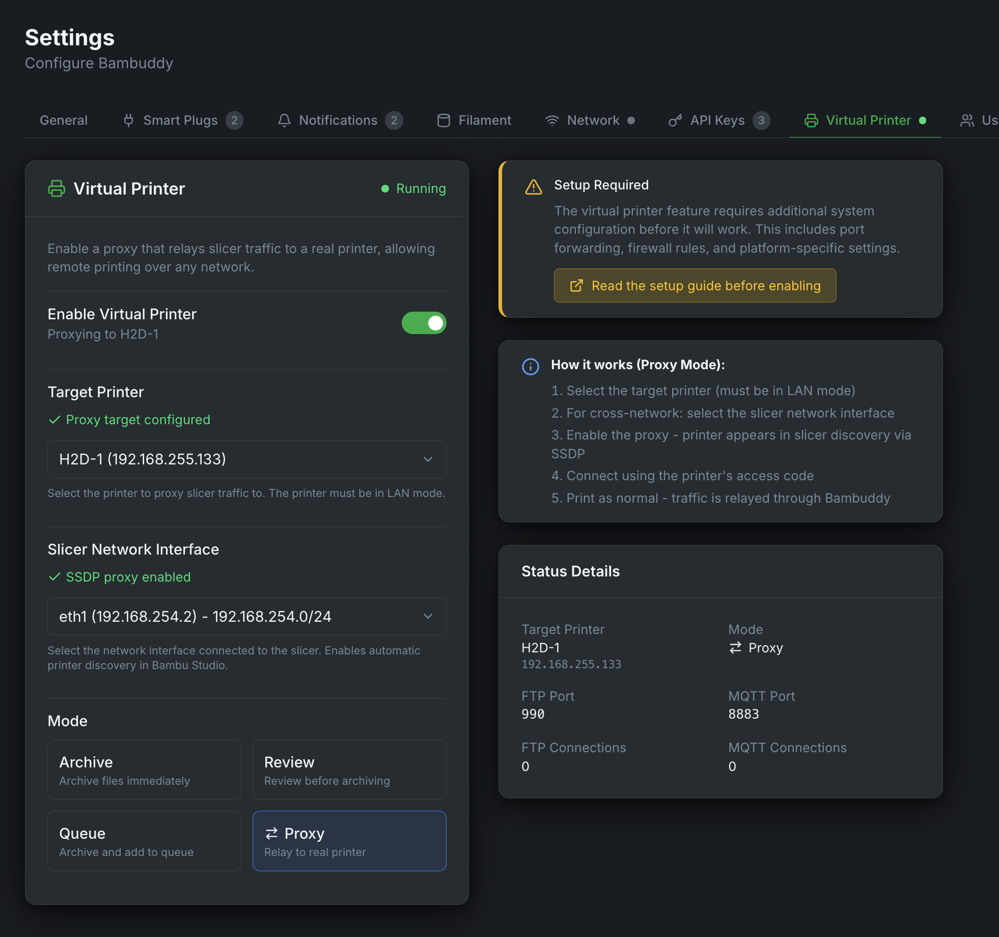
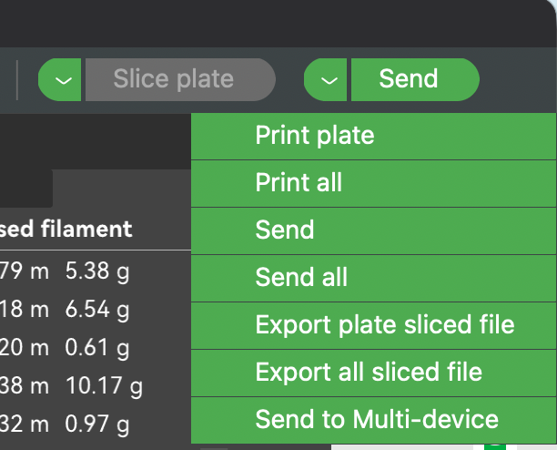
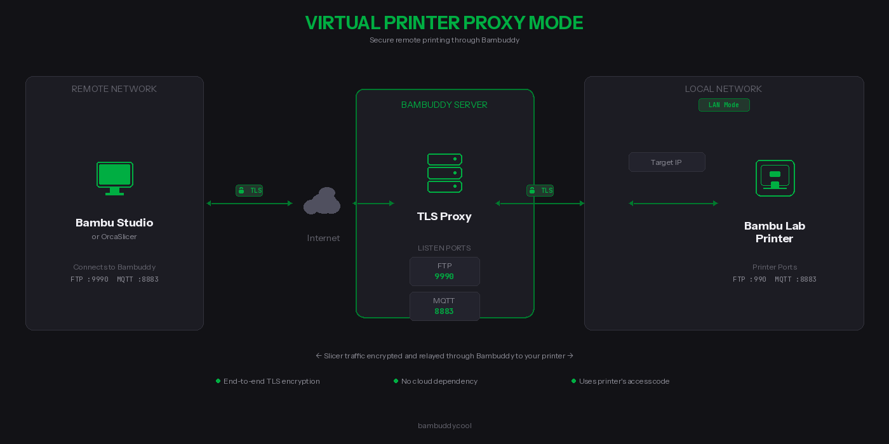

# Virtual Printer

> Send prints to Bambuddy directly from Bambu Studio or OrcaSlicer — even when your real printer is busy, offline, or doesn't exist yet.

<div class="grid cards" markdown>

-   :material-archive: **Print Archiving**

    Send prints to Bambuddy for archiving without starting them.

-   :material-playlist-plus: **Queue Building**

    Build up a print queue before your printer is available.

-   :material-printer-3d: **Print Farm Prep**

    Prepare jobs to distribute across multiple printers.

-   :material-wan: **Remote Slicing**

    Slice on one computer, send to Bambuddy running elsewhere.

-   :material-cloud-print: **Remote Printing**

    Print from anywhere via Proxy Mode.

</div>

[Install Bambuddy :material-arrow-right:](../getting-started/installation.md){ .md-button .md-button--primary }
[How it works :material-arrow-down:](#overview){ .md-button }

{ .screenshot }

## Overview

The Virtual Printer feature allows Bambuddy to emulate one or more Bambu Lab printers on your network. This enables you to send prints directly from Bambu Studio or OrcaSlicer to Bambuddy, even without a physical printer connected.

You can create **multiple virtual printers**, each with its own dedicated IP address, mode, printer model, and access code. Each virtual printer runs completely independent services (FTP, MQTT, SSDP, Bind).

When enabled, each virtual printer:

- Can be discovered automatically via SSDP (same LAN) or added manually by IP (VPN, remote, Docker bridge)
- Accepts print jobs over secure TLS connections (MQTT + FTP)
- Archives prints directly, queues them for review, or adds them to the print queue
- Works with the same workflow as sending to a real Bambu Lab printer
- Runs on its own dedicated bind IP with independent services

## Modes

The virtual printer supports four modes:

| Mode | Description |
|------|-------------|
| **Immediate** | Files are archived automatically when received |
| **Review** | Files go to pending uploads for manual review before archiving |
| **Print Queue** | Files are archived AND added to the print queue (unassigned). An **Auto-dispatch** toggle controls whether incoming prints start automatically (enabled by default) or require manual dispatch. |
| **Proxy** | Forwards traffic directly to a real printer (remote printing) |

The first three are **server modes** — Bambuddy runs its own FTP/MQTT servers and receives files locally. **Proxy mode** is different — Bambuddy uses transparent TCP proxying to forward traffic to a real printer, with end-to-end TLS between the slicer and printer for most protocols.

!!! warning "Server modes don't show AMS data in the slicer — and that's intentional"
    A virtual printer in Immediate / Review / Print Queue mode has no real printer behind it, so the slicer has nothing to query — no AMS slots, no loaded filaments, no temperatures. You set filaments **manually** in the slicer and hit **Send**, same as slicing offline. If you want live AMS data in the slicer, you want **Proxy Mode**. See [Why don't I see my AMS / filament slots in the slicer?](#why-dont-i-see-my-ams-filament-slots-in-the-slicer) for the full explanation.

---

## Required Ports

!!! tip "You don't usually need to configure these"
    The installer and UI handle port setup automatically. This table is reference for advanced setups, firewall rules, or Docker networking — safe to skim on a first read.

Each virtual printer uses these ports on its dedicated bind IP:

| Service | Port | Protocol | Purpose |
|---------|------|----------|---------|
| Bind | 3000, 3002 | TCP | Slicer bind/detect handshake (required for all modes) |
| SSDP | 2021 | UDP | Printer discovery (same LAN only, not needed for VPN/remote) |
| MQTT | 8883 | TCP/TLS | Printer communication |
| File Transfer | 6000 | TCP/TLS | Verify job & file upload tunnel (proxy mode) |
| RTSP Camera | 322 | TCP/TLS | Camera streaming for X1/H2/P2 series (proxy mode) |
| FTPS | 990 | TCP/TLS | File transfer control |
| FTP Data | 50000-50100 | TCP | File transfer passive data |

!!! note "Dual Bind Ports"
    Different versions of BambuStudio and OrcaSlicer use different ports for the bind/detect handshake. Bambuddy listens on **both 3000 and 3002** to support all slicer versions.

!!! note "Port 990"
    The FTP server binds directly to port 990 (the standard FTPS port). This requires `CAP_NET_BIND_SERVICE` capability for the process, or running as root. The systemd service file and Docker image already include this capability.

---

## Certificate Installation

!!! info "Required Step"
    The virtual printer uses TLS encryption with a self-signed CA certificate.
    On macOS and Windows, Bambu Studio and OrcaSlicer **do not use the system certificate store** — you must add the certificate directly to the slicer's `printer.cer` file.
    On Linux, recent builds opt into the system CA store (`tls_cert_store_accepted: yes` in `BambuStudio.conf`); see the [Linux tab](#step-2-append-the-bambuddy-ca-certificate-to-slicer) below for the recommended path.

### Step 1: Locate the CA Certificate

The Bambuddy CA certificate is at:

- **Native install**: `virtual_printer/certs/bbl_ca.crt`
- **Docker**: Extract with `docker cp bambuddy:/app/data/virtual_printer/certs/bbl_ca.crt ./bambuddy-ca.crt`

!!! note "Certificate Generation"
    The certificate is only generated when you first enable the virtual printer in the UI. If the file doesn't exist, enable the virtual printer first.

### Step 2: Append the Bambuddy CA Certificate to Slicer

The slicer's `printer.cer` file contains PEM certificates. You need to **append** the Bambuddy CA certificate to this file.
    
!!! note ""
    The slicer's printer connection certificates are completely separate from the system keyring. 

Open `printer.cer` in a text editor and:

1. **Go to the end of the file**
2. **Paste the entire contents of `bambuddy-ca.crt`** after the last `-----END CERTIFICATE-----`
3. **Save the file**
4. **Fully restart the slicer** (Cmd+Q on macOS, not just close the window)

!!! tip "Keep Original Certificates"
    Appending (rather than replacing) preserves your ability to connect to physical Bambu Lab printers while also enabling the virtual printer.

**Certificate file locations:**
    
!!! warning "Certificate file location depends on installation options"
    When changing the installation path or method, the files location may differ from the defaults listed below,
    search for a file named `printer.cer` located in the `resources/cert/` subfolders.

=== "macOS"
    - **Bambu Studio:** `/Applications/BambuStudio.app/Contents/Resources/cert/printer.cer`
    - **OrcaSlicer:** `/Applications/OrcaSlicer.app/Contents/Resources/cert/printer.cer`

=== "Windows"
    - **Bambu Studio:** `C:\Program Files\Bambu Studio\resources\cert\printer.cer`
    - **OrcaSlicer:** `C:\Program Files\OrcaSlicer\resources\cert\printer.cer`

=== "Linux"
    **Recommended: append to the system CA store**

    Recent Linux builds of Bambu Studio and OrcaSlicer trust the system CA bundle when
    `tls_cert_store_accepted: yes` is set in `~/.config/BambuStudio/BambuStudio.conf`
    (the default after first launch). This is the easiest path for AppImage and Flatpak
    installs, where the bundled `printer.cer` is inside a read-only image.

    Debian / Ubuntu / Mint / Raspberry Pi OS:

    ```bash
    sudo cp bbl_ca.crt /usr/local/share/ca-certificates/bambuddy-ca.crt   # extension MUST be .crt
    sudo update-ca-certificates
    ```

    Fedora / RHEL / openSUSE:

    ```bash
    sudo cp bbl_ca.crt /etc/pki/ca-trust/source/anchors/bambuddy-ca.crt
    sudo update-ca-trust
    ```

    Arch:

    ```bash
    sudo trust anchor --store bbl_ca.crt
    ```

    Then **fully quit and relaunch** the slicer.

    !!! warning "Common pitfall"
        Dropping the `.crt` file directly into `/etc/ssl/certs/` and running
        `update-ca-certificates` is a no-op — the tool only picks up files placed
        under `/usr/local/share/ca-certificates/` with a `.crt` extension.

    **AppImage** — direct edit (alternative)

    The `printer.cer` is bundled inside the AppImage's read-only squashfs. To edit it you
    have to extract the AppImage, modify the cert, then run from the extracted tree:

    ```bash
    ./Bambu_Studio_linux_*.AppImage --appimage-extract
    # edit squashfs-root/usr/share/Bambu Studio/resources/cert/printer.cer
    ./squashfs-root/AppRun
    ```

    **Native package install** — direct edit (alternative)

    - **Bambu Studio (`.deb`/`.rpm`):** `/usr/share/Bambu Studio/resources/cert/printer.cer`
    - **OrcaSlicer (`.deb`/`.rpm`):** `/usr/share/OrcaSlicer/resources/cert/printer.cer`

    These are owned by root; edit with `sudo`.

!!! warning "When to Update the Certificate"
    You must update the `printer.cer` file whenever:

    - **First-time setup** — append the Bambuddy CA certificate
    - **New Bambuddy installation** — each install generates a unique CA
    - **Switching Bambuddy hosts** — each host has its own CA (unless you [share the CA](#multiple-bambuddy-hosts))
    - **After slicer updates** — updates may restore the original certificate file, requiring you to append again

### Certificate Persistence

The CA certificate is generated once and persists across Bambuddy restarts. If you switch between Docker and native installations, share the certificate directory to avoid regenerating:

```yaml
volumes:
  - ./virtual_printer:/app/data/virtual_printer
```

### Multiple Bambuddy Hosts

Each Bambuddy installation generates its own unique CA certificate.

!!! warning "One Bambuddy CA at a Time"
    When switching between Bambuddy hosts with different CAs, remove the old Bambuddy CA and append the new one. Having multiple Bambuddy CAs may cause confusion about which host to connect to.

**Option 1: Share the CA (Recommended)**

Copy the `certs/` directory from one host to all others:

```bash
# Copy certs from host1 to host2
scp -r host1:/path/to/virtual_printer/certs/ host2:/path/to/virtual_printer/
```

Then restart Bambuddy on host2. All hosts will use the same CA, so one certificate in the slicer works for all.

**Option 2: Update Certificate When Switching Hosts**

Each time you switch to a different Bambuddy host:

1. Extract the CA from the new host
2. Open the slicer's `printer.cer` file
3. Remove the old Bambuddy CA (if present) and append the new one
4. Fully restart the slicer

---

## :material-shield-lock: Tailscale Integration (Optional)

!!! info "Opt-in per virtual printer"
    Tailscale integration is **off by default**. Enable the **Tailscale integration** toggle on
    a virtual printer card when you want that VP to be reachable over your tailnet with a
    Let's Encrypt certificate provisioned via `tailscale cert`. Users without Tailscale aren't
    affected in any way.

### What this gives you

When enabled, Bambuddy:

1. Queries the host's Tailscale daemon for the MagicDNS hostname (e.g. `myhost.tailXXXX.ts.net`)
2. Calls `tailscale cert` to obtain a Let's Encrypt cert for that hostname
3. Serves that cert on the VP's MQTT and FTPS listeners
4. Advertises the Tailscale hostname in SSDP so other tailnet devices discover the printer

The practical benefit for most users is **secure remote access**: your virtual printer becomes
reachable from any tailnet device (laptop at work, phone on LTE, another site) over a private,
end-to-end WireGuard-encrypted tunnel — without port forwarding, DDNS, reverse proxies, or
exposing anything to the public internet.

!!! warning "Important — slicer-side caveat"
    Both **Bambu Studio** and **OrcaSlicer** only accept **IP addresses** (not hostnames) in
    the Add Printer dialog. This means the Let's Encrypt cert's hostname validation **never
    applies** — the slicer connects to a Tailscale `100.x.x.x` IP, the cert is issued for the
    MagicDNS hostname, and the hostnames don't match.

    **Practical consequence:** you still need to [import Bambuddy's self-signed CA](#certificate-installation)
    into your slicer, same as a LAN-mode install. The Tailscale toggle provides the **private
    tunnel** (reachability from anywhere, no port forwarding), not cert-import elimination.

    If a future slicer version accepts hostnames, or you use a third-party tool that connects
    by hostname, the LE cert will validate cleanly with no import needed.

### When Tailscale is the right choice

| You want… | Tailscale helps? |
|---|---|
| Print to Bambuddy from your laptop on another network | **Yes** — private tunnel + reachability |
| Print from a friend's house or public wifi | **Yes** — no port forwarding needed |
| Eliminate the one-time CA import in Bambu Studio / Orca | **No** — both slicers only accept IPs |
| Secure Proxy Mode's FTP data channel over the internet | **Yes** — WireGuard encrypts the tunnel |
| Avoid exposing Bambuddy on the public internet | **Yes** — tailnet is private (CGNAT) |

### Prerequisites

Three things must be in place on the Bambuddy host before the toggle will succeed:

1. **Tailscale installed and the node authenticated** — `tailscaled` running, `tailscale up`
   completed, the node shows as `active` in `tailscale status`.
2. **`tailscale set --operator=<user>`** — the OS user running Bambuddy needs the Tailscale
   operator capability to call `tailscale cert`. Native install: usually `bambuddy`. Docker:
   the PUID your container runs as (default `1000`; check with
   `docker inspect bambuddy --format '{{.Config.User}}'`).
3. **HTTPS enabled for your tailnet** — one-time tailnet-wide toggle at
   [login.tailscale.com/admin/dns](https://login.tailscale.com/admin/dns) → **HTTPS Certificates**
   → Enable. **MagicDNS** must also be enabled (usually it already is).

If any of these is missing, the toggle won't succeed and Bambuddy logs a specific hint — see
[Troubleshooting](#tailscale-troubleshooting) below.

### Installation — Native Bambuddy

```bash
# 1. Install Tailscale on the Bambuddy host
curl -fsSL https://tailscale.com/install.sh | sh
sudo systemctl enable --now tailscaled

# 2. Authenticate the node (opens a browser URL)
sudo tailscale up

# 3. Grant cert access to the Bambuddy service user
sudo tailscale set --operator=bambuddy
```

Then enable **HTTPS Certificates** at [login.tailscale.com/admin/dns](https://login.tailscale.com/admin/dns),
go to the Bambuddy UI and flip the **Tailscale integration** toggle on the virtual-printer card
you want to expose.

### Installation — Docker

The Bambuddy Docker image ships with the `tailscale` CLI pre-installed. `tailscaled` itself
runs on the host.

**Step 1 — Install and authenticate Tailscale on the Docker host** (same as native steps 1–2 above).

**Step 2 — Grant cert access to the container's user:**

```bash
# Default Bambuddy container runs as UID 1000 — adjust if you override PUID
sudo tailscale set --operator=$(getent passwd 1000 | cut -d: -f1)
```

**Step 3 — Mount the tailscaled socket.** Edit `docker-compose.yml` and add this line under
`volumes:` (or uncomment it if you have the stock compose file):

```yaml
      - /var/run/tailscale/tailscaled.sock:/var/run/tailscale/tailscaled.sock
```

**Step 4 — Recreate the container** (a restart won't pick up the new volume):

```bash
docker compose up -d --force-recreate
```

**Step 5 — Enable HTTPS for your tailnet** at [login.tailscale.com/admin/dns](https://login.tailscale.com/admin/dns),
then flip the toggle on the VP card.

!!! warning "Host-side Tailscale is required"
    The socket mount only works when `tailscaled` is running on the Docker host. The container
    doesn't run its own tailscaled — Bambuddy just calls the `tailscale` CLI, which talks to
    the host's daemon through the mounted socket.

### Verifying it works

After flipping the toggle, look at the Bambuddy log. You want to see:

```
[VP <name>] Using Tailscale cert for myhost.tailXXXX.ts.net
MQTT SSL cert info: subject=CN=myhost.tailXXXX.ts.net
```

If instead you see `Tailscale available (...) but cert provisioning failed, falling back to
self-signed cert`, walk through [Troubleshooting](#tailscale-troubleshooting).

On the VP card, when the integration is active, the MagicDNS hostname appears with a
copy-to-clipboard button next to the serial number.

### Fallback behaviour

Tailscale integration is designed to fail gracefully. If anything goes wrong at VP start:

| Situation | Result |
|-----------|--------|
| Tailscale binary not found | Self-signed cert used; one-line hint logged |
| Tailscale daemon not running / not authenticated | Self-signed cert used; reason logged |
| HTTPS certs disabled in tailnet | Self-signed cert used; admin URL in the error |
| Operator capability not granted | Self-signed cert used; suggested `tailscale set` logged |
| `tailscale cert` times out or fails | Self-signed cert used; stderr logged |

The virtual printer always starts regardless of Tailscale availability, so the toggle is safe
to leave on permanently even if Tailscale is temporarily broken or offline.

### <a name="tailscale-troubleshooting"></a>Troubleshooting

#### Toggle rejects with "Tailscale is not installed on this host"

Bambuddy couldn't find the `tailscale` binary, or couldn't reach the daemon's socket. Check
in order:

```bash
which tailscale                    # must print a path
sudo systemctl status tailscaled   # must be "active (running)"
sudo tailscale status              # your node should be listed with a 100.x.x.x IP
```

If any check fails, go back to [Installation](#installation-native-bambuddy).

**Docker users** — if you forgot to mount the socket, Bambuddy logs this hint verbatim:

```
Running in Docker but /var/run/tailscale/tailscaled.sock is not mounted. Add
`- /var/run/tailscale/tailscaled.sock:/var/run/tailscale/tailscaled.sock` to
docker-compose.yml (under volumes:) and run Tailscale on the host to enable
Let's Encrypt certs for virtual printers.
```

After adding the mount, **`docker compose up -d --force-recreate`** — a plain `restart`
doesn't apply volume changes.

#### Cert provisioning fails — "Access denied: cert access denied"

The Tailscale daemon doesn't trust the OS user running Bambuddy to request certs. Run once
on the host:

```bash
sudo tailscale set --operator=<user-running-bambuddy>
```

- **Native:** usually `bambuddy` (the service user from the installer)
- **Docker:** the UID your container runs as. Find it with
  `docker inspect bambuddy --format '{{.Config.User}}'`, then look up the username with
  `getent passwd <uid>`

After running the command, flip the VP toggle off and back on to retry cert provisioning.

#### Cert provisioning fails — "your Tailscale account does not support getting TLS certs"

HTTPS certs aren't enabled on your tailnet. Go to
[login.tailscale.com/admin/dns](https://login.tailscale.com/admin/dns) and enable
**HTTPS Certificates**. Also confirm **MagicDNS** is enabled in the same page (usually it is).
Both are one-time tailnet-wide toggles.

#### Node shows "offline" in `tailscale status` even though I just ran `tailscale up`

Usually a stale node identity — the local daemon has a node key cached that the control plane
has forgotten (expired, deleted from the admin console, or never registered properly). Fix:

```bash
sudo tailscale logout
sudo tailscale up --operator=<user>
# Follow the auth URL in a browser
```

If that still doesn't register, nuke the state and start fresh:

```bash
sudo systemctl stop tailscaled
sudo rm /var/lib/tailscale/tailscaled.state
sudo systemctl start tailscaled
sudo tailscale up --operator=<user>
```

#### `tailscaled` won't start inside an LXC container (Proxmox)

```
tstun.New("tailscale0") failed; /dev/net/tun does not exist
modprobe: FATAL: Module tun not found
```

LXC containers don't expose TUN by default. On the **Proxmox host**:

1. Select the LXC container → **Options** → **Features**
2. Check **TUN device** (and **Nesting** if you haven't already)
3. Stop and start the container:
   ```bash
   pct stop <CTID> && pct start <CTID>
   ```
   A regular reboot from inside the container is not enough — it needs a stop/start cycle.

Or edit `/etc/pve/lxc/<CTID>.conf` directly on the Proxmox host:

```
features: nesting=1
lxc.cgroup2.devices.allow: c 10:200 rwm
lxc.mount.entry: /dev/net/tun dev/net/tun none bind,create=file
```

#### Slicer still shows "untrusted cert" after enabling Tailscale

Expected — see the caveat at the top of this section. Both Bambu Studio and OrcaSlicer
connect by IP, not hostname, and the LE cert is issued for the MagicDNS hostname so hostname
validation fails. Import Bambuddy's CA into the slicer
[as described above](#certificate-installation).

#### FQDN copy button shows "Failed to copy"

`navigator.clipboard` is only available in secure contexts (HTTPS or `localhost`). On plain
HTTP Bambuddy falls back to a legacy `document.execCommand('copy')` path, which works on
almost all browsers. If both fail (very old browser, hostile extension), select the hostname
manually and copy with Ctrl/Cmd-C.

---

## Platform Setup

Choose your platform below for specific setup instructions.

### Linux (Native Installation)

Port 990 is a privileged port. The process needs `CAP_NET_BIND_SERVICE` to bind to it.

**For systemd services**, add to the service file:
```ini
AmbientCapabilities=CAP_NET_BIND_SERVICE
```

**For manual runs**, grant the capability to the Python binary:
```bash
sudo setcap cap_net_bind_service=+ep $(readlink -f $(which python3))
    ```

**Firewall rules (if using UFW):**

```bash
sudo ufw allow 3000/tcp  # Bind/detect
sudo ufw allow 3002/tcp  # Bind/detect
sudo ufw allow 2021/udp  # SSDP
sudo ufw allow 8883/tcp  # MQTT
sudo ufw allow 990/tcp   # FTPS
sudo ufw allow 6000/tcp  # File transfer tunnel
sudo ufw allow 322/tcp   # RTSP camera (X1/H2/P2)
sudo ufw allow 2024:2026/tcp  # Proprietary slicer ports (A1/P1S)
sudo ufw allow 50000:50100/tcp  # FTP passive data
```

**Firewall rules (if using firewalld):**

```bash
sudo firewall-cmd --permanent --add-port=3000/tcp  # Bind/detect
sudo firewall-cmd --permanent --add-port=3002/tcp  # Bind/detect
sudo firewall-cmd --permanent --add-port=2021/udp  # SSDP
sudo firewall-cmd --permanent --add-port=8883/tcp  # MQTT
sudo firewall-cmd --permanent --add-port=990/tcp   # FTPS
sudo firewall-cmd --permanent --add-port=6000/tcp  # File transfer tunnel
sudo firewall-cmd --permanent --add-port=322/tcp   # RTSP camera (X1/H2/P2)
sudo firewall-cmd --permanent --add-port=2024-2026/tcp  # Proprietary slicer ports (A1/P1S)
sudo firewall-cmd --permanent --add-port=50000-50100/tcp  # FTP passive data
sudo firewall-cmd --reload
```

---

### Docker (Linux)

Docker requires host networking for SSDP discovery to work.

**docker-compose.yml:**

```yaml
services:
  bambuddy:
    image: ghcr.io/maziggy/bambuddy:latest
    container_name: bambuddy
    network_mode: host  # Required for SSDP discovery
    cap_add:
      - NET_BIND_SERVICE  # Required for virtual printer proxy (port 990)
    volumes:
      - bambuddy_data:/app/data
      - bambuddy_logs:/app/logs
    environment:
      - TZ=Europe/Berlin
    restart: unless-stopped

volumes:
  bambuddy_data:
  bambuddy_logs:
```

!!! note "No iptables redirect needed"
    The FTP server binds directly to port 990 inside the container. With `network_mode: host`, no port mapping or iptables redirect is required.

**Firewall rules (if using UFW):**

```bash
sudo ufw allow 3000/tcp  # Bind/detect
sudo ufw allow 3002/tcp  # Bind/detect
sudo ufw allow 2021/udp  # SSDP
sudo ufw allow 8883/tcp  # MQTT
sudo ufw allow 990/tcp   # FTPS
sudo ufw allow 6000/tcp  # File transfer tunnel
sudo ufw allow 322/tcp   # RTSP camera (X1/H2/P2)
sudo ufw allow 2024:2026/tcp  # Proprietary slicer ports (A1/P1S)
sudo ufw allow 50000:50100/tcp  # FTP passive data
```

**Firewall rules (if using firewalld):**

```bash
sudo firewall-cmd --permanent --add-port=3000/tcp  # Bind/detect
sudo firewall-cmd --permanent --add-port=3002/tcp  # Bind/detect
sudo firewall-cmd --permanent --add-port=2021/udp  # SSDP
sudo firewall-cmd --permanent --add-port=8883/tcp  # MQTT
sudo firewall-cmd --permanent --add-port=990/tcp   # FTPS
sudo firewall-cmd --permanent --add-port=6000/tcp  # File transfer tunnel
sudo firewall-cmd --permanent --add-port=322/tcp   # RTSP camera (X1/H2/P2)
sudo firewall-cmd --permanent --add-port=2024-2026/tcp  # Proprietary slicer ports (A1/P1S)
sudo firewall-cmd --permanent --add-port=50000-50100/tcp  # FTP passive data
sudo firewall-cmd --reload
```

---

### Docker (macOS / Windows)

!!! warning "Limited Support"
    Docker Desktop on macOS and Windows doesn't support host network mode.
    SSDP discovery **will not work** — you must add the printer manually by IP.

Use bridge networking with port mapping:

```yaml
services:
  bambuddy:
    image: ghcr.io/maziggy/bambuddy:latest
    container_name: bambuddy
    cap_add:
      - NET_BIND_SERVICE
    ports:
      - "${PORT:-8000}:8000"           # Web UI
      - "3000:3000"                    # Bind/detect
      - "3002:3002"                    # Bind/detect (alt port)
      - "990:990"                      # FTPS
      - "6000:6000"                    # File transfer tunnel
      - "8883:8883"                    # MQTT
      - "322:322"                      # RTSP camera (X1/H2/P2)
      - "2024-2026:2024-2026"          # Proprietary slicer ports (A1/P1S)
      - "50000-50100:50000-50100"      # FTP passive data
    volumes:
      - bambuddy_data:/app/data
      - bambuddy_logs:/app/logs
    environment:
      - TZ=Europe/Berlin
      # Required for FTP passive mode behind Docker NAT:
      # Set to your Docker host's LAN IP
      #- VIRTUAL_PRINTER_PASV_ADDRESS=192.168.1.100
    restart: unless-stopped

volumes:
  bambuddy_data:
  bambuddy_logs:
```

!!! tip "PASV Address"
    When using bridge mode, FTP passive data connections need to know the host's real IP. Set `VIRTUAL_PRINTER_PASV_ADDRESS` to your Docker host's LAN IP address.

---

### Unraid

1. Set **Network Type** to `host` in container settings
2. No additional configuration needed — the FTP server binds directly to port 990

---

### Synology NAS

1. Use **Host Network** in Container Manager
2. No additional configuration needed — the FTP server binds directly to port 990

---

### TrueNAS SCALE

1. Use **Host Network** when creating the app/container
2. No additional configuration needed — the FTP server binds directly to port 990

---

### Proxmox LXC

1. No special configuration needed — the FTP server binds directly to port 990
2. Ensure the LXC container runs Bambuddy as root or with `CAP_NET_BIND_SERVICE`

---

## Configuration

### Creating a Virtual Printer

1. Complete the platform setup above first
2. Go to **Settings** in Bambuddy
3. Scroll to the **Virtual Printer** section
4. Click **Add Virtual Printer**
5. Set a **Name** for this virtual printer
6. Choose your **Mode**: Immediate, Review, Print Queue, or Proxy
7. Choose the **Printer Model** to emulate
8. Set an **Access Code** (exactly 8 characters) — not needed for Proxy mode
9. Enter a **Bind IP** — a dedicated IP address for this virtual printer
10. Click **Create**, then toggle it to **Enabled**

You can create multiple virtual printers, each with its own mode, model, and bind IP. They appear as separate printers in your slicer.

### Dedicated Bind IP

Each virtual printer requires its own dedicated IP address. This IP is used for all services (FTP, MQTT, SSDP, Bind) and must be unique across all enabled virtual printers.

For example, if you want to run 3 virtual printers:

| | IP |
|---|---|
| Bambuddy web UI | `192.168.1.100` (your main IP) |
| Virtual Printer 1 | `192.168.1.101` |
| Virtual Printer 2 | `192.168.1.102` |
| Virtual Printer 3 | `192.168.1.103` |

You add these extra IPs as **interface aliases** (secondary addresses) on your network adapter. The commands below are temporary — see the persistence section for each platform to keep them across reboots.

#### Adding Interface Aliases

!!! warning "Choose Unused IPs"
    Pick IP addresses that are **outside your DHCP range** or reserve them in your router to avoid conflicts. Check with `ping 192.168.1.101` before adding.

=== "Linux (Native / Docker Host Mode)"

    !!! note "Required package"
        The `ip` command comes from the `iproute2` package, which is pre-installed on most distros. If missing: `sudo apt install iproute2` (Debian/Ubuntu) or `sudo dnf install iproute` (Fedora/RHEL).

    Find your interface name first:

    ```bash
    ip -br addr show
    # Example output: eth0  UP  192.168.1.100/24
    ```

    Add secondary IPs:

    ```bash
    sudo ip addr add 192.168.1.101/24 dev eth0
    sudo ip addr add 192.168.1.102/24 dev eth0
    sudo ip addr add 192.168.1.103/24 dev eth0
    ```

    Verify:

    ```bash
    ip addr show eth0
    # Should show inet 192.168.1.100/24, 192.168.1.101/24, etc.
    ```

    **Make persistent (choose your distro):**

    === "Netplan (Ubuntu 18.04+, Debian 12+)"

        Install netplan if not already present:

        ```bash
        sudo apt install netplan.io
        ```

        Find your existing netplan config:

        ```bash
        ls /etc/netplan/
        # Usually 01-netcfg.yaml, 01-network-manager-all.yaml, or 50-cloud-init.yaml
        ```

        Edit the file (e.g., `/etc/netplan/01-netcfg.yaml`) and add the `addresses` block:

        ```yaml
        network:
          version: 2
          ethernets:
            eth0:
              dhcp4: true
              addresses:
                - 192.168.1.101/24
                - 192.168.1.102/24
                - 192.168.1.103/24
        ```

        Apply:

        ```bash
        sudo netplan apply
        ```

    === "/etc/network/interfaces (Debian, Raspberry Pi OS)"

        Install `ifupdown` if not already present:

        ```bash
        sudo apt install ifupdown
        ```

        Add to `/etc/network/interfaces`:

        ```
        auto eth0:1
        iface eth0:1 inet static
            address 192.168.1.101
            netmask 255.255.255.0

        auto eth0:2
        iface eth0:2 inet static
            address 192.168.1.102
            netmask 255.255.255.0

        auto eth0:3
        iface eth0:3 inet static
            address 192.168.1.103
            netmask 255.255.255.0
        ```

        Apply without reboot:

        ```bash
        sudo ifup eth0:1
        sudo ifup eth0:2
        sudo ifup eth0:3
        ```

    === "NetworkManager (Fedora, RHEL, Arch)"

        NetworkManager and `nmcli` are pre-installed on Fedora, RHEL, and most Arch desktop installs. If missing:

        === "Fedora/RHEL"
            ```bash
            sudo dnf install NetworkManager
            ```

        === "Arch"
            ```bash
            sudo pacman -S networkmanager
            sudo systemctl enable --now NetworkManager
            ```

        Add secondary IPs to your connection:

        ```bash
        sudo nmcli con mod "Wired connection 1" +ipv4.addresses "192.168.1.101/24"
        sudo nmcli con mod "Wired connection 1" +ipv4.addresses "192.168.1.102/24"
        sudo nmcli con mod "Wired connection 1" +ipv4.addresses "192.168.1.103/24"

        # Apply (brief reconnect)
        sudo nmcli con up "Wired connection 1"
        ```

        !!! tip "Find your connection name"
            Run `nmcli con show` to see your connection names. Common names: `"Wired connection 1"`, `"eno1"`, `"enp0s3"`.

=== "Unraid"

    SSH into your Unraid server or use the terminal in the web UI:

    ```bash
    ip addr add 192.168.1.101/24 dev eth0
    ip addr add 192.168.1.102/24 dev eth0
    ```

    **Make persistent** — add to `/boot/config/go`:

    ```bash
    echo "ip addr add 192.168.1.101/24 dev eth0" >> /boot/config/go
    echo "ip addr add 192.168.1.102/24 dev eth0" >> /boot/config/go
    ```

=== "Synology NAS"

    SSH into your NAS:

    ```bash
    sudo ip addr add 192.168.1.101/24 dev eth0
    sudo ip addr add 192.168.1.102/24 dev eth0
    ```

    **Make persistent** — create a triggered task:

    1. Control Panel → Task Scheduler → Create → Triggered Task → User-defined script
    2. Event: **Boot-up**
    3. User: **root**
    4. Script:
    ```bash
    ip addr add 192.168.1.101/24 dev eth0
    ip addr add 192.168.1.102/24 dev eth0
    ```

=== "TrueNAS SCALE"

    You can add aliases through the web UI:

    1. Network → Interfaces → Edit your interface
    2. Add **Aliases**: `192.168.1.101/24`, `192.168.1.102/24`, etc.
    3. Click **Save** and **Apply**

    These persist automatically.

=== "Proxmox LXC"

    **Option A — Inside the LXC container (recommended):**

    Use the Linux instructions above. Install `iproute2` if missing:

    ```bash
    apt install iproute2
    ```

    Then add IPs and make persistent with netplan or `/etc/network/interfaces`.

    **Option B — From the Proxmox host:**

    Add additional network devices to the LXC config (`/etc/pve/lxc/100.conf`):

    ```
    net0: name=eth0,bridge=vmbr0,ip=192.168.1.100/24,gw=192.168.1.1
    net1: name=eth1,bridge=vmbr0,ip=192.168.1.101/24
    net2: name=eth2,bridge=vmbr0,ip=192.168.1.102/24
    ```

    Or via CLI:

    ```bash
    pct set 100 -net1 name=eth1,bridge=vmbr0,ip=192.168.1.101/24
    pct set 100 -net2 name=eth2,bridge=vmbr0,ip=192.168.1.102/24
    ```

    Restart the container after adding network devices.

=== "Docker (macOS / Windows)"

    !!! warning "Single Virtual Printer Only"
        Docker Desktop on macOS and Windows uses a VM — you cannot add host interface aliases into the container. Bridge mode limits you to **one virtual printer** per Docker host.

        For multiple virtual printers, use Linux (native or VM with host networking).

!!! tip "Docker Host Mode"
    If you're running Bambuddy in Docker with `network_mode: host`, add the aliases on the **Docker host** (not inside the container). The container inherits all host IPs automatically.

### Printer Model Selection

Choose which Bambu printer model the virtual printer should emulate:

| SSDP Code | Printer | Serial Prefix |
|-----------|---------|---------------|
| 3DPrinter-X1-Carbon | X1C (default) | 00M |
| 3DPrinter-X1 | X1 | 00M |
| C13 | X1E | 03W |
| C11 | P1P | 01S |
| C12 | P1S | 01P |
| N7 | P2S | 22E |
| N2S | A1 | 039 |
| N1 | A1 Mini | 030 |
| O1D | H2D | 094 |
| O1C | H2C | 094 |
| O1S | H2S | 094 |

!!! note "Model Change"
    Changing the printer model will automatically restart the virtual printer. You may need to re-add the printer in your slicer since the serial number changes.

### Network Interface Override

!!! tip "Multi-NIC / Docker / VPN Users"
    If Bambuddy has multiple network interfaces (e.g., LAN + Tailscale, Docker with multiple bridges), the auto-detected IP may be wrong. Use **Network Interface Override** in Virtual Printer settings to select the correct interface.

    This applies to **all modes** and affects:

    - The IP address advertised via SSDP discovery
    - The IP included in the TLS certificate (SAN)

---

## Adding to Bambu Studio / OrcaSlicer

!!! info "When Does Automatic Discovery Work?"
    SSDP discovery only works when the slicer and Bambuddy are on the **same network
    segment** (same LAN/subnet). You must add the printer manually by IP when:

    - Connecting over a **VPN** (WireGuard, Tailscale, etc.)
    - Using **Docker bridge mode** (macOS/Windows)
    - Connecting over the **internet** via port forwarding
    - The slicer is on a **different subnet** than Bambuddy

### Automatic Discovery

1. Ensure the virtual printer is enabled and running
2. In Bambu Studio/OrcaSlicer, go to **Device** tab
3. Click **Refresh** or wait for discovery
4. The virtual printer "Bambuddy" should appear
5. Click to add it, entering the access code when prompted

### Manual Addition (Bind with Access Code)

If automatic discovery doesn't work (VPN, remote, bridge mode):

1. In Bambu Studio, go to **Device** → **Add Printer**
2. Select **Add printer by IP** (or **Bind with access code**)
3. Enter the IP address of your Bambuddy server
4. Enter the access code (8 characters)
5. The printer will be added to your device list

!!! note "Bind/Detect Ports Required"
    The "bind with access code" handshake uses port 3000 or 3002 (depending on your slicer version). Bambuddy listens on both. Make sure these ports are reachable from the slicer (firewall, port forwarding, Docker port mapping).

---

## Sending Prints to Bambuddy

### Server Modes (Immediate / Review / Print Queue)

!!! warning "Use Send, Not Print"
    You must use the **Send** button, not the **Print** button!

    - **Send** → Transfers the file to Bambuddy (correct)
    - **Print** → Attempts to start printing immediately (won't work — there's no real printer)

1. Slice your model as usual
2. Select "Bambuddy" from the printer dropdown
3. Click the **Send** button (next to the Print button)
4. The file will be transferred to Bambuddy

{ .screenshot }

**What Happens Next:**

- **Immediate**: The file is automatically archived
- **Review**: The file appears in **Pending Uploads** for you to review, assign to a project, add notes, or queue for printing
- **Print Queue**: The file is archived and added to the print queue as an unassigned job

!!! tip "Send Button Location"
    In Bambu Studio/OrcaSlicer, the Send button is typically a small icon next to the large Print button, or accessible via the dropdown arrow on the Print button.

#### Why don't I see my AMS / filament slots in the slicer?

This is the **#1 question** about server modes — and the answer is: **you're not supposed to**.

A virtual printer in Immediate / Review / Print Queue mode is **not connected to a real printer**. It's a file receiver. There is no AMS, no loaded filaments, no spool weights, no nozzle temperature — because there is no printer behind it. The slicer has nothing to query, so the AMS panel stays empty and filament slots fall back to generic defaults.

**This is by design.** The whole point of server modes is to decouple slicing from printing:

- Slice now, pick a real printer later
- Send a file from a laptop while the printer is offline
- Queue jobs for whichever printer is free when you get to the farm
- Archive sliced jobs without printing them at all

**How to slice correctly for a virtual printer in server mode:**

1. In the slicer, pick the **printer model** that matches the real printer you intend to print on (X1C, P1S, A1, etc.). The virtual printer announces its model via SSDP so the slicer picks the right profile.
2. Set filaments **manually** — choose the material/color/brand for each extruder or AMS slot the way you would if you were slicing offline for a printer that isn't powered on.
3. Use the **Send** button. The sliced `.3mf` lands in Bambuddy (archived, queued, or pending review depending on mode).
4. When you're ready to print, send the file to a **real printer** from Bambuddy's UI (Print Queue, Archive, or File Manager). At that point the real printer's AMS is used and slot mapping happens on the printer itself.

!!! tip "I want live AMS data in the slicer"
    Then you want **Proxy Mode**, not a server mode. Proxy Mode forwards the slicer ↔ printer conversation to a real printer, so the slicer sees the real AMS, live temperatures, and can start prints directly. See [Proxy Mode](#material-earth-proxy-mode-remote-printing) below.

    Server modes are for the opposite use case: slicing without a printer in the loop.

### Proxy Mode

In Proxy mode, you use the slicer normally — slice, select the printer, and click **Print** or **Send** just like you would with a local printer. Bambuddy relays everything to the real printer transparently.

---

## :material-earth: Proxy Mode — Remote Printing

!!! success "NEW FEATURE"
    Proxy Mode enables **remote printing from anywhere in the world** through a secure TLS relay.

{ .screenshot }

### What is Proxy Mode?

Unlike the server modes that archive files locally, **Proxy Mode** forwards your print jobs directly to a real Bambu Lab printer. Bambuddy acts as a secure relay between your slicer and your printer.

### How It Works

1. **Select the target printer** in Bambuddy settings (must be in LAN mode)
2. **For cross-network:** select the slicer network interface for SSDP relay
3. **Enable the proxy** — printer appears in slicer discovery via SSDP
4. **Connect** using the printer's access code
5. **Print as normal** — traffic is relayed through Bambuddy

### Proxy Mode Ports

| Protocol | Bambuddy Listen Port | Printer Port | Purpose |
|----------|---------------------|--------------|---------|
| Bind | 3000, 3002 | — (local) | Slicer bind/detect handshake (served locally) |
| MQTT/TLS | 8883 | 8883 | Printer control & status (TLS-terminated, IP rewriting) |
| File Transfer | 6000 | 6000 | File transfer tunnel (transparent proxy, end-to-end TLS) |
| RTSP Camera | 322 | 322 | Camera streaming (transparent proxy, end-to-end TLS) |
| FTP/FTPS | 990 | 990 | FTP control (transparent proxy, end-to-end TLS) |
| FTP Data | 50000-50100 | dynamic | FTP passive data (transparent proxy) |
| Proprietary | 2024-2026 | 2024-2026 | Slicer–printer communication (A1/P1S, transparent proxy) |

### Key Benefits

| Feature | Description |
|---------|-------------|
| :lock: **TLS-encrypted control channels** | End-to-end TLS for FTP, file transfer, and camera; MQTT TLS-terminated for IP rewriting |
| :globe_with_meridians: **No cloud dependency** | Your data never touches third-party servers |
| :key: **Uses printer's credentials** | No additional passwords — use your printer's access code |
| :zap: **Full protocol support** | FTP, MQTT, file transfer tunnel, camera, and bind protocol |
| :camera: **Camera streaming** | RTSP camera feed proxied for X1/H2/P2 series (port 322) |
| :chart_with_upwards_trend: **Connection monitoring** | Real-time status showing active connections |

!!! warning "FTP Data Channel Security"
    Bambu Studio's FTP implementation does not encrypt the data channel — even though
    it negotiates PROT P (encrypted), it sends file data in cleartext. The MQTT control
    channel (commands, status) **is** fully TLS-encrypted.

    **What this means:** Your 3MF print files are transferred unencrypted between the
    slicer and Bambuddy. Between Bambuddy and your printer, the data channel encryption
    depends on the printer model (some use PROT P, some use PROT C).

    **Recommendation:** When using Proxy Mode over the internet, place a VPN
    (WireGuard, Tailscale, or similar) between your slicer and Bambuddy to protect
    the FTP data channel.

### Requirements

**Printer Requirements:**

- Bambu Lab printer in **LAN Mode** (Developer Mode)
- Printer must be accessible from Bambuddy on your local network
- Printer's IP address and access code

**Network Requirements:**

- Bambuddy server accessible from the slicer (same LAN, VPN, or internet)
- Ports **3000 + 3002** (bind), **990** (FTP), **6000** (file transfer), **8883** (MQTT), **322** (RTSP camera), **2024-2026** (A1/P1S proprietary), and **50000-50100** (FTP data) reachable from the slicer
- Static IP or dynamic DNS for your Bambuddy server (if remote)

**Supported Network Configurations:**

| Setup | SSDP Discovery | Manual Add | Notes |
|-------|---------------|------------|-------|
| Same LAN | Automatic | Yes | SSDP broadcast reaches slicer directly |
| Dual-homed (2 NICs) | Automatic | Yes | Use Network Interface Override to select correct NIC |
| Docker host mode (Linux) | Automatic | Yes | Host networking passes SSDP traffic |
| Different VLANs (routed) | Automatic | Yes | SSDP cross-subnet listener responds to M-SEARCH from any interface |
| Docker bridge mode | **Not available** | **Required** | Bridge networking blocks UDP multicast |
| VPN (tun mode) | **Not available** | **Required** | Tun VPN tunnels don't carry UDP broadcast; use manual add |
| VPN (tap mode) | Automatic | Yes | Tap mode bridges L2 traffic including broadcasts |
| Port forwarding / internet | **Not available** | **Required** | SSDP is local-network only |

### Setting Up Proxy Mode

#### Step 1: Complete Platform Setup

Make sure you've completed the [Platform Setup](#platform-setup) for your installation (iptables rules, firewall ports, Docker config).

#### Step 2: Configure Remote Access (if needed)

To access from outside your home network, forward these ports on your router:

| External Port | Internal Port | Protocol | Destination |
|---------------|---------------|----------|-------------|
| 3000 | 3000 | TCP | Bambuddy server IP |
| 3002 | 3002 | TCP | Bambuddy server IP |
| 990 | 990 | TCP | Bambuddy server IP |
| 6000 | 6000 | TCP | Bambuddy server IP |
| 8883 | 8883 | TCP | Bambuddy server IP |
| 322 | 322 | TCP | Bambuddy server IP |
| 50000-50100 | 50000-50100 | TCP | Bambuddy server IP |

!!! tip "Recommended: Use a VPN"
    For best security, use a VPN like **Tailscale** or **WireGuard** between your slicer
    and Bambuddy. This encrypts all traffic including the FTP data channel
    (see security note above).

    Other options:

    - **Cloudflare Tunnel** — Free tunneling (TCP passthrough for ports 3000, 3002, 990, 8883, 50000-50100)
    - **nginx/Caddy/Traefik** — Reverse proxy for web UI only; FTP/MQTT/bind need direct access

!!! warning "Security Note"
    These ports will be exposed to the internet. The MQTT and FTP control channels are protected by TLS encryption and your printer's access code. The FTP data channel is not encrypted on the slicer side — use a VPN for full encryption.

#### Step 3: Enable Proxy Mode in Bambuddy

1. Go to **Settings → Virtual Printer**
2. Select **Proxy** mode from the mode options
3. Select your **Target Printer** from the dropdown
4. Click the toggle to **Enable Virtual Printer**
5. Verify the status shows "Running" with the proxy ports

#### Step 4: Configure Your Slicer

In Bambu Studio or OrcaSlicer:

1. Go to **Device** → **Add Printer** → **Add printer manually**
2. Enter your Bambuddy server's **IP or hostname**
3. Enter your **printer's access code** (not a Bambuddy password)
4. The printer should connect and show as online

#### Step 5: Print!

Select a model, slice it, and click **Print**. The job will be:

1. Sent to Bambuddy (encrypted via TLS)
2. Relayed to your printer on the local network
3. Started on your printer just like a local print

### Dual-Homed (Cross-Network) Setup

For setups where Bambuddy has interfaces on two networks (e.g., printer on LAN A, slicer on LAN B):

- Enable the virtual printer, then select the slicer-facing interface under **Network Interface Override**
- Bambuddy will re-broadcast printer SSDP on the slicer's network
- The slicer discovers the printer automatically via SSDP
- All protocols are proxied including camera streaming (RTSP port 322) — no additional NAT rules needed

### Proxy Mode vs Server Modes

| Feature | Immediate | Review | Print Queue | **Proxy** |
|---------|-----------|--------|-------------|-----------|
| Files stored locally | Yes | Yes | Yes | No |
| Sends to real printer | No | No | No | Yes |
| Remote printing | No | No | No | Yes |
| Requires target printer | No | No | No | Yes |
| Uses printer's access code | No | No | No | Yes |
| Requires Bambuddy access code | Yes | Yes | Yes | No |

---

## Troubleshooting

### Slicer Can't Find or Connect to Virtual Printer

1. **Check virtual printer is enabled** and showing "Running" status in Bambuddy Settings
2. **Verify bind/detect ports are reachable** — the slicer needs port 3000 or 3002 for the handshake:
   ```bash
   # From the slicer machine
   nc -zv BAMBUDDY_IP 3000
   nc -zv BAMBUDDY_IP 3002
   ```
3. **Check firewall** — ports 3000/tcp, 3002/tcp, 2021/udp, 8883/tcp, 990/tcp, 2024-2026/tcp, 50000-50100/tcp must be open
5. **Same network?** — SSDP discovery only works on the same LAN/subnet. Use "bind with access code" for VPN, remote, or Docker bridge setups

### FTP Error / Connection Reset

1. **Check permissions** on the uploads directory
2. **Check no other FTP server** is using port 990
3. **Verify `CAP_NET_BIND_SERVICE`** — the process needs this capability to bind to port 990
4. **Review logs** for specific error messages

### "Wrong Printer Model" Error

The slicer's selected printer profile must match the virtual printer model in Bambuddy settings.

### Permission Denied Errors

If you see "Permission denied" in the logs:

```bash
# Fix ownership of the virtual printer directory
sudo chown -R $(whoami):$(whoami) /path/to/bambuddy/data/virtual_printer
```

### Authentication Failed

1. Verify access code matches in both Bambuddy and slicer
2. Access code must be exactly 8 characters
3. Try removing and re-adding the printer in your slicer

### Wrong IP in SSDP / TLS Handshake Fails (Multi-NIC)

If Bambuddy has multiple network interfaces (LAN + VPN, Docker bridges, etc.), the auto-detected IP may be on the wrong interface:

1. Go to **Settings → Virtual Printer**
2. Enable the virtual printer if not already enabled
3. Under **Network Interface Override**, select the interface your slicer connects through
4. The virtual printer will restart with the correct IP in SSDP broadcasts and TLS certificate

### TLS Connection Failed / Error -1

This typically means the slicer doesn't trust the virtual printer's certificate.

!!! tip "Linux AppImage / Flatpak users — start here"
    The `printer.cer` shipped inside an AppImage or Flatpak is read-only, so editing it
    in place isn't possible without extracting the bundle. Recent Linux builds have
    `tls_cert_store_accepted: yes` set in `BambuStudio.conf`, which means the slicer
    trusts the system CA bundle. Install the Bambuddy CA there instead — see the
    [Linux tab in Step 2](#step-2-append-the-bambuddy-ca-certificate-to-slicer).

1. **Verify Bambuddy CA is in slicer's certificate file**:
   ```bash
   # Check that the Bambuddy CA appears in printer.cer
   grep -c "BEGIN CERTIFICATE" "/path/to/slicer/resources/cert/printer.cer"
   ```
   The count should be higher than a stock install (stock has 1 certificate).

2. **Wrong certificate?** If you have multiple Bambuddy hosts or reinstalled, you must update the certificate. See [Step 2](#step-2-append-the-bambuddy-ca-certificate-to-slicer).

3. **Verify certificate fingerprints match**:
   ```bash
   # On Bambuddy server (Docker)
   docker exec bambuddy openssl x509 -in /app/data/virtual_printer/certs/bbl_ca.crt -noout -fingerprint -sha1

   # On Bambuddy server (native)
   openssl x509 -in virtual_printer/certs/bbl_ca.crt -noout -fingerprint -sha1
   ```
   Verify this fingerprint appears in one of the certificates in your slicer's `printer.cer`.

4. **Fully restart the slicer** — Cmd+Q on macOS, or End Task on Windows. Just closing the window is not enough.

5. **Regenerate certificates** (last resort):
   ```bash
   # Delete certs and restart Bambuddy
   rm -rf /path/to/virtual_printer/certs/
   # Then disable and re-enable virtual printer in UI
   ```
   You'll need to remove the old Bambuddy CA from the slicer and append the new one.

### Proxy Mode: Printer Shows Offline in Slicer

- Verify the target printer is online in Bambuddy
- Check that the printer is in LAN mode
- Restart the proxy by toggling it off and on

### Proxy Mode: "Connect Using IP and Access Code" Dialog When Printing

If the slicer connects and shows printer status but shows a connection dialog when you click Print:

1. **Check port 6000 is reachable** — BambuStudio uses this port for the file transfer tunnel:
   ```bash
   nc -zv BAMBUDDY_IP 6000
   ```
2. **Check firewall** — port 6000/tcp must be open between slicer and Bambuddy
3. **Different VLANs/subnets** — the MQTT IP rewrite ensures the slicer connects to the proxy, not the printer. Check Bambuddy logs for `IP rewrite active` to confirm it's working

### Proxy Mode: Camera Not Loading

- **X1/H2/P2 series**: Camera uses RTSP on port 322. Ensure this port is reachable from the slicer
- **A1/P1 series**: Camera uses port 6000 (shared with file transfer). Ensure port 6000 is reachable

### Proxy Mode: Connection Drops During Transfer

- Large files may timeout on slow connections
- Check your internet upload speed

---

## Technical Details

### Security

- **Bind protocol** (ports 3000, 3002): In proxy mode, Bambuddy responds with the VP's own identity (not forwarded to printer). Unencrypted TCP — transmits printer identity only, no sensitive data
- **MQTT control channel**: TLS-terminated at Bambuddy (TLS 1.2). In proxy mode, printer IP addresses in MQTT payloads are rewritten to prevent the slicer from bypassing the proxy
- **File transfer tunnel** (port 6000): End-to-end TLS (transparent proxy)
- **Camera streaming** (port 322): End-to-end TLS RTSP (transparent proxy)
- **Proprietary ports** (ports 2024-2026): End-to-end TLS (transparent proxy). Used by A1/P1S models for slicer–printer communication
- **FTP control channel**: End-to-end TLS (transparent proxy)
- **FTP data channel**: In proxy mode, transparent proxy — encryption depends on slicer/printer negotiation. Bambu Studio does not encrypt the data channel. Use a VPN for end-to-end data encryption
- Self-signed certificates are auto-generated (shared CA persists, per-instance device cert regenerates per serial)
- Access code authentication required for all connections (8 characters)
- Certificates stored in `virtual_printer/certs/` (shared CA) and `virtual_printer/certs/{id}/` (per-instance certs)

### Limitations

- Each virtual printer requires its own dedicated bind IP address
- SSDP discovery requires same LAN or routed subnets — use manual IP entry for tun-mode VPN, or Docker bridge setups
- Slicer must trust the self-signed certificate (see [Certificate Installation](#certificate-installation))
- FTP data channel unencrypted on slicer side (use VPN for full encryption)
- VPN tun mode does not support SSDP broadcast — printers must be added manually by IP

---

## Ready to try it?

[Install Bambuddy :material-arrow-right:](../getting-started/installation.md){ .md-button .md-button--primary }
[Back to top :material-arrow-up:](#virtual-printer){ .md-button }
