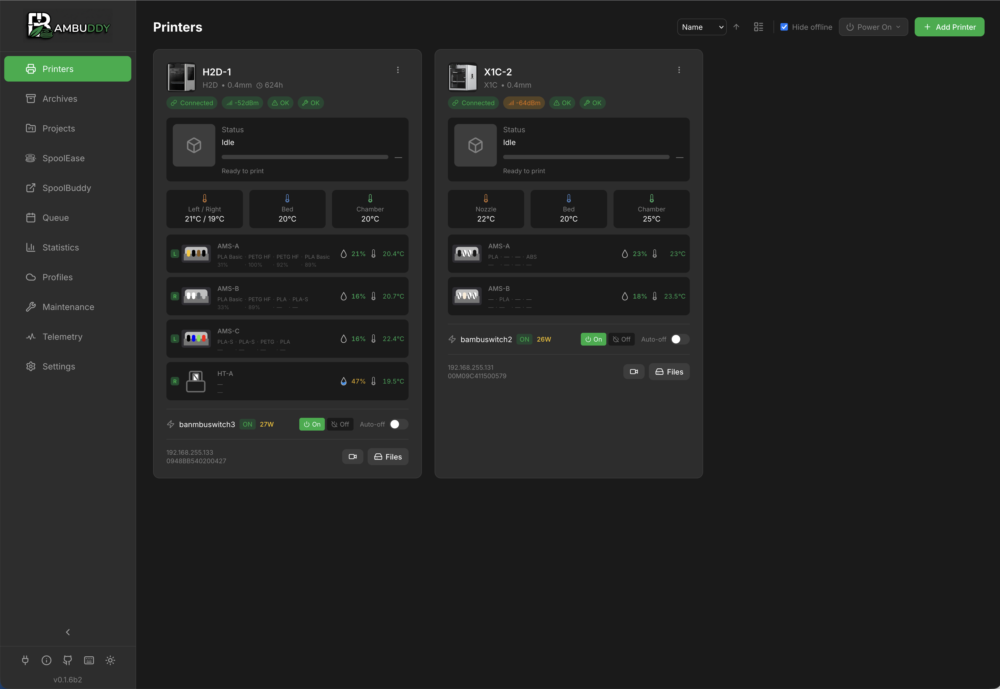

# Your Prints. Your Data. Your Control.

**Bambuddy** is a self-hosted print archive and management system for Bambu Lab 3D printers. Monitor your print farm in real-time, archive every print automatically, and take control of your 3D printing workflow.

  :material-printer-3d: Multi-Printer
  :material-cloud-off-outline: Works Offline
  :material-open-source-initiative: Open Source

[Get Started :material-arrow-right:](getting-started/index.md){ .btn .btn-primary }
[View on GitHub :material-github:](https://github.com/maziggy/bambuddy){ .btn .btn-secondary }

{ .screenshot }

---

## :rocket: Quick Start

[:material-download: **Installation** <small>Get up and running in minutes</small>](getting-started/installation.md)

[:material-docker: **Docker** <small>One-command deployment</small>](getting-started/docker.md)

[:material-printer-3d: **Add Printer** <small>Connect your first printer</small>](getting-started/first-printer.md)

[:material-cellphone: **Mobile** <small>Access from anywhere</small>](getting-started/mobile.md)

---

## :sparkles: Features

### :material-archive: Print Archive
Automatic 3MF archiving with metadata extraction, 3D model preview, duplicate detection, and full-text search. Never lose a print file again.

### :material-monitor-dashboard: Real-time Monitoring
Live printer status via WebSocket, MJPEG camera streaming, HMS error tracking, and AMS humidity/temperature monitoring with historical charts.

### :material-chart-line: Statistics & Analytics
Customizable drag-and-drop dashboard with success rates, filament usage trends, cost tracking, time accuracy analysis, and failure correlation.

### :material-clock-outline: Scheduling & Automation
Print queue with drag-and-drop ordering, scheduled prints, smart plug integration (Tasmota, Home Assistant), auto power-on/off, and energy consumption tracking.

### :material-bell-ring: Push Notifications
Multi-provider alerts via WhatsApp, Telegram, Discord, Email, Pushover, ntfy, and custom webhooks. Quiet hours and daily digest support.

### :material-puzzle: Integrations
Spoolman filament sync, Bambu Cloud profiles, K-profiles (pressure advance), external links, and a REST API with API key authentication.

[Explore All Features :material-arrow-right:](features/index.md){ .md-button }

---

## :printer: Supported Printers

| Series | Models | Status |
|--------|--------|:------:|
| **H2 Series** | H2D, H2S | :material-check-circle:{ .text-green } Tested |
| **X1 Series** | X1, X1 Carbon | :material-check-circle:{ .text-green } Tested |
| **P1 Series** | P1P, P1S | :material-help-circle:{ .text-yellow } Needs Testing |
| **A1 Series** | A1, A1 Mini | :material-help-circle:{ .text-yellow } Needs Testing |

!!! tip "Testers Wanted!"
    Help make Bambuddy work great with all Bambu Lab printers! Please [report your experience](https://github.com/maziggy/bambuddy/issues).

---

## :wrench: Tech Stack

### Backend
:material-language-python: Python
:material-api: FastAPI
:material-database: SQLAlchemy + SQLite

### Frontend
:material-react: React
:material-language-typescript: TypeScript
:material-tailwind: Tailwind CSS

### Communication
:material-transit-connection-variant: MQTT over TLS
:material-folder-network: FTPS
:material-web: WebSocket

---

## :people_holding_hands: Community

### :material-bug: Found a Bug?
[Open an Issue](https://github.com/maziggy/bambuddy/issues/new)

### :material-lightbulb: Feature Request?
[Start a Discussion](https://github.com/maziggy/bambuddy/discussions)

### :material-code-tags: Want to Contribute?
[Read Contributing Guide](https://github.com/maziggy/bambuddy/blob/main/CONTRIBUTING.md)

---

Made with :heart: for the 3D printing community
  

