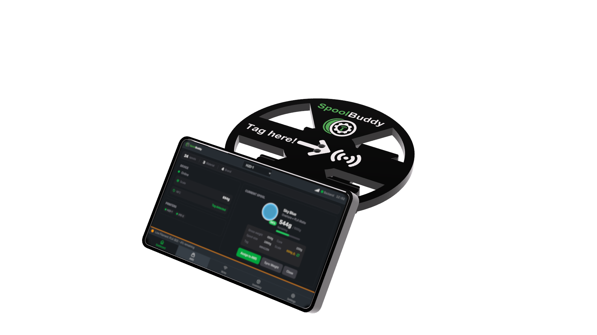

# Your Printers. No Cloud. Your Rules.

**Bambuddy** is a self-hosted command center for Bambu Lab 3D printers — from one A1 to a 40-printer farm. Monitor your fleet in real-time, archive every print automatically, slice and queue jobs locally, and take control of your 3D printing workflow.

  :material-printer-3d: Multi-Printer
  :material-cloud-off-outline: Works Offline
  :material-open-source-initiative: Open Source

[:material-rocket-launch: Try the Live Demo](https://demo.bambuddy.cool){ .btn .btn-primary target=_blank }
[Get Started :material-arrow-right:](getting-started/index.md){ .btn .btn-secondary }
[View on GitHub :material-github:](https://github.com/maziggy/bambuddy){ .btn .btn-secondary }

!!! tip "Try Bambuddy in your browser"
    A fresh, fully working Bambuddy instance spawns in ~10 seconds at **[demo.bambuddy.cool](https://demo.bambuddy.cool)** — no install, no signup, 30-minute session. Pre-loaded with simulated printers, archives, queue items, and inventory so every page has something to explore.

{ .screenshot }

---

## :material-nfc-variant: NEW: SpoolBuddy — NFC Spool Management

**Tap. Identify. Track.** SpoolBuddy is a dedicated hardware companion for Bambuddy — a Raspberry Pi-powered touchscreen kiosk with NFC reader and load cell that identifies your filament spools instantly.

- :material-tag-multiple: **Works with any spool** — Not just Bambu Lab — tag and track filament from any brand
- :material-nfc: **Write your own NFC tags** — Assign any spool to a tag directly from the touchscreen
- :material-scale: **Built-in scale** — Real-time spool weight tracking with load cell
- :material-monitor: **7" touchscreen kiosk** — Dedicated always-on display for your print station

[Build Your Own :material-arrow-right:](spoolbuddy/index.md){ .btn .btn-primary }

---

## :loudspeaker: Contributors Wanted

**Bambuddy is community-driven and I need your help.** Whether you're technical or not, there's a place for you:

- :material-file-document-edit: **Documentation writers** &mdash; help improve this wiki, guides, and feature docs so new users have a smooth onboarding
- :material-cog: **Discourse admin** &mdash; our [**Discourse forum**](https://forum.bambuddy.cool) is now live but still needs to be configured, themed, and tuned (categories, permissions, SSO, email, plugins, backups). If you know Discourse or want to dig in, I'd love your help.
- :material-forum: **Forum moderators** &mdash; help welcome newcomers, answer questions, and keep discussions healthy on the new forum

If you enjoy writing, helping others, or keeping a community friendly, you're exactly who we're looking for.

**Get in touch:** [Forum](https://forum.bambuddy.cool){ .md-button } [Discord](https://discord.gg/aFS3ZfScHM){ .md-button } [GitHub](https://github.com/maziggy/bambuddy/discussions){ .md-button } [martin@bambuddy.cool](mailto:martin@bambuddy.cool){ .md-button .md-button--primary }

---

## :material-printer-3d-nozzle-outline: NEW: Integrated Slicing

**Slice STL and 3MF files server-side &mdash; no desktop slicer needed.** Bambuddy's optional slicer-api sidecar runs OrcaSlicer or Bambu Studio headlessly inside Docker. The **Slice** button in File Manager, Archives, and the MakerWorld page produces a ready-to-print `.gcode.3mf` in the same folder &mdash; one click away from dispatch.

- :material-cursor-pointer: **One-click Slice button** &mdash; from File Manager, Archives, MakerWorld imports, and the print queue
- :material-package-variant: **Bambu Studio Preset Bundles (.bbscfg)** &mdash; import once, pick a curated printer + process + filament triplet from a dropdown for every slice
- :material-layers-triple: **Per-AMS-slot filament dropdowns** &mdash; multi-color plates render one picker per slot the print actually uses, auto-matched against your imported / cloud / standard presets
- :material-cellphone: **Headless-friendly** &mdash; runs on your NAS, mini-PC, or RPi; no desktop slicer install needed for one-click print
- :material-flash: **Reuses existing dispatch** &mdash; sliced result drops into the library, ready for the plate picker, AMS mapper, and queue

Closes the workflow gap that kept users on a desktop machine just to slice a quick re-print.

[Setup Guide :material-arrow-right:](features/slicer-api.md){ .md-button .md-button--primary }

---

## :globe_with_meridians: Remote Printing with Proxy Mode

**Print from anywhere in the world!** Bambuddy's new Proxy Mode acts as a secure relay between your slicer and printer.

- :lock: **End-to-end TLS encryption** — Your print data is encrypted from slicer to printer
- :earth_americas: **No cloud dependency** — Direct connection through your own Bambuddy server
- :key: **Uses printer's access code** — No additional credentials needed
- :zap: **Full-speed printing** — FTP and MQTT protocols proxied transparently

Perfect for remote print farms, traveling makers, or accessing your home printer from work.

[Setup Guide :material-arrow-right:](features/virtual-printer.md#proxy-mode-remote-printing){ .md-button .md-button--primary }

---

## :rocket: Quick Start

[:material-download: **Installation** <small>Get up and running in minutes</small>](getting-started/installation.md)

[:material-docker: **Docker** <small>One-command deployment</small>](getting-started/docker.md)

[:material-printer-3d: **Add Printer** <small>Connect your first printer</small>](getting-started/first-printer.md)

[:material-cellphone: **Mobile** <small>Access from anywhere</small>](getting-started/mobile.md)

---

## :sparkles: Features

### :material-archive: Print Archive
Automatic 3MF archiving with metadata extraction, 3D model preview, duplicate detection, and full-text search. Never lose a print file again.

### :material-monitor-dashboard: Real-time Monitoring
Live printer status via WebSocket, MJPEG camera streaming, HMS error tracking, and AMS humidity/temperature monitoring with historical charts.

### :material-chart-line: Statistics & Analytics
Customizable drag-and-drop dashboard with success rates, filament usage trends, cost tracking, time accuracy analysis, and failure correlation.

### :material-clock-outline: Scheduling & Automation
Print queue with drag-and-drop ordering, scheduled prints, smart plug integration (Tasmota, Home Assistant), auto power-on/off, and energy consumption tracking.

### :material-bell-ring: Push Notifications
Multi-provider alerts via WhatsApp, Telegram, Discord, Email, Pushover, ntfy, and custom webhooks. Quiet hours and daily digest support.

### :material-puzzle: Integrations
Spoolman filament sync, Bambu Cloud profiles, K-profiles (pressure advance), external links, and a REST API with API key authentication.

[Explore All Features :material-arrow-right:](features/index.md){ .md-button }

---

## :printer: Supported Printers

| Series | Models |
|--------|--------|
| **X1 Series** | X1, X1 Carbon, X1E |
| **H2 Series** | H2D, H2D Pro, H2C, H2S |
| **P1 Series** | P1P, P1S |
| **P2 Series** | P2S |
| **A1 Series** | A1, A1 Mini |

---

## :wrench: Tech Stack

### Backend
:material-language-python: Python
:material-api: FastAPI
:material-database: SQLAlchemy + SQLite

### Frontend
:material-react: React
:material-language-typescript: TypeScript
:material-tailwind: Tailwind CSS

### Communication
:material-transit-connection-variant: MQTT over TLS
:material-folder-network: FTPS
:material-web: WebSocket

---

## :people_holding_hands: Community

### :material-forum: Join the Forum
[forum.bambuddy.cool](https://forum.bambuddy.cool) &mdash; community Q&A, guides, and longer discussions

### :material-bug: Found a Bug?
[Open an Issue](https://github.com/maziggy/bambuddy/issues/new)

### :material-lightbulb: Feature Request?
[Start a Discussion](https://github.com/maziggy/bambuddy/discussions)

### :material-code-tags: Want to Contribute?
[Read Contributing Guide](https://github.com/maziggy/bambuddy/blob/main/CONTRIBUTING.md)

### :material-file-document-edit: Help with Docs or the Forum?
[See Contributors Wanted](#contributors-wanted) or email [martin@bambuddy.cool](mailto:martin@bambuddy.cool)

---

Made with :heart: for the 3D printing community
  

